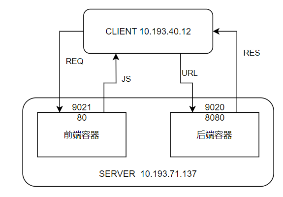
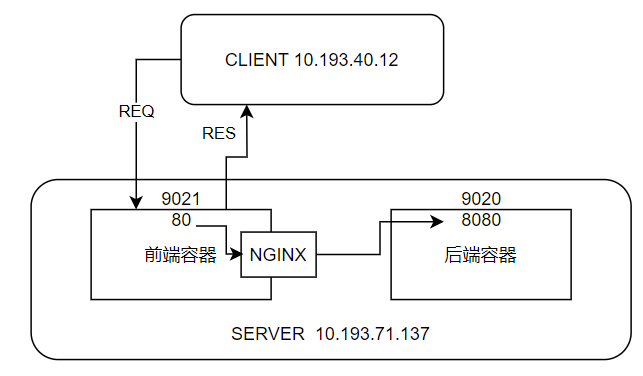

# Docker_前端项目部署


[TOC]


## 常用方案介绍

方案1：为将前端工程复制到server，docker建立容器A，并在容器内进行前端环境自动配置以及编译成果复制，并在同一个容器内添加nginx环境做运行部署；

方案2：在开发机上对工程编译，编译结果文件复制到server，server的docker仅仅建立nginx环境，并docker本地目录绑定到编译结果文件所在目录；

下面用REACT项目做例子

## 方案1

该方案需要在容器内做环境配置和编译

### dockerfile文件

```dockerfile
# 第一阶段：使用 Node.js 镜像构建 React 应用
FROM node:22.17.0 as build

# 设置工作目录
WORKDIR /app

# 复制 package.json 和 package-lock.json 到容器中
COPY package*.json ./

# 安装依赖
RUN npm install

# 复制项目文件到容器中
COPY . .

# 构建 React 应用
RUN npm run build

# 第二阶段：使用 Nginx 镜像提供静态文件服务
FROM nginx:alpine

# 将构建好的 React 应用复制到 Nginx 的默认静态文件目录中
COPY --from=build /app/build /usr/share/nginx/html

# 暴露 80 端口
EXPOSE 80

# 启动 Nginx 服务
CMD ["nginx", "-g", "daemon off;"]

```

这段代码是一个用于构建和部署 React 应用的 Dockerfile。Dockerfile 是一种文本文件，用于定义 Docker 镜像的构建过程。这个 Dockerfile 采用了多阶段构建的方式，分为两个主要阶段：构建 React 应用和使用 Nginx 服务器部署应用。

### 第一阶段：构建 React 应用

```
# 第一阶段：使用 Node.js 镜像构建 React 应用
FROM node:22.17.0 as build

# 设置工作目录
WORKDIR /app

# 复制 package.json 和 package-lock.json 到容器中
COPY package*.json ./

# 安装依赖
RUN npm install

# 复制项目文件到容器中
COPY . .

# 构建 React 应用
RUN npm run build
```

#### 详细解释：

1. **基础镜像选择**：FROM node:22.17.0 as build 指定使用 Node.js 22.17.0 版本作为基础镜像，并将此阶段命名为build。这个镜像包含了构建 React 应用所需的 Node.js 和 npm 环境。

1. **工作目录设置**：WORKDIR /app 在容器内创建并设置工作目录为/app，后续的操作将在此目录下进行。

1. **依赖安装**：

- - COPY package*.json ./ 先复制 package.json 和 package-lock.json 文件，这是为了利用 Docker 的缓存机制。如果这两个文件没有变化，Docker 会复用之前的缓存，跳过 npm install 步骤，从而加快构建速度。

- - RUN npm install 执行 npm install 命令安装项目依赖。

1. **项目文件复制与构建**：

- - COPY . . 将当前目录下的所有文件复制到容器的工作目录中。

- - RUN npm run build 执行 npm run build 命令，这通常会触发 React 应用的生产环境构建，生成优化后的静态文件，通常位于build目录下。

### 第二阶段：使用 Nginx 部署应用

```
# 第二阶段：使用 Nginx 镜像提供静态文件服务
FROM nginx:alpine

# 将构建好的 React 应用复制到 Nginx 的默认静态文件目录中
COPY --from=build /app/build /usr/share/nginx/html

# 暴露 80 端口
EXPOSE 80

# 启动 Nginx 服务
CMD ["nginx", "-g", "daemon off;"]
```

#### 详细解释：

1. **基础镜像选择**：FROM nginx:alpine 使用轻量级的 Nginx Alpine 镜像作为基础，这个镜像体积小且包含了 Nginx 服务器。

1. **复制构建产物**：COPY --from=build /app/build /usr/share/nginx/html 从第一阶段（build）的容器中复制构建好的静态文件到 Nginx 服务器的默认文档根目录/usr/share/nginx/html。

1. **端口暴露**：EXPOSE 80 声明容器将在运行时监听 80 端口，但这只是一个元数据，不会实际打开端口。

1. **启动 Nginx 服务**：CMD ["nginx", "-g", "daemon off;"] 定义容器启动时执行的命令，以非守护进程模式启动 Nginx，确保 Nginx 在容器中正常运行。

### 多阶段构建的优势

这种多阶段构建的方式有几个重要优势：

- **减小镜像体积**：最终的镜像只包含运行应用所需的静态文件和 Nginx 服务器，不包含构建工具和依赖，体积显著减小。

- **安全性提高**：生产环境镜像不包含不必要的开发工具和依赖，减少了潜在的安全风险。

- **构建效率优化**：通过合理利用 Docker 缓存，可以加快后续构建的速度。

通过这种方式，你可以高效地构建和部署 React 应用，同时保持镜像的精简和安全性。

### 镜像建立和使用

```shell
#镜像建立
docker build -t react_app:0.1 -f react_env_dockerfile .
#镜像运行
docker run -d -p 9021:80 --name mw_query_app react_app:0.1
```


## 方案2（目前推荐）

### 开发机环境及编译

```shell
#环境-包配置
npm install	#一般开发前就运行过了
#编译 无论new-react-app还是vite都一样 只是 vite生成结果在dist文件夹内
npm run build
```

这里采用vite建立的工程会在根目录产生dist文件夹，将其复制到服务器上

### 建立NIGNX镜像

```dockerfile
# 第二阶段：使用 Nginx 镜像提供静态文件服务
FROM nginx:alpine

# 将构建好的 React 应用复制到 Nginx 的默认静态文件目录中 如果采用本地目录绑定可不做复制
# COPY --from=build /app/dist /usr/share/nginx/html

# 暴露 80 端口
EXPOSE 80

# 启动 Nginx 服务
CMD ["nginx", "-g", "daemon off;"]
```

#### 代码解释

1. **基础镜像选择**

```
FROM nginx:alpine
```

这行代码的作用是指定所使用的基础镜像是nginx:alpine。Alpine Linux 是一种轻量级的 Linux 发行版，用它构建的镜像体积较小，所以很适合用于容器环境。

1. **复制构建产物（已注释）**

```
# COPY --from=build /app/dist /usr/share/nginx/html
```

此命令的功能是把前一个构建阶段（也就是 build 阶段）生成的 React 应用构建产物，复制到 Nginx 容器内用于存放静态文件的默认目录/usr/share/nginx/html中。不过，这行代码被注释掉了，这意味着可能会通过本地目录挂载的方式来提供静态文件，而不是把文件直接复制到镜像里。

1. **端口暴露**

```
EXPOSE 80
```

这行代码表明该容器会监听 80 端口，以此来提供 HTTP 服务。但要清楚，这只是一个元数据声明，在运行容器时，还需要使用-p或者-P参数，才能真正把容器的端口映射到宿主机上。

1. **启动 Nginx 服务**

```
CMD ["nginx", "-g", "daemon off;"]
```

这行代码定义了容器启动时会执行的默认命令。这里让 Nginx 以非守护进程的模式运行，这是容器化环境里的标准做法。要是以守护进程模式运行，Nginx 会在后台运行，这样容器的主进程就会立即退出，进而导致容器终止。

#### 实际用途

这个 Dockerfile 的主要用途是创建一个用于部署 React 单页应用的轻量级容器。借助 Nginx 高性能的静态文件服务能力，可以高效地提供 React 应用的构建产物。

#### 注意要点

- 如果要使用多阶段构建，就需要取消注释COPY命令，并且要确保前面的构建阶段已经正确生成了 React 应用的构建产物。

- 在生产环境中部署时，建议自定义 Nginx 配置，比如添加 Gzip 压缩、设置缓存策略等，以此来优化性能。

- 运行容器时，需要使用-p 80:80参数把容器的 80 端口映射到宿主机的某个端口上，这样才能通过浏览器访问应用。 
- 

### 镜像建立和使用

```shell
#镜像建立
docker build -t nginx_mini:0.1 -f nginx_env_dockerfile .
#镜像运行
docker run -d -v /mnt/react_app/dist/:/usr/share/nginx/html -p 9021:80 --name mw_query_app nginx_mini:0.1
```

#### 命令解释

```
docker build -t nginx_mini:0.1 -f nginx_env_dockerfile .
```

- **docker build**：这是 Docker 构建镜像的核心命令，用于根据指定的 Dockerfile 生成镜像。

- **-t nginx_mini:0.1**：-t参数用于为构建的镜像添加标签（tag）。这里nginx_mini是镜像的名称，0.1是版本号，通过名称和版本号的组合，方便后续识别和管理该镜像。

- **-f nginx_env_dockerfile**：-f参数指定了构建镜像所使用的 Dockerfile 的路径和名称。默认情况下，Docker 会在当前目录寻找名为Dockerfile的文件，而这里明确指定使用nginx_env_dockerfile作为构建的配置文件。

- **.**：表示构建上下文的根目录。Docker 在构建镜像时，会将该目录下的所有文件和子目录发送给 Docker 守护进程，供 Dockerfile 中的命令（如 COPY）使用。

#### 镜像运行命令解释

```
docker run -d -v /mnt/react_app/dist/:/usr/share/nginx/html -p 9021:80 --name mw_query_app nginx_mini:0.1
```

- **docker run**：用于基于指定的镜像创建并启动一个容器。

- **-d**：以守护进程（后台）模式运行容器，容器启动后不会占据当前终端，而是在后台默默运行。

- **-v /mnt/react_app/dist/:/usr/share/nginx/html**：-v参数用于挂载宿主机的目录到容器内，实现宿主机与容器之间的文件共享。这里将宿主机的/mnt/react_app/dist/目录，挂载到容器内 Nginx 默认的静态文件目录/usr/share/nginx/html。这也解释了 Dockerfile 中COPY命令被注释的原因，通过目录挂载的方式，无需将文件复制到镜像中，方便后续对 React 应用文件进行修改和更新，修改宿主机目录下的文件后，容器内会即时生效。

- **-p 9021:80**：-p参数用于端口映射，将宿主机的端口与容器的端口进行绑定。这里把宿主机的9021端口映射到容器的80端口，这样通过访问宿主机的9021端口，就能访问到容器内 Nginx 在80端口提供的服务。

- **--name mw_query_app**：为容器指定一个名称mw_query_app，方便后续通过名称对容器进行操作（如启动、停止、删除等），而无需使用较长的容器 ID。

- **nginx_mini:0.1**：指定基于哪个镜像来创建容器，这里使用的是前面构建的nginx_mini:0.1镜像。

#### 命令与 Dockerfile 的关联

- 构建命令通过-f指定了使用你提供的 Dockerfile（nginx_env_dockerfile），该 Dockerfile 选择了轻量的nginx:alpine基础镜像，并配置了 Nginx 的运行相关设置，为容器运行提供了基础环境。

- 运行命令中的-v参数实现了宿主机目录与容器内 Nginx 静态文件目录的挂载，替代了 Dockerfile 中被注释的COPY命令的功能，实现了 React 应用文件的提供。同时，-p参数与 Dockerfile 中EXPOSE 80相对应，将容器暴露的 80 端口映射到宿主机的 9021 端口，使得外部能够访问容器内的服务。


## 方案对比


方案1：为将前端工程复制到server，docker建立容器A，并在容器内进行前端环境自动配置以及编译成果复制，并在同一个容器内添加nginx环境做运行部署；

方案2：在开发机上对工程编译，编译结果文件复制到server，server的docker仅仅建立nginx环境，并docker本地目录绑定到编译结果文件所在目录；


### 方案 1 和方案 2 的对比分析

以下是两种 React 工程部署方案的优劣势对比：

### 方案 1：一体化 Docker 容器部署

**优势**：

1. **环境一致性**：所有环境配置都封装在 Docker 镜像中，确保开发、测试和生产环境一致

1. **部署简单**：只需推送 Docker 镜像到服务器并运行容器，无需额外文件同步

1. **自动化程度高**：CI/CD 流程可完全自动化，从代码提交到部署无需人工干预

1. **隔离性强**：前端构建和运行环境与宿主机完全隔离，避免环境冲突

1. **版本控制**：镜像本身可以打标签，方便回滚和版本管理

**劣势**：

1. **构建时间长**：每次部署都需要在容器内重新安装依赖和构建前端

1. **镜像体积大**：包含 Node.js 构建环境和 Nginx 运行环境，可能导致镜像体积较大

1. **资源消耗多**：容器内同时运行构建和运行环境，占用更多系统资源

1. **调试复杂**：如果构建过程出现问题，调试需要进入容器内部

### 方案 2：预编译 + Docker 挂载部署

**优势**：

1. **部署速度快**：只需复制编译结果，无需每次都重新构建

1. **镜像体积小**：Docker 镜像只包含 Nginx，不包含前端构建工具

1. **资源利用高效**：构建过程在开发机完成，不占用服务器资源

1. **灵活性高**：可以使用任何方式生成前端文件，不限于 Docker

1. **易于调试**：前端文件直接在宿主机可见，便于调试和修改

**劣势**：

1. **环境不一致风险**：开发机和生产环境可能存在差异

1. **部署步骤复杂**：需要先在开发机编译，再复制文件到服务器

1. **手动操作多**：文件复制过程需要额外步骤，增加人为错误风险

1. **版本管理不便**：编译结果可能没有与代码版本严格关联

1. **安全性较低**：前端文件直接暴露在宿主机文件系统中

### 适用场景建议

- **选择方案 1 的情况**：

- - 团队需要严格的环境一致性

- - 部署频率高，需要完全自动化的 CI/CD 流程

- - 应用需要快速回滚能力

- - 对服务器资源利用率要求不高

- **选择方案 2 的情况**：

- - 前端构建过程非常耗时

- - 服务器资源有限，需要优化容器体积

- - 部署频率较低，手动步骤可以接受

- - 开发团队习惯传统的文件部署方式

- - 需要快速修改和调试前端文件

### 最佳实践建议

如果选择方案 1，可以考虑以下优化：

1. 使用 Docker 缓存机制加速依赖安装

1. 采用多阶段构建减小最终镜像体积

1. 定期清理无用的镜像和容器

1. 在 CI/CD 流程中添加构建缓存

如果选择方案 2，可以考虑以下优化：

1. 使用自动化脚本处理文件复制和部署

1. 在开发机和服务器使用相同的构建脚本

1. 将编译结果纳入版本控制系统

1. 使用文件同步工具如 rsync 提高部署效率

两种方案各有优劣，具体选择应根据团队规模、项目需求、部署频率和资源限制等因素综合考虑。


## 方案2的改进：容器内通信

### 原方案2流程问题分析

原方案2流程：

客户机IP：10.193.55.11

服务宿主机IP：10.193.71.137

前端docker容器：端口 9021:80	 ，即容器内端口80提供服务，绑定了容器对外端口9021，因此客户机可通过10.193.71.137:9021访问本容器；

后端docker容器：端口 9020:8080 ，即容器内端口8080提供服务，绑定了容器对外端口9020，因此客户机可通过10.193.71.137:9020访问本容器； 

注意：这里的前端工程 访问后端的地址是实实在在将 10.193.71.137 写入配置文件内的，因此当整个服务移动到其他IP上，导致需要重新改动前端工程代码（事实证明这里仅仅改动配置json是无效的）；

为了规避这种情况，直接用docker内部网络，并在前端容器内做nginx反向代理；

这样就要用docker建立网络，并采用两个容器通过这个虚拟网络通信，做到容器内通信；

容器内通信的原因：

1、跳过宿主机网关对于网关有复杂身份验证的系统非常有用；

2、由于客户机访问前端时把工程中URL直接拷贝到客户机浏览器，然后从网页访问的请求都是直接根据URL访问后端容器，该URL依然是宿主机的IP，此时又要经过一次服务器网关；



### 容器内通信方案流程

建立docker网络

```shell
#创建docker虚拟子网
docker network create 虚拟子网名
#容器接入子网
docker network connect 虚拟子网名 前端容器ID/前端容器名
docker network connect 虚拟子网名 后端容器ID/后端容器名
```

此时在后端容器内 webapi 提供的服务端口为 8080 ，那么既然是容器内通讯，前端访问后端的地址端口就是8080 

为了强制从前端向后端发出访问请求，而不直接从客户机向后端容器发送请求，需要进入前端容器配置nginx反向代理

```shell
#进入前端容器命令行
docker exec -it 前端容器ID sh
#备份配置文档
cp /etc/nginx/conf.d/default.conf  /etc/nginx/conf.d/default.conf.bak
#编辑配置文档
vi /etc/nginx/conf.d/default.conf
#写入如下内容

# API请求反向代理到后端容器
    location /api/ {
        proxy_pass http://后端容器名:8080;
        proxy_set_header Host $host;
        proxy_set_header X-Real-IP $remote_addr;
        proxy_set_header X-Forwarded-For $proxy_add_x_forwarded_for;
        proxy_set_header X-Forwarded-Proto $scheme;
        proxy_http_version 1.1;
        proxy_set_header Connection "";
    }
 

#退出容器
exit
#重启容器
docker restart 前端容器ID
```

由于nginx进行了反向代理，IP由proxy_pass代劳，那么在前端代码中对webapi访问就采用相对路径访问后端 ， 比如 /api/Query/GetMaterialWeightInfo
此时经过nginx代理则拼为 http://后端容器名:8080/api/Query/GetMaterialWeightInfo
必须注意：proxy_pass http://后端容器名:8080;  而不是 proxy_pass http://后端容器名:8080/;   斜杠/会导致拼好的路径api段消失；


 那么此时就能做到 客户机访问前端容器，容器通过nginx转发 访问后端API获得数据返回前端容器 然后返回网页；

下面为示意图




