# 常用曲线导论

[TOC]

本篇主要针对游戏和工业设计中的样条曲线进行基本介绍

## 贝塞尔

### 贝塞尔曲线 Bézier Curve

本片一切都是从贝塞尔曲线开始

#### 最简模式

两点之间最方便的连接是直线，那么一个点在直线上距离起点和总长的比值则可获得一个参数；

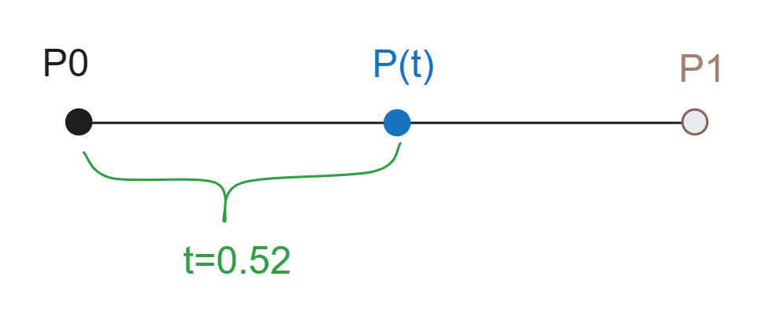

这个称为lerp(Linear Interpolation)或者线性插值；公式如下：
$$
P(t)=(1-t) P_0+t P_1
\\
t \in [0,1]
$$

#### 扩展到三点

当平面上具有三个点，那么按顺序两两做插值，并将插值点连线，对该连线再次插值，获得一个轨迹点；
在参数走遍区间内所有值之后，轨迹点获得的路径轨迹就是贝塞尔插值曲线；
这里三点决定的贝塞尔曲线就是二次贝塞尔曲线；

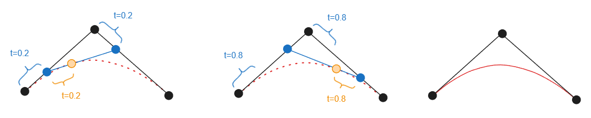

同理如果具有四个点，那么就可以构成三次贝塞尔曲线；

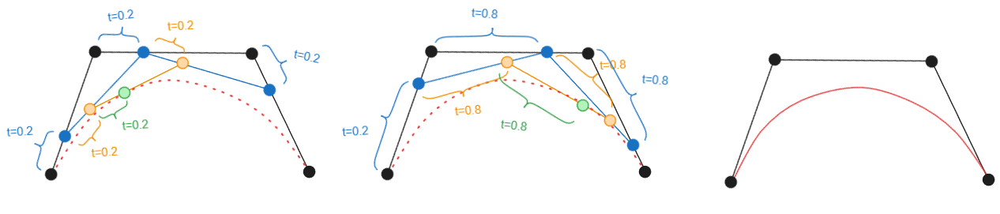

三次贝塞尔曲线就是最常见的一种贝塞尔曲线了；

那么如何以代数方式表达贝塞尔曲线？

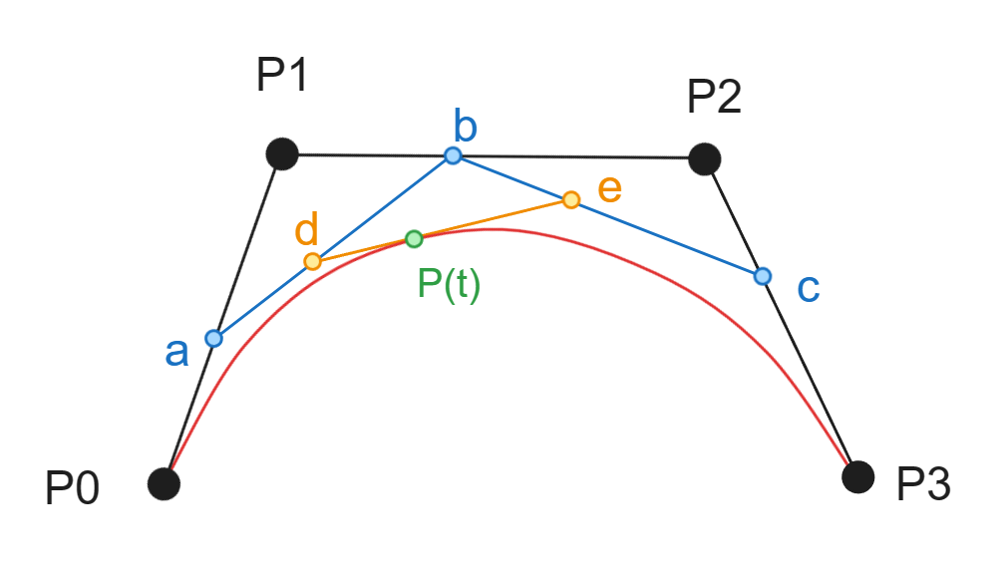

我们将三次贝塞尔曲线的每个点都标记出来，并以插值概念以代数表达，该方法叫做 Decasteljau 算法：
$$
a=lerp(P_0,P_1,t)
\\
b=lerp(P_1,P_2,t)
\\
a=lerp(P_2,P_3,t)
\\
d=lerp(a,b,t)
\\
e=lerp(b,c,t)
\\
P=lerp(d,e,t)
$$

##### 伯恩斯坦式

然后我们对上述式子进行展开和化简：
$$
a=(1-t) P_0 + t P_1 = P_0 - t P_0 + t P_1
\\
b=(1-t) P_1 + t P_2 = P_1 - t P_1 + t P_2
\\
c=(1-t) P_2 + t P_3 =  P_2 - t P_2 + t P_3
\\
d=(1-t) [(1-t) P_0 + t P_1] + t [(1-t) P_1 + t P_2]=(1-t)^2P_0+2(1-t)tP_1+t^2P_2
\\
e=(1-t) [(1-t) P_1 + t P_2] + t [(1-t) P_2 + t P_3]=(1-t)^2P_1+2(1-t)tP_2+t^2P_3
\\
P= (1-t)^3P_0+3t(1-t)^2P_1+3t^2(1-t)P_2+t^3P_3
\\可见
\\
P=\\P_0(-t^3+3t^2-3t+1)+\\P_1(3t^3-6t^2+3t)+\\P_2 (3t^2-3t^3)+\\P_3 (t^3)
$$
这个式子叫做伯恩斯坦（Bernstein）多项式，三个参数多项式在平面的图像如下：

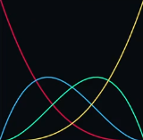

##### 系数多项式

而如果将参数t提取出来那么就得到了系数多项式
$$
P=P_0+t(-3P_0+3P_1)+t^2(3P_0-6P_1+3P_2)+t^3(-P_0+3P_1-3P_2+P_3)
$$
系数多项式可以高效的利用系数来计算轨迹点位置和参数的关系

##### 矩阵型

上述三种依据不同效率进行使用，而计算机中矩阵效率最高，我们考虑将上述式子都化为矩阵形式，如下
$$
P(t)=
\left [ 
\begin{matrix}
1 & t & t^2 & t^3   \\ 
\end  {matrix} 
\right ] 
\left [ 
\begin{matrix}
1 	& 0 	& 0 	& 0   \\ 
-3 	& 3 	& 0 	& 0   \\ 
3 	& -6 	& 3 	& 0   \\ 
-1 	& 3 	& -3 	& 1   \\ 
\end  {matrix} 
\right ] 
\left [ 
\begin{matrix}
P_0     \\ 
P_1     \\ 
P_2     \\ 
P_3     \\ 
\end  {matrix} 
\right ]
$$
由矩阵式可见 前两项合并就得到伯恩斯坦多项式，后两项合并就得到系数多项式；这个形式就非常好用；

#### 长线扩展

如果我们需要将贝塞尔扩展到很长，那么完全可以根据规则将曲线扩展为n次贝塞尔曲线；那么整个多项式影响曲线如下：

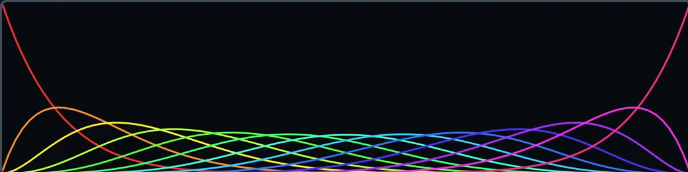

那么这就面临一个问题，在n次贝塞尔曲线需要做局部调整的时候，移动其中一个控制点，那么这个控制点根据规则，其影响会扩散到其他非起点和终点的所有点上，尽管距离越远影响越小，但是依然具有影响；所以我们失去了局部控制曲线的能力；

而且n次贝塞尔曲线若阶次过高，会大量消耗算力；

我们需要在不影响曲线每一个点的情况下控制曲线形状；

### 贝塞尔样条 Bézier Spline

为了得到上述局部控制曲线的能力，我们将三次贝塞尔曲线收尾相连；就得到了贝塞尔样条线

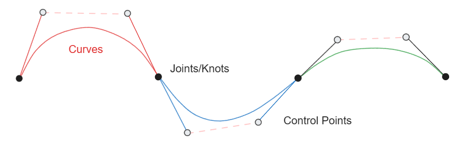

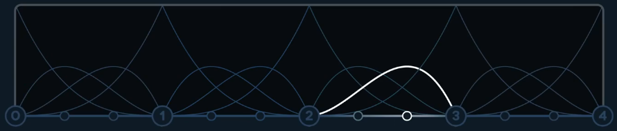

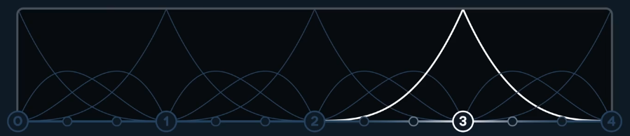

可见某一段中的控制点只能影响段内的曲线状态；而每一个节点可以控制两侧的曲线段状态；

于是我们得到了

-  一个可以局部控制的曲线
-  更加便于计算的曲线
-  曲线每三个点通过一次点

所以贝塞尔样条非常受欢迎，PS中的钢笔工具就是这；

节点是三次曲线的起点或终点，控制点和节点之间的线（控制棒）为起点或者终点的切线；

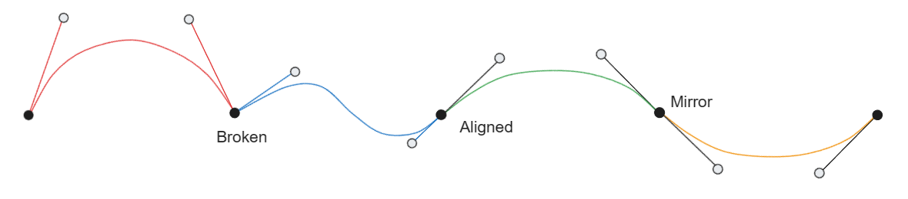

在四段三次曲线拼出的样条线中，可以利用控制点来构造，断点（尖点/Broken）、平行(Aligned)、镜像(Mirror)；

#### 代数连续性

连续性是对曲线时间连接程度的表达；贝塞尔样条是多个三次贝塞尔连接的，那么必考察其连续性；

依然如下图，该样条由四个曲线收尾连接，数学上称之为是C0连续的；如果收尾的的点都不重合那么就是不连续；

如果有一个方块在贝塞尔样条上进行运动，在节点处可能出现角度和速度的忽然变化；此时我们需要研究贝塞尔曲线的导数来一探究竟；

拿出上述的三阶贝塞尔矩阵式：
$$
P(t)=
\left [ \begin{matrix}
1 & t & t^2 & t^3   
\end  {matrix} \right ] 
\left [ 
\begin{matrix}
1 	& 0 	& 0 	& 0   \\ 
-3 	& 3 	& 0 	& 0   \\ 
3 	& -6 	& 3 	& 0   \\ 
-1 	& 3 	& -3 	& 1   \\ 
\end  {matrix} 
\right ] 
\left [ 
\begin{matrix}
P_0     \\ 
P_1     \\ 
P_2     \\ 
P_3     \\ 
\end  {matrix} 
\right ]
$$
对其求1、2、3阶导：
$$
P^{(0)}(t)=
\left [ \begin{matrix}
1 & t & t^2 & t^3  
\end  {matrix} \right ] 
...
\\
P^{(1)}(t)=
\left [ \begin{matrix}
0 & 1 & 2t & 3t^2  
\end  {matrix} \right ] 
...
\\
P^{(2)}(t)=
\left [ \begin{matrix}
0 & 0 & 2  & 6t  
\end  {matrix} \right ] 
...
\\
P^{(3)}(t)=
\left [ \begin{matrix}
0 & 0 & 0 & 6   
\end  {matrix} \right ] 
...
$$
三个结果分别理解为：一阶导数为速度velocity，二阶导数为加速度acceleration，三阶导数为急动度jolt；

##### C0连续

若样条线中各三次曲线首尾相连，就都出现了实际0阶连续；也叫C0连续；否则不连续；

即
$$
A(1)=B(0)
$$

##### 一阶连续/C1连续

实际计算结果中，若节点和其两侧控制点为镜像，则速度在节点处数值重合，一阶连续；满足了就可以称之为C1连续；即
$$
A'(1)=B'(0)
$$

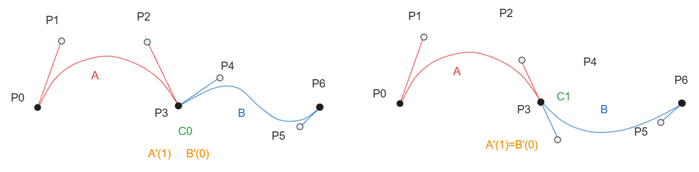

可见前曲线的末端一阶导和后曲线的首端一阶导数值相等，才能把C0升格为C1连续；

##### 二阶连续/C2连续

然后观察二阶导数，当加速度在节点处出现跳变，则说明曲线无法实现C2连续；

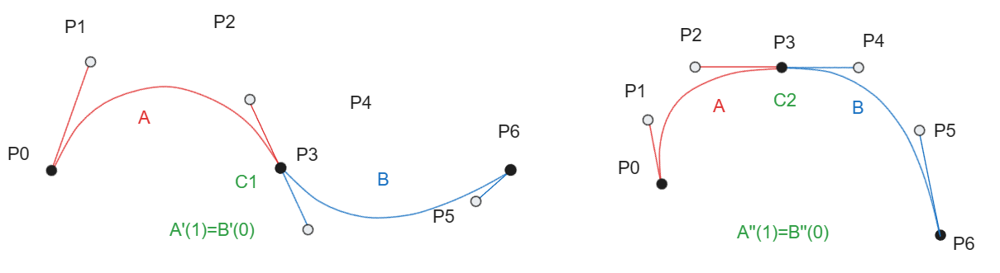
$$
A''(1)=B''(0)
$$
要达成这个条件，则P5需要受到P1、P2、P3的控制，
$$
P_5=P_1+4（P_3-P_2）
$$
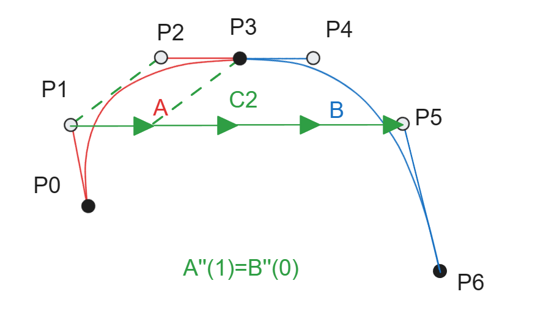

##### C2连续缺点

再次拿出四段组样条：

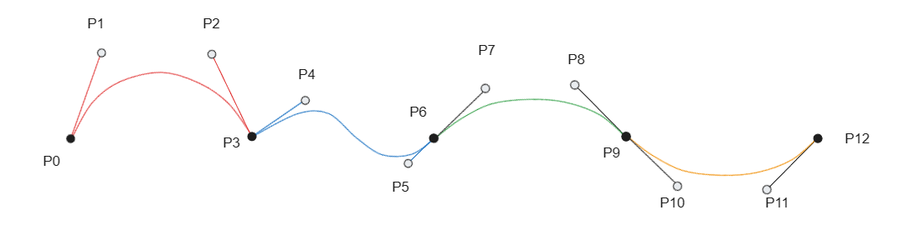

由此我们获得了C2连续的曲线，但是为了达成C2连续，我们再次牺牲了之前讲的样条线的局部控制特性；
由于C2连续性要求
P5被P1、P2、P3控制
P8被P3、P5、P6控制
P11被P7、P8、P9控制
由于C1连续的镜像要求
P2锁定P4
P5锁定P7
P8锁定P10

那么所有的控制点都被前置的点锁定了；
一旦移动几个自由的点都会极大改变整个曲线的形状；
由此我们失去了局部控制的能力；
所以贝塞尔样条想要达到C2连续，则必然牺牲局部控制特性；

##### C3连续

虽然C2连续的情况很糟糕，那么如果曲线想要C3连续会怎么样呢？

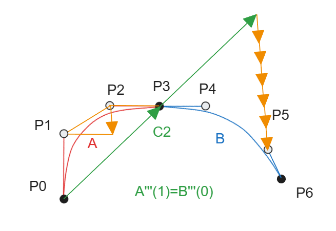
$$
P_6=P_3+(P_3-P_0)+6（P_1-P_2+P_3-P_2）
$$
可见此时，P6由P0、P1、P2、P3决定；如此向后我们连节点都无法控制了，这个情况比上述C2连续时更加糟糕；

情况就显示为，C3连续的样条线对于初始的几个控制点的敏感度极高；
其实此时的这个样条线就是由第一段三次曲线的参数t直接超过1来进行计算拟合的；
那么整个样条线就是一根线，而非多个三次曲线的品拼接；此时就是C无穷连续；所有的导数都是连接的；

这是符合直觉的，因为拼接的原料曲线就是三次贝塞尔曲线，三阶导数之后所有的差异都会被抹平；
导致这样的曲线已经不是样条线了；

##### 参数连续总结

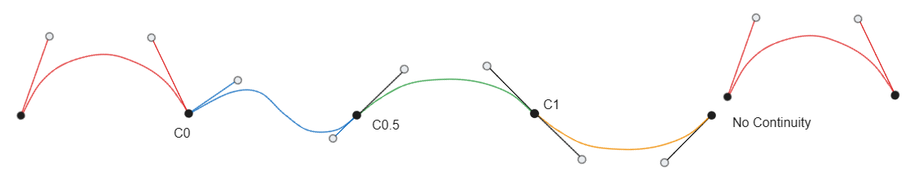

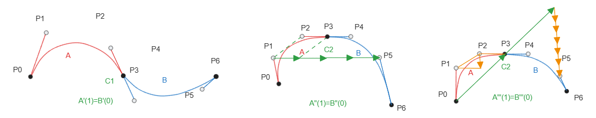

##### 参数连续性

有如下定义了样条线 参数连续性
$$
A^{(i)}(t_{end})=B^{(i)}(t_{start})
\\
i\in\{0,...,n\}
\\
\Rightarrow
\\
C^n \  Continuous
$$
连续性是样条线的讨论核心；

#### 几何连续性 Geometric Continutiy

##### G1连续

我们再次拿出上图

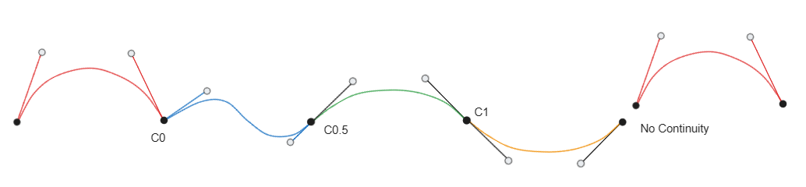

这里有个C0.5连续的标识，这个连续性具有何种特性呢？

如果我们不考虑这里的速度问题而只考虑方向，那么可以将一阶导归一化为曲线沿途方向，并求其正交左向量（法向）；即
$$
T=\frac{P'(u)}{||P'(u)||}
\\
N=(-T_y,T_x)
$$
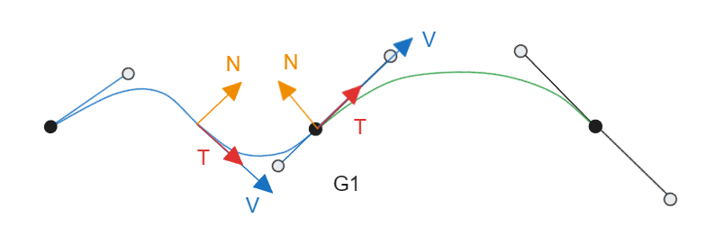

可见，速度的大小突变，没有影响切向量和法向量的方向；这种切线连续性称之为G1连续；

那么既然G1出现了，好奇的问道，G2是什么情况呢？

##### G2连续

这里我们做个实验，我们将整个样条线沿着Z轴线放样拉伸为曲面，然后赋予镜面材质，打光，放入斑点内饰房间中，观察其曲型镜面对斑点的反射，可以观测到，在G1连续处出现了图案接缝跳变；

其实这种现象不只是出现在曲线的接缝处，在曲面过渡至平面的时候也出现类似情况；如下斑马房内反射：

分析其法线，就会发现其角度发生了突变，那么可知切向量也发生了突变；

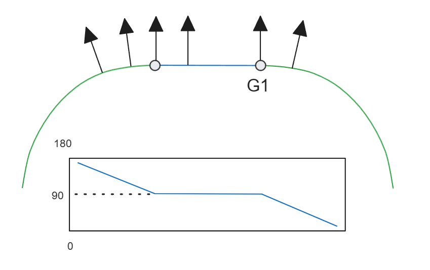

于是我们讨论G2需要一个参数无关且速度（导数）无关的几何量考虑；

我们想到的是使用曲率描述其曲线的在某点上的几何状态；

曲率的推导参考高数线积分相关内容，这里略过；这里直接给出曲率计算公式：
$$
平面曲率：
k=\frac
{
\left [ \begin{matrix}
P_x' & P_x''  \\
P_y' & P_y''  \\
\end  {matrix} \right ]
}
{||P'||^3}
\\
高维曲率：
k=\frac{P' \times P''}{||P'||^3}
\\
曲率半径：r=\frac1k
$$
平面上分子为二维向量的叉乘，也叫双向量的楔形乘积；

由此我们在考察方才的G1连续样条的曲率情况；

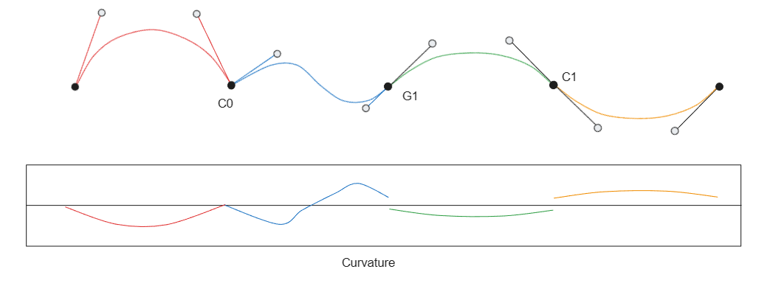

可以从曲率分析看出，即使C0连续的尖点也可能曲率连续，而就算C1连续处也可能有曲率跳变；
而这里的G1连续处曲率也有跳变；

##### 曲率梳分析

这里我们可以采用曲率梳看下情况：曲率梳对于我们研究G几何连续具有较高价值；

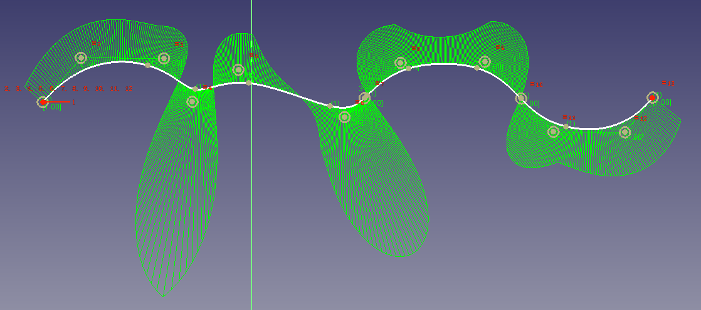

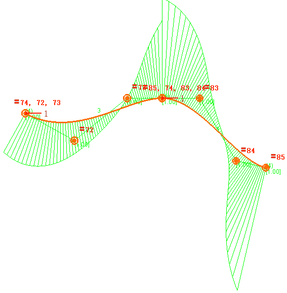

我们先关注G1连接处的情况；

我们知道，如果要保持G1连续，那么
$$
G1：P_4=P_3+(P_3-P_2)\beta_1
\\
\beta_1=1.00
$$
观察下图

如果要调整曲率，不只是P4会对B段起点曲率产生影响，P5也会对B段起点曲率有影响；
$$
G1:P_4=P_3+(P_3-P_2)\beta_1 
\\
\beta_1=1.00
\\
G2:P_5=P_3+(P_3-P_2)(2+\beta_1^2+0.5\beta_2)+(P1-P2)\beta_1^2
\\ 
\beta_2=0.00
\\
$$
上述式子阐述了如何利用两个参数控制B段线的曲率和A段G2连续；这里推导没有给出；

但是我们搞定了G2连续，依然失去了对曲线局部控制的特性；

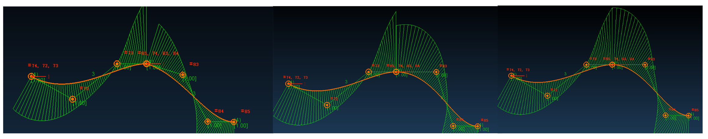

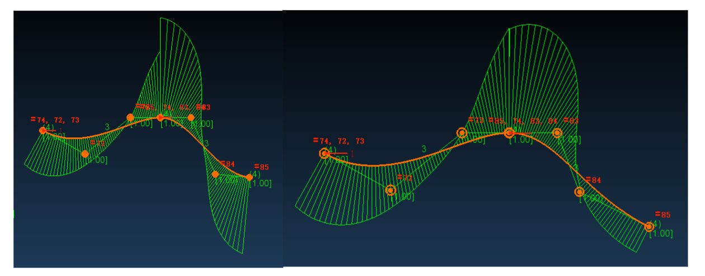

如上图所示无论调整P4还是调整P5都具有对齐曲率达成G2连续的能力；

那么G2连续应该就能解决反射跳变问题了，下图可见斑点反射没有跳变接缝；

 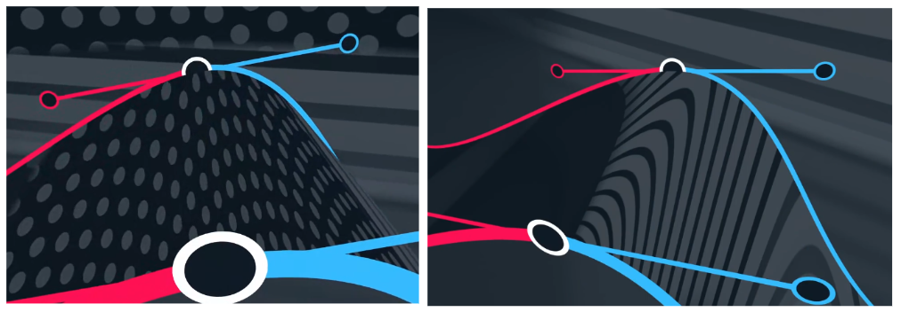

##### 几何连续总结

工业上一般称G2或以上的面为A级面；

如图，表达了G1 G2 G3 的情况

- G1情况中，曲线仅为法向对齐，即曲率梳对齐；
- G2情况中，曲率法向对齐，且数值连续
- G3情况中，曲率法向对齐，且数值连续，且曲率的导数是连续，即曲率梳也是平滑过度的；

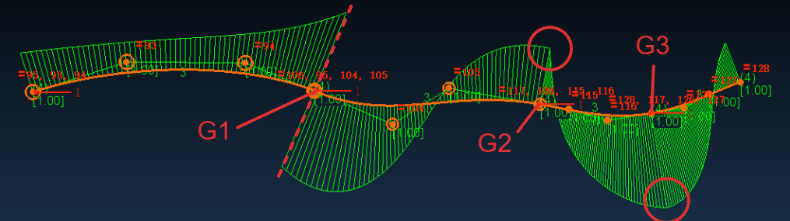

我们大致可以给出一个几何连续的定义出来，通常工程中对其定义较为粗浅 ：
$$
IF ：若存在一个函数  g（t） 使得A(t) 和 B[g(t)]是C^n连续的
\\
THEN：那么他们就是G^n连续的
$$

#### 连续性总结

| C参数连续 | 参数连续特性                           | G几何连续 | 几何连续特性                    | 关系             |
| --------- | -------------------------------------- | --------- | ------------------------------- | ---------------- |
| C0        | 位置连续，两端曲线端点重叠即可         | G0        | 位置连续，两端曲线端点重叠即可  | 等价             |
| C1        | 满足C0时，一阶导速度连续velocity       | G1        | 满足G0时，一阶导切线连续tangent | C1满足必然G1满足 |
| C2        | 满足C1时，二阶导加速度连续acceleration | G2        | 满足G1时，曲率连续Curvature     | C2满足必然G2满足 |
| C3        | 满足C2时，三阶导急动度连续jolt         | G3        | 满足G2时，曲率变速连续Torsion   | C3满足必然G3满足 |

上述的结论只适用于正则曲线，即曲线上各处没有速度为0的情况下；否则零点需要单独讨论；

如下图就是尖点例外，比较罕见，这一点上曲线时C无穷连续的，但是只有G0连续

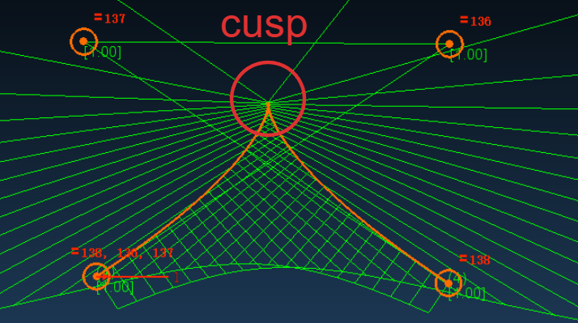

### 扩展曲线 Extended Universe

#### 赫米特样条线 Hermite Spline

如图：

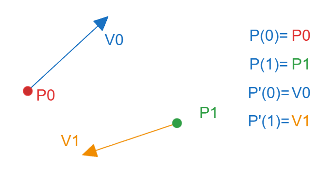

如果我们将贝塞尔的控制点拿掉，仅仅使用起点终点以及起终点的趋势向量，一次组成曲线形成条件；我们要构成一个三次曲线；
$$
P(t)=at^3+bt^2+ct+d
$$
这里三次曲线的多项式有四个未知数，使用上述四个条件解方程得到a、b、c、d；
最终我们可以得到这个样条曲线矩阵形式：
$$
P(t)=
\left [ \begin{matrix}
1 & t & t^2 & t^3   
\end  {matrix} \right ] 
\left [ \begin{matrix}
1 	& 0 	& 0 	& 0   \\ 
0 	& 1 	& 0 	& 0   \\ 
-3 	& -2 	& 3 	& -1  \\ 
2 	& 1 	& -2 	& 1   \\ 
\end  {matrix} \right ] 
\left [ \begin{matrix}
P_0     \\ 
v_0     \\ 
P_2     \\ 
v_1     \\ 
\end  {matrix} \right ]
$$
中间矩阵构成了其基函数

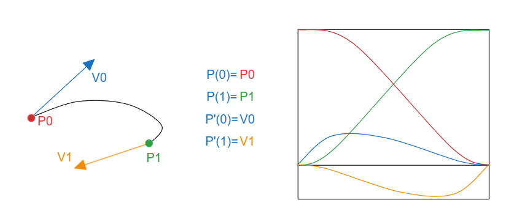

那么如果我们将这种三次曲线首尾相接连接为样条就得到了，在连接处一次可导的C1连续样条；
当然这个还是难以达到C2连续的标准；
这个就是赫米特样条线；
赫米特-法国数学家

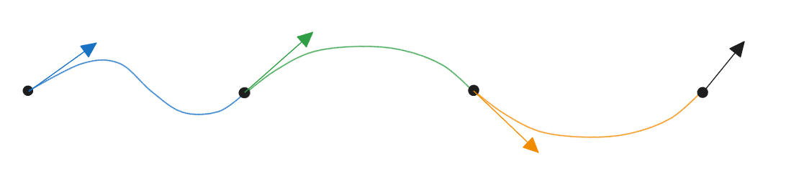

##### 赫米特样条特性

- 具有显式导数
- 必然C1连续
- 支持插值因为曲线会经过线上的每个点

赫米特和贝塞尔的转换

如果将赫米特样条的每个向量缩小三倍，并在该向量的负方向创建一个向量，这样就能得到贝塞尔定义的控制点了；
这样就可以用贝塞尔样条来定义一个赫米特样条

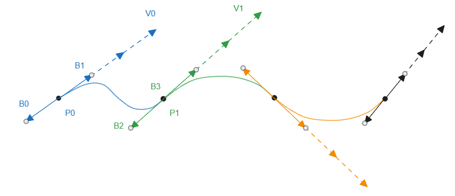
$$
B_0=P_0
\\
B_1=P_0+v_0/3
\\
B_2=P_1-v_1/3
\\
B_3=P_1
$$

#### 线性样条线 Linear Spline

- - 由于线通过每个节点，所以支持插值
  - 对于其他曲线而言线性样条（多段线）非常简单
  - 代数表达上非常的简单 $P(t)=(1-t)P_0+tP_1$

- 但是只是C0连续

  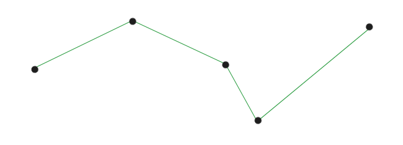

那么是否可以将其曲线化？

一种方法模仿构造赫米特曲线的方法，但是向量并非自定义，而是通过节点计算得到；
首先抛开起终点，寻找每个当前节点的前后两个节点，依据前后节点计算向量，并将其向量算作当前点的曲线向量；
$$
P'_i=P_{i+1}-P_{i-1}
\\
i\neq 0 ,i\neq  n
$$
然后考虑起终点，直接使用起终点和临近一点按起终点做镜像，得到辅助点，然后依据上述计算向量
其实起终点向量构成没有那么麻烦，构成辅助点之后可以发现：向量就是起终点和最近点构成的向量的2倍；
$$
P_{-1}=P_0-(P_1-P_0)=2P_0-P_1
\\
P_{n+1}=P_n-(P_{n-1}-P_{n})=2P_n-P_{n-1}
\\
P'_0=P_{1}-P_{-1}=P_{1}-(2P_0-P_1)=2(P_1-P_0)
\\
P'_n=P_{n+1}-P_{n-1}=2P_n-P_{n-1}-P_{n-1}=2(P_n-P_{n-1})
$$

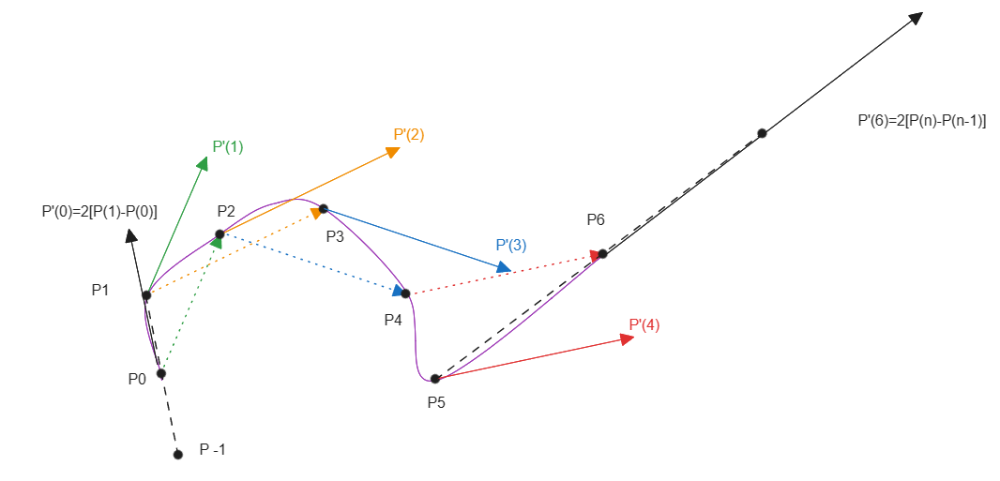

由此我们得到了一个不怎么好看的曲线，可以看到右图紫色线过度非常生硬，这是由于向量过大导致的，如果我们给每个向量都来个衰减系数s，那么整个曲线就会慢慢变得平滑；

 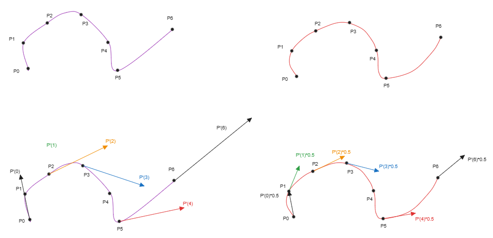

当s衰减至0的时候就会退化为多段线；

这种样条线称为 Cardinal Spline 样条；

我们可以写出 Cardinal Spline 样条矩阵式：
$$
P(t)=
\left [ \begin{matrix}
1 & t & t^2 & t^3   
\end  {matrix} \right ] 
\left [ \begin{matrix}
1 	& 0 	& 0 	& 0   \\ 
-s 	& 0 	& s 	& 0   \\ 
2s 	& s-3 	& 3-2s 	& -s  \\ 
-s	& 2-s 	& s-2 	& s   \\ 
\end  {matrix} \right ] 
\left [ \begin{matrix}
P_0     \\ 
P_1     \\ 
P_2     \\ 
P_3     \\ 
\end  {matrix} \right ]
$$
根据观察，当衰减系数s=0.5的时候，这条 Cardinal 样条显得最为放松，这个情况的特化曲线称为 Catmull-Rom Spline 卡特莫-罗姆样条线

Catmull-Rom 样条特性

- 由于线通过每个节点，所以支持插值
- 从曲率分析来讲是G1连续的，且是C1连续的
- 无需定义节点的切向量

我们可以写出 Catmull-Rom Spline 卡特莫-罗姆样条线矩阵式：
$$
P(t)=
\left [ \begin{matrix}
1 & t & t^2 & t^3   
\end  {matrix} \right ] 
\left [ \begin{matrix}
0 	& 2 	& 0 	& 0   \\ 
-1 	& 0 	& 1 	& 0   \\ 
2 	& -5 	& 4 	& -1  \\ 
-1	& 3 	& -3 	& 1   \\ 
\end  {matrix} \right ] 
\left [ \begin{matrix}
P_0     \\ 
P_1     \\ 
P_2     \\ 
P_3     \\ 
\end  {matrix} \right ]
$$
将矩阵表达的基函数图像绘制

即 每个点对其周边的影响都是以这个展开曲线为准的，可见调整一个节点其附近两点间产生正向作用，次近两点的部分产生负向作用；

对于7个点的整条线，每个点的影响能力如下：

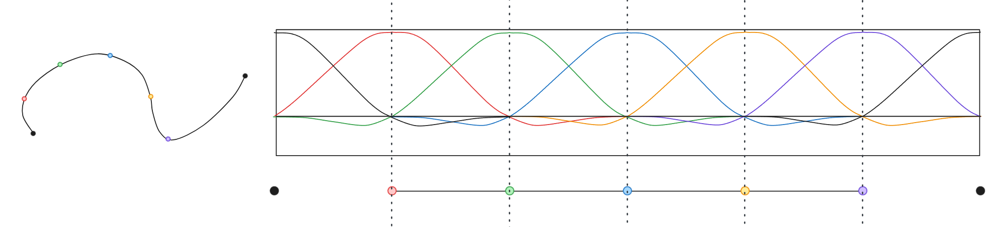

那么我们直接对其导数做分析，得到如下，

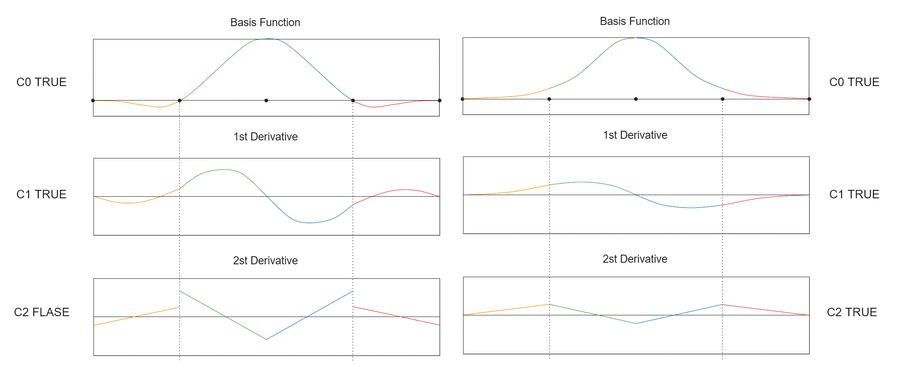

可见Catmull-Rom唯独C2没有连续

#### B样条

已知Catmull-Rom唯独C2没有连续，那么我们可不可能想办法构造一个C2连续的曲线，然后将其矩阵式写出来呢？

我们看下矩阵式的通用情况
$$
P(t)=
\left [ \begin{matrix}
1 & t & t^2 & t^3   
\end  {matrix} \right ] 
\left [ \begin{matrix}
c_{00} 	& c_{10} 	& c_{20} 	& c_{30}   \\ 
c_{01} 	& c_{11} 	& c_{21} 	& c_{31}   \\ 
c_{02} 	& c_{12} 	& c_{22} 	& c_{32}  \\ 
c_{03}	& c_{13} 	& c_{23} 	& c_{33}   \\ 
\end  {matrix} \right ] 
\left [ \begin{matrix}
P_0     \\ 
P_1     \\ 
P_2     \\ 
P_3     \\ 
\end  {matrix} \right ]
$$
在通用式中矩阵中具有16个未知数，那么我们必须得到16个条件才可以解方程，那么再次看到一阶导数、二阶导数的图像，我们要关注每个颜色交换的节点部分；
$$
图像右侧末端必须C2连续得到：
\\
B_0(1)=0,B'_0(1)=0,B''_0(1)=0
\\
图像蓝红交界C2连续得到：
\\
B_0(0)=B_1(1),B_0(0)=B'_1(1),B''_0(0)=B''_1(1)
\\
图像绿蓝交界C2连续得到：
\\
B_0(0)=B_2(1),B_0(0)=B'_2(1),B''_0(0)=B''_2(1)
\\
图像黄绿交界C2连续得到：
\\
B_0(0)=B_3(1),B_0(0)=B'_3(1),B''_0(0)=B''_3(1)
\\
图像左侧末端C2连续得到：
\\
B_3(1)=0,B'_3(1)=0,B''_3(1)=0
\\
由于整段曲线在一个三次曲线中，考虑在参数取t时影响力合为1：
\\
B_0(t)+B_1(t)+B_2(t)+B_3(t)=1
$$
至此16个条件完备，可直接解方程得到C2连续的曲线；最终得到方程：
$$
P(t)=
\left [ \begin{matrix}
1 & t & t^2 & t^3   
\end  {matrix} \right ] 
\left [ \begin{matrix}
1 	& 4 	& 1		& 0   	\\ 
-3 	& 0 	& 3 	& 0  	\\ 
3 	& -6 	& 3		& 0  	\\ 
-1	& 3 	& -3 	& 1   	\\ 
\end  {matrix} \right ] 
\left [ \begin{matrix}
P_0     \\ 
P_1     \\ 
P_2     \\ 
P_3     \\ 
\end  {matrix} \right ]
$$
按照该规则绘制的曲线如下

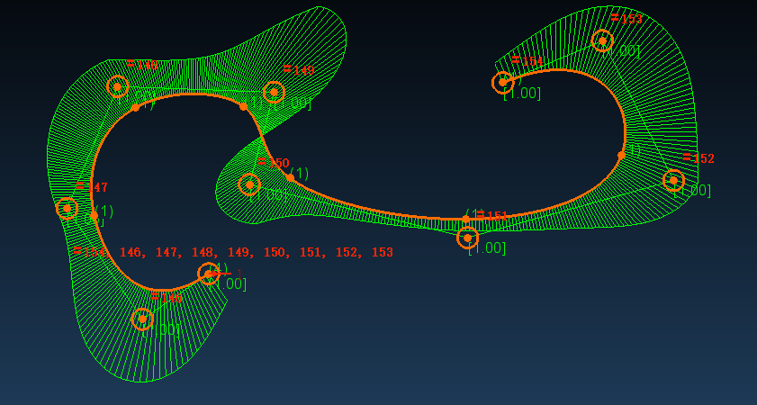

从曲率梳上看，该曲线G2连续，但是并非G3连续； 
因此该曲线为G1、G2、C1、C2 连续，而C3、G3不连续；
这个曲线就是叫做B-Spline，大名鼎鼎的B样条；

### 总结

这里我们将各个较为重要曲线的基函数和矩阵式整理出来：

Bézier 贝塞尔样条段：

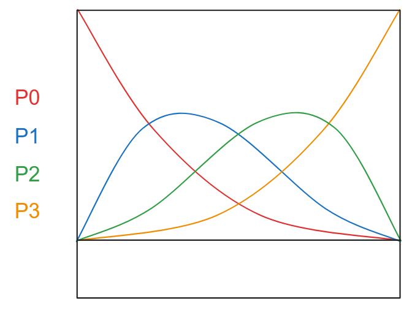
$$
P(t)=
\left [\begin{matrix}
1 & t & t^2 & t^3   \\ 
\end  {matrix} \right ] 
\left [ \begin{matrix}
1 	& 0 	& 0 	& 0   \\ 
-3 	& 3 	& 0 	& 0   \\ 
3 	& -6 	& 3 	& 0   \\ 
-1 	& 3 	& -3 	& 1   \\ 
\end  {matrix} \right ] 
\left [ \begin{matrix}
P_0     \\ 
P_1     \\ 
P_2     \\ 
P_3     \\ 
\end  {matrix} \right ]
$$

Hermite 赫米特样条段：

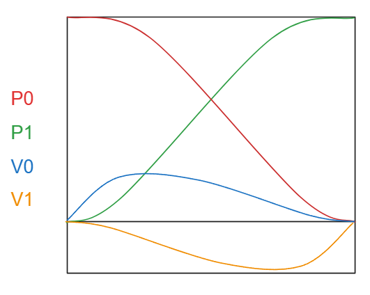
$$
P(t)=
\left [ \begin{matrix}
1 & t & t^2 & t^3   
\end  {matrix} \right ] 
\left [ \begin{matrix}
1 	& 0 	& 0 	& 0   \\ 
0 	& 1 	& 0 	& 0   \\ 
-3 	& -2 	& 3 	& -1  \\ 
2 	& 1 	& -2 	& 1   \\ 
\end  {matrix} \right ] 
\left [ \begin{matrix}
P_0     \\ 
v_0     \\ 
P_2     \\ 
v_1     \\ 
\end  {matrix} \right ]
$$

Catmull-Rom 卡特莫-罗姆样条段：

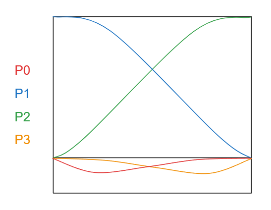
$$
P(t)=
\left [ \begin{matrix}
1 & t & t^2 & t^3   
\end  {matrix} \right ] 
\left [ \begin{matrix}
0 	& 2 	& 0 	& 0   \\ 
-1 	& 0 	& 1 	& 0   \\ 
2 	& -5 	& 4 	& -1  \\ 
-1	& 3 	& -3 	& 1   \\ 
\end  {matrix} \right ] 
\left [ \begin{matrix}
P_0     \\ 
P_1     \\ 
P_2     \\ 
P_3     \\ 
\end  {matrix} \right ]
$$
B-Spline B样条段

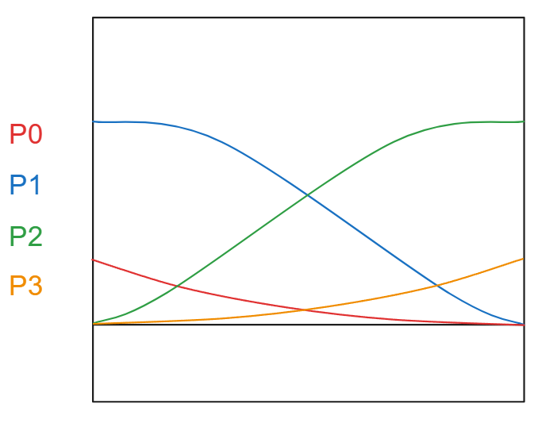
$$
P(t)=
\left [ \begin{matrix}
1 & t & t^2 & t^3   
\end  {matrix} \right ] 
\left [ \begin{matrix}
1 	& 4 	& 1		& 0   	\\ 
-3 	& 0 	& 3 	& 0  	\\ 
3 	& -6 	& 3		& 0  	\\ 
-1	& 3 	& -3 	& 1   	\\ 
\end  {matrix} \right ] 
\left [ \begin{matrix}
P_0     \\ 
P_1     \\ 
P_2     \\ 
P_3     \\ 
\end  {matrix} \right ]
$$

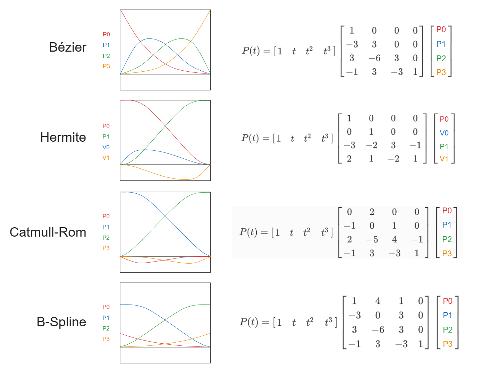

整个曲线构造 都是由 指定节点通过不同的系数构造曲线多项式

|             | 阶数 | 连续性 | 切向量 | 插值     | 常用领域                     |
| ----------- | ---- | ------ | ------ | -------- | ---------------------------- |
| 贝塞尔      | 3    | C0、C1 | 人为   | 部分插值 | 形态、字体、矢量图           |
| 赫米特      | 3    | C0、C1 | 显式   | 完全插值 | 动画、物理模拟、插值         |
| 卡特莫-罗姆 | 3    | C1     | 自动   | 完全插值 | 动画、路径平滑               |
| B样条       | 3    | C2     | 自动   | 无法插值 | 曲率敏感表面、动画、相机路径 |
| 线性        | 1    | C0     | 自动   | 完全插值 | 密集数据、无法平滑插值工况   |

### 非均匀样条简述

Non-Uniform B-Spline 非均匀B样条  NURBS

其实就是B样条的每个节点移动对于相邻4个点内曲线段的影响非等距均匀；

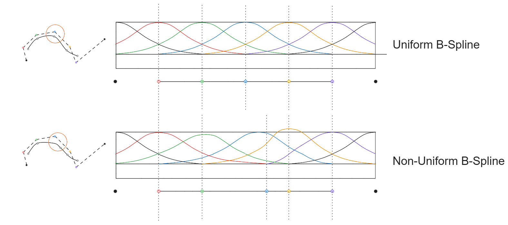

