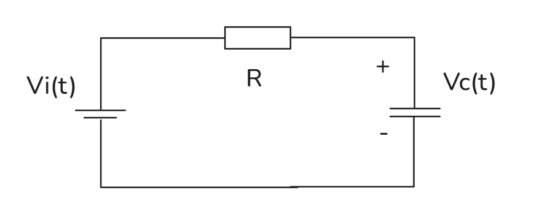
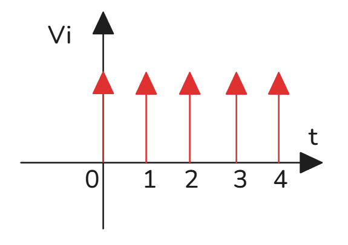
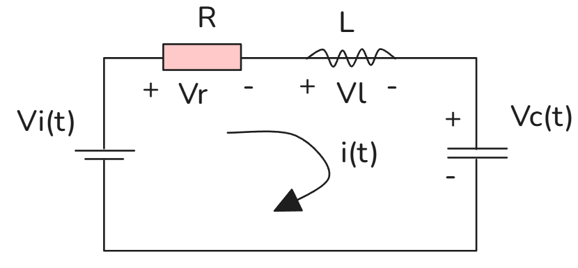
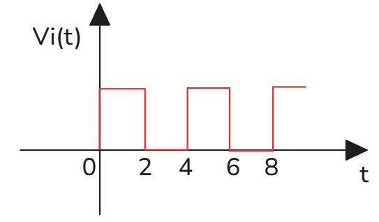

# 拉普拉斯逆转换_周期型

[TOC] 

## 周期函数的拉普拉斯变换

设周期函数 $(f(t)=f(t+T))$，最小正周期 $T$
$$
\mathcal{L}\{f(t)\}=\frac{1}{1-e^{-sT}}\int_0^T f(t)e^{-st}dt
$$
**公式**：
$$
\boldsymbol{F(s)=\frac{1}{1-e^{-sT}}\cdot F_1(s),\quad F_1(s)=\int_0^T f(t)e^{-st}dt}
$$

### 例1
周期 $(T=2)$，一个周期内 $f(t)=1,\ t\in[0,1];\ f(t)=0,\ t\in(1,2]$
$$
\begin{aligned}
F(s)&=\frac{1}{1-e^{-2s}}\int_0^1 1\cdot e^{-st}dt
=\frac{1}{1-e^{-2s}}\cdot\left.\frac{-1}{s}e^{-st}\right|_0^1\\
&=\frac{1}{1-e^{-2s}}\cdot\frac{1-e^{-s}}{s}
=\frac{1}{s(1+e^{-s})}
\end{aligned}
$$

### 例2
周期 $(T=4)$，一个周期 $([0,2])$ 为1，$((2,4])$为0
$$
\begin{aligned}
F(s)&=\frac{1}{1-e^{-4s}}\int_0^2 e^{-st}dt
=\frac{1}{1-e^{-4s}}\cdot\frac{1-e^{-2s}}{s}\\
&=\frac{(1-e^{-2s})}{s(1-e^{-4s})}=\frac{1}{s(1+e^{-2s})}
\end{aligned}
$$

---

## 含延迟算子 $e^{-as}$ 逆变换；RC电路实例
时移性质：
$$
\mathcal{L}^{-1}\{e^{-as}F(s)\}=f(t-a)H(t-a)
$$
$(H(t))$ 为单位阶跃函数

### 例1
$$
F(s)=\frac{1}{s(1+e^{-s})}=\frac{1}{s}\cdot\frac{1}{1+e^{-s}}
$$
几何级数展开 $\dfrac{1}{1+x}=1-x+x^2-x^3+\cdots,\ x=-e^{-s}$
$$
F(s)=\frac{1}{s}\big(1-e^{-s}+e^{-2s}-e^{-3s}+\cdots\big)
$$
逐项逆变换
$$
f(t)=(H(t))-H(t-1)+H(t-2)-H(t-3)+\cdots
$$

### 例2 RC电路

电路参数：$R=\dfrac12\,\Omega,\ C=1\,\text{F},\ V_C(0)=1\,\text{V}$
输入脉冲序列 $V_i(t)=\sum_{n=0}^{\infty}\delta(t-n)$
电路方程
$$
RC\frac{dV_C}{dt}+V_C(t)=V_i(t)
\implies
\frac12V_C'+V_C=V_i
$$
拉普拉斯变换
$$
\frac12\left[sV_C(s)-V_C(0)\right]+V_C(s)=V_i(s)
$$
$$
(s+2)V_C(s)-2=2V_i(s),\quad V_i(s)=1+e^{-s}+e^{-2s}+\cdots
$$
$$
V_C(s)=\frac{1}{s+2}\left[3+2e^{-s}+2e^{-2s}+2e^{-3s}+\cdots\right]
$$
逆变换
$$
V_C(t)=3e^{-2t}(H(t))+\sum_{n=1}^{\infty}2e^{-2(t-n)}H(t-n)
$$

---

## RLC周期脉冲电路

参数：$R=3\,\Omega,\ C=0.5\,\text{F},\ L=1\,\text{H}$，初值 $V_C(0)=0,\;V_C'(0)=2$
$$
V_i=RC\frac{dV_C}{dt}+LC\frac{d^2V_C}{dt^2}+V_C(t)
$$
代入参数
$$
V_i=\frac12V_C''+\frac32V_C'+V_C
$$
输入周期方波：
$$
V_i(t)=(H(t))-H(t-2)+H(t-4)-H(t-6)+\cdots
$$
$$
V_i(s)=\frac1s\left(1-e^{-2s}+e^{-4s}-e^{-6s}+\cdots\right)
$$
变换整理：
$$
2V_i(s)=(s^2+3s+2)V_C(s)-2
$$
$$
V_C(s)=\frac{2}{s^2+3s+2}+\frac{2}{s(s+1)(s+2)}\big(1-e^{-2s}+e^{-4s}-\cdots\big)
$$
部分分式 $\dfrac{2}{s(s+1)(s+2)}=\dfrac{1}{s}-\dfrac{2}{s+1}+\dfrac{1}{s+2}$，利用时移逐项写出分段解。

