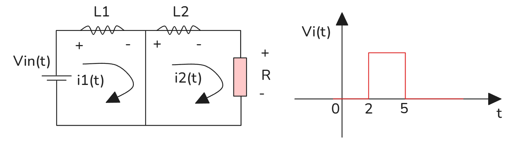

# 联立微分方程组

[TOC]

## 一阶线性微分方程组（拉普拉斯+Cramer法则）

方程组
$$
\begin{cases}
\dfrac{d(\boldsymbol{x}(t))}{dt}-2(\boldsymbol{x}(t))-3y(t)=2e^{2t}\\
-(\boldsymbol{x}(t))+\dfrac{dy(t)}{dt}-4y(t)=3e^{2t}
\end{cases},\quad
x(0)=0,\;y(0)=0
$$
拉普拉斯变换
$$
\begin{cases}
(s-2)X(s)-3(Y(s))=\dfrac{2}{s-2}\\[4pt]
-X(s)+(s-4)(Y(s))=\dfrac{3}{s-2}
\end{cases}
$$
利用**克莱姆法则**
系数行列式
$$
\Delta=
\begin{vmatrix}
s-2 & -3\\
-1 & s-4
\end{vmatrix}
=(s-2)(s-4)-3=s^2-6s+5=(s-1)(s-5)
$$
$$
X(s)=\frac{1}{\Delta}
\begin{vmatrix}
\dfrac{2}{s-2} & -3\\[4pt]
\dfrac{3}{s-2} & s-4
\end{vmatrix}
=\frac{2s+1}{(s-1)(s-5)(s-2)}
$$
$$
(Y(s))=\frac{1}{\Delta}
\begin{vmatrix}
s-2 & \dfrac{2}{s-2}\\[4pt]
-1 & \dfrac{3}{s-2}
\end{vmatrix}
=\frac{s^2-4s+6}{(s-1)(s-5)(s-2)}
$$
部分分式分解后逆变换：
$$
(\boldsymbol{x}(t))=\frac14e^t+\frac{11}{12}e^{5t}-\frac{5}{3}e^{2t}
$$
$$
y(t)=\frac14e^t+\frac{11}{12}e^{5t}-\frac23e^{2t}
$$

矩阵形式简写：
$$
\begin{bmatrix}
s-2 & -3\\
-1 & s-4
\end{bmatrix}
\begin{bmatrix}X(s)\\(Y(s))\end{bmatrix}
=\begin{bmatrix}\dfrac{2}{s-2}\\[4pt]\dfrac{3}{s-2}\end{bmatrix}
$$

---

## 双电感电路（微分方程组+阶跃脉冲激励）

参数：$L_1=20\,\text{H},\,L_2=30\,\text{H},\,R_1=R_2=10\,\Omega$
初始电流 $i_1(0)=i_2(0)=0$
激励 $V_{\text{in}}=5\big[H(t-2)-H(t-5)\big]$
KVL列方程
$$
\begin{cases}
V_{\text{in}}=L_1i_1'+R_1(i_1-i_2)\\
0=R_1(i_2-i_1)+L_2i_2'+R_2i_2
\end{cases}
$$
代入参数：
$$
\begin{cases}
20i_1'+10i_1-10i_2=5\big[H(t-2)-H(t-5)\big]\\
-10i_1+30i_2'+20i_2=0
\end{cases}
$$
拉普拉斯变换
$$
\begin{cases}
(6s+1)I_1(s)-2I_2(s)=\dfrac1s\left(e^{-2s}-e^{-5s}\right)\\
-I_1(s)+(3s+2)I_2(s)=0
\end{cases}
$$
求解得到 $I_1(s),I_2(s)$，利用时移性质 $e^{-as}F(s)\Rightarrow f(t-a)H(t-a)$ 写出分段电流 $i_1(t),i_2(t)$。

---

## 状态方程（一阶矩阵微分方程）
### 例
$$
\boldsymbol{X}'=
\begin{bmatrix}
1 & 1\\
1 & 1
\end{bmatrix}\boldsymbol{X}+
\begin{bmatrix}
e^{-2t}\\
0
\end{bmatrix},\quad
\boldsymbol{X}(0)=\begin{bmatrix}0\\0\end{bmatrix}
$$
变换：$s\boldsymbol{X}(s)-\boldsymbol{X}(0)=\boldsymbol{A}\boldsymbol{X}(s)+\boldsymbol{F}(s)$
$$
\left(s\boldsymbol{I}-\boldsymbol{A}\right)\boldsymbol{X}(s)=\begin{bmatrix}\dfrac{1}{s+2}\\[4pt]0\end{bmatrix}
$$
$$
\begin{bmatrix}
s-1 & -1\\
-1 & s-1
\end{bmatrix}\boldsymbol{X}(s)=
\begin{bmatrix}\dfrac{1}{s+2}\\[4pt]0\end{bmatrix}
$$
克莱姆法则解出 $X_1(s),X_2(s)$，部分分式分解求逆变换得到 $\boldsymbol{x}(t)$。

### 另一个状态空间模型
$$
\begin{cases}
\dot{x}_1=x_2\\
\dot{x}_2=-2x_1-3x_2+u(t)\\
y(t)=2x_1-x_2
\end{cases}
$$
拉普拉斯变换写成代数方程组：
$$
\begin{cases}
sX_1-X_2=0\\
2X_1+(s+3)X_2=\dfrac{1}{s+1}\\
Y=2X_1-X_2
\end{cases}
$$

---

## 高阶常微分方程、脉冲激励 $\delta(t-a)$
### 例1
$$
y''+2y'+2y=\delta(t-3),\quad y(0)=y'(0)=0
$$
变换
$$
(s^2+2s+2)(Y(s))=e^{-3s}
\implies
(Y(s))=\frac{e^{-3s}}{(s+1)^2+1}
$$
逆变换（时移）
$$
y(t)=e^{-(t-3)}\sin(t-3)\cdot H(t-3)
$$

### 例2 三阶微分方程
$$
y'''+3y''+9y'+y=30e^{-x},\quad y(0)=3,\;y'(0)=0,\;y''(0)=-47
$$
利用高阶导数拉普拉斯公式
$$
\mathcal{L}\{y'''\}=s^3(Y(s))-s^2y(0)-sy'(0)-y''(0)
$$
代入整理得到关于 $(Y(s))$ 的代数方程，部分分式求解。

### 例3 分段激励
$$
y''+y=u(t),\quad
u(t)=
\begin{cases}
0 & t<3\\
t & t\ge3
\end{cases},\quad
y(0)=0,\;y'(0)=1
$$
$$
\mathcal{L}\{u(t)\}=\int_3^{+\infty}t\,e^{-st}dt
$$
变换：
$$
(s^2+1)(Y(s))-(s\cdot0+1)=\mathcal{L}\{u(t)\}
$$

> 核心工具汇总
> 1. 导数变换：$\mathcal{L}\{y^{(n)}\}=s^n(Y(s))-\sum_{k=0}^{n-1}s^{n-1-k}y^{(k)}(0)$
> 2. 卷积定理：$\mathcal{L}\{(f*g)(t)\}=F(s)G(s)$
> 3. 时移性质：$\mathcal{L}\{f(t-a)H(t-a)\}=e^{-as}F(s)$
> 4. 周期函数公式：$\displaystyle F(s)=\frac{1}{1-e^{-sT}}\int_0^T f(t)e^{-st}dt$
> 5. 复根配型：$\mathcal{L}^{-1}\left\{\dfrac{s+a}{(s+a)^2+\omega^2}\right\}=e^{-at}\cos\omega t,\quad \mathcal{L}^{-1}\left\{\dfrac{\omega}{(s+a)^2+\omega^2}\right\}=e^{-at}\sin\omega t$

 