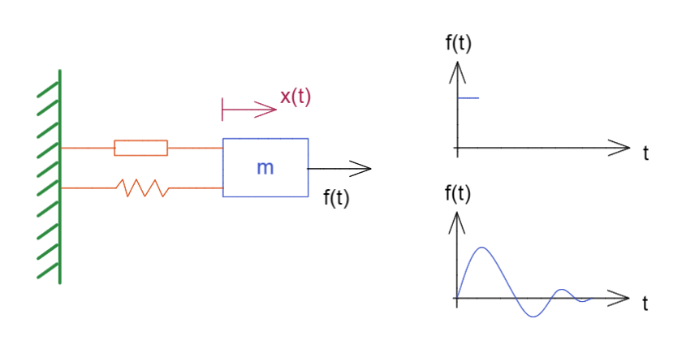
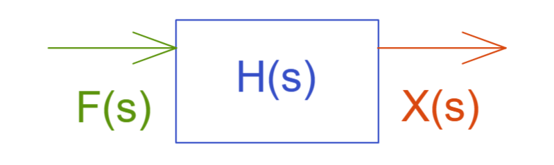
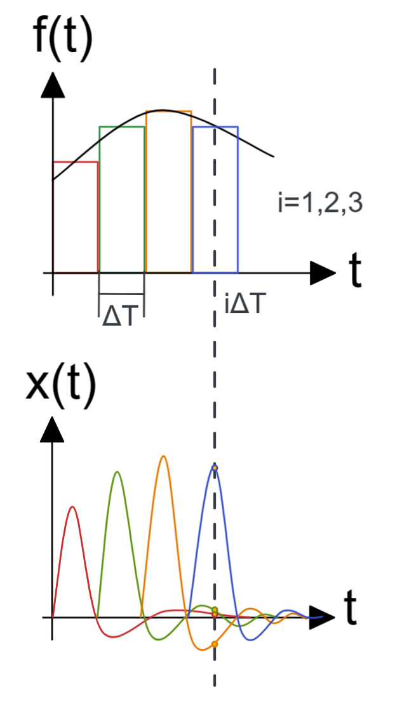
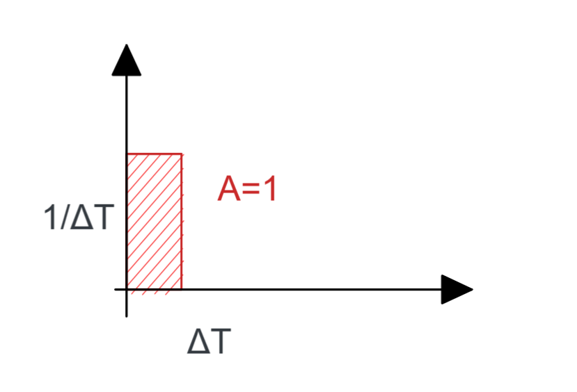
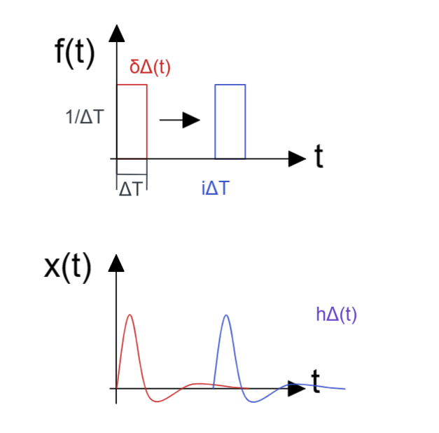
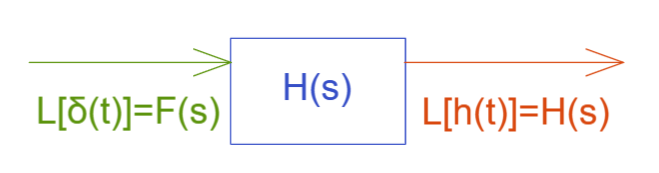
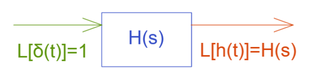

# 线性时不变系统的冲激响应与卷积

[TOC]

## 术语

LTI system 线性时不变系统  = linear time invariant

Implulse Resporse 冲激响应

Convolution 卷积

叠加原理  superpositon principle

## 线性时不变系统

有一个运算  $O\{\}$  对输入信号  $f(t) $ 操作，有如下输出：

$O\{f(t) \}=x(t)$

### 叠加原理  superpositon principle

此时在线性系统中有两个输入信号如下：

$O\{f_2(t)\}=x_2(t)$
$O\{af_1(t)\}=ax_1(t)$

那么将这两个信号相加就有

$O\{f_2(t)\}+O\{af_1(t)\}=x_2(t) +ax_1(t)$

这个就是线性空间的叠加原理
$$
O\{a_1 f_1(t)+a_2 f_2(t)\} = a_1x_1(t)+a_2x_2(t)
$$

### 时不变Time Invariant

无论在哪个时间点，向系统输入的信号相同那么其输出也是必然相同的
$$
O\{f(t)\}=x(t)\rightarrow O\{f(t-\tau)\}=x(t-\tau)
$$

### 例：线性弹簧阻尼系统

我们有个带阻尼的弹性系统如图
如果我们给一个**短暂外力**，就会不断振动然后慢慢停下

那么这个系统的简单写为框图就是

$$
F(s)H(s)=X(s) \\ 
F(s)输入的拉普拉斯变换，
H(s)传递函数，
X(s)输出的拉普拉斯变换
$$
当我们对这个式子进行拉普拉斯逆变换时就能够得到卷积

$L^{-1}[F(s)H(s)]=L^{-1}[X(s)]\Rightarrow f(t)*h(t)=x(t),此处*就是卷积$

该式子的证明可查看附录 <卷积的拉普拉斯变换>

### 直观示例

有一个连续输入，我们将其离散化

线性时不变系统，在某一时刻系统的输出，即为系统所有之前时间的相应信号加和，$x(t)=\sum signals$ ， 如果离散的时间分割越小，那么离散就成为了连续  $\lim\limits_{\Delta T}\sum\rightarrow\int$

### 单位冲激函数  Dirac Delta

上述在弹簧阻尼系统中的一个所谓的**短暂外力**就是单位冲激函数；

所谓的单位冲激函数在计算机种可视为在很短时间内的的一个方波，其导致的响应（带有阻尼的波形反馈，有时是环境回声）就是冲激响应函数，该函数反映了产生响应的整个系统的环境；其实就是向系统SYS发出冲激HIT获得响应RES函数，从RES所含信息中以获知系统SYS的全貌；

单位冲激总的来说是一个宽度为0，面积为1的函数，数学上无法寻得该函数；
$$
\delta(t):\\
\int^\infty_{-\infty}\delta(t)dt=1\\
\delta(t)=0,t\neq0
$$
于是将其离散化
$$
\delta_\Delta(t) = 
\frac1{\Delta T},0<t<\Delta T \\
\lim\limits_{\Delta T}\delta_\Delta(t) =\delta(t)
$$

 现在我们对一个系统发出冲激；

此时我们可以得到其响应函数内容的表格，在线性时不变系统，信号系统的平移或者是乘积等运算结果依然在群内；如下输入输出表：

| $f(t)$                         | $x(t)$                    |
| ------------------------------ | ------------------------- |
| $\delta_\Delta (t)$            | $h_\Delta (t)$            |
| $\delta_\Delta (t-i\Delta T)$  | $h_\Delta (t-i\Delta T)$  |
| $A\delta_\Delta (t-i\Delta T)$ | $Ah_\Delta (t-i\Delta T)$ |

我们回到冲激函数，之前说到冲激函数是个时间极短的波，通常视为方波，那么矩形面积可计算，那么其方波面积即可计算；
其宽为时间间隔 $\Delta T$，高度为输入型号在该 $i$ 时刻的强度 $f(i\Delta T)$  , 那么就能够得到 $A=f(i\Delta T)\cdot\Delta T$

我们代入上述表格最后一项，得到；
$$
f(t)=f(i\Delta T)\cdot\Delta T\cdot \delta_\Delta (t-i\Delta T)  
\Rightarrow 
x(t)=f(i\Delta T)\cdot\Delta T\cdot h_\Delta (t-i\Delta T)
$$
其表达系统SYS对面积为$A=f(i\Delta T)\cdot\Delta T$ 的冲激输入得到的在延迟 $ i\Delta T$ 时间的响应；

上述这只是仅仅一个冲激函数的情况；
那么计算在当前时间点 T 之前多个冲激函数的输入在该时刻 T 的响应则需要将先前所有的冲激响应函数全部做$\sum$线性叠加；
那么计算在当前时间点 T 之前的连续函数的输入在该时刻 T 的响应则需要将先前连续函数每个时刻的信号统一考虑做积分$\int$；

线性叠加情况下：
$$
x(t)=\sum\limits^i_{i=0}f(i\Delta T)h_\Delta(t-i\Delta T),t=i\Delta T
$$
将上述连续化 $\Delta T\rightarrow 0 \Rightarrow \Delta T=d\tau, i\Delta T=\tau,h_\Delta()=h()$

那么积分情况下：
$$
x(t)=\int^t_0 f(\tau)h(t-\tau)d\tau
$$
这个形式就是卷积的定义式；
$$
\int^t_0 f(\tau)h(t-\tau)d\tau=f(t)*h(t)
$$

## 总结

所以在对于一个LTI线性时不变系统中，一个冲激响应的函数可以完全定义这个系统，知晓这个系统的在该最大测量强度下的全貌；

对于如下这个系统，如果该输入为一个冲激响应，那么输入为 1 进入系统，系统的输出则直接完成了系统的描绘；

那么显然可以得到验证，一个单一的冲激造成的响应在理论上所反映出的就是系统的全貌   $1\cdot H(s)=H(s)$

### 应用

可用在混响混音的情况；如果我们可以在礼堂等空旷地点，重重敲击某物得到声音（该物体最好不是持续发声的那种，别用 钟、音叉 等，建议敲击木头或扎破气球来获得瞬间大音量），记录这个响度极大的瞬间声音；此时其实就是敲击声音为冲激，录音为环境系统的回声反馈，这反馈中就已经含有系统的特征了； 此时将录音室内的说话录音信号和这个冲激响应做卷积，就能够得到好像某人在礼堂等地区说话的混音效果；

如果我们得到一段录音，而需要判断其环境，就可以直接构造方波作为冲激，然后根据响应来反算系统环境的响应，就能够分析环境类型了；

让一个单一可塑的因子在环境中被塑造后产生的效果作为时域的核心 core，并将其影响施加到复杂的因素上，以将其整体形式转变为被环境塑造后的样貌；

让一个单一可塑的因子（冲激）在环境（系统）中被塑造后产生的效果（响应）作为时域的核心 core（塑造方针），并将其影响施加到复杂的因素（其他连续复杂信号）上，以将其整体形式转变（卷积）为被环境塑造后的样貌（被塑造方针改变了的连续复杂信号的样态）；

