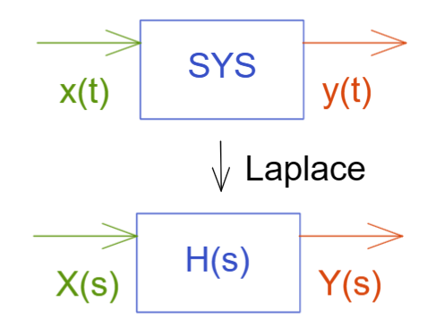
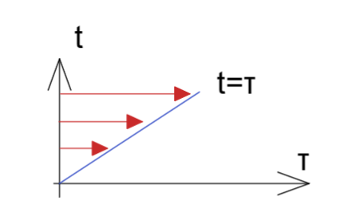
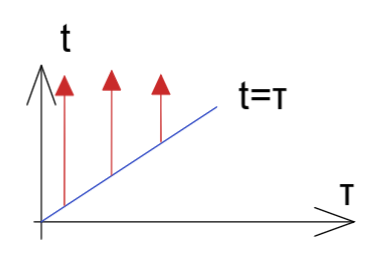

# 卷积的拉普拉斯变换 Laplace Transform of Convolution

一个线性时不变系统可以使用如下表示

频域上，整个输入输出系统经过拉普拉斯变换后会遵循
  $Y(s)=H(s)X(s) \\ 
X(s)输入的拉普拉斯变换，
H(s)传递函数，
Y(s)输出的拉普拉斯变换$ 

如果在时域上 那么就要对整个系统做拉普拉斯反变换，其实对输出信号变换为时域 也就是 对输入式子做变换

那么就有
$$
Y(s)=H(s)X(s) \Rightarrow L^{-1}[Y(s)]=L^{-1}[H(s)X(s)] \Rightarrow y(t)=x(t)*h(t)\\
*即为卷积
$$
## 证明

给出卷积以及拉普拉斯变换定义
$$
X(s)=L[X(t)]=\int_0^\infty x(t)e^{-st}dt \ \ \ ,拉普拉斯变换\\
x(t)*g(t)=\int_0^t x(\tau)g(t-\tau)d\tau \ \ \ ,卷积
$$
证明
$$
L[x(t)*g(t)]=X(s)G(s)
$$

--------

直接代入定义式

$L[x(t)*g(t)]=\int_0^\infty \int_0^t x(\tau)g(t-\tau)d\tau\ e^{-st}dt $

来求这个二重积分  $\iint\limits_DF(t,\tau)dA$，我们需要将积分区域的图形画出积分面A

可见横坐标开始积分上下限就有  $\tau:0\rightarrow t$   , 纵坐标积分上下限有 $t:\tau\rightarrow\infty$

那么这个时候积分次序从纵坐标开始对这个积分面做积分

从纵坐标开始积分上下限有 $t:\tau\rightarrow\infty$ ，横坐标则有 $\tau:0\rightarrow \infty$

那么这时候上述式子变为

$L[x(t)*g(t)]=
\int_\tau^\infty \int_0^\infty x(\tau)g(t-\tau) e^{-st}d\tau dt =
\int_0^\infty \int_\tau^\infty  x(\tau)g(t-\tau) e^{-st} dt d\tau $

抽取内部的式子  $ \int_\tau^\infty  x(\tau)g(t-\tau) e^{-st} dt $ ，注意到，此时内部式仅对 $t$ 积分有关 和 $\tau$ 积分无关，所以  $d\tau=0$

为了将函数 $g(t-\tau)$ 变为单变量函数 则使用换元法，令 $u=t-\tau$ ，则 $t=u+\tau,dt=du+d\tau,u:0\rightarrow\infty$

$ \int_\tau^\infty  x(\tau)g(t-\tau) e^{-st} dt  = 
\int_0^\infty  x(\tau)g(u) e^{-s(u+\tau) } d(u+\tau) =
\int_0^\infty  x(\tau)g(u) e^{-s(u+\tau) } du $

将该式子代入原式，并整理，就可见形式上完全契合拉普拉斯定义式

$L[x(t)*g(t)]\\=
\int_0^\infty  \int_0^\infty  x(\tau)g(u) e^{-s(u+\tau) }\ du\ d\tau \\=
\int_0^\infty  \int_0^\infty x(\tau) g(u) e^{-s\tau}e^{-su}  \ du\ d\tau \\=
\int_0^\infty  x(\tau)  e^{-s\tau} \ d\tau \cdot \int_0^\infty g(u)e^{-su}  \ du \\=
X(s)\cdot G(s)$

Q.E.D.
$$
L[x(t)*g(t)] = 
L[x(t)]*L[g(t)] = 
X(s)\cdot G(s)
$$

