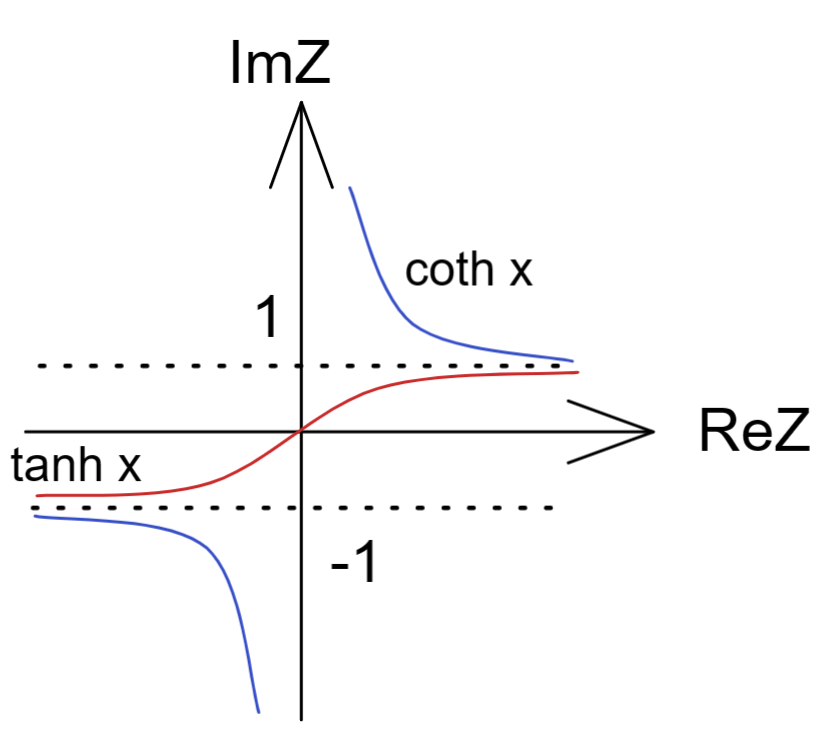

## 复数 Complex

[TOC]

**Αα、Ββ、Γγ、Δδ、Εε、Ϝϝ、Ζζ、Ηη、Θθ、Ιι、Κκ、Λλ、Μμ、Νν、Ξξ、Οο、Ππ、Ρρ、Σσ、Ττ、Υυ、Φφ、Χχ、Ψψ、Ωω**

## 为何我们需要复数

|                                                              |                                                              |                                                              |
| ------------------------------------------------------------ | ------------------------------------------------------------ | ------------------------------------------------------------ |
|  |  |  |
| $z^2-1=0$                                                    | $z^2=0$                                                      | $z^2+1=0$                                                    |
| $z=1,-1$                                                     | $z=0$                                                        | $无实数解$                                                   |

但是我们可以引入虚数来解决无实数解的情况；即 $i \equiv \sqrt{-1}$  则 $i^2=-1$ ；

因此， $z^2+1=0 \rightarrow z^2 = -1 \rightarrow z = \pm \sqrt{-1} = \pm i $

故在代数层面虚数还有一些扩展：

$i^2 = -1 $

$i^3 = i^2 \cdot i = -i$

$ i^4 = i^2 \cdot i^2 = -1 \cdot -1 = 1$

## 复数和复数平面

我们可以将不同特性的数加在一起，则得到复数

$z = x+iy $   此处 x 为实部 y为虚部，我们可以在坐标轴上来表示出来；

复数的代数情况：

$z_1+z_2 = (x_1+iy_1)+(x_2+iy_2) = (x_1+x_2)+i(y_1+y_2) $

$z_1-z_2 = (x_1+iy_1)-(x_2+iy_2) = (x_1-x_2)+i(y_1-y_2) $

$z_1z_2 = (x_1+iy_1)(x_2+iy_2) = (x_1x_2-y_1y_2)+i(x_1y_2+y_1x_2) $

$\frac{z_1}{z_2} = \frac{x_1+iy_1}{x_2+iy_2}=\frac{(x_1+iy_1)(x_2-iy_2)}{(x_2+iy_2)(x_2-iy_2)} = \frac{(x_1x_2+y_1y_2)+i(y_1x_2-x_1y_2)}{x^2_2+y^2_2} = \frac{x_1x_2+y_1y_2}{x^2_2+y^2_2}+i\frac{y_1x_2+x_1y_2}{x^2_2+y^2_2}$

## 共轭复数

指和原复数虚部正负相反的复数  $\bar z = x=iy$

$\bar zz = (x-iy)(x+iy) = x^2+y^2$

共轭复数在复平面上表现为根据实数轴对称的两个点；

两个共轭复数相乘得到的是复数平面点对原点距离的平方；

## 极坐标方式表达

一般我们使用复平面上的点到原点距离以及到原点连线对实数正轴的夹角来表达复数；

modulus 模  $   |z|   = \sqrt{x^2+y^2} = \sqrt{\bar z z}$

argument 角度  arg z  ,角度的算法有点复杂 

一般来讲 $ \tan\theta = \frac{y}{x} \rightarrow arg z =\theta =\tan^{-1} \frac{y}{x} $   但是这样有纰漏，比如下例

有 $ z_1 = x_1+iy_1 =1+i$ 

则 $ \tan\theta_1 = \frac{y_1}{x_1} = 1 $ 由于 实部虚部都是正数 那么点在第一象限

另 $ z_2 = x_2+iy_2 =-1-i$ 

则 $ \tan\theta_2 = \frac{y_2}{x_2} = 1 $ 由于 实部虚部都是负数 那么点在第三象限

那么出现了180度的区别；

## 复数平面三角关系

${x,y} \leftarrow \rightarrow (|z|,\theta)$

$$
x = |z|cos\theta \\
y = |z|sin\theta
$$
因此可以将原有复数表达写为如下

$ z =x+iy = |z|\cos\theta + i |z|\sin\theta = |z|(\cos\theta+ i \sin \theta)  $

此时我们得到 一个modulus |z|  还有只和角度相phase有关的复数；

## 欧拉等式

$e^{i\theta} = cos\theta + i sin \theta$

证明：

对$e^z$ 泰勒展开 得到  $ e^z = 1 + z + \frac{z^2}{2!}+...+\frac{z^n}{n!}+... $

若 $ z = i\theta  $  其中  $\theta$为实数 带入上式

$e^{i\theta} \\ = 1 + i\theta + \frac{(i\theta)^2}{2!} + \frac{(i\theta)^3}{3!} +  \frac{(i\theta)^4}{4!} +...+ \frac{(i\theta)^n}{n!}+... \\ = 1 + i\theta - \frac{(\theta)^2}{2!} - i\frac{(\theta)^3}{3!} + \frac{(\theta)^4}{4!} +...+ \frac{(i\theta)^n}{n!}+...  \\=  \\ 1-\frac{\theta^2}{2!} +\frac{\theta^4}{4!}-\frac{\theta^6}{6!}+\frac{\theta^8}{8!}-... \\ + i(\theta-\frac{\theta^3}{3!}+\frac{\theta^5}{5!}-\frac{\theta^7}{7!}+\frac{\theta^9}{9!}-...) $

由于我们直到sin和cos函数的泰勒展开

$ \cos\theta = 1-\frac{\theta^2}{2!} +\frac{\theta^4}{4!}-\frac{\theta^6}{6!}+\frac{\theta^8}{8!}-...$

$\sin\theta=\theta-\frac{\theta^3}{3!}+\frac{\theta^5}{5!}-\frac{\theta^7}{7!}+\frac{\theta^9}{9!}-...$

则上式可并为 
$$
e^{i\theta} = \cos\theta + i \sin\theta
$$

由此得到欧拉等式；这是个非常优美的等式，可以再次用于复数的表达

$$
z = x+iy = re^{i\theta}
$$

## de Moivreó theorem

利用这个关系 $(e^{i\theta})^n=e^{in\theta}$

$(\cos\theta + i\sin\theta)^n = \cos\ n\theta + i\ \sin n\theta$

该特性早期需要使用复杂几何证明方法进行，而在复数域则简化了证明；

### 例题1

证 $\cos3\theta = 4\cos^3\theta -3\cos\theta$

$ (\cos\theta +i\sin\theta)^3 = \cos3\theta + i\sin3\theta$

$(\cos\theta +i\sin\theta)^3 = (\cos^3\theta - 3\cos\theta \sin^2\theta) + i (3\cos^2\theta \sin\theta -\sin^3\theta)$

实部虚部分别相等 得到

$(\cos^3\theta - 3\cos\theta \sin^2\theta) + i (3\cos^2\theta \sin\theta -\sin^3\theta)= \cos3\theta + i\sin3\theta $

 $  cos3\theta = cos^3\theta - 3cos\theta sin^2\theta =cos^3\theta - 3cos\theta (1-cos^2\theta) = 4cos^3\theta -3cos\theta $ 

### 例题2

证$\cos^3\theta = \frac{1}{4}\cos3\theta +\frac{3}{4}\cos\theta $

设$z=e^{i\theta }$

$\cos\theta  = \frac{1}{2}(e^{i\theta }+e^{-i\theta }) = \frac{1}{2}(z+\frac{1}{z}) $

$\sin\theta  = \frac{1}{2i}(e^{i\theta }-e^{-i\theta }) = \frac{1}{2i}(z-\frac{1}{z}) $

$\cos^3\theta   = \frac{1}{2^3}(z+\frac{1}{z})^3 = \frac{1}{8}(z^3+\frac{1}{z^3})+\frac{3}{8}(z+\frac{1}{z}) = \frac{1}{4}cos3\theta+\frac{3}{4}cos\theta$

### 例题3

$z^3 = 1$

$z=re^{i\theta}$ 

$r^3e^{i3\theta}= 1 = e^{i2n\pi}$

可见 r=1 

$e^{i\theta}=e^{i\frac{2n\pi}{3}} = 1 , e ^{i\frac{2\pi}{3}} , e^{i\frac{4\pi}{3}} ,...$那么可在单位上可见三个解

若我们把所有不重复的解相加则得到  0 

$z_1+z_2+z_3 = 1 + \cos\frac{2\pi}{3} +i\sin\frac{2\pi}{3}+ \cos\frac{4\pi}{3} +i\sin\frac{4\pi}{3} = (1-\frac{1}{2}+\frac{1}{2})+i(\frac{\sqrt{3}}{2}-\frac{\sqrt{3}}{2}) =0$

## 物理应用

 

上述内容一般需要常微分方程式来解，这里我们可以使用复数域来解 I(t) 电流；

根据电学内容 电容阻抗和频率有关 则 这里的容抗为 $i\frac{1}{\omega C}$

那么 整个电路的阻抗为 $Z= Z_R+Z_C = R +i \frac{1}{\omega C}$

$V =IZ  \rightarrow I(t)   $

$V(t) = Ve^{i\omega t}= V\cos\omega t + iV\sin\omega t$

RC阻抗为  $Z = |Z|e^{i\phi }$  

$I(t) = \frac{V(t)}{Z} = \frac{Ve^{i\omega t}}{|Z|e^{i\phi}} = \frac{V}{|Z|}e^{i(\omega - \phi)} = \frac{V}{|Z|}[\cos(\omega t -\phi)+i\sin(\omega t-\phi)] = \frac{V}{|Z|} \cos(\omega t -\phi)+ i \frac{V}{|Z|}  \sin(\omega t-\phi) $

可见 电流的频率和电压源频率有一个相位角差；

现在只需要实部虚部分别计算即可得到结果；

$|Z| = \sqrt{R^2 + (\frac{1}{\omega C})^2}$

$tan\phi =  \frac{虚部}{实部} = - \frac{1}{\omega RC}$ 注意由于物理量基本为正 故整个Z在复平面的第四象限内变化 故这里有个负号

那么问题在于 当频率不断升高  即 $\omega \rightarrow \infin$  那么 阻抗 $Z_C = \frac{1}{i\omega C } \rightarrow 0$

那么验证了高频电路中电容近似导线；

## 结

复数是否像二维向量

那么是否也有内积和外积特性

我们有

$z=x+iy ,\bar z=x-iy    $

$z_1+z_2 = (x_1+x_2)+i(y_1+y_2)$

$ \bar z_1 z_2 =(x_1-iy_1)(x_2+iy_2) = (x_1x_2+y_1y_2)+i(x_1y_2-y_1x_2)$

可见 这里的  实部为内积$ z_1 \cdot z_2 $  虚部为外积$ z_1 \times z_2 $

那么我们获得了几何意义  

$ \overrightarrow r_1 = (x_1,y_1) , \overrightarrow r_2 = (x_2,y_2) $

inner product  内积  $\overrightarrow r_1 \cdot \overrightarrow r_2 = x_1x_2+y_1y_2$

outer product 外积   $\overrightarrow r_1 \times \overrightarrow r_2 =(x_1y_2-y_1x_2 ) \hat k$
$$
\left | \begin{matrix}
\hat i & \hat j   & \hat k \\
x_1 &y_1 & 0 \\
x_2 &y_2 & 0\\
\end{matrix} \right |
$$

$$
Re(\bar z_1 z_2) =\overrightarrow z_1 \cdot \overrightarrow z_2 \\
Im(\bar z_1 z_2) = (\overrightarrow z_1 \times \overrightarrow z_2)_z
$$

## 复变函数

一个简单的例子 polynomial

$z = x+ iy \rightarrow f(z)=u+iv$

这在数学上是个简单的映射 即从 $(x,y) $映射到$ (u,v)$ , 一个空间向量 映射到 另一个空间的向量

$f(z) = (x+iy)^2 = (x^2 -y^2)+i(2xy)$

$u(x,y) = x^2 - y^2 \\ v(x,y) = 2xy$

曲线在交点处垂直，且在整个平面内 处处保持垂直；

harmonic function 调和函数，也就是 满足 拉普拉斯方程的 函数 ；  

拉普拉斯方程 规则为： 函数对x偏微分两次 和 函数对y偏微分两次的结果相同；

$\frac{\part^2u}{\part x^2}-\frac{\part^2u}{\part y^2} = 2-2=0 \rightarrow \nabla^2u=0 $ 

## 与三角函数和双曲函数关系

定义
$$
e^{iz} = \cos z + i \sin z \\

\cos z  = \frac{1}{2}(e^{iz }+e^{-iz })   \\

\sin z  = \frac{1}{2i}(e^{iz }-e^{-iz })
$$
定义双曲函数 hyperbolic function
$$
cosh z  = \frac{1}{2}(e^{z} +e^{-z })   \\

sinh z  = \frac{1}{2i}(e^{z }-e^{-z })
$$
当 z = x

|                                                              |                                                              | 开关函数                                                     |
| ------------------------------------------------------------ | ------------------------------------------------------------ | ------------------------------------------------------------ |
|  |  |  |
| $\cosh x  = \frac{1}{2}e^{x} + \frac{1}{2}e^{-x }  $ 为偶函数 | $\sinh z  = \frac{1}{2i}e^{z }-\frac{1}{2i}e^{-z }$ 为奇函数 | $\tanh x=\frac{\sinh x}{\cosh x}=\frac{e^x-e^{-x}}{e^x+e^{-x}}$ 为奇函数 |
| $ sech x = (\cosh x)^{-1}$  为偶函数                         | $ csch x = (\sinh x)^{-1}$  为奇函数                         | $\coth x =(\tanh x)^{-1}$为奇函数                            |

从实部到虚部变化

$z=iy \rightarrow \cos z=\cos(iy) = \frac{1}{2}(e^{i(iy)}+e^{i(iy)}) = \frac{1}{2}(e^{-y}+e^y) =\cosh y$

同样的 $\sin(iy) = \frac{1}{2i}(e^{-y}-e^y) = i\frac{1}{2}(e^y-e^{-y})=i\sin hy$

故
$$
\cos(iy)  =\cosh\  y \\
\sin(iy)  =i\cdot \sinh\ y
$$
三角函数在虚轴上的值基本就是双曲函数在实轴上的值

## 应用于微分和积分

### 例1

$f(x)=e^{3x}\cos4x$ 可以当作某个函数的实数部分

$f'(x) =(e^{3x}\cos4x)'=3e^{3x}\cos4x-4e^{3x}\sin4x = e^{3x}(3\cos4x-4\sin4x) $

$g(x) = e^{3x}(\cos4x+i\sin4x) = e^{3x}e^{i4x} = e^{(3+4i)x}$

$\frac{dg}{dx} =g'(x)= (3+4i)e^{(3+4i)x}$ 将原有的g函数带入

$e^{3x} (3+4i) (\cos4x+i\sin4x) =e^{3x}(3\cos4x-4\sin4x)+ie^{3x}(4\cos4x+3\sin4x) $

可见

$Re[g'(x)]=e^{3x}(3 \cos4x-4\sin 4x)=f'(x)$

故有时候求一个函数的微分可以先求其作为实部的复数的微分然后结果取实部即可

### 例2

$I = \int e^{ax}\cos bx\ dx$

设函数 

$g(x) = e^{ax}(cosbx+isinbx)=e^{ax}e^{ibx}=e^{(a+ib)x}$

$w=\int g(x)dx=\frac{1}{a+bi}e^{(a+bi)x} + const = \frac{e^{ax}}{a^2+b^2}(a\cos bx+b\sin bx)+ i \frac{e^{ax}}{a^2+b^2}(a\sin bx-b\cos bx)+const$

$I=Re(w)=\frac{e^{ax}}{a^2+b^2}(a\cos bx+b\sin bx)+const$

## 复变对数函数

自然对数情况下 我们遇到了一些问题

$z = re^{i\theta} = re^{i(\theta+2n\pi)} \rightarrow \ln z= \ln[re^{i(\theta+2n\pi)}] = \ln r + i(\theta+2n\pi)$

我们根据计算方法获得了自然对数的多个解，但是这违背了函数唯一映射结果的定义 ；

此时复数域的自然对数函数成为多值函数；

我们有

$\ln 1  = ln(e^{i2n\pi} )= i2n\pi = 0,\pm 2\pi i,\pm 4\pi i,...$

$\ln i  = ln[e^{i(\frac{\pi}{2}+2n\pi)} ]= i(\frac{\pi}{2}+2n\pi)=...,-\frac{3}{2}\pi i, \frac{1}{2}\pi i, \frac{5}{2}\pi i,...$

那么
$$
\ln \theta = \ln r + i \theta , -\pi < \theta \leq\pi
$$

当我们对相角规定范围的时候，在负实轴处则破坏了连续性 如同螺丝转一圈无法回到原有平面而是回到投影后的相同位置；

我们可以在负实轴上下取点进行考察：

$\ln(-1+i\epsilon ) =\ln[1e^{i(\pi-\delta)}]= i(\pi-\delta) = i\pi$

$\ln(-1-+i\epsilon ) =\ln[1e^{-i(\pi-\delta)}]= -i(\pi-\delta) = -i\pi$

那么两者差不为0 ，此处出现了跳变 ；

## 复数域指数函数

如下

$2^i = e^{\ln 2^i}=e^{i(\ln 2 + i2n\pi)} = e^{i\ln2}\cdot e^{-2n\pi} = [\cos(\ln2)+i\sin(\ln2)]e^{-2n\pi} $

可见复数域指数函数依旧是多值函数；

$i^2 = e^{\ln(i^2)} = e^{2\ln i} = e^{2\ln(1e^{i(\frac{\pi}{2}+2n\pi)})} = e^{(4n+1)\pi i} = -1$

显然多值函数所有结果都相等，可见多值函数变为单值函数； 故我们一开始对虚部的定义是属于特殊情况；

  

## 复数级数

复数级数的前N项和为：

$S_N=z_1+z_2+...+z_N = \sum\limits_{n=1}^{N} z_n$

例  $e^z$ 的麦克劳伦展开

$S(z)=1+z+\frac{1}{2!}z^2+\frac{1}{3!}z^3+...=\sum\limits_{n=0}^\infin\frac{z^n}{n!}$

## 等差级数

$a_n = a_0 + nd$

$Sn = a_0+(a_0+d)+(a_0+2d)+...+[a_0+(N-1)d]\\=\sum\limits_{n=0}^{N-1}(a_0+nd)\\=a_0\sum\limits_{n=0}^{N-1}1+d\sum\limits_{n=0}^{N-1}n\\=a_0N + d\frac{1}{2}N(N-1)$

## 几何级数  等比级数

$a_n = a_0 r^n$

$S_N = a_0+a_0r+a_0r^2+...+a_0r^{N-1}=\sum\limits_{n=0}^{N-1}a_0 r^n$

采用因式分解  由于其一定有一个 r=1 的解   也可以使用$S_n-S_{n-1}=-a_0+a_0r^N$解得

$r^N-1 =(r-1)(r^{N-1}+r^{N-2}+...+r+1)=(r-1)\sum\limits_{n=0}^{N-1}r^n$

$\sum\limits_{n=0}^{N-1}r^n = \frac{r^N-1}{r-1} \rightarrow S_N=\sum\limits_{n=0}^{N-1}a_0r^n = a_0\sum\limits_{n=0}^{N-1}r^n=a_0\frac{1-r^N}{1-r}$

那么r为1的时候是什么情况，实际就是简化的等比级数；

### 例1

$S=1+\frac{2}{2}+\frac{3}{2^2}+\frac{4}{2^3}+..$

该级数其实就是 $f(x)=1+2x+3x^2+...  ， x=\frac{1}{2}$  当时候的情况

我们对整个式子积分

$F(x)=\int_0^xf(x')dx'=x+x^2+x^3+...=\frac{x}{1-x}$

再次微分

$f(x)=\frac{dF}{dx}=\frac{d}{dx}[-1+\frac{1}{1-x}]=\frac{1}{(1-x)^2}$

此时我们得到了

$f(x)=1+2x+3x^2+... =\frac{1}{(1-x)^2} $

$S = f(\frac{1}{2})=4$

### 例2

$S(\theta)=1+\cos\theta+\frac{\cos2\theta}{2!}+...$

使用复数代数形式 可见 cos涉及的都是一个复数的实部 $e^{i\theta}=\cos\theta+i\sin\theta \rightarrow Re[e^{i\theta}]=\cos\theta$

那么可以转化为 e 表达式取实部即可 

$S(\theta)=Re[1+e^{i\theta}+\frac{1}{2!}e^{i2\theta}+\frac{1}{3!}e^{i3\theta}+...]$

由于$e^{i\theta} =z$

$S(\theta)=Re[1+z+\frac{1}{2!}z^2+\frac{1}{3!}z^3+...] = Re[e^z]=Re[e^{\cos\theta+i\sin\theta}] $

$Re[e^{\cos\theta+i\sin\theta}]=Re[e^{\cos\theta}]Re[e^{i\sin\theta}]=Re[e^{\cos\theta}]Re[\cos(\sin\theta)+i\sin(\sin\theta)]=e^{\cos\theta}\cos(\sin\theta)$

## 泰勒级数

将一个函数表达为一个多项式级数的形式，是一种将任何可能是线性或非线性的函数近似转为线性处理的方法，以方便精度和算力控制，计算机内常用；

即我们是否能够将任何函数表达为如下形式

$f(x)=a_0+a_1x+a_2x^2+a_3x^3+...$

对于这个假设我们发现

$x=0 \rightarrow f(0) = a_0 \\ f'(0)=a_1 \\ f''(0)=2a_2 \rightarrow a_2=\frac{ f''(0) }{2!} \\... \\ f^{(n)}(0)=n!a_n \rightarrow a_n=\frac{ f^{(n)}(0) }{n!} $

那么我们归纳可以得到 一个在原点展开的式子
$$
f(x)=f(0)+f'(0)x+\frac{f''(0)}{2!}x^2+...=\sum\limits^\infin_{n=0}\frac{f^{(n)}(0)}{n!}x^n
$$
但并非所有函数都有泰勒展开，其起码需要满足无限多阶可微分

常见函数泰勒展开

$e^x = 1+x + \frac{1}{2!}x^2+\frac{1}{3!}x^3+...$

接下来我们推广到在某一点$x_0$展开，请保证函数在这一点有无限多阶可微

$f(x)=a_0+a_1(x-x_0)+a_2(x-x_0)^2+a_3(x-x_0)^3+...$

同样对函数在某一点$x_0$进行多阶微分，我们归纳可以得到 
$$
f(x)=f(x_0)+f'(x_0)(x-x_0)+\frac{f''(x_0)}{2!}(x-x_0)^2+...=\sum\limits^\infin_{n=0}\frac{f^{(n)}(x_0)}{n!}(x-x_0)^n
$$
物理应用

simple harmonic oscillate 简谐振荡            

任何平衡系统遭到干扰的时候，其位能都写为抛物线，可以泰勒展开，微分后胡克定律，简谐振荡   

##  解析延拓 analytic continuation

$f(z) = 1+z+z^2+... ,|z|<1$

 

我们可以见到 在范数超过1的时候看上去好像没有解，但是其实在取-2时能够得到一个解；

该问题引出至今没有解决的数论猜想问题 黎曼猜想；

这里我们举个例子

simple harmonic oscillate 简谐振荡   

一个做震动的机构，其滑块的质量会在运动时损耗

$m=m_0-\Delta m$

滑块的质量改变之后，其震动周期如何变动？

假设损耗较小，设损耗比

$g=\frac{\Delta m}{m_0}=1-\frac{m}{m_0} <<1$

运动等式为

$(m_0-\Delta m)\ddot x+kx=0$

将所有内容无量纲化，拿到频率

$周期表达为\omega_0^2=\frac{k}{m_0}  ,  假设\omega_0=1 ,   \omega_0t \rightarrow t ，\omega_0 量纲(1/s)$

前后频率的比例

$\alpha=\frac{\omega^2}{\omega_0^2}$

整理得二阶等式

$\ddot x + x -g\ddot x =0$

微扰理论扩展

$x(t)=x_0(t)+gx_1(t)+g^2x_2(t)+...$

$x_0(t)=\cos(\sqrt{\alpha}t) \rightarrow \cos(\omega t),\omega_0=1$

由于前后频率应该非常接近，那么就可以对频率得比例也做微扰理论扩展

$\alpha=1+c_1g+c_2g^2+...$

那么整理得到

$x(t)=\cos(\sqrt{\alpha}t)+gx_1+g^2x_2+...$

$(1-g)\ddot x=(1-g)x''(t)=-\alpha (1-g)\cos(\sqrt{\alpha}t)+(1-g)(g\ddot x_1+g\ddot x_2+...)$

$=-\cos(\sqrt{\alpha}t)+g[(1-c_1)\cos(\sqrt{\alpha}t)+\ddot x_1]+g^2[(c_1-c_2)\cos(\sqrt{\alpha}t)+(\ddot x_2-\ddot x_1)]+...$

根据二阶等式得到

$\ddot x + x -g\ddot x =0 \rightarrow (1-g)\ddot x = -x$

上式代入，对每个阶做相等,1阶如下

$\ddot x_1 +x_1 + (1-c_1)\cos(\sqrt{\alpha}t)=0$

常规解如下

$x_1(t)=A\cos(t+\Phi)+B\cos(\sqrt{\alpha}t)$

 将常规解代入1阶等式

$(1-\alpha)B\cos(\sqrt{\alpha}t) + (1-c_1)\cos(\sqrt{\alpha}t)=0$

$(1-\alpha)B + (1-c_1) =0$

故 

$c_1=1 \  and\ B=0$

$A= 0 \ and\  \Phi=0 \rightarrow x_1(t)=0$

那么频率比则成为了级数和

$\alpha = \frac{\omega^2}{\omega_0^2}=1+g+g^2+...=\sum\limits^\infin_{n=0}g^n=\frac{1}{1-g}$

$\beta(z)= i[1+i(g-1-i)+i^2(g-1-i)^2+... ]$

$\gamma(z)= -1[1-(g-2)+(g-2)^2+...] $

通用式为

$f(z)=\frac{1}{1-z_0}\sum\limits^\infin_{n=0}(\frac{z-z_0}{1-z_0})^n$

整个复平面空间内不同级数代表不同收敛圆，三个收敛圆都有交叠，那么可以使用一个表达式表达，即解析延拓；

复数函数可以利用解析延拓使用同一个表达式表达多个有规律的范围圆

$\alpha(z)=\beta(z)=\gamma(z)=\frac{1}{1-z}$

$\alpha(-2)=\frac{1}{3}$

所以导致看起来没有解的位置出现了解；

