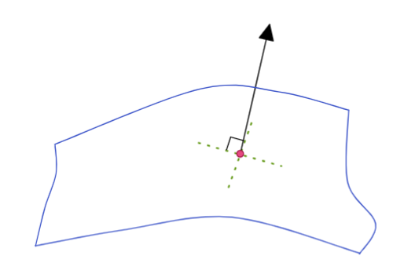

# 偏导数

[TOC]

## 回顾：差分与微分

$\Delta f \equiv f(x+\Delta x)-f(x)$

$d f \equiv f(x+dx)-f(x)$

$d f= f(x+dx)-f(x)=\frac{f(x+dx)-f(x)}{dx}dx \rightarrow df = \frac{df}{dx}dx $

如果因变量的差异出现了不同的两个因素 x y 那么整个微分式写为

$df \equiv f(x+dx,y+dy)-f(x,y)$

## 偏导

### 极限

此时将y因素固定

$\frac{\part F}{\part x} = \lim\limits_{\Delta x \rightarrow 0}\frac{f(x+\Delta x,y)-f(x,y)}{\Delta x}=\frac{f(x+dx,y)-f(x,y)}{dx}$

若将x固定 则有

$\frac{\part F}{\part y} = \lim\limits_{\Delta y \rightarrow 0}\frac{f(x,y+\Delta y)-f(x,y)}{\Delta y}=\frac{f(x,y+dy)-f(x,y)}{dy}$

### 二次偏导

$\frac{\part}{\part x}(\frac{\part F}{\part x})=\frac{\part^2f}{\part x^2}=f_{xx}$

$\frac{\part}{\part y}(\frac{\part F}{\part x})=\frac{\part^2f}{\part y\part x}=f_{yx}$

$\frac{\part}{\part x}(\frac{\part F}{\part y})=\frac{\part^2f}{\part x\part y}=f_{xy}$

$\frac{\part}{\part y}(\frac{\part F}{\part y})=\frac{\part^2f}{\part y^2}=f_{yy}$

对每个因子都微分 所得结果和微分顺序无关
$$
\frac{\part^2f}{\part y\part x} = \frac{\part^2f}{\part x\part y}
$$

### 例

$f(x,y)=\cos(xy)+y^2$

$\frac{\part^2f}{\part y\part x} = \frac{\part^2f}{\part x\part y}=-\sin(xy)-xy\cos(xy)$

### 分解

$df = f(x+dx,y+dy)-f(x,y) = [f(x+dx,y+dy)-f(x,y+dy)]+[f(x,y+dy)-f(x,y)]$

$df = \frac{f(x+dx,y+dy)-f(x,y+dy)}{dx}dx+\frac{f(x,y+dy)-f(x,y)}{dy}dy$
$$
df = \frac{\part f}{\part x}dx+ \frac{\part f}{\part y}dy
$$

### 逆向

具有dx 和 dy 组合的多项式 是否可以写为一个全微分式子

$A(x,y)dx+B(x,y)dy = df(x,y)$ 能否一直成立

由先前可见

$\frac{\part^2f}{\part y\part x} = \frac{\part^2f}{\part x\part y} \rightarrow \frac{\part}{\part y}(\frac{\part f}{\part x})= \frac{\part}{\part x}(\frac{\part f}{\part y})\rightarrow \frac{\part A}{\part y }=\frac{\part B}{\part x}$

那么$\frac{\part A}{\part y }=\frac{\part B}{\part x}$这个条件就是可将式子写为一个充要条件

### 例 古典场论

粒子在经过太阳受到的作用力的平面表现为，即外力做功

$F_x dx + F_ydy$

此时 得到一个向量场的描述，那么如果能够将这个式子写为一个式子的全微分来表达，就意味着可以将向量场的功使用一个纯量场的公式来表达;

即为

$F_x dx + F_ydy = \vec F \cdot d\vec r = -dU$

如果能够做到，那么这个力叫保守力；这直接和能量守恒有关；

### 例 空间曲面

$z=f(x,y)$

$x=x(y,z),dx=(\frac{\part x}{\part y })_zdy+(\frac{\part x}{\part z})_ydz$

$y=y(x,z),dy = (\frac{\part  y}{\part x})_zdx + (\frac{\part y}{\part z})_xdz$
$$
(\frac{\part x}{\part y })_z \cdot(\frac{\part y}{\part x })_z =1 \\
(\frac{\part y}{\part z })_x \cdot(\frac{\part z}{\part x })_y \cdot(\frac{\part x}{\part y })_z =-1
$$

## 多元泰勒展开

### 推断

可将多元函数写为

$f(x,y)a_0+[a_{1x}x+a_{1y}y]+[a_{xx}x^2+a_{yy}y^2+a_{xy}xy]+...$

此时对原点进行多阶微分计算

0阶：

$f(0,0)=a_0$

1阶：

$\frac{\part f}{\part x}(x,y)=a_{1x}+[2a_{xx}x+a_{xy}y]+...$

$\frac{\part f}{\part x}(0,0)=a_{1x}\\\frac{\part f}{\part y}(0,0)=a_{1y}  $

2阶：

$\frac{\part^2f}{\part x^2} = (2!)a_{xx}+0 \\ \frac{\part^2f}{\part y^2} = (2!)a_{yy}+0 \\ \frac{\part^2f}{\part x\part y}=a_{xy}+0$

### 多元麦克劳伦

$f(x,y) \\ = f(0,0)+[\frac{\part f}{\part x}x+\frac{\part f}{\part y}y]+\frac{1}{2!}[\frac{\part ^2f}{\part x^2}x^2+\frac{\part ^2f}{\part y^2}y^2+2\frac{\part^2 f}{\part x \part y}xy]+...\\ =f(0,0)+\sum\limits_i\frac{\part f}{\part x_i}x_i+\frac{1}{2!}\sum\limits_{ij}\frac{\part^2 f}{\part x_i\part x_j}x_i x_j+...$

 我们注意到 2阶项是一个特殊算子作用在函数f上：

$\frac{\part ^2f}{\part x^2}x^2+\frac{\part ^2f}{\part y^2}y^2+2\frac{\part^2 f}{\part x \part y}xy=(x\frac{\part}{\part x}+y\frac{\part}{\part y})^2f$

那么我们可以把泰勒级数改编为

$f(x,y)=\sum\limits^\infin_{n=0}\frac{1}{n!}(x\frac{\part}{\part x}+y\frac{\part}{\part y})^n f|_{0,0}$

那么对于任意一点展开 则得到通用公式
$$
f(x,y)=\sum\limits^\infin_{n=0}\frac{1}{n!}(\Delta x\frac{\part}{\part x}+\Delta y\frac{\part}{\part y})^n f|_{x_0,y_0} \\ \Delta x= x-x_0 \\ \Delta y = y-y_0
$$

## 驻点 Stationary Point

驻点(Stationary Point)又称为平稳点、稳定点或临界点

$df =0$

$\frac{df}{dx}dx=0 \rightarrow \frac{df}{dx} =0$

我们使用泰勒展开式

$f(x)=f(x_0)+f'(x_0)\Delta x + \frac{1}{2!}f''(x_0)\Delta x ^2 + ... ,\Delta x<<1$

由于 差分很小 , 那么我们可以忽略高阶项，且一阶导为0，则

$\Delta f=f(x)-f(x_0)=\frac{1}{2!}f''(x_0)\Delta x ^2 $

所以函数的变化在驻点附近基本都像是抛物线

那么在该点的二阶导数的正负决定了驻点是最大还是最小

$f''(x_0) > 0 , min \\ f''(x_0) < 0 ,max$

## 多元函数驻点

有xy多元函数图像如下：

S点为鞍点 Saddle， P点为峰点Peak，B点为洼点Basin，三者都是驻点

那么我们如何考察驻点？同样是将函数微分；

$df=0 \rightarrow \frac{\part f}{\part x}dx +\frac{\part f}{\part y}dy=0 \rightarrow \frac{\part f}{\part x}=0,  \frac{\part f}{\part y} =0$

我们定义梯度 Gradient算符

$\vec\nabla f \equiv (\frac{\part f}{\part x},\frac{\part f}{\part y} ) \rightarrow df = \vec\nabla f\cdot d \vec r,d \vec r = (dx,dy) $

其中 $\vec r $  是一个任意向量，当我们要求  $df =10$  时，必定推得 $\vec\nabla f =0$ 即梯度为0 ，即为驻点 ；

为何如此呢？从泰勒展开即可看出来

$\Delta f=f(x,y) - f(x_0,y_0)=\sum\limits_i\frac{\part f}{\part x_i}\Delta x_i+\frac{1}{2!}\sum\limits_{ij}\frac{\part^2 f}{\part x_i\part x_j}\Delta x_i\Delta x_j+...$

一阶导依旧是0  同样由于 dx dy 很小 可以忽略高阶项

$\Delta f= \frac{1}{2!}\sum\limits_{ij}\frac{\part^2 f}{\part x_i\part x_j}\Delta x_i\Delta x_j $

我们将二阶内得微分定义为矩阵

$M_{ij}=\frac{\part^2 F}{\part x_i\part x_j}\rightarrow M = \left ( \begin{matrix}
f_{xx} & f_{xy}   \\
f_{yx} & f_{yy}   \\ 
\end{matrix} \right ) $

则可以将二阶项写为矩阵形式 
$$
\Delta f =\frac{1}{2}\Delta x^\top M \Delta x= \frac{1}{2}\left ( \begin{matrix}\Delta  x & \Delta  y  \\ \end{matrix} \right )\left ( \begin{matrix}f_{xx} & f_{xy}   \\f_{yx} & f_{yy}   \\ \end{matrix} \right )\left ( \begin{matrix}\Delta  x  \\\Delta  y  \\ \end{matrix} \right )
$$

>  对于方阵特性
>
> Trace：
>
> $trM = \sum\limits_iM_{ii} = M_{11}+M_{22}$
>
> Determinant
>
> $detM = \left | \begin{matrix}
> M_{11} & M_{12}  \\
> M_{21} & M_{22}  \\ 
> \end{matrix} \right | = M_{11}M_{22}-M_{12}M_{21}$

 

回到最初图片

$Basin：  	detM >  0 , trM > 0  $

$Peak ：  	detM >  0 , trM < 0  $

$Saddle：  	detM <  0   $

  

## 多元函数带约束驻点

当我们需要最优化一个多元函数的时候(这个动作通常是求极值)，需要使用拉格朗日乘子使得问题变得简单

### 拉格朗日乘子法 lagrange multiplier

我们对多元函数引入一个新量   $\lambda$   构造一个新函数

$f^*(x,y,\lambda) = f(x,y)+\lambda g(x,y)$

那么我们直接对新的函数求极值

$df^*=0 \rightarrow \frac{\part f^*}{\part x}dx+\frac{\part f^*}{\part y}dy+\frac{\part f^*}{\part \lambda}d\lambda=0$

由于每个微分都是任意小的数量 那么其因子必须为0才能让等式成立

$\frac{\part f^*}{\part x} =0 \rightarrow \frac{\part f}{\part x}+\lambda \frac{\part g}{\part x}=0$

$\frac{\part f^*}{\part y} =0 \rightarrow \frac{\part f}{\part y}+\lambda \frac{\part g}{\part y}=0$

$\frac{\part f^*}{\part \lambda} =0 \rightarrow g=0$

由于我们得到引入的g函数的在极值的时候为0，那么表明 原函数 和 新函数在极值时的结果是相等的 ；

### 例

求一个椭圆  $\frac{x^2}{a^2}+\frac{y^2}{b^2}=1$  的内接矩形面积最大情况 ；

#### 解1

我们写出内接矩形的面积计算公式   $A = 4xy$

并且构造一个新函数  $A^* = A +\lambda \Phi ，where\ \Phi=0$ 且取极值时引入函数为 0 保证新旧函数在极值处相等；

在所有内接矩形的情况下 椭圆方程的方程式不变的 那么我们设约束

 $\Phi = \frac{x^2}{a^2}+\frac{y^2}{b^2} - 1 \equiv 0$ 

那么我们对新函数微分

$\frac{\part A^*}{\part \lambda} =0 \rightarrow \Phi=\frac{x^2}{a^2}+\frac{y^2}{b^2} - 1 =0$

$\frac{\part A^*}{\part x} = 0 \rightarrow 4y+\frac{2\lambda}{a^2}x=0$

$\frac{\part A^*}{\part y} = 0 \rightarrow 4x+\frac{2\lambda}{b^2}y=0$

解方程

$8xy + 2\lambda(\frac{x^2}{a^2}+\frac{y^2}{b^2}) =8xy + 2\lambda=0  \rightarrow \lambda =-4xy$

带入微分式得到

$x=\frac{a}{\sqrt{2}} ,y=\frac{b}{\sqrt{2}} $

那么可见，内接面积最大的时候 长宽比就是椭圆的长短轴比；

$A_{max} = 2ab$

#### 解2

直接取出椭圆的三角函数参数表达

$x =a\cos\theta, y = b \sin\theta$

$A = 4xy = 4ab\cos\theta\sin\theta = 2ab \sin(2\theta),\theta\in[0,\frac{\pi}{2}]$

直接得出极值 

### 拉格朗日乘子在几何中的意义

在3D空间内有

$df=\frac{\part f}{\part x}dx+\frac{\part f}{\part y}dy+\frac{\part f}{\part z}dz=\vec\nabla f \cdot d\vec r$

如果我们的梯度不为0，那么结果一定会随着因子   $\vec r$  的任意微小变化而变化，那么这个极小区域本就不是平坦的，即不是驻点；

但如果梯度为0 可判断驻点，但如果要判断是否为极值依旧要进入高阶项观察其他变化；

但是如果因子$\vec r$ 并非任意微小的变化，我们将因子$\vec r$ 限制在一个曲面上面，则得到如下情况：

我们在3D空间有一个曲面  $\Phi(x,y,z)=0$，因子$\vec r$ 只能在这个曲面上运动；

由于点在整个曲面上运动的时候， $\Phi(x,y,z)=0$始终成立，那么意味着 

 $d\Phi=0 = \vec\nabla\Phi\cdot d\vec r$

由于因子$\vec r$ 在曲面上是任意的向量，那么与该向量点乘永远为零的向量一定为曲面的法向量，由此我们可以得到$ \vec\nabla\Phi$ 就是曲面的法向量；

此时空间中驻点的条件变成了

$\vec\nabla f \cdot d\vec r = 0+\vec\nabla \Phi \cdot d\vec r =0$

此时因子$\vec r$ 在平面上，那么$\vec\nabla f$  只需要满足  $\vec\nabla f \mathop{//} \vec\nabla \Phi$ 即可

进一步就得到

$\vec\nabla f +\lambda \vec\nabla \Phi =0$

这就是拉格朗日算子法的来历；

我们在寻找驻点的时候只要能够对函数微分即可；

$df =0 $

如果没有任何constraint约束条件（边界条件）就可以如下梯度方式表达

$df = \vec\nabla f\cdot d\vec r, d\vec r 任意微向量 \rightarrow \vec\nabla f = 0 $

如果带有边界条件的时候  如 $\Phi(x_i)=0$  该约束可扩展到多维空间，特殊情况三维空间为 $\Phi(x,y)=0$ 是曲面；

如果我们对约束条件两边微分得到 $d\Phi=\vec\nabla\Phi\cdot d\vec r =0,d\vec r必须在曲面内$ ，那么由此关系得到$d\vec r$必然垂直于$\vec\nabla\Phi$

那么微分向量受到约束，回到函数$df$ ，就可以得到

 $df = \vec\nabla f\cdot d\vec r, d\vec r \in \Phi , d\vec r \bot \vec\nabla\Phi \rightarrow \vec\nabla f + \lambda\vec\nabla\Phi= 0 $

即  原函数和约束条件函数的梯度平行 

## 物理应用

--------------------------------------------

### 香农熵 信息熵   Shannon entropy

对信息的量化方法

从古典概率开始,抛硬币记录概率

| 硬币 | 符号 | 几率      |
| ---- | ---- | --------- |
| 正   | X=1  | $P_1=P$   |
| 反   | X=0  | $P_0=1-P$ |

$P_1+P_0 =1$

如果要看一个事件发生的不确定性如何香农提出了如下公式，对几率倒数的对数取期望值

$\sigma = <\ln\frac{1}{P}> = \sum\limits_\alpha P_\alpha\ln\frac{1}{P_\alpha}=- \sum\limits_\alpha P_\alpha\ln P_\alpha$

也常常写为
$$
H(x)\equiv-\sum\limits_x P(x)\ln[P(x)]
$$

该公式常用于近代热统计物理以及计算机基础原理；

> 这里我们需要详细解释一下
>
> 信息熵往往是为了表达一个系统不确定性，系统的不确定性越大，熵也就越大，把它搞清楚所需要的信息量也就越大;
>
> 古典概率中一个情况（变量）的概率值表达为一个确定性（不确定性），只要得到概率值那么改变量在系统中的**确定性**和**不确定性**同时被决定，所以可以说此时**确定性**和**不确定性**在系统中同一，如果一个系统只有两个变量，那么其不确定性（确定性）就是两个变量不确定性（确定性）的和，如果需要使用**确定性**几率来表达这个**不确定性**的和的关系，那么就采用一个倒数形式先做出**不确定性**和**确定性**的反比关系，然后取得对数来对反比关系添加可加性，那么有了$f(P)=\log\frac{1}{P} = -\log P$ ，$f(P)$ 就是某个变量的不确定性，如果是两个变量，则有 $f(P_1)+f(P_0)=-\log P_1-\log P_0=-\log(P1P0)=\log\frac{1}{P_1P_0}=f(P_1P_0)$
>
> 可见该结果符合以往两个情况同时出现需要将概率相乘的常识认知，对两个情况同时出现的状况取不确定性=两个情况的不确定性之和 ，可见该公式符合上述对于确定性和不确定性的要求；
>
> 如果我们有多个变量，要计算其不确定性，那么只需将每个变量的不确定性和其出现概率都计算，然后统计平均，即取期望值即可；所以有了上述香农熵公式；
>
> 注：对数的底数一般为2 10 或 e ，现代计算机的二进制导致其基本的计算底数取得2，不过可以根据后续图像直观推测e的效率最高，越2.7，更加接近3，所以理论上三进制计算机处理信息更加高效；

### 热平衡熵

熵在热力系统中总会达到最高点

我们看一个例子

#### 例1 孤立热力系统

在一个孤立系统中，系统有共N个等概率状态，如果其最后达到热平衡，计算其香农熵；

根据上述说法，首先拿出香农熵公式   $\sigma=- \sum\limits^N_{\alpha=1} P_\alpha\ln P_\alpha$

同时添加约束条件，即整个系统为孤立，那么所有状态概率和为1，那么 $ \sum\limits^N_{\alpha=1} P_\alpha = 1$

既然有了约束条件，并要求我们求系统熵达到最高的极值，此时我们使用拉格朗日乘子法：

$\sigma^*=\sigma+\lambda(\sum\limits^N_{\alpha=1} P_\alpha -1)$

$\frac{\part \sigma^*}{\part P_i}=0 \rightarrow -\ln P_i-P_i\frac{1}{P_i}+\lambda=0 \rightarrow -\ln P_i-1+\lambda=0$

$P_i = e^{\lambda-1}=const$

由于 总概率为1 ，则$ \sum\limits^N_{\alpha=1} P_\alpha = P_i\cdot N = 1 $

所以$P_i = \frac{1}{N}$

孤立系统在达到最后平衡时，每个状态出现的几率应该相同；

所以 $\sigma=- \sum\limits^N_{\alpha=1} P_\alpha\ln P_\alpha=-\frac{1}{N}\ln\frac{1}{N}\times N = \ln\frac{1}{N}=\ln N$

在热统计物理中，玻尔兹曼熵 = 玻尔兹曼常数 * 最大香农熵  

$S = k\cdot \sigma_\max ，k=1.380649×10^{-23}J/K$

香农熵和玻尔兹曼熵是等价的，所以两者的物理状态理论同构；

于是人们分别从物理现象和数学概率中发现了相同的理论结构；

#### 例2 可换热系统

系统总体的具有一个内能U，且上下可交换热量，求该最大信息熵；

总状态和为1 则 $ \sum\limits^N_{\alpha=1} P_\alpha = 1$

总内能为U，则  $ \sum\limits^N_\alpha P_\alpha E_\alpha=U$

得到两个边界条件

此时我们需要利用拉格朗日乘子法

$\sigma^* = \sigma +\lambda_1(\sum\limits^N_{\alpha=1} P_\alpha - 1)+\lambda_2(\sum\limits^N_\alpha P_\alpha E_\alpha-U) $

$\frac{\part \sigma^*}{\part P_i}=0 \rightarrow -\ln P_i - P_i\frac{1}{P_i}+\lambda_1+\lambda_2E_i=0 \rightarrow P_i=e^{\lambda_1-1}e^{\lambda_2E_i}$

代回边界条件 $ \sum\limits^N_{\alpha=1} P_\alpha = 1$

$\sum\limits_\alpha P_\alpha=e^{\lambda_1-1}(\sum\limits_\alpha e^{\lambda_2E_\alpha })=1\rightarrow P_i=\frac{ e^{\lambda_2E_i}}{\sum\limits_\alpha e^{\lambda_2E_\alpha }}$

热力学内发现  $\lambda_2=-\frac{1}{kT}$ 

则导致上述公式成为 $P_i=\frac{ e^{\lambda_2E_i}}{\sum\limits_\alpha e^{\lambda_2E_\alpha }} = \frac{1}{Z}e^{-\frac{E_i}{kT}} \rightarrow Z = \sum\limits_\alpha e^{-\frac{E_\alpha}{kT}}$

然后我们得到了波兹曼分布
$$
Z = \sum\limits_\alpha e^{-\frac{E_\alpha}{kT}} \\P(E_i)= \frac{1}{Z} e^{-\frac{E_\alpha}{kT}}
$$
其解释了高能量状态非常罕见；

得到了在不同宏观能级情况下的研究可忽略微观干扰的数学依据；因为微观干扰宏观的高能级状态在概率上不为0但是小到几乎不可能发生；

### 包络线问题

一个受到参数变化的函数集合所构成的包络线；

我们见到整个包络线的非常相近的两点，也在非常相似的两个函数的图像上，那么得到关系：

$f(x,y;\alpha) =0,f(x,y;\alpha+d\alpha) =0$

写出展开式：

$f(x,y;\alpha+d\alpha) = f(x,y;\alpha)+\frac{\part f}{\part\alpha}d\alpha,f(x,y;\alpha)=0 \rightarrow \frac{\part f}{\part\alpha}=0$

于是得到方程组
$$
f(x,y;\alpha) = 0,\frac{\part f}{\part\alpha}(x,y;\alpha)=0
$$
那么只需要解方程消去变化参数，即可得到由原函数变化形成的包络线

#### 例1 运动波

我们由一系列的圆 符合方程 $(x-\alpha)^2+y^2=\epsilon^2$

我们得到原函数以及其微分

$f(x,y;\alpha)=(x-\alpha)^2+y^2-\epsilon^2=0$

$\frac{\part f}{\part\alpha} = 0 \rightarrow -2(x-\alpha)=0$

那么将 $x=\alpha$代入上述原函数以及其微分式既可以消去 $\alpha$ 

$y=\pm \epsilon$

可见和图中得到的结果符合；

#### 例2 滑梯

根据模型我们得到方程集合 $\frac{x}{a}+\frac{y}{b}=1$

约束条件为 $a^2+b^2=L^2$

我们为了将两个参量a b 化为一个参量 采用三角函数参数化表达

$a=L\cos\theta,b=L\sin\theta \rightarrow \frac{x}{L\cos\theta}+\frac{y}{L\sin\theta}=1$

$f(x,y;\theta)=\frac{x}{L\cos\theta}+\frac{y}{L\sin\theta}-1=0$

$\part f_\theta=\frac{x\sin\theta}{L\cos^2\theta}+\frac{y\cos\theta}{L\sin^2\theta} =0 \rightarrow  \frac{x}{y}=\frac{\cos^3\theta}{\sin^3\theta}$

所以解得 $x=C\cdot\cos^3\theta,y=C\cdot\sin^3\theta$

代回$\frac{x}{L\cos\theta}+\frac{y}{L\sin\theta}=1$ 得到 $C=L$ 得到

$x=L\cdot\cos^3\theta,y=L\cdot\sin^3\theta \rightarrow (\frac{x}{L})^\frac{1}{3}=\cos\theta,(\frac{y}{L})^\frac{1}{3}=\sin\theta$

代回$\frac{x}{L\cos\theta}+\frac{y}{L\sin\theta}=1$ 得到结果

$(\frac{x}{L})^\frac{2}{3}+(\frac{y}{L})^\frac{2}{3}=1$

实际包络线如上，其实延拓到其他象限就是著名得Asteroid星型线；

###  理想气体

这里有个理想气体受热并做功，吸热-做功=当前内能

$dU = TdS -PdV$ 也就是说得到一个函数 $U=U(S,V)$

我们对函数$U=U(S,V)$进行微分

$dU=(\frac{U}{S})_VdS+(\frac{U}{V})_SdV$

我们经过比对 $dU = TdS -PdV$ 和 $dU=(\frac{\part U}{\part S})_VdS+(\frac{\part U}{\part V})_SdV$   得到了 

$ T=(\frac{\part U}{\part S})_V ,P=-(\frac{\part U}{\part V})_S$

由于二次偏导性质 $\frac{\part^2U}{\part V\part S} = \frac{\part^2U}{\part S\part V} \rightarrow \frac{\part }{\part V}(\frac{\part U}{\part S})=\frac{\part }{\part S}(\frac{\part U}{\part V})$
$$
-(\frac{\part P}{\part S})_V=(\frac{\part T}{\part V})_S
$$

