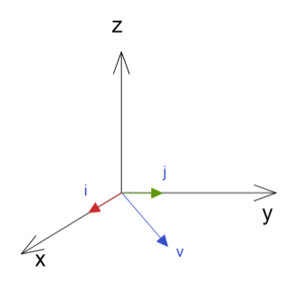
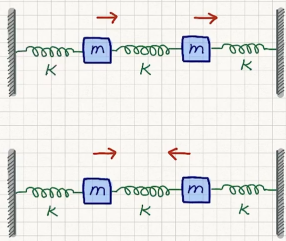

# 线性代数   Linear Algebra

[toc]

**Αα、Ββ、Γγ、Δδ、Εε、Ϝϝ、Ζζ、Ηη、Θθ、Ιι、Κκ、Λλ、Μμ、Νν、Ξξ、Οο、Ππ、Ρρ、Σσ、Ττ、Υυ、Φφ、Χχ、Ψψ、Ωω**

$R = 
\left ( 
\begin{matrix}
a & b   \\
c & d   \\ 
\end  {matrix} 
\right ) $

$$
\left (\begin{matrix}V'_x   \\V'_y   \\ \end {matrix}\right ) =\left (\begin{matrix}0 & -1   \\1 & 0   \\ \end {matrix}\right ) \left (\begin{matrix}V_x   \\V_y   \\ \end {matrix}\right )
$$

$$
R = 
\left ( 
\begin{matrix}
a & b   \\
c & d   \\ 
\end  {matrix} 
\right )

R = 
\left (\begin{matrix}
a & b   \\
c & d   \\ 
\end {matrix}\right )
$$

向量和线性代数时理论分析的常用工具，大多时候线性操作一般表现为矩阵；

## 引

### 例1 二维旋转 2D rotation

一个XY坐标系中的向量$V$，被旋转操作转到  $V'$  处,旋转角度为 $\theta$ ，那么就得到关系式：

$\vec V'=R(\theta)\vec V$

其实这里的操作可以使用各一个矩阵来表达

$R (\theta) =
\left ( 
\begin{matrix}
\cos\theta & -\sin\theta   \\
\sin\theta &  \cos\theta   \\ 
\end  {matrix} 
\right )$

其实这个矩阵叫做othogonal matrix  正交矩阵

我们设 $\theta = \pi/2$  得到矩阵 

$R (\frac{\pi}{2})= 
\left ( 
\begin{matrix}
0 & -1   \\
1 & 0   \\ 
\end  {matrix} 
\right )$

于是根据矩阵乘法就能得到如下结果

$\left (\begin{matrix}
V'_x   \\
V'_y   \\ 
\end {matrix}\right ) 
=
\left (\begin{matrix}
0 & -1   \\
1 & 0   \\ 
\end {matrix}\right ) 
\left (\begin{matrix}
V_x   \\
V_y   \\ 
\end {matrix}\right )$

$V'_x=-V_y ,V'_y=V_x   $

那么如果我们对一个向量进行多次这样的旋转操作，结果是否能够符合某种加法或乘法运算（即在一个群中）？

那么我们就进行两次旋转 ，旋转角度为 $\theta_1,\theta_2$ 

$R(\theta_1)R(\theta_2) \\
= 
\left (\begin{matrix}
\cos\theta_1 & -\sin\theta_1   \\
\sin\theta_1 &  \cos\theta_1   \\ 
\end {matrix}\right )
\left (\begin{matrix}
\cos\theta_2 & -\sin\theta_2   \\
\sin\theta_2 &  \cos\theta_2   \\ 
\end {matrix}\right ) \\
=
\left (\begin{matrix}
\cos\theta_1\cos\theta_2- \sin\theta_1\sin\theta_2 & 
-\cos\theta_1\sin\theta_2-\sin\theta_1\cos\theta_2 \\
\cos\theta_1\sin\theta_2+ \sin\theta_1\cos\theta_2  &
\cos\theta_1\cos\theta_2- \sin\theta_1\sin\theta_2 \\ 
\end {matrix}\right ) \\
=
\left (\begin{matrix}
\cos(\theta_1+\theta_2) & -\sin(\theta_1+\theta_2)   \\
\sin(\theta_1+\theta_2) &  \cos(\theta_1+\theta_2)   \\ 
\end {matrix}\right )\\
=R(\theta_1+\theta_2)$

可见两次旋转操作即将角度相加然后一起旋转操作

### 例2 耦合振子 coupled oscillators

我们写出该模型的运动方程Equations Of Motion EOM；

$m\frac{d^2x_1}{dt^2}=-k_1x_1+k_{12}(x_2-x_1) \\ m\frac{d^2x_2}{dt^2}=-k_2x_2-k_{12}(x_2-x_1)$

将该式展开 可以拟出一个矩阵

$m \left (\begin{matrix}
\ddot x_1   \\
\ddot x_2   \\ 
\end {matrix}\right ) 
=
-\left (\begin{matrix}
k_1+k_{12} & -k_{12}   \\
-k_{12} & k_2+k_{12}    \\ 
\end {matrix}\right ) 
\left (\begin{matrix}
x_1   \\
x_2   \\ 
\end {matrix}\right )$

我们得到了一个对称的实数矩阵，那么如果此处的$k_{12}=0$ 那么两个物体的运动则充分解耦，其实也就是说中间弹簧不参与力的运算，即处于自然状态，那么其实就是两个物体运动方式一样；

### 例3 生命起源  核酸链的变异问题

我们知道遗传因子的含氮碱基有 A（腺嘌呤）   G（鸟嘌呤）  C（胞嘧啶）  T（胸腺嘌呤）U（尿嘧啶）

一般RNA单链的核糖核苷酸的含氮碱基为  		A G C U 

一般DNA双链的脱氧核糖核苷酸的含氮碱基为  A G C T 

这里我们以RNA为例  ，为了简化分析   我们将 嘌呤 和 嘧啶 分开  ，嘌呤purines为R  嘧啶pyrimidine为Y

我们在一个链上把R 和 Y 排列上去 ，就能得到一个带有遗传信息的RNA ，如图；

那么我们就是得到了长度L的基因长度，那么这个长度的片段具有的序列状态形式就有 $2^L$种；

那么我们假定那么多序列状态中有些特定序列会在环境中较好的存活下来，成为总体片段状态的大多数，此时自然已经开始选择最符合环境的“生物”了；

那么每种状态都有自己的适应力，对于某个序列 $i$，种群环境适应力设为 $f_i - fitness$ ，当前种群数量设为 $N_i$ ，于是我们得到

$\frac{dN_i}{dt}=f_i N_i \rightarrow N_i(t)=N_i(0)e^{f_i t}$

即为种群数量随着时间而改变的程度由【当前种群数】和【种群环境适应力】两个因子决定；

其实这样的微分式子就是自然指数增长函数的微分形式，于是得到右式；

看右式可推测适应力决定了长期的种群数量，是慢慢消亡还是指数增长；

我们设定一个当前序列 $i$ 的种群数量$N_i(t)$在所有片段组成的总数量$N(t)$中的比例 $x_i(t)$

$x_i(t)=\frac{N_i(t)}{N(t)},N(t)=\sum\limits_i N_i(t)$

如果我们找到所有适应力最强为 $f_\max=\max \{f_i\}$  ,那么最终总数量所有状态都会成为该序列的模样；

$x_\max(t\rightarrow \infin)=1,x_i(t\rightarrow \infin)=0$

**但事实并非那么简单，如果按上述发展最终世界就只存在一种永恒的物种，永恒是显然违反逻辑的**

上述内容都是没有考虑到基因片段在复制的时候发生突变的情况，即为序列上的某些碱基变化导致其突变后成为不同的序列状态；

我们假设有个突变情况

一个序列复制的时候出现了两个碱基的变化，假设每个碱基的突变可能性为等可能，并设为 $u,u\in[0,1]$

那么整个序列的突变可能性就是 $u^2(1-u)^{L-2}$

既然序列可以变化，那么我们可以将序列之间定义一个距离，以表达两个序列状态的区别程度，将两个序列互相变化所需的碱基变化个数做了定量，这个概念就相当于物种基因相似性，相似性越高距离越小；

那么就设定序列状态的突变距离为 $d_{ij}=d_{ji}$

那么更具上述突变可能性的式子就可以写为突变可能性的矩阵：

$m_{ij}=u^{d_{ij}}(1-u)^{L-d_{ij}}$

最简单的序列突变举证展开如下

我们将所有 【序列$i$】自身的延续 以及 从【序列$j$】突变到 【序列$i$】 的 所有突变可能性相加，就是把矩阵某一行值全部相加；

$\sum\limits_i m_{ij}=\sum\limits_i u^{d_{ij}}(1-u)^{L-d_{ij}}=[u+(1-u)]^L=1$

即将所有序列 突变到某固定序列的几率 全部相加就为1，符合常识；

接下来我们对所有序列进行突变操作，并计算适应力，于是需要修正上述没有突变时的适应力公式$\frac{dN_i}{dt}=f_i N_i$

$\frac{dN_i}{dt}=\sum\limits_{j}m_{ij}f_j N_j=\sum\limits_{j}F_{ij} N_j$

这里我们首先按照无突变形式计算其序列的增长能力，然后将其完整增长后的序列数量做突变操作，计算得到【非序列$i$】突变为【序列$i$】而对于【序列$i$】数量的增长贡献，同时计算得到【序列$i$】突变为【非序列$i$】而对于【序列$i$】数量的削减贡献；

所以此时$F_{ij}$就成为了适应力矩阵，其将突变的可能性囊括进来了；
$$
\frac{dN_i}{dt}=\sum\limits_{j}F_{ij} N_j
$$
所以我们得到了这样的修正后的公式，其计算结果的情况如下

当在海洋的原汤中，不同的碱基形成不同序列

在总体突变可能性极大的时候（辐射等其他恶劣环境导致），某一获得高适应性的序列无法保持自己的基因稳定，就快速突变为其他低适应性序列，没有机会扩展自己的种类数量，有特定序列的生命此时难以产生；

在总体突变可能性较低的时候（环境冷却或稳定下来后），某一获得高适应性的序列可以保持自己基因稳定，就可以不断增加其在总数中的比例，这个过程不断进行，序列不断有序化，并有较稳定的传承，生命由此而产生；

那么这样的突变值在分子生物学对地球上的多数物种进行测定的时候验证了这一猜想：多数稳定发展的物种基因突变几率较低；

我们在高突变情况下模拟如下：

就算有高适应的种类也无法保持其种类的数量；

低突变情况下的模拟如下：

出现了某高适应种群数量占据大部分的情况；其突变情况越小peak越是高且细；

但是这里我们发现第二个图中有一个适应力的高原，我们观察在特定变异可能性情况下不同种群数量的变化：出现了单独超高适应暂时胜出peak，但最后让位于另一丰富多样的高适应种群组mesa；

其种群数量变化如下

长期来看，超高适应性的种群对于突变的忍受能力较差，而一般适应性但是种群内多样性丰富的种群反而可以在长期竞争中胜出；

可见对于人类来说，就是那个peak，单一超高适应种群，对于突变非常敏感；而mesa就相当于具有多重变异个体的RNA种群（主要是病毒），可以在长期获胜；

## 线性空间

### 空间向量

有个线性空间的线性向量，表达为

$\vec v = v_x\hat i+v_y\hat j+v_z\hat k $

什么是线性向量？

有向量 $\vec a, \vec b, \vec c $ 在向量空间内应该满足：
$\vec a + \vec b = \vec b + \vec a$

$(\vec a + \vec b)+ \vec c =  \vec a+(\vec b+ \vec c)  $

$\lambda (\vec a + \vec b)=\lambda\vec a + \lambda\vec b  $

$(\lambda+\mu)\vec a = \lambda\vec a + \mu\vec a$

$\lambda(\mu\vec a)=(\lambda\mu )\vec a$

存在零向量

$\vec a +\vec 0=\vec a$

存在单位向量

$1\times \vec a = \vec a$

有负向量

$\vec a +(-\vec a)=0$

### 线性独立性

我们有个N 个非零向量 $ \vec v_1,\vec v_2,\vec v_3,...,\vec v_N  $  可以组成

$ c_1\vec v_1+c_2\vec v_2+c_3\vec v_3+...+c_N\vec v_N=\vec 0$

那么显然系数都为0的时候才才会出现上述式子，那么我们可以说 这N 个向量具有线性独立性

那么我们如何严格证明各个非零向量线性独立呢？、

$\vec v = v_x \hat i + v_y \hat j \rightarrow v_x \hat i + v_y \hat j -\vec v = 0$

有上述可见两个解， $0,0,0 \ \ and \ \ v_x,v_y,-1$

那么可见没有三者出现线性独立，第二个解表达了v的线性相依；

如果这里的$v_z$ 不为 0 ，那么就有

$  \vec v = v_x \hat i + v_y \hat j + v_z \hat k  $

我们为了证明 $\hat i,\hat j, \vec v $ 之间线性独立，则构建

$c_1 \hat i + c_2\hat j +c_3\vec v = 0 \rightarrow c_1 \hat i \cdot \hat k + c_2\hat j\cdot \hat k +c_3\vec v\cdot \hat k = 0 \rightarrow  0+0+c_3 v_z =0$

由于 $v_z\neq 0 $  ，那么 $ c_3=0$ , 则

$c_1 \hat i + c_2\hat j = 0 \rightarrow c_1 \hat i\cdot \hat i + c_2\hat j \cdot \hat i = 0 \rightarrow c_1 \hat i\cdot \hat i + 0 = 0 \rightarrow c_1=0$

$c_1 \hat i + c_2\hat j = 0 \rightarrow c_1 \hat i\cdot \hat j + c_2\hat j \cdot \hat j = 0 \rightarrow 0 + c_2\hat j \cdot \hat j = 0  \rightarrow c_2=0$

所以 我们证明 $\hat i,\hat j, \vec v $ 之间线性独立；

可见线性独立 的向量 不一定互相垂直 ， 但是如果互相垂直 ，就一定线性独立；

如果我们能够在一个空间最多找到 N 个线性独立的向量 ，那么个 N  就是该空间的 dimension  维度/秩 ；

### 内积 / 狄拉克符号

这里引入狄拉克符号，通常用于量子力学的推导，这里先介绍了

我们可以简单定义符号 

$\langle a | =  
\left (\begin{matrix}
a_1 & a_2 & a_3  
\end {matrix}\right )$ 

$ | b \rangle=  
\left (\begin{matrix}
b_1 \\ b_2 \\ b_3  
\end {matrix}\right )$

$\langle a| b\rangle=\langle b | a\rangle^*$

$\langle a| \lambda b +\mu c \rangle = \lambda \langle a| b\rangle+\mu \langle a| c\rangle $

这边 的 * 为共轭  用在 带有复数的向量的内积必须进行的共轭处理（证明略）；

我们在 N 维的向量空间取处 所有互相垂直的 单位向量 ，两两内积，就能够得到很多正交矩阵

$\langle \hat e_i | \hat e_j \rangle = \delta_{ij} \ \ ;\ \ i,j = 1,2,3,...,N$

这里的 $\delta_{ij}$ 为克罗内克尔delta符号 （Kronecker delta symbol） 其具有性质

$\delta _{ij} = \left\{
\begin{aligned}
1 &, &i=j \\
0 &, &i\neq j
\end{aligned}
\right. $

可见其就是一个N维的对角的单位矩阵，如果这里的基向量不是垂直的，那么就会出现一个特殊的矩阵；

那么我们可以得到 向量必然可用的展开方式：
$$
|a\rangle = \sum\limits_{i=1}^{N}a_i  | \hat e_i \rangle
$$
其实就相当于在N维空间的向量$\vec a = a_1\hat e_1 +a_2\hat e_2  +...+a_N\hat e_N , \ e_1,e_2,...,e_N 都为单位基向量$

若想要得到向量在空间的某个基方向上的分量，就可以如下操作

$\langle\hat e_j| a\rangle = \sum\limits_{i=1}^{N}a_i\langle\hat e_j|\hat e_i\rangle = \sum\limits_{i=1}^{N}a_i\delta_{ij} = a_j$

那么根据上面们得到了内积的来源 

$|a\rangle = \sum\limits_{i=1}^{N}a_i  | \hat e_i \rangle \rightarrow \langle a| = \sum\limits_{i=1}^{N}a_i^*  \langle\hat e_i |  $

$|b\rangle = \sum\limits_{i=1}^{N}b_j | \hat e_j \rangle$

上述两式做内积

$\langle a| b\rangle  =\sum\limits_i\sum\limits_j a^*_i b_j\langle \hat e_i| \hat e_j\rangle  =\sum\limits_i\sum\limits_j a^*_i b_j \delta_{ij}  =\sum\limits_i a^*_i b_i$

### 线性操作

将 一个 向量 进行线性操作 把一个向量 变换为另一个向量 该操作的表达方式就是矩阵

我们可以使用狄拉克符号表达出来

$|y\rangle = M | x \rangle $

由于其在线性空间，那么可以得到

$M(\lambda|a\rangle + \mu | b\rangle) = \lambda M | a\rangle + \mu M| b\rangle$

我们把向量展开

$|y\rangle = A | x \rangle $

$ x \rangle = \sum\limits_i x_j| \hat e_j \rangle$

$ y \rangle = \sum\limits_j y_j| \hat e_j \rangle$

$A|x\rangle= \sum\limits_j x_j A|\hat e_j\rangle  = \sum\limits_j  y_j|\hat e_j\rangle \rightarrow  \langle \hat e_i \sum\limits_j x_j A|\hat e_j\rangle  =\langle \hat e_i \sum\limits_j  y_j|\hat e_j\rangle \rightarrow \sum\limits_j x_j\langle\hat e_i|A|\hat e_j\rangle = \sum\limits_j y_j \langle\hat e_i|\hat e_j\rangle$

 所以我们得到 $A_{ij}=\langle\hat e_i|A|\hat e_j\rangle $
$$
y_i = \sum\limits_j A_{ij}x_j
$$
其实这个表达式就是矩阵计算的规则来源 按行展开 

### 洛伦兹转换  粗略推导

将时间引入三维空间，得到四维线性空间；
$$
\left (\begin{matrix}ct' \\ x' \\ y' \\ z'  \end {matrix}\right )=  \left (\begin{matrix}\gamma & -\gamma\frac{u}{c} & 0 & 0  \\-\gamma\frac{u}{c}& \gamma  & 0 & 0  \\0 & 0 & 1 & 0  		\\0 & 0 & 0 & 1  		\\\end {matrix}\right )\left (\begin{matrix}ct  \\ x  \\ y  \\ z   \end {matrix}\right )\\\gamma = \frac{1}{\sqrt{1-(u/c)^2}}
$$
我们进行简化 去掉两个不影响的轴

洛伦兹转换 的向量空间 叫做 闵可夫斯基空间 ，这会导致可以使用三角表达矩阵中元素；

$\cosh \alpha=\gamma=\frac{1}{\sqrt{1-(u/c)^2}} $

$\sinh\alpha=\frac{\gamma u}{c}=\frac{u/c}{\sqrt{1-(u/c)^2}} $

$\cosh^2x-\sinh^2x=1$

那么上述变化简化为
$$
\left (\begin{matrix}ct' \\ x' \end {matrix}\right )=  \left (\begin{matrix}\cosh\alpha  & -\sinh\alpha  \\-\sinh\alpha &  \cosh\alpha  \\\end {matrix}\right )\left (\begin{matrix}ct  \\ x  \end {matrix}\right )\\
$$
我们发现这里矩阵很类似转动，其实就是时间和某个轴向的混杂；

我们在一般坐标中看到 $x=vt$ , 那么 在另一个运动系中应该看到的是 $x'=v't'$
$$
\left (\begin{matrix}ct' \\ x' \end {matrix}\right )=  \left (\begin{matrix}\cosh\alpha  & -\sinh\alpha  \\-\sinh\alpha &  \cosh\alpha  \\\end {matrix}\right )\left (\begin{matrix}ct  \\ vt \end {matrix}\right ) =\left (\begin{matrix}\cosh\alpha\cdot ct  -\sinh\alpha\cdot vt  \\-\sinh\alpha\cdot ct + \cosh\alpha\cdot vt \\\end {matrix}\right )
$$

$$
v'=\frac{x'}{t'}=\frac{-\sinh\alpha\cdot ct + \cosh\alpha\cdot vt}{\cosh\alpha\cdot t  -\sinh\alpha\cdot vt/c} =\frac{v-\tanh\alpha\cdot c}{1-\tanh\alpha\cdot v/c} \\\tanh\alpha=\frac{u}{c} \\v'=\frac{v-u}{1-\frac{uv}{c^2}}
$$

## 矩阵

$|y\rangle = A | x \rangle \rightarrow \sum\limits_j A_{ij} x_j = y_i $
$$
A_{ij}=\langle \hat e_i | A | \hat e_j \rangle
$$
该公式即为 一个矩阵 对两个基向量分别做投影，仅保留这两个基向量在矩阵内产生的影响值，以确定矩阵该处的元素值；

狄拉克符号  bra & ket

$|a\rangle = \sum\limits_{i=1}^{N}a_i  | \hat e_i \rangle $       ，ket ， 竖向量

$ \langle a| = \sum\limits_{i=1}^{N}  \langle\hat e_i | a_i^* $      ，bra， 横向量

内积 

$\langle x| y \rangle = \sum\limits_ix_i^* y_i \ , \  \langle y|x \rangle = \sum\limits_i y_i^* x_i = \langle x|y \rangle ^*$

### 矩阵规则

$$
(A+B)_{ij} = A_{ij} + B_{ij} \\ 
(\lambda A)_{ij}=\lambda A_{ij} \\
(AB)_{ij} = \sum\limits_k A_{ik}B{kj}
$$

#### 例1 三维空间转动

有向量 $\vec v$

$ R_z(\theta)\vec v = \vec v'$

$v_x' = v_x\cos\theta -v_y\sin\theta$

$v_y' = v_x\sin\theta +v_y\cos\theta$

$v_z' =v_z  $

我们可以将其写为矩阵
$$
\left (\begin{matrix}
v_x' \\ v_y' \\ v_z'  
\end {matrix}\right )
=  
\left (\begin{matrix}
\cos\theta & -\sin\theta & 0   \\
\sin\theta & \cos\theta  & 0   \\
0 & 0 & 1  		\\ 
\end {matrix}\right )
\left (\begin{matrix}
 v_x  \\ v_y  \\ v_z   
\end {matrix}\right )
$$
我们开始考察基向量旋转的情况

可见

$\hat i' = \cos\theta\hat i+\sin\theta\hat j$ 

$\left (\begin{matrix}
i_x' \\ i_y' \\ i_z'  
\end {matrix}\right )
=  
\left (\begin{matrix}
\cos\theta &  [] & []   \\
\sin\theta &  [] &  []  \\
0 & []  &  [] \\ 
\end {matrix}\right )
\left (\begin{matrix}
1  \\ 0  \\ 0   
\end {matrix}\right )$

针对其他基向量也是一样的操作，

那么最后就能够将中间的矩阵构建出来

那么沿着三个轴旋转的矩阵就能够得到
$$
R_z(\theta)=  \left (\begin{matrix}\cos\theta & -\sin\theta & 0   \\\sin\theta & \cos\theta  & 0   \\0 & 0 & 1  		\\ \end {matrix}\right ) \\R_x(\theta)=  \left (\begin{matrix}1  & 0 &  0	\\ 0 & \cos\theta & -\sin\theta \\0 & \sin\theta & \cos\theta  \\\end {matrix}\right )\\R_y(\theta)=  \left (\begin{matrix}\cos\theta& 0 &  \sin\theta    \\0 & 1 & 0  		\\ -\sin\theta& 0 & \cos\theta     \\\end {matrix}\right )
$$

>  定义 交换子 commutator
>
> $[A,B]\equiv AB-BA$

我们构造一个交换子式子，该式表达为 【绕x转转动】 【绕y轴转动】  两个动作先后不同导致的结果是否一样？

$[R_x,R_y] =R_x R_y-R_y R_x $ 

直接将旋转90度带入上述旋转式子即可证明，旋转动作的先后会导致结果不同；

所以 

$[R_x,R_y] =R_x R_y-R_y R_x \neq 0 $ 

### 矩阵转置

转置简单表现为将一个矩阵 行列互换

$(A^\top)_{ij} = A_{ji}$

#### 例 

$R_z(\theta)
=  
\left (\begin{matrix}
\cos\theta & -\sin\theta & 0   \\
\sin\theta & \cos\theta  & 0   \\
0 & 0 & 1  		\\ 
\end {matrix}\right ) \\
R_z^\top(\theta)
=  
\left (\begin{matrix}
\cos\theta & \sin\theta & 0   \\
-\sin\theta & \cos\theta  & 0   \\
0 & 0 & 1  		\\ 
\end {matrix}\right ) \\$

$(R^\top)_{ij} = R_{ji}$

把它们乘起来

$R_z(\theta)R_z^\top(\theta)
=  
\left (\begin{matrix}
\cos\theta & -\sin\theta & 0   \\
\sin\theta & \cos\theta  & 0   \\
0 & 0 & 1  		\\ 
\end {matrix}\right )
\left (\begin{matrix}
\cos\theta & \sin\theta & 0   \\
-\sin\theta & \cos\theta  & 0   \\
0 & 0 & 1  		\\ 
\end {matrix}\right ) 
=  
\left (\begin{matrix}
1 & 0 & 0   \\
0 & 1 & 0   \\
0 & 0 & 1   \\ 
\end {matrix}\right ) = \delta_{ij} $

### 正交矩阵

定义为 ，和自己的转置相乘的结果为单位阵

$R_z R_z^\top =\delta_{ij} =\mathbf{1} $

### 赫尔米特共轭 / 厄米共轭

当矩阵运算中带有复数的时候，变换后需进行厄米共轭 ，匕首dagger 符号即为 共轭并转置

$(A^\dagger)_{ij}=A^*_{ji}$  也就是 $ A^\dagger  = (A^*)^\top $     $ A^\dagger  = (A^\top )^*$

若整个矩阵为实数矩阵 ，那么其厄米共轭的结果和dagger结果一样

$A_{real}^* = A_{real}^\dagger$

例 
$$
(AB)^\dagger =B^\dagger A^\dagger
$$
$[(AB)^\dagger]_{ij} = (AB)^* _{ji} = \sum\limits_kA_{jk}^*B_{ki}^* = \sum\limits_k(A^\dagger)_{kj}(B^\dagger)_{ik}= \sum\limits_k(B^\dagger)_{ik}(A^\dagger)_{kj}=(B^\dagger A^\dagger)_{ij}$

同样的证明方法用在实数矩阵上就证明 $(AB)^\top =B^\top A^\top $

### 矩阵的迹 Trace

方阵的迹定义为 对角线元素的和

$TrA=\sum\limits_i^N A_{ii} = A_{11}+A_{22}+...+A_{NN}$

当我们有三个矩阵 对其乘积求迹

$Tr(ABC) = \sum\limits_i(ABC)_{ii}=\sum\limits_{ijk}A_{ij}B_{jk}C_{ki}=\sum\limits_{ijk}B_{jk}C_{ki}A_{ij}=\sum\limits_j(BCA)_{jj}=Tr(BCA)$

同理证得

$Tr(ABC)=Tr(CAB)=Tr(BCA)$

这个顺序是轮换形式，故  $Tr(CBA) $ 是不在上述等式中的

### 行列式Determinant

行列式背后具有列维-奇维塔张量定义 内容较为复杂 后期会讲

$detA=|A| =  
\left |\begin{matrix}
A_{11} & A_{12} & A_{13}   \\ 
A_{21} & A_{22} & A_{23}   \\ 
A_{31} & A_{32} & A_{33}   \\ 
\end {matrix}\right | \\  =   
(A_{11}A_{22}A_{33}+A_{12}A_{23}A_{31}+A_{13}A_{21}A_{32})-(A_{13}A_{22}A_{31}+A_{12}A_{21}A_{33}+A_{11}A_{23}A_{32}) $

其正负的判定总结为

$(123),(231),(312) + \\ (132),(213),(321)  -$

即可写为   $(-1)^P$ P为该序列回到 123 顺序时 需要交换位置的次数（每次都是两个互换）

如 

$(231) \rightarrow (132) \rightarrow (123) \ \  P = 2 为偶数 $

$(321) \rightarrow (123) \ 1，3互换一次即可 \     P=1 为奇数 $

N阶矩阵行列式展开后会有 $N!$ 个子项

### 行列式的简单定义

$detA = \sum\limits_{perm}(-1)^P A_{1P_1}A_{2P_2}A_{3P_3} \\ (P_1P_2P_3) = (123),(312),...$

如果据某行或者某列进行展开的就是拉普拉斯展开

对每个元素展开所得到的降维行列式在高中教材称之为代数余子式

$detA = A_{11}C_{11}+A_{12}C_{12}+A_{13}C_{13}$

$C_{ij}=(-1)^{i+j}M_{ij}$

$C_{11} =(-1)^{1+1} =  
\left |\begin{matrix}
A_{22} & A_{23} \\ 
A_{32} & A_{33} \\  
\end {matrix}\right | \\$

$C_{12} =(-1)^{1+2} =  
\left |\begin{matrix}
A_{21} & A_{23} \\ 
A_{31} & A_{33} \\  
\end {matrix}\right | \\$

#### 例 三维转动的拉普拉斯展开

$|R_z(\theta)|
=  
\left |\begin{matrix}
\cos\theta & -\sin\theta & 0   \\
\sin\theta & \cos\theta  & 0   \\
0 & 0 & 1  		\\ 
\end {matrix}\right |   
=  
0-0+  
\left |\begin{matrix}
\cos\theta & -\sin\theta    \\
\sin\theta & \cos\theta     \\ 
\end {matrix}\right | 
=\cos^2\theta-(-\sin^2\theta)=1$

一个向量在空间中转动的时候其长度不变

### 行列式性质

##### 1 无论是否转置 方阵的行列式结果不变

$|A^\top|=|A|$

证：

$detA = \sum\limits_{perm}(-1)^P A_{1P_1}A_{2P_2}A_{3P_3} =detA = \sum\limits_{perm}(-1)^Q A_{Q_11}A_{Q_22}A_{Q_33} $

##### 2 共轭并转置的情况

$|A^\dagger|  = |A|^* $

证：

$|A^\dagger|=|(A^*)^\top|=|A^*|=|A|^*$

##### 3 行之间互换 或者 列之间互换

$|A|=-|A'|$

证：

$detA'=\sum\limits_{perm}(-1)^P A'_{1P'_1}A'_{2P'_2}A'_{3P'_3}=\sum\limits_{perm}(-1)^P A'_{1P'_1}A'_{3P'_2}A'_{2P'_3}=\sum\limits_{perm}(-1)^P A'_{1P'_1}A'_{2P'_3}A'_{3P'_2}$

由于  正负判定交换一次需要变换正负   $(P_1P_3P_2) = -(P_1P_2P_3)$

$\sum\limits_{perm}(-1)^P A'_{1P'_1}A'_{2P'_3}A'_{3P'_2} =- \sum\limits_{perm}(-1)^P A'_{1P'_1}A'_{2P'_2}A'_{3P'_3} = -detA = detA'$

##### 4 乘积

$|\lambda A| = \lambda^N|A| $

##### 5 行之间或列之间有相同的 那么结果为 0

$if \ A_{i.}=A_{j.} \ or \ A_{.i}=A_{.j} \,then \ |A|=0$

##### 6 将某行翻倍加到另一行上 结果不变  (列之间也一样)

$ 
\left |\begin{matrix}
a & b \\ 
c & d \\  
\end {matrix}\right | =  
\left |\begin{matrix}
a+\lambda b & b \\ 
c+\lambda d & d \\  
\end {matrix}\right | $

##### 7 分配

$|AB|=|A||B|$

$|AB...Z|=|A||B|...|Z|$

### 逆矩阵

常用式

$A|x\rangle = |y\rangle$

是否可以找出一个反作用的矩阵 从答案寻求源头呢

$A^{-1}|y\rangle = |x\rangle$

并非所有矩阵都有逆矩阵，就是说具有不可逆的线性操作

其实就是有些操作会消弭被操作数据的特征，导致逆操作无法讲原有数据的特征和细节还原出来；

#### 逆矩阵存在判定

如果操作为线性的，那么求逆矩阵只需要满足  $detA\neq 0$ 即可

$detA\neq 0  $   称为  non-singular  matrix

$detA = 0 $   称为  singular  matrix

 non-singular  matrix  存在逆矩阵

$A^{-1}|y\rangle = |x\rangle \rightarrow A^{-1}A|x\rangle = |x\rangle \rightarrow A^{-1}A=I$

$A |x\rangle = |y\rangle \rightarrow A A^{-1}|y\rangle = |y\rangle \rightarrow AA^{-1}=I$

#### 逆矩阵计算方法

$$
(A^{-1})_{ij}=\frac{1}{|A|}c_{ji} \\ c_{ij}=(-1)^{i+j}M_{ij}
$$

#### 例 旋转矩阵的逆矩阵

$R_z(\theta)
=  
\left (\begin{matrix}
\cos\theta & -\sin\theta & 0   \\
\sin\theta & \cos\theta  & 0   \\
0 & 0 & 1  		\\ 
\end {matrix}\right )   
   $

$R^{-1}_{11}
=  (-1)^{1+1}
\left |\begin{matrix}
\cos\theta & 0    \\
0 & 1     \\ 
\end {matrix}\right |   = \cos\theta
 $

$R^{-1}_{12}
=  (-1)^{1+2}
\left |\begin{matrix}
-\sin\theta & 0    \\
0 & 1     \\ 
\end {matrix}\right |   = \sin\theta
 $

$R^{-1}
=  
\left (\begin{matrix}
\cos\theta &  \sin\theta & 0   \\
-\sin\theta & \cos\theta  & 0   \\
0 & 0 & 1  		\\ 
\end {matrix}\right )  = R ^\top 
   $

可以得到正交矩阵的特性

$RR^{-1}=R^{-1}R=\mathbf{1}=RR^\top=R^\top R$

### 本征向量

有一矩阵对向量操作：  

$M|x\rangle = |y\rangle$

那么这个变换方式是否有可能，在变换前后使得向量方向不变 ，只有大小变化？

$M|m\rangle = \lambda|m\rangle$
这里我们称 $\lambda$  为本征值，一个矩阵不一定有本征向量和本征值，且不一定有N个本征向量，且本征向量不一定都垂直；

#### 例 求矩阵的  本征值  和  本征向量

$\left (\begin{matrix}
5 & -2     \\
-2 & 2     \\ 
\end {matrix}\right )  $  满足 $M|m\rangle = m|m\rangle$

$\left (\begin{matrix}
5 & -2     \\
-2 & 2     \\ 
\end {matrix}\right )
\left (\begin{matrix}
x     \\
y     \\ 
\end {matrix}\right )
=
m
\left (\begin{matrix}
x     \\
y     \\ 
\end {matrix}\right )$

 $\left (\begin{matrix}
5-m & -2     \\
-2 & 2-m     \\ 
\end {matrix}\right )
\left (\begin{matrix}
x     \\
y     \\ 
\end {matrix}\right )
\rightarrow 
\left |\begin{matrix}
5-m & -2     \\
-2 & 2-m     \\ 
\end {matrix}\right | = 0 $

所以 $m=1,6$  带回原式，得到两个本征向量

$V_{m_1=1}=
\left (\begin{matrix}
x     \\
y     \\ 
\end {matrix}\right ) 
=
\frac{1}{\sqrt{5}}
\left (\begin{matrix}
1     \\
2     \\ 
\end {matrix}\right ) ,m=1$

$V_{m_2=6}=
\left (\begin{matrix}
x     \\
y     \\ 
\end {matrix}\right ) 
=
\frac{1}{\sqrt{5}}
\left (\begin{matrix}
-2     \\
1     \\ 
\end {matrix}\right ) ,m=6
$

 两个本征向量的关系

$\lang V_{m_1=1}|V_{m_2=6} \rang = 0$

由此意外发现，两个本征向量 就是两个互相垂直可以构造二维空间的基向量 

$\lang m| m'\rang = \delta_{mm'}$

当我们扩展至任意向量的时候，试图使用 向量的基向量构造式 ，左侧作用的v2意为投影到v2上

$|v\rang=\sum\limits_i c_{m_i}|\vec V_{m_1}\rang 
\rightarrow 
\lang \vec V_{m_2}|v\rang=\sum\limits_2 c_{m_2}\lang \vec V_{m_2}|\vec V_{m_1}\rang 
\rightarrow 
c_{m_2}=\lang \vec V_{m_2}|v \rang $

由此求出任意向量在和基向量关系的系数，其实就是内积即对每个基向量的投影大小的倍数；

依旧看上式

$
|v\rang
=
\sum\limits^m_i c_i|\vec V_i\rang 
=
\sum\limits^m_i |\vec V_i\rang c_i
=
\sum\limits^m_i |\vec V_i\rang \lang \vec V_i|v \rang
=
(\sum\limits^m_i |\vec V_i\rang \lang \vec V_i|)|v \rang
$

所有的本征向量与自己转置外积之总和的结果为单位阵
$$
\sum\limits_i^m |\vec V_i\rang \lang \vec V_i| =I
$$

##### 构造原矩阵

我们可以根据本征向量$\vec V_i$  和本征值$\lambda$得到如下
$$
M = \sum\limits_i^m \lambda|\vec V_i\rang \lang \vec V_i|=\lambda I
$$

我们可以看出一个本征矩阵可以等同于 单位阵的翻倍；
可以使用已知的【本征向量$\vec V_i$】以及 【本征值$\lambda$】构建原矩阵；

证：

$M|v\rang 
=
\sum\limits_i^m \lambda|\vec V_i\rang \lang \vec V_i| v\rang
=
\lambda|v\rang (\sum\limits_i^m |\vec V_i\rang \lang \vec V_i|)
=
\lambda|v\rang$

证2：

对任意向量

$
|v\rang 
=
\sum\limits_i^m |\vec V_i\rang\lang \vec V_i|v\rang
= 
\sum\limits_i^m C_i|\vec V_i\rang 
\\
C_i = \lang \vec V_i|v\rang 表达为对基向量的投影结果系数$

当原本的矩阵作用在向量上

$M|v\rang 
=
\sum\limits_i^m M|\vec V_i\rang\lang \vec V_i|v\rang
=
\sum\limits_i^m \lambda|\vec V_i\rang\lang \vec V_i|v\rang
=
(\sum\limits_i^m \lambda|\vec V_i\rang \lang \vec V_i|) |v\rang
  $
所以可以得到 $M = \sum\limits_i^m \lambda|\vec V_i\rang \lang \vec V_i|$

----

### 洛伦兹变换 详解

我们直接使用本章粗略讲解洛伦兹时候的简化式开始，
$$
\left (\begin{matrix}ct' \\ x' \end {matrix}\right )=  \left (\begin{matrix}\cosh\alpha  & -\sinh\alpha  \\-\sinh\alpha &  \cosh\alpha  \\\end {matrix}\right )\left (\begin{matrix}ct  \\ x  \end {matrix}\right )\\
$$
同时我们也设定了如下表达

$\cosh \alpha=\gamma=\frac{1}{\sqrt{1-(u/c)^2}} $

$\sinh\alpha=\frac{\gamma u}{c}=\frac{u/c}{\sqrt{1-(u/c)^2}} $

$\cosh^2x-\sinh^2x=1$

现在，我们开始对变换矩阵做对角化，行列式

$\left |\begin{matrix}
\cosh\alpha -\lambda  & -\sinh\alpha  \\
-\sinh\alpha &  \cosh\alpha -\lambda  \\
\end {matrix}\right |
=0
\Rightarrow 
(\lambda-\cosh\alpha)^2-\sinh^2\alpha
\Rightarrow 
\lambda_\pm=\cosh\alpha\pm\sinh\alpha$

由此开始求洛伦兹矩阵的本征向量

$\left (\begin{matrix}
\cosh\alpha  & -\sinh\alpha  \\
-\sinh\alpha &  \cosh\alpha  \\
\end {matrix}\right )
\left (\begin{matrix}
a  \\ 
b  \\
\end {matrix}\right ) 
=
\lambda_\pm
\left (\begin{matrix}
a  \\ 
b  \\
\end {matrix}\right )
\Rightarrow 
b= \mp a
\Rightarrow 
v_1 =\frac{1}{\sqrt{2}}
\left (\begin{matrix}
1  \\ 
-1  \\
\end {matrix}\right ),
v_2 =\frac{1}{\sqrt{2}}
\left (\begin{matrix}
1  \\ 
1  \\
\end {matrix}\right ) 
$

那么这些本征向量和本征值的物理意义是什么？

观察 a 和 b 的本征向量内的比例关系，可见其 x轴 和 时间 无论向前或向后运动比例都相同，
无论在何种坐标系观察有一个东西的速度总是不变，那么我们知道光速才有这个特性；

所以我们通过求得洛伦兹转换矩阵的本征向量获得了光速不变性的佐证   $x=\pm ct$

那么本征值是什么物理意义？我们定义一个光

$\omega = c k$

$\left (\begin{matrix}
\omega' \\ 
ck' \end {matrix}\right )
=  
\left (\begin{matrix}
\cosh\alpha  & -\sinh\alpha  \\
-\sinh\alpha &  \cosh\alpha  \\
\end {matrix}\right )
\left (\begin{matrix}
\omega    \\ 
ck  	\\
\end {matrix}\right )  
\\ $

$\left (\begin{matrix}
\omega' \\ 
\omega \end {matrix}\right )
=  
\left (\begin{matrix}
\cosh\alpha  & -\sinh\alpha  \\
-\sinh\alpha &  \cosh\alpha  \\
\end {matrix}\right )
\left (\begin{matrix}
\omega    \\ 
\omega   	\\
\end {matrix}\right )  
\\ $

$\omega'= (\cosh\alpha-\sinh\alpha)\omega
\rightarrow
\frac{\omega'}{\omega}=\cosh\alpha-\sinh\alpha   
$

由于我们上述的定义

$\frac{\omega'}{\omega}
=\frac{1}{\sqrt{1-(u/c)^2}} - \frac{u/c}{\sqrt{1-(u/c)^2}}
=\frac{1-u/c}{\sqrt{(1-u/c)(1+u/c)}} 
=\sqrt{\frac{1-u/c}{1+u/c}}
=\sqrt{\frac{c-u}{c+u}} 
< 1$

这里本征值表达就是光的多普勒效应
如果换一个对面的位置做观察，同样可以和上述类似步骤得到 $\sqrt{\frac{c+u}{c-u}} >1  $

------

### 矩阵对角化

首先并非所有矩阵都可以对角化，需要能够求出特征向量和特征值，且数量和其秩等同才行；

在一个正交空间A中有矩阵M，我们使用该空间自身的正交基表达这个矩阵，但该矩阵每个位置都有非0元素，而我们想要对其做简化；
于是我们将该矩阵M自身的一组特征向量和特征值求出（我简称 **特征库**，特征库包含了特征向量和特征值以及构建规则），再次计算该组**特征库**对空间A的正交基的各方面影响，即**特征库**中的特征向量替换为正交空间A基向量，此时就将矩阵M的特征向量影响去除，仅留下特征值影响，而特征值仅仅影响每个特定方向，故会出现非常规整的对角矩阵，由此完成对矩阵M的对角化简化；

其实我们可以假设一个M 为待定的**核心矩阵** ，其在不同正交基构成的空间中的表达不同；

$M_{ij}=\lang e_i| M | e_j\rang$   一组正交基构成空间A，两个基底表达为 I J  ，然后该核心矩阵在空间A中的表达如此，此时该表达是非解耦的；

核心矩阵使用自己的特征库表达出来，两个基底表达为 K W  ，（假设二维可按两个方向展开表达）；
所有正交基与自身转置外积之和为单位阵（或翻倍），注意这里的特征向量不一定是单位向量，但是建议将其单位化 

 $ M = \sum\limits_k c_k|\vec v_k\rang\lang \vec v_k| = \sum\limits_w c_w|\vec v_w\rang\lang \vec v_w|$

那么将核心矩阵的表达代入其在空间A的表达 ，即为 将特征库应用到A空间表达出来，核心矩阵特征向量最终消弭

$D_{ij}=\lang \vec v_i|M|\vec v_j\rang =
\lang \vec v_i|(\sum\limits_k c_k|\vec v_k\rang\lang \vec v_k|)|\vec v_j\rang =
\sum\limits_k c_k\lang \vec v_i|\vec v_k\rang\lang \vec v_k|\vec v_j\rang =
\sum\limits_k c_k\delta_{ik}\delta_{kj}  =
\sum\limits_k c_k\delta_{ij} \\
\rightarrow
D_{ij} =c_i\delta_{ij}=c_j\delta_{ij}$

此时我们得到了一个对角矩阵，整个对角上的数字即为核心矩阵M的各个特征值；

至此，将原有矩阵在空间A中解耦为对角矩阵，其实对角化方法可用简单的高斯消元法进行；

### 相似矩阵

例：

依旧使用矩阵
$
M_{ij} = \lang e_i|M|e_j \rang
=
\left (\begin{matrix}
5 & -2     \\
-2 & 2     \\ 
\end {matrix}\right )  $   

我们之前计算过其特征值为 $m=1,6$  
特征向量

$V_1=
\frac{1}{\sqrt{5}}
\left (\begin{matrix}
1     \\
2     \\ 
\end {matrix}\right ) ,m=1$
$V_2
=
\frac{1}{\sqrt{5}}
\left (\begin{matrix}
-2     \\
1     \\ 
\end {matrix}\right ) ,m=6
$

由上述对角化得到其对角矩阵为
$D_{ij} = \lang m_i|M|m_j\rang =
\left (\begin{matrix}
1 & 0     \\
0 & 6     \\ 
\end {matrix}\right )  $

虽然我们可以使用高斯消元法做对角化 ， 但我们这里使用狄拉克符号做计算；

我们看到两个正交基  的关系其实就是一个线性变换，这里由于同原点则可看作转动

$|m_j\rang=S|e_j\rang
\rightarrow
S_{ij}=\lang e_i|S|e_j\rang 
=
\lang e_i|m_j\rang$

接下来我们需要证明如下一个相似变换：
$$
S^{-1}MS=D
$$
证：

由于S变化是转动，那么其逆矩阵即为其转置矩阵  $S^{-1}=S^\top$

$
(S^{-1}MS)_{ij}
=
(S^{\top}MS)_{ij}
= 
\sum\limits_{kw} S^{\top}_{ik}  M_{kw}  S_{wj} 
=
\sum\limits_{kw} \lang m_i|e_k\rang   \lang e_k|M|e_w\rang \lang e_w|m_j\rang 
=
\lang m_i|M|m_j\rang = m_i\delta_{ij} = D_{ij}
$

该动作叫相似转换

### 对角矩阵应用

#### 对角矩阵的计算

$D_{ij} = d_i\delta_{ij}$

$D^2_{ij}=\sum\limits_k D_{ik}D_{kj}=\sum\limits_k d_i\delta_{ik}d_j\delta_{kj} = d_i^2\delta_{ij}
\rightarrow
(D^n)_{ij}=d_i^n\delta_{ij}$

也可从相似转换看到  $M=SDS^{-1}$

$M^n=M \cdot M \cdot M... = (SDS^{-1})(SDS^{-1})(SDS^{-1})...=S(D \cdot D \cdot D ...)S^{-1}=SD^nS^{-1}$

**可见对角矩阵相乘结果还是对角矩阵**

### 交换矩阵：

$[A,B]=AB-BA=0$

$(AB)_{ij}=\sum\limits_k a_i\delta_{ik}b_k\delta_{kj}=a_ib_i\delta_{ij}$

$(BA)_{ij}=\sum\limits_k b_i\delta_{ik}a_k\delta_{kj}=b_i a_i\delta_{ij}=a_ib_i\delta_{ij}$

也可从相似转换看到,若AB为可对角化的非对角矩阵，此时矩阵是一般的样子

$A'=SAS^{-1} \rightarrow A=S^{-1}A'S$

$B'=SBS^{-1} \rightarrow B=S^{-1}B'S$

$[A',B']=A'B'-B'A' \\=
SAS^{-1} \cdot SBS^{-1} - SBS^{-1} \cdot SAS^{-1} =
SABS^{-1} - SBAS^{-1} \\=
S(AB-BA)S^{-1}=S[A,B]S^{-1}=0$

如果两个矩阵使用相同的基底都可以对角化，那么这两者为交换矩阵，即便其表达方式不一定是对角化的；

#### 例 二次曲线

 

我们有公式来表达平面上的椭圆

$5x^2-4xy+2y^2=30$ 

也可以写为

$\left (\begin{matrix}
x & y    
\end {matrix}\right ) 
\left (\begin{matrix}
5 & -2     \\
-2 & 2     \\ 
\end {matrix}\right ) 
\left (\begin{matrix}
x   \\
y   \\ 
\end {matrix}\right )
=30 $

如果我们使用其对角矩阵来替换这个看起来一般的矩阵

$\left (\begin{matrix}
x' & y'    
\end {matrix}\right ) 
\left (\begin{matrix}
1 & 0     \\
0 & 6     \\ 
\end {matrix}\right ) 
\left (\begin{matrix}
x'   \\
y'   \\ 
\end {matrix}\right )
=30 
\rightarrow
x'^2+y'^2=30$

其表达就成了一个标准椭圆公式，只不过我们取的不是现有直角坐标系的基向量来表达；

#### 例：再提耦合振子

 

我们写出该模型的运动方程Equations Of Motion EOM；

$m\frac{d^2x_1}{dt^2}=-k_1x_1+k_{12}(x_2-x_1) \\ m\frac{d^2x_2}{dt^2}=-k_2x_2-k_{12}(x_2-x_1)$

将该式展开 可以拟出一个矩阵

$m \left (\begin{matrix}
\ddot x_1   \\
\ddot x_2   \\ 
\end {matrix}\right ) 
=
-\left (\begin{matrix}
k_1+k_{12} & -k_{12}   \\
-k_{12} & k_2+k_{12}    \\ 
\end {matrix}\right ) 
\left (\begin{matrix}
x_1   \\
x_2   \\ 
\end {matrix}\right )$

我们得到了一个对称的实数矩阵，那么如果此处的$k_{12}=0$ 那么两个物体的运动则充分解耦，其实也就是说中间弹簧不参与力的运算，即处于自然状态，那么其实就是两个物体运动方式一样；我们可是使用特征向量来证明；

为了简化 我们将所有的弹簧力取为K 即为 $K_1=K_2=K_{12}=K$

那么中间的振动矩阵就简化为如下

$IK=
\left (\begin{matrix}
2K & -K   \\
-K & 2K   \\ 
\end {matrix}\right ) $

我们求这个矩阵的特征值和特征向量

$IK=
\left |\begin{matrix}
2K & -K   \\
-K & 2K   \\ 
\end {matrix}\right |=0
\rightarrow
(\lambda-2K)^2-K^2=0 
\rightarrow
\lambda=K,3K$

$|K\rang = 
\frac{1}{\sqrt{2}}
\left (\begin{matrix}
1   \\
1   \\ 
\end {matrix}\right ) 
,
|3K\rang = 
\frac{1}{\sqrt{2}}
\left (\begin{matrix}
1   \\
-1   \\ 
\end {matrix}\right ) $

由此我们得到两个特征向量 以及两个特征值 ，
两个特征向量互不影响，那么就代表了该系统的两个特殊的振动，特殊振动中两个振子互不影响、互相独立，
这两个振动一个是上述的中间弹簧不参与力的运算的同相运动，还有一个就是同时相向并相离（相向）振动； 

同向振动时，频率为 $\omega_1 = \sqrt{\frac{K}{m}}$

相向振动时，频率为 $\omega_2 = \sqrt{\frac{3K}{m}}$

-------

#### 例 生物演化应用：

现在我们再次回到导论中提到的，RNA演化问题；

我们先前讲不同碱基排列不同的RNA称为不同种RNA，或称物种，其实DNA排列不同的就是不同物种，所有RNA排列情况的集合就是所有生物物种的集合；
但是为了简化方程通常使用RNA作例子，模拟生物起源时期的地球原始汤中RNA的演化关系；

我们使用一个最常规的式子表达各种物种的**增长公式**：
$$
\frac{dN_i}{dt} = f_i N_i \\ f_i 为fitness物种适应度 \\ N_i为物种在所有物种中数量
$$
适应度会影响该物种的数量，所以这里的微分式就是表达未来该物种的种群数量发展潜力（发展力）；

当然也可以假设这里的适应度表达为出生率减去死亡率   $f_i=b_i-d_i$

这里的适应度是和各个物种数量以及发展时间有关的 我们写为  $f_i=f_i(N_1,N_2,...;t)$

那么为了考察某一物种在所有生物中的竞争力，需要将其表达为其数量在物种中的**占比公式**
$$
x_i \equiv N_i/N \\ N_i为某一物种数量 \\ N为生物总数
$$
那么显然

$ \sum\limits_i x_i=\frac{1}{N}\sum\limits_i N_i=1$

然写出复制基因等式 Replicator-Equation  ，我们对占比公式两边对时间微分，并将上述**增长公式**和**占比公式**带入：

$\frac{dx_i}{dt}=
\frac{d}{dt}(\frac{N_i}{N}) = 
\frac{1}{N}\frac{dN_i}{dt}-\frac{N_i}{N^2}\frac{dN}{dt} \\= 
\frac{1}{N}f_i N_i - \frac{N_i}{N^2} \sum\limits_j f_j N_j=
\frac{N_i}{N}f_i  - \frac{N_i}{N} \sum\limits_j f_j \frac{N_j}{N}\\=
f_i x_i  - x_i \sum\limits_j f_j x_j$

观察上述第二项的求和公式 ， $\sum\limits_j f_j x_j$  相当于所有物种各个适应度的加权平均，即生态系统平均适应度
我们将该平均适应度 写为  $\phi = \sum\limits_j f_j x_j$  ，于是得到**复制基因等式** Replicator-Equation：
$$
\frac{d x_i}{dt}=( f_i -\phi )x_i
$$
我们要注意这里涉及的某物种占比 $x_i$ 和某物种适应性 $f_i$ 和其他物种生物都相关，就算物种数量遵循自然指数增长方式，由于占比的分母也会同时出现综合变动，适应性则会受到变异扰动，故会呈现较为复杂的非线性；

##### 零和游戏 zero-sum-game

当平均适应度为0的时候，即  $\phi=0$  ，生态系统处于彻底的稳态 ，那么所有物种总量对时间微分：

$\frac{dN}{dt} = \sum\limits_i \frac{dN_i}{dt} =
\sum\limits_i f_i N_i = ( \sum\limits_i f_i x_i)N =
\phi N $

那么此时生物数量恒定，这个零点在数值模拟时作为基本参照很有用；

##### 适应度地形  fitness-landscape

依旧使用我们在导论中提到的 嘌呤 和 嘧啶 的碱基对组RNA链来表达不同的物种
假设链条长度固定为 L    ， 0 和 1 表达 嘌呤 和 嘧啶 的区别  ，对这种排列可能性进行列举：

原始种为    000000   具有适应度   $f_0$

变异种为    010010   具有适应度   $f_i,i=1,2,...,2^L-1$

指定不同种之间互相变异的汉明距离 $d_{ij}$ ， 表示从一个种变异到另一个种的变化量用距离表示 
这里的汉明距离是计算机术语，由于已经将RNA链条表达为二进制，所以可简化为汉明距离 
且两个种之间互相的变化是相同的  $d_{ij} = d_{ji}$  （注意这里已经将矩阵的对称性引入，导致后续对角化的可能）其实也就是碱基变异数；
我们不仅计算变异可能性也计算不变异位置的可能性，根据古典概率，互斥事件同时发生的概率为两者各自概率相乘；

我们由此可以得到**基因变异矩阵** ：
$$
m_{ij} = u^{d_{ij}}(1-u)^{L-d_{ij}}  \\ u为碱基改变可能性，即变异可能性 \\ 1-u 为碱基不变可能性，即复制可能性
$$
可见变异距离越远，达成的总可能越低
该矩阵包含了所有不同种类之间变异的可能性，相当于一个变异几率表，由于互变距离和可能性一样，变异矩阵是对称矩阵；

此时我们可给出适应度地形如图；

##### 准物种  quasi-species

由于变异存在，那么一个物种可能会变异称为相近的物种，那么就无法算入原本物种数量中，而算入变异结果的那个物种，其缘由在于变异导致的物种占比变化，进而造成了平均适应度的扰动
上述我们给出的**复制基因等式**不再是零和游戏，那么 算上 $平均适应度\phi$ 修正的**复制基因等式**，同时算上所有物种变异到当前物种的**基因变异矩阵**（变异可能性表），**复制基因等式**改写为**准物种等式**（相近物种等式）：
$$
\frac{d x_i}{dt}=\sum\limits_j m_{ij} f_j x_j -\phi x_i
$$
这里是假设**当前物种i** ，使用**变异矩阵**修正由其他序列变异而来包括自身序列变异失去的物种数量；
该式子其实为了消除平均适应度的求和项而设立；

##### 量子化推导

至此然后的操作需要一 点想象力 ，借由量子力学的规范变换(Gauge transformation)得到如下
假设一个**生态系统发展潜力表达式**，其内部含有指数增长、增长修正、适应度、占比，这里的根号是为了推导方便：

$\Psi(t)=\sqrt{f_i}\cdot x_i(t)e^{w(t)} , w'(t)=\frac{dw}{dt}=\phi(t)$

两边微分，并将**准物种等式**带入

$\frac{d\Psi_i}{dt}
=
\sqrt{f_i}(\frac{dx_i}{dt}e^w+x_i\frac{dw}{dt}e^w)
=
\sqrt{f_i}(\sum\limits_j m_{ij} f_j x_j e^w -\phi x_i e^w+x_i\phi e^w) 
=
\sqrt{f_i}(\sum\limits_j m_{ij} f_j x_j e^w )
\\ \rightarrow
\frac{d\Psi_i}{dt} = \sqrt{f_i}(\sum\limits_j m_{ij} f_j x_j e^w )
$

$\rightarrow  
\frac{d\Psi_i}{dt} 
=
\sqrt{f_i}(\sum\limits_j m_{ij}\sqrt{f_j} \sqrt{f_j} x_j e^w )
=
\sqrt{f_i}(\sum\limits_j m_{ij}\sqrt{f_j} \Psi_j )  
=
 \sum\limits_j \sqrt{f_if_j} m_{ij} \Psi_j \\  
\rightarrow  
\frac{d\Psi_i}{dt} = \sum\limits_j \sqrt{f_if_j} m_{ij} \Psi_j   $

引入一个**汉密尔顿矩阵** $H_{ij}$，该矩阵是个对称矩阵，有非常良好的性质

$H_{ij} = -\sqrt{f_if_j}m_{ij} , H_{ij} =H_{ji}$ 

于是得到一个优雅的公式，物种发展潜力对时间的微分表达式，由此将生物动力学和物理动力学联系起来；
$$
\frac{d\Psi_i}{dt} =- \sum\limits_j  H_{ij} \Psi_j
$$
而一个对称矩阵可以计算得到其特征值以及特征向量；
于是假设**汉密尔顿矩阵**的 特征向量为 $|E_\alpha\rang ,\alpha=0,1,2,...2^L-1$  
**汉密尔顿矩阵**特征值设为 $\lambda_\alpha$
如果 $|\Psi(t)\rang$是一个**汉密尔顿矩阵**的本征状态 

$\frac{d|\Psi\rang}{dt}=-H|\Psi\rang=-\lambda_\alpha|\Psi\rang$

可以两边积分

$|\Psi(t)\rang =|\Psi(0)\rang e^{-\lambda_\alpha t} = e^{-\lambda_\alpha t}|E_\alpha\rang $

引入单位阵

$|\Psi(0)\rang =\sum\limits_\alpha |E_\alpha\rang\lang E_\alpha |\Psi(0)\rang = \sum\limits_\alpha C_\alpha | E_\alpha\rang $

所以
$$
|\Psi(0)\rang = \sum\limits_\alpha C_\alpha | E_\alpha\rang \\ 										|\Psi(t)\rang = \sum\limits_\alpha C_\alpha e^{-\lambda_\alpha t}| E_\alpha\rang  								\\ C_\alpha代表某常数																						 \\ e^{-E_\alpha t}代表了随时间的衰退修正
$$
当长时间演化，观察0号状态，最后必定留下一个基态

$|\Psi_0(t)\rang \sim C_0 e^{-\lambda_0 t}| E_0\rang  			$

故最终由特征向量进行决定了物种分布的状态，也就是将复杂的问题整定为对矩阵求特征向量问题；

我们再看上文 **生态系统发展潜力表达式** ， 移动一下位置

$x_i = \frac{1}{\sqrt{f_i}}\Psi_ie^{-w(t)}$

两边求和

$1=\sum\limits_i x_i =\sum\limits_i( \frac{\Psi_i}{\sqrt{f_i}}) e^{-w} =1
\rightarrow
e^w=\sum\limits_i\frac{\Psi_i}{\sqrt{f_i}}$

由此得到物种的**占比公式**
$$
x_i =\frac{ \frac{\Psi_i}{\sqrt{f_i}}}{\sum\limits_j\frac{\Psi_j}{\sqrt{f_j}}}
$$
此时可以涉及计算程序进行考察

这里给出错误临界  $u_c L=\ln(\frac{f_P}{f})$

其实呢，根据考察能够得到
 $u<1/L$  时候会在物种空间出现高原或高峰，代表出现了优势物种占据生态系统的多数
 $u>1/L$  时候物种空间个物种数量大体平均 ，代表出现了没有个别组的物种占据生态系统的多数

可见突变几率过大会导致无法出现高级动物；

参考资料  Evolutionary Dynamics by M-A-Nowak

  

