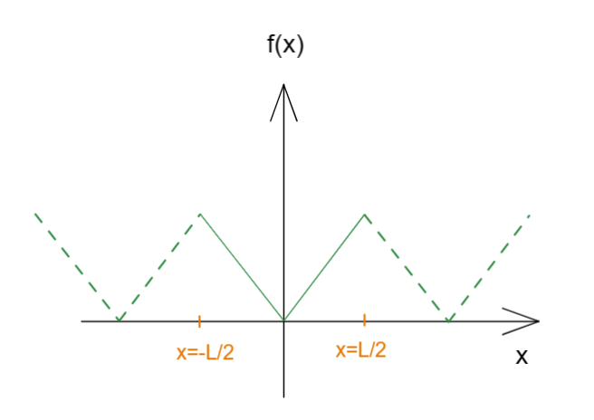
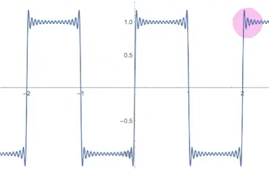
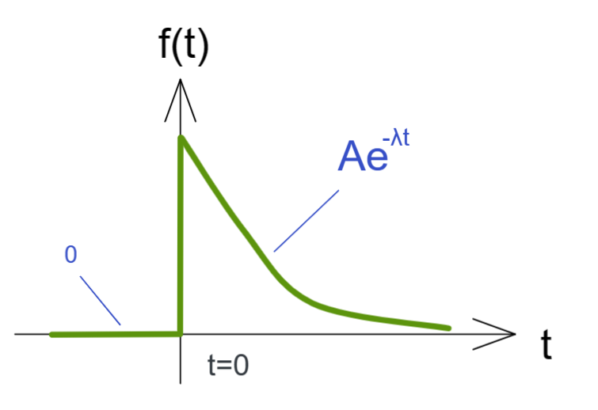
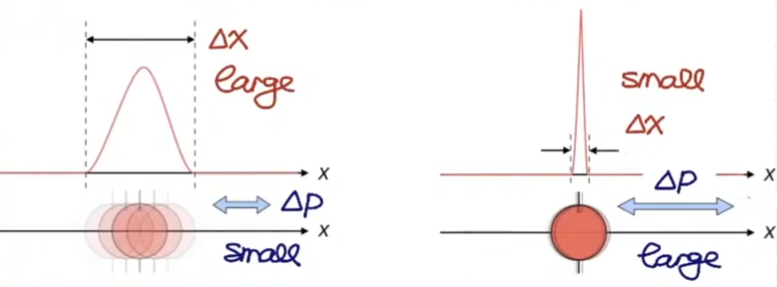
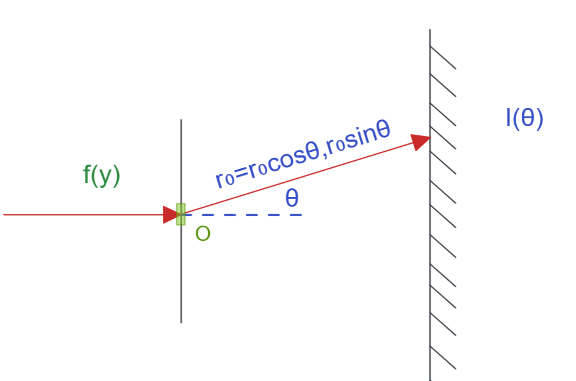
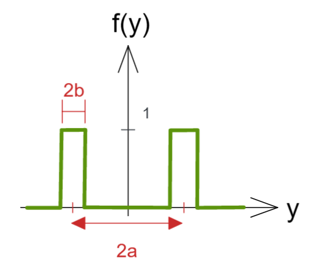

# 傅里叶转换 Fourier Transform    FFT

[TOC]

## 傅里叶级数  Fourier Series

首先我们有一个周期函数

在线性代数一章节中讲到过，一个空间中的向量可以使用其空间内的基底计算组合而成；
那么如果将这个在二维空间中的周期函数也看作为一个向量，向量每个元素就是其函数值$f(x)$，鉴于x涉及连续情况，也可以将其视作无限个元素的向量(无限维)，那么既然现有函数可以视作向量，这个函数是否也可以使用两个基底来表达出这个函数呢？

向量基底构成向量，向量可解构为正交基，函数基底构成函数，函数可解构为正交函数；向量元素值就是函数取某x的函数值；

那么我们需要寻找曾见到过的函数作为基底，这组基底需要线性无关，正交基 orthogonal-basic  则是最好的选择，我们可以根据向量的内积来定义函数如何正交；
为了保证周期性的特点，基底最好也是具有周期性的；
那么一组具有周期性且正交的函数就是  $\cos$  和  $\sin$ 函数，且可以证明其不同周期三角函数之间也是正交的；

这里先把结论给出：
$$
f(x) = \frac{1}{2}a_0+\sum\limits^\infin_{n=1}[a_n\cos(\frac{2n\pi x}{L})+b_n\sin(\frac{2n\pi x}{L})]
$$
这个傅里叶公式来历常规推导内容详见附录；Appendix-Fourier-Transform-Derivation

该公式直接使用不同周期的三角函数作为基底做加权之和表达一个函数，由n来控制三角函数的频率，附录中已经证明一般情况不同频率的三角函数正交；
既然把函数看作是一个向量（主要看x的取值，如果是有限离散取值，则函数是个有限长向量，若是连续则为无限长向量，即由无限个元素的向量），该函数的每个函数值看作无限长向量中的每个元素，当x取某值的时候，整个式子就成为了由基底取x构造出函数在x时的函数值，此时只确定了无限维向量中的某个值；对定义域内无限个x都计算得到函数值，即对无限维度向量中的每个元素赋值，该组函数值构成的线就是函数图像；

### 狄拉克符表达傅里叶系数

如果附录中的证明过于繁杂，可以使用狄拉克符号作证明，其形式较为简单，
我们将函数看作向量，那么函数是被各正交向量基底加权构造得来，这里  $|n\rang$ 就是某个基底
我们设有起码两个基底     $|n\rang ,|m\rang$  两者是正交的，但并非归一化；于是有：

$|f\rang=\sum\limits_nC_n|n\rang \to \lang m|f\rang=\sum\limits_nC_n\lang m|n\rang=C_n\delta_{mn}N_m\to C_mN_m=\lang m|f\rang\to C_m = \frac1{N_m}\lang m|f\rang$

显然  两个基底     $|n\rang ,|m\rang$   可以用三角函数替代，那么这里就是某个基底和函数内积来求解系数，其余可见附录详细推导；

其实求系数只需要使用基底做内积即可，系数本质即为函数在此基底方向上的投影影响力；这里直接给出系数结果：
$$
f_T(t)=f_T(t+2L), T = 2L \\
a_0=\frac{1}{L}\int^L_{-L}f(t)dt \\
a_n=\frac{1}{L}\int^L_{-L}f(t)\cos \frac{n\pi}{L}tdt\\  
b_n=\frac{1}{L}\int^L_{-L}f(t)\sin \frac{n\pi}{L}tdt
$$

### 对称考虑

很多情况下 ，会发现傅里叶级数对称性；

由于两个基底三角函数的本来的奇偶性，会出现一些工程常见的只有一个基底构成的简化傅里叶级数

cos 傅里叶级数

$f(x)=f(-x)$  由于原本的函数是偶函数，所有的 $b_n$ 内有基函数sin 内积为 0  ， 则留下 $a_n$ 有非零值，简化为cos傅里叶级数:
$$
f(x) = \frac{1}{2}a_0+\sum\limits^\infin_{n=1}a_n\cos(\frac{2n\pi x}{L}) 
$$
sin 傅里叶级数

$-f(x)=f(-x)$  由于原本的函数是奇函数，所有的 $a_n$ 内有基函数sin 内积为 0  ， 则留下 $ b_n$ 有非零值，简化为sin傅里叶级数:
$$
f(x) = \frac{1}{2}a_0+\sum\limits^\infin_{n=1} b_n\sin(\frac{2n\pi x}{L})
$$
在用傅里叶展开构造方波的时会出现原函数不连续的跳变处有9%的突起跳动，无法消除，使用傅里叶这种基底都是连续的方法去模仿具有跳变或者断点的函数，就会出现断点处无法消除的跳变，这个现象叫做 吉伯斯现象Gibbs phenomenon吉伯斯效应，工程上非常忌讳，需要后期二维余弦变换DCT处理；

## 傅里叶级数的复数表达

选一个复数基底  $e^{ik_nx}$

$e_{ik_nx}=\cos(k_nx)+_i\sin(k_nx)=\cos(\frac{2n\pi x}L)+i\sin(\frac{2n\pi x}L),k_n=\frac{2n\pi}L$

其实使用欧拉公式将复数和三角函数联系在一起，也就是将两个不同的三角函数重组为一个唯一新基底，使用新基底表达函数；

于是我们有了最简单的傅里叶级数复数表达：
$$
f(x)=f(x+L),k_n=\frac{2n\pi}L\\
f(x)=\sum\limits^\infin_{n=-\infin}C_n e^{ik_n x}\\
Cn = \frac1L\int^{\frac L2}_{-\frac L2}f(x)e^{-ik_nx}dx
$$
这里的系数也是原有三角表达中系数的组合
$$
C_n=\frac12(a_n-ib_n) \\
C_{-n}=\frac12(a_n+ib_n)\\
n=0,1,2,...
$$
如果函数仅在实数域  那么 $a_n , b_n$都为实数  此时  $C_{-n}=C^*_n$

## 帕塞瓦尔定理 Parseval’s Theorem

两个周期函数的”内积“可由傅里叶展开表达，   $f(x),g(x)$都有相同的周期为L

$k_n=\frac{2n\pi}L\\
f(x)=\sum\limits^\infin_{n=-\infin}c_n e^{ik_nx} \\
g(x)=\sum\limits^\infin_{n=-\infin}d_n e^{ik_nx}$

把函数视作向量，进行狄拉克符运算

$\lang f|g\rang = \int^{\frac L2}_{-\frac L2}f^*(x)g(x)dx=
\sum\limits_nc^*_n\int^{\frac L2}_{-\frac L2}g(x)e^{-ik_nx}dx$

然后看  $\int^{\frac L2}_{-\frac L2}g(x)e^{-ik_nx}dx=
\int^{\frac L2}_{-\frac L2}\sum\limits^\infin_{n=-\infin}d_n e^{ik_nx}e^{-ik_nx}dx=
\sum\limits^\infin_{n=-\infin}\int^{\frac L2}_{-\frac L2}d_ndx=
L \sum\limits^\infin_{n=-\infin}d_n$

故 $\lang f|g\rang =L \sum\limits^\infin_{n=-\infin}c^*_nd_n $

这里我们假设两个函数时离散的，并将各自一组傅里叶系数看作向量，那么有如下情况

$
\vec F=\frac1{\sqrt L} (...,c_{-1},c_0,c_1,...) \\ 
\vec G=\frac1{\sqrt L} (...,d_{-1},d_0,d_1,...) \\ 
\lang f|g \rang=\vec F^*\cdot \vec G$

可见 傅里叶其实就是复杂情况的基底的转换而已；

当 $f=g$  时  上述的关系就成为了  帕塞瓦尔定理 Parseval’s Theorem
$$
\frac1L \int^{\frac L2}_{-\frac L2}|f|^2dx=\sum\limits_n |C_n|^2
$$
常用于计算电磁波空间平均值   $\lang \cdot \rang = \frac1L\int^{\frac L2}_{-\frac L2}\cdot dx$

任意电磁波函数平方 $|f|^2$ 的空间平均值能够被写为所有傅里叶模式的贡献之和

$\lang|f|^2\rang = \sum\limits_n|C_n|^2$

## 傅里叶极限连续化推导

再看下式
$$
f(x)=f(x+L),k_n=\frac{2n\pi}L\\
f(x)=\sum\limits^\infin_{n=-\infin}C_n e^{ik_n x}\\
Cn = \frac1L\int^{\frac L2}_{-\frac L2}f(x)e^{-ik_nx}dx
$$
我们可以得到上述的混合式
$$
f(x)
=\sum\limits^\infin_{n=-\infin}C_n e^{ik_n x}
=\sum\limits^\infin_{n=-\infin} [\frac1L\int^{\frac L2}_{-\frac L2}f(x)e^{-ik_nx}dx \  e^{ik_n x}]
$$
可定义周期无限长的非周期函数情况    $L\to\infin,\Delta k =k_{n+1}-k_n= \frac{2\pi}L\to0 ,L =\frac{2\pi}{\Delta k},\frac1L =\frac{\Delta k}{2\pi}$  ， 
n的离散取值则变为连续取值，那么求和式就会成为对k的积分

$f(x) \\=
\sum\limits^\infin_{n=-\infin}[C_n  e^{ik_n x}] \\=
\sum\limits^\infin_{n=-\infin} [\frac{\Delta k}{2\pi}\int^{\frac L2}_{-\frac L2}f(x)e^{-ik_nx}dx \  e^{ik_n x} ]\\=
\frac{1}{2\pi}\sum\limits^\infin_{n=-\infin} [\int^{\frac L2}_{-\frac L2}f(x)e^{-ik_nx}dx \  e^{ik_n x} ]\Delta k\\ \xlongequal{\Delta k\to 0}
\frac{1}{2\pi}\int^\infin_{-\infin} [\int^\infin_{-\infin}f(x)e^{-ikx}dx \  e^{ik x} ] dk\\= 
\frac{1}{2\pi}\int^\infin_{-\infin} \int^\infin_{-\infin}f(x)e^{-ikx}dx \  e^{ik x} dk$

有的得到一个较为规整的式子
$$
f(x)=f(x+L),k_n=\frac{2n\pi}L\\
f(x)=\frac{1}{2\pi}\int^\infin_{-\infin} \int^\infin_{-\infin}f(x)e^{-ikx}dx \  e^{ik x} dk
$$
很多教材到这里就说 内部  $ \int^\infin_{-\infin}f(x)e^{-ikx}dx$  是傅里叶变换, 外部是个逆变换；
但是，这样讲还是过于抽象了，接下来我们使用另一种方式来推导一种从形式上看就是变换与逆变换的写法；如下

另推：

## 互转式推导

我们也可以采用另一种方式进行推算

再看
$$
f(x)=f(x+L),k_n=\frac{2n\pi}L\\
f(x)=\sum\limits^\infin_{n=-\infin}C_n e^{ik_n x}\\
Cn = \frac1L\int^{\frac L2}_{-\frac L2}f(x)e^{-ik_nx}dx
$$
比如先将系数构成替换，然后构造一个新的以k为变量的函数 $ g(k_n)\equiv\frac{\sqrt{2\pi}}{\Delta k}C_n=\frac L{\sqrt{2\pi}}C_n,C_n=\frac{\Delta k}{\sqrt{2\pi}} g(k) \\ $
请注意这里的构造式中的根号是为了后续互转式结果系数一致进行的特意指定；

显然就有

$
g(k_n)=\frac L{\sqrt{2\pi}}\frac1L\int^{\frac L2}_{\frac L2}f(x)e^{-ik_nx}dx  \overset{L\to\infin}\Rightarrow 
g(k)=\frac1{\sqrt{2\pi}}\int^\infin_{-\infin}f(x)e^{-ikx}dx$

得到了
$$
g(k)=\frac1{\sqrt{2\pi}}\int^\infin_{-\infin}f(x)e^{-ikx}dx
$$
由于之前具有傅里叶级数  $f(x)=\sum\limits^\infin_{n=-\infin}C_n e^{ik_n x}$  
且已经构造了 $C_n=\frac{\Delta k}{\sqrt{2\pi}} g(k_n)$  ，将其代入上式：

$f(x)=
\sum\limits^\infin_{n=-\infin}\frac{\Delta k}{\sqrt{2\pi}} g(k_n)e^{ik_nx}=
\frac1{\sqrt{2\pi}}\sum\limits^\infin_{n=-\infin}g(k_n)e^{ik_nx}\Delta k  \overset{\Delta k\to0}\Rightarrow
\frac1{\sqrt{2\pi}}\int^\infin_{-\infin} g(k)e^{ikx}dk$

得到了
$$
f(x)=\frac1{\sqrt{2\pi}}\int^\infin_{-\infin} g(k)e^{ikx}dk
$$
显然我们用这种方式可以将 $f(x) ， g(x)$  联系起来，这两者就是傅里叶的变换和逆变换，我称之为 互转式：
$$
f(x)=\frac1{\sqrt{2\pi}}\int^\infin_{-\infin} g(k)e^{ikx}dk  \\
g(k)=\frac1{\sqrt{2\pi}}\int^\infin_{-\infin}f(x)e^{-ikx}dx  \\
$$
如此就可以清晰的从公式的形态上直接看出 变换 和 逆变换 互相的关系；显然如果将一个式子代入另一个就得出上述第一种推导的同样结果；

这里我们得到了  x  和  k  之间的二重性  ， 那么其实工程上总是将其当作  时间   和  频率 的 二重性
那么我们用时间和频率替换  $ (x,k)\to(t,\omega)  $  ，这里的指数处因工程需要会有正负调整, 那么 互转式 就写为 工程互转式：
$$
f(t)	 =\frac1{\sqrt{2\pi}}\int^\infin_{-\infin} g(\omega)e^{-i\omega t}d\omega  	\\
g(\omega)=\frac1{\sqrt{2\pi}}\int^\infin_{-\infin} f(t	   )e^{ i\omega t}dt  		\\
$$
那么这两个函数就可以绘制出图像来，一个函数和时间有关 ，另一个和频率有关，两者互通，这就是信号学总是在讲的时域和频域；

 

## 应用

### 例

有一个函数如图，将其傅里叶展开，从时域转为频域

$g(\omega)=\frac1{\sqrt{2\pi}}\int^\infin_{-\infin} f(t	   )e^{ i\omega t}dt =
\frac1{\sqrt{2\pi}}\int^\infin_0 Ae^{-\lambda t}e^{ i\omega t}dt	 =
\frac1{\sqrt{2\pi}}\int^\infin_0 Ae^{(-\lambda+i\omega)t} dt=
\frac A{\sqrt{2\pi}}\frac1{i\omega-\lambda}e^{(i\omega-\lambda)t}|^\infin_0 =\frac A{\sqrt{2\pi}}\frac{1}{\omega-i\lambda}$

### 不确定性原理  uncertainty principle

假设具有一个粒子位置运动方程    $\Psi(x)=Ae^{-\frac14\frac{x^2}{\Delta^2_x}}$
A 为标准化常数 normalization  constant ，需要计算其概率分布   probability distribution

根据量子力学一课的内容，写出可能性密度函数， 并作变换

$P(x)=|\Psi(x)|^2=A^2e^{-\frac12\frac{x^2}{\Delta^2_x}}$

$\int^{+\infin}_{-\infin}P(x)dx=1\to A^2=\frac1{\sqrt{2\pi}\Delta_x}$

就得到可能性密度函数
$$
P(x)=\frac1{\sqrt{2\pi}\Delta_x}e^{-\frac12\frac{x^2}{\Delta^2_x}}
$$
其实这例子的位置可能性分布就是个正态分布(高斯分布)
平均值： $\mu=\lang x\rang=2$    ，粒子可能出现在任何地方，概率都是等同的;
标准差： $\sigma = \sqrt{\lang x^2\rang-\lang x\rang^2}=\Delta_x$

如果我们求粒子的动量变化方程，对此例子运动作傅里叶展开
$\tilde \Psi(k)=\frac1{\sqrt{2\pi}}\int\limits^\infin_{-\infin}\Psi(x)e^{-ikx}dx=
\frac A{\sqrt{2\pi}}\int\limits^\infin_{-\infin}dx\ e^{-\frac14\frac{x^2}{\Delta^2_x}-ikx} $

这里注意指数项上需要进行配方

$-\frac14\frac{x^2}{\Delta^2_x}-ikx=
-\frac1{4\Delta^2_x}[x^2+4i \Delta^2_x kx+(2i\Delta^2_x)^2]+\frac1{4\Delta^2}(2i\Delta^2_x)^2=
-\frac1{4\Delta^2_x}(x+2i\Delta^2_x k)^2+\Delta^2_x k^2$

那么

$\tilde \Psi(k) =
\frac A{\sqrt{2\pi}}\int\limits^\infin_{-\infin}dx\ e^{-\frac14\frac{x^2}{\Delta^2_x}-ikx} =
\frac A{\sqrt{2\pi}}e^{-\Delta^2_xk^2}\int\limits^\infin_{-\infin}dx\ e^{-\frac14\frac{x'^2}{\Delta^2_x}}=\sqrt2A\Delta_xe^{-\Delta^2_xk^2}$

可见傅里叶变换完成后 的结果 依旧是个 正态分布(高斯分布)

那么可能性函数就变化为

$P(k)=|\tilde\Psi(x)|^2=\frac{2\Delta_x}{\sqrt{2\pi}}e^{-2\Delta^2_xk^2}$

这里我们给出教材原有的标准式
$$
P(k)=\frac1{\sqrt{2\pi}\Delta_k}e^{-\frac12\frac{k^2}{\Delta^2_k}}
$$
不难发现   $\Delta_x\Delta_k=\frac12$

其位置与动量的关系综合起来才为常数，而各自都会被对方的变化牵制；整个测不准原理核心由傅里叶变换就表达了出来；

根据波粒二象性 Einstein-de Broglie关系式   

$P=\hbar k  \to  \Delta P=\hbar \Delta k = \hbar \Delta_k$

显然就可以得出  海森堡测不准原理 
$$
\Delta x \Delta P = \frac12\hbar
$$

### 夫琅禾费衍射  fraunhofer diffraction

一束光通过光栅，会发生衍射，在不同角度都可能产生结果，假设某次结果如图，那么光最终到墙面的强度时什么？光原有强度为  $\vec K_{in}=(K,0)=(\frac{2\pi}\lambda,0)$

首先看狭缝数量，将其简化为函数，这里是双狭缝：

这里直接给出结论  终点的强度为 $I(\theta) = \frac{2\pi}{r^2_0}|\tilde f(K\sin\theta)|^2$

