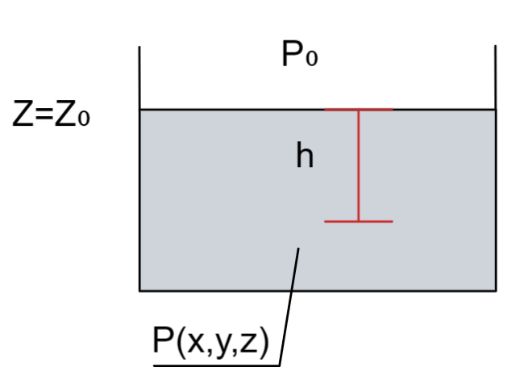
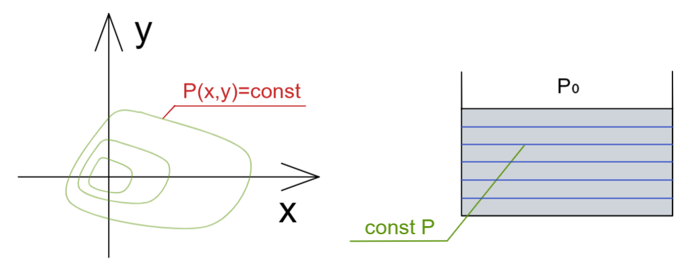
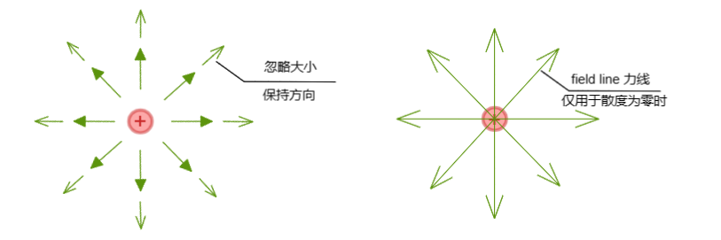
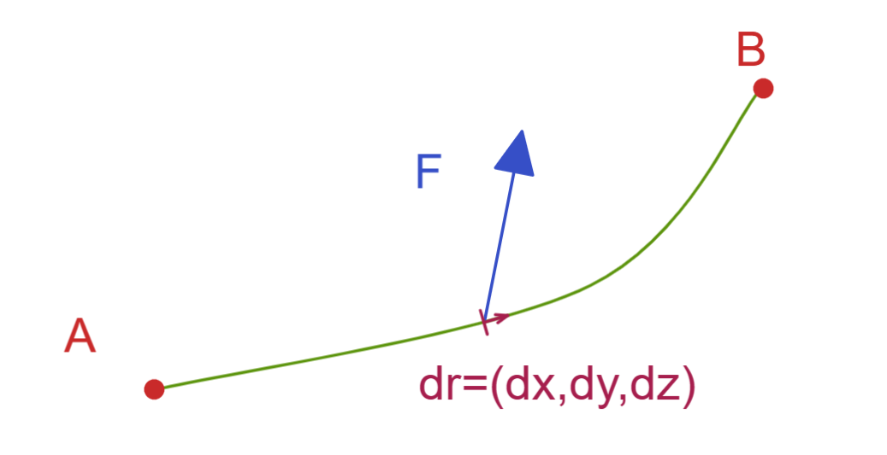
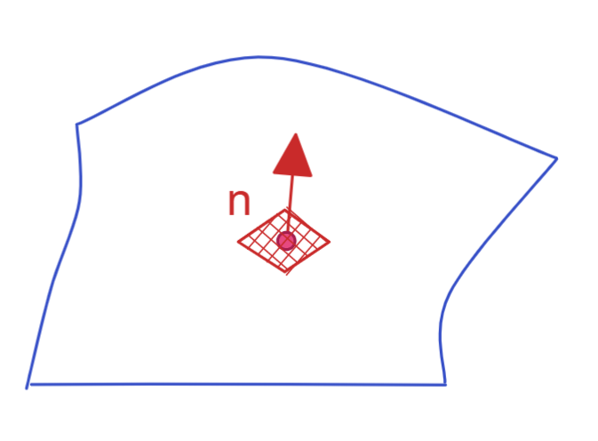
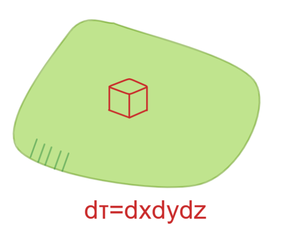
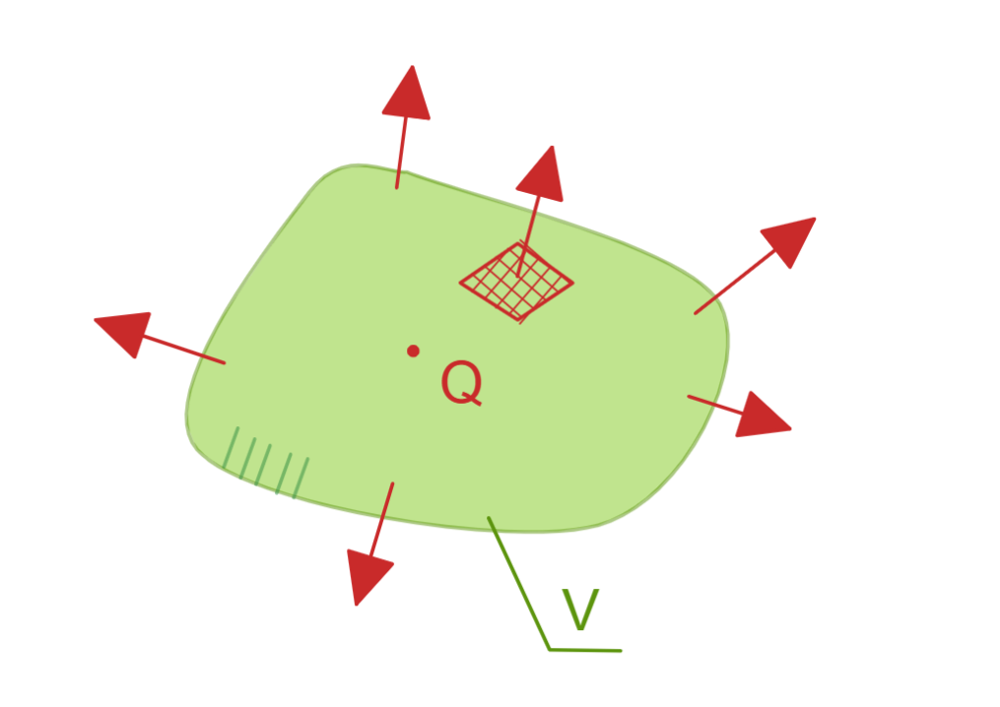
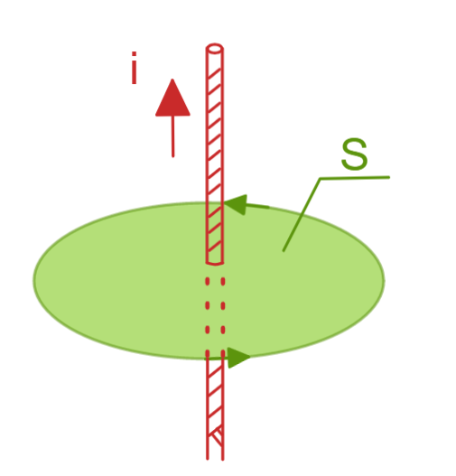
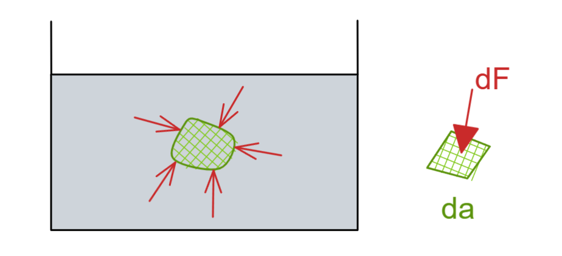
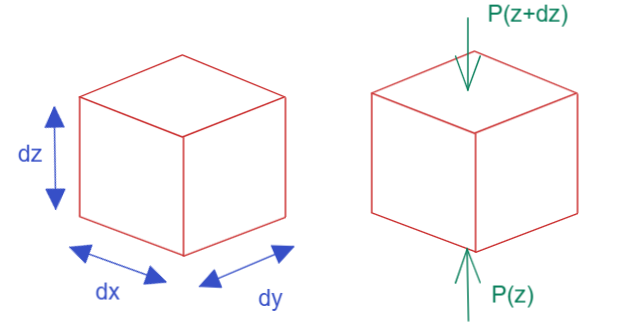

# 向量微积分

[TOC]

## 引、场论

场的概念在物理学中非常重要

### 几个例子

#### 标量场

##### 水压

整个压力场可以使用如下公式表达 

$P(x,y,z)=P_0+\rho g(z_0-z) , P(x,y,z) 为标量场 ，P_0为水面压力（大气压），(z_0-z)为深度$

液体压力本就是和重力达成静力平衡的现象；

##### 等位线

我们通常可以使用等高线（等位线）的方式来表达一个可视化的表达标量场

可见能够使用等高线（等位线）表达标量场；

#### 向量场

现在我们扩展到向量场 

一个电场，  $\vec E=\frac Q{4\pi\epsilon_0r^2}\hat r , r=\sqrt(x^2+y^2+z^2),\hat r= (\frac xr,\frac yr,\frac zr)$

### 几种算子

那么如何用微分来描述场的变化呢？

我们对一个标量场（纯量场）对规定的几个方向取一个梯度Gradient，表达对不同方向进行导致的量的变化

$\vec\nabla\Phi=(\frac{\part\Phi}{\part x},\frac{\part\Phi}{\part y},\frac{\part\Phi}{\part z})$

然后我们将归一化的梯度和某方向进行点乘，得到散度 Divergence，为标量（纯量）
可理解为 场对于某方向的投影（影响），即点沿某方向前进导致能量变化程度表达；

$\vec\nabla\cdot\vec V= \frac{\part V_x}{\part x}+\frac{\part V_y}{\part y}+\frac{\part V_z}{\part z} $

最后是旋度，空间中的物体既然有方向上的位移自由度，那么也有自身旋转的自由度，经典力学中也称角动量；
其形成即为使用归一化的梯度和某方向进行叉乘，叉积的物理意义可理解为场中某点旋转时的线速度

$\vec\nabla\times\vec V= 
\left | 
\begin{matrix}
\hat i & \hat j &\hat k   \\
\frac\part{\part x} & \frac\part{\part y}   & \frac\part{\part z}    \\  
V_x & V_y & V_z 
\end  {matrix} 
\right |  =
(
\frac{\part V_z}{\part y}-\frac{\part V_y}{\part z} , 
\frac{\part V_x}{\part z}-\frac{\part V_z}{\part x} ,
\frac{\part V_y}{\part x}-\frac{\part V_x}{\part y}
) $

拉普拉斯算子  Laplacian  无非是将两个散度叠加，两次计算后 标量依然返回到标量
两次计算，若第一次计算得到梯度，那么第二次计算就得到归一化的梯度在梯度自身各方向的影响
既然在最基本的力学中，一次微分求速度，二次微分求加速度，称为力，那么可以认为其实二次微分得到的结果就是外界的影响，只是在场中对各个方向的计算将方向这一因素消解了，结果得到标量；

$\nabla^2\Phi=\nabla\cdot\nabla\Phi=\frac{\part^2\Phi}{\part x^2}+\frac{\part^2\Phi}{\part y^2}+\frac{\part^2\Phi}{\part z^2}$

这里要对运算子进行总结：

$\vec\nabla\Phi$   		梯度，将标量场转为向量场

$\vec\nabla\cdot\vec V$ 		散度，将向量场转为标量场

$\vec\nabla\times\vec V$		旋度，将向量场转为向量场

$\nabla^2$ 			拉普拉斯算符，将标量场转为标量场

### 几种积分

#### 线积分

$\int_\Gamma\vec F\cdot\vec r =\int_\Gamma (F_xdx+F_yd_y+F_zd_z)$

表达为某个力F在整个选取的路径AB上，沿着路径的方向所产生的影响，即在线上所做功；

#### 面积分

$\int_S\vec E\cdot d\vec a =\int_S(\vec E\cdot\vec n)da，d\vec a=da\cdot\hat  n$

面积分，我们总是默认在封闭曲面向外的是所取面的法向量，而场对于面的影响即为对于面的投影的影响大小乘以该投影面积；

#### 体积分

$\int_V\phi d\tau=\int\phi dxdydz$

和面积分类似，这里的体积分为三重积分；

### 亥姆霍兹定理  Helmholtz Theorem

如何描述一个标量场  $\Phi=\Phi(x,y,z)$  中的空间变化呢？
其实我们在这个三维空间中，只需要能够得到任意一点对于三各维度 x  y  z的微分变化，就能够得到任意方向的变化；

$\vec\nabla\Phi=(\frac{\part\Phi}{\part x},\frac{\part\Phi}{\part y},\frac{\part\Phi}{\part z})$

这个表达其实就是梯度；

那么我们如果需要描述电磁场怎么办？
我们一般知道，如电场 $\vec E$  的三个方向变化互相独立，那么我们就要有 如下几个变化

$\vec E_{xx},\vec E_{xy},\vec E_{xz},\vec E_{yx},\vec E_{yy},\vec E_{yz},\vec E_{zx},\vec E_{zy},\vec E_{zz}$

看来每个方向的电场还需对三个方向求一次微分；那么就有了  $3\times3=9$ 个微分单元；
此时如果将磁场考虑进来就会出现  $9+9=18$ 个微分单元作为整个式子的参数了，这是非常庞大的数字；
我们使用较为方便的方法表达  $\frac{\part E_i}{\part x_j},\frac{\part B_i}{\part x_j}$

但是麦克斯韦方程反而非常简单：
$$
\vec\nabla\cdot\vec E=\frac\rho{\epsilon_0}		\\
\vec\nabla\times\vec E=-\frac{\part \vec B}{\part t}		\\
\vec\nabla\cdot\vec B=0		\\
\vec\nabla\times\vec B=\mu_0\vec J +\frac1{c^2}\frac{\part \vec E}{\part t}
$$
看来对于描述向量场 $ \vec F(\vec r)$，我们只需要知道其散度和旋度即可

$\vec\nabla\cdot\vec F = D(\vec r)$

$\vec\nabla\times\vec F = \vec C(\vec r)$

其实根据 亥姆霍兹定理 来说 这确实没错,当然内部具有非常复杂的证明；
只要 我们的 散度和旋度都会趋近0，且衰减速度大于 $\frac1{r^2}$，那么向量场就可以表达为如下一个简单式子
$$
\vec F = -\vec\nabla U+\vec\nabla\times\vec W \\
U = \frac1{4\pi}\int\frac{D(\vec r')}{|\vec r-\vec r'|}d\tau'		\\
\vec W =\frac1{4\pi}\int\frac{\vec C(\vec r')}{|\vec r-\vec r'|}d\tau'
$$
那么得到结论，只要知道散度和旋度就能够定义出一个向量场

### 简单推定

假设我们使用散度和梯度定义两个完全相同的场

$\vec\nabla\cdot\vec F_1=D=\vec\nabla\cdot\vec F_2 \\ \vec\nabla\times\vec F_1=\vec C=\vec\nabla\times\vec F_2$

如果梯度和散度构成的场为唯一场，那么只需要说明   $\vec F_1-\vec F_2=\vec x =\vec 0 $

则

$\vec\nabla\cdot\vec x =0 , \vec\nabla\times\vec x =\vec0 \to \vec x = \vec 0$

### 体边界关系 Bulk-Boundary Relations

有个封闭曲面，体积为V，边界为  $\part V$ ，我们尝试对其在场中做面积分，之后会发现其相当于每个点的散度做体积分

$\int_{\part V}\vec E\cdot d\vec a = \int_V\vec\nabla\vec Ed\tau$  

#### 斯托克斯定理

有个通电导线，选取某一个空间圆截面做积分，圆截面为$ S$ ，圆截面其边缘为$\part S$   ，我们尝试对其边缘做线积分，结果发现其就等于导线产生磁场对于面S的面积分；

$\int_{\part S} \vec B\cdot\vec r = \int_S(\vec \nabla\times\vec B)\cdot d\vec a$

可见基本就有，积分计算有降维趋势  boundary-bulk 

$ L.H.S.=R.H.S.$

可以看到  体降为面  面降为线  线降为点

$F(b)-F(a)=\int^b_a \frac{dF}{dx}dx$

其实在定积分时的计算就在于函数在两个端点的函数只差即可得到整个积分结果，那么这个动作可以升维度推广为上述所有体边界关系中；

### 阿基米德浮力定理的向量场解释

我们在经典了物理中所知的，浮力就是物体在水中被各个方向液体在面上总作用的表现；

那么对于**表面作用**我们可以使用面积分表达，那么对于所谓**浮力**这种超距力假设就用体积分表达就能够得到，面积分=体积分

$\vec B=-\vec W$ 

我们取一个小面积来看，此时浮力方向和面法相相关，而真正的作用者即压强看作标量；这符合常识；
所以液体中真正的力作用方向由面的空间位置决定

$d\vec F=-p\cdot d a\cdot \hat n = -p\cdot d\vec a$

那么我们就得到面积分和体积分

$\vec B=\int d \vec F=-\int p d \vec a \\ \vec W=\int d\vec W=\int\rho\vec g d\tau$

接下来我们采用欧拉法分析，取出一个小小方块

 

我们将水下的整个场作为压强场看待，那么为  $P=P(x,y,z)$  ,那么对于该方块来讲Z方向有如下压强公式

$-P(z+dz)dxdy+P(z)dxdy-\rho g\cdot dxdydz=0$

该方块没有加速运动

$P(z+dz)-P(z)=\frac{\part P}{\part z}dz \\ \rightarrow (-\frac{\part P}{\part z}-\rho g)d\tau=0,d\tau=dxdydz$

于是对xy方向也进行相同操作就有了如下

$\frac{\part P}{\part z}=-\rho g , \frac{\part P}{\part x}=0=\frac{\part P}{\part y}$ 
$$
\vec\nabla P=-\frac{\part P}{\part z}-0-0=\rho\vec g
$$

那么我们就看出这里使用了梯度来表达压强场各方向影响潜力

那么使用体边界关系   $\int p d\vec a=\int\vec\nabla p d\tau$

$\vec B=-\int pd\vec a=-\int\nabla pd\tau=-\int\rho\vec gd\tau \to \vec B=-\vec W$

规则成立

