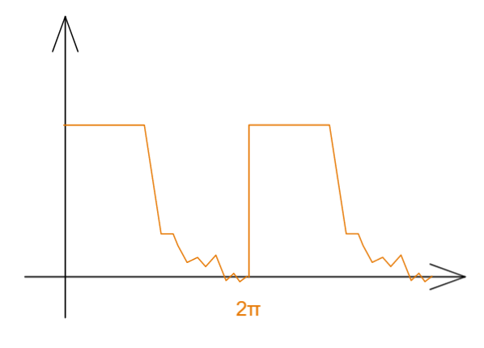
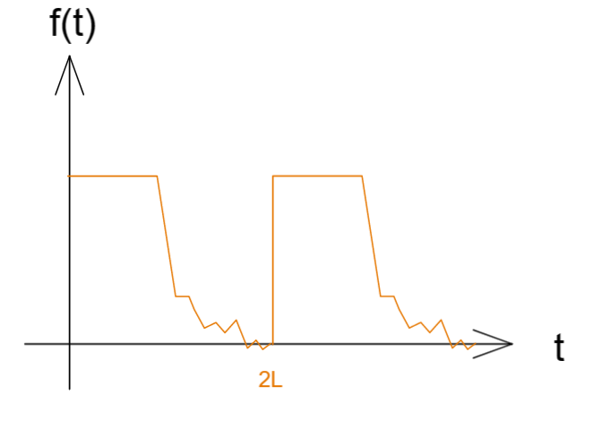
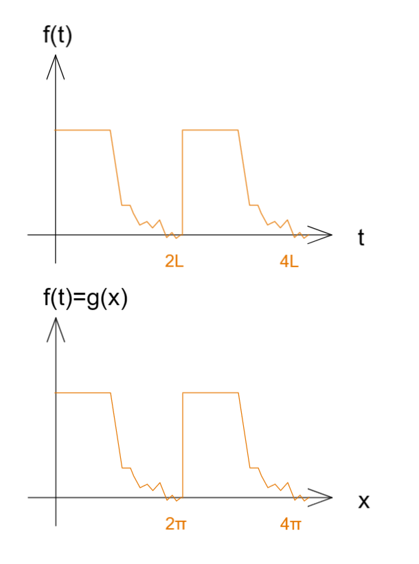
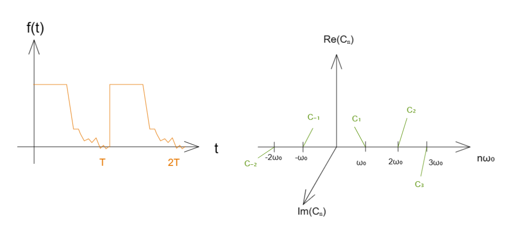

# 傅里叶级数与傅里叶变换

[TOC]

Αα、Ββ、Γγ、Δδ、Εε、Ϝϝ、Ζζ、Ηη、Θθ、Ιι、Κκ、Λλ、Μμ、Νν、Ξξ、Οο、Ππ、Ρρ、Σσ、Ττ、Υυ、Φφ、Χχ、Ψψ、Ωω

## 引

这里要首先证明三角函数的正交性
然后，既然证明了正交，利用加权求和的形式得到关于周期为$2\pi$函数的傅里叶级数
再把周期扩展到任意L 
为了简化公式，使用欧拉公式把复数域和三角函数混合的形式区别统合起来，于是有了周期函数的复指数表达
最终的周期复指表达中会算得一个系数项，整个展开的矛盾就转移到了该系数中
然后我们将整个函数推广到非周期函数中，即将周期推到无限的函数
无限导致的就是级数求和成为连续积分 ，最后得到规整的式子，就是傅里叶变换和逆变换；

 

## 三角函数的正交性

三角函数正交性是傅里叶级数的基础

我们有个 三角函数系 集合   $\{ \sin 0x=0 , \cos 0x=1, \sin x \cos x,\sin 2x \cos 2x,...,\sin nx \cos nx,... \}$  

即  $\{ \sin nx ,\cos nx \},n = 0,1,2,...$

那么什么是正交，向量内积为0是正交，函数则这里有个定义 ：

$\int^\pi_{-\pi} \sin nx \cos mx dx =0 $

$\int^\pi_{-\pi} \cos mx \cos nx dx =0  , n\neq m$

那么上述的三角函数正交的情况是怎么来的？
简单来说，其实正交就是垂直 ， 也就是两个向量的内积为0的时候就是正交；

$\vec a \cdot \vec b = |\vec a||\vec b|\cos\phi = |\vec a||\vec b| \cdot 0=0$ 就平面上来说正交是这样，那么如果用向量表达出来，假设两者在n维度场：

$\vec a \cdot \vec b = a_1 b_1+a_2 b_2+...+a_n b_n=\sum\limits^\infty_{i=1}a_i b_i=0$

如果上述求和公式并非取整数，而是连续实数，那么上述的求和就成为了积分；

于是当我们将向量转为无限维的函数，意味着其向量内元素是无限且稠密的，但某个元素总是可用函数自变量表达
$$
a \cdot b =\int^{x_1}_{x_0}f(x)g(x)dx \\a=f(x),b=g(x) ,x\in(x_0,x_1)
$$
由此我们定义出了函数之间的内积以及函数的正交；

于是我们要在三角函数上证明，，利用三角积化和差公式，以及奇函数性质：

$\int^\pi_{-\pi} \cos nx \cos mx dx , n\neq m \rightarrow  \\ 
\frac{1}{2}\int^\pi_{-\pi} \cos (n-m)x \cos (n+m)x dx \\=
\frac{1}{2}\int^\pi_{-\pi} \cos (n-m)x dx \frac{1}{2}\int^\pi_{-\pi}\cos (n+m)x dx \\=
\frac{1}{2}\frac{1}{n-m} \sin (n-m)x |^\pi_{-^\pi} + \frac{1}{2}\frac{1}{n-m}\sin (n+m)x|^\pi_{-^\pi} =
0+0=0$

同样我们也可验证：
$\int^\pi_{-\pi} \cos nx \sin mx dx = 0, n\neq m$
$\int^\pi_{-\pi} \sin nx \sin mx dx = 0, n\neq m$

那么如果 $n = m$ ,就有

$\int^\pi_{-\pi} \cos nx \cos mx dx , n=m\neq0  \rightarrow \\
 \int^\pi_{-\pi} \frac{1}{2}[1+\cos2mx] dx \\= 
\frac{1}{2} [\int^\pi_{-\pi} 1 dx+ \int^\pi_{-\pi}\cos2mx dx ]  \\=
\frac{1}{2} [\int^\pi_{-\pi} 1 dx+ \int^\pi_{-\pi}\cos0x\cos2mx dx ]  \\=
\frac{1}{2}[\pi+0]=\pi$

那么我们将上述所有三角函数正交的情况罗列出来：
$$
\int^\pi_{-\pi} \sin nx \cos mx dx =0 \\
$$

$$
\int^\pi_{-\pi} \sin nx \sin mx dx = 0 ,n\neq m \\ \int^\pi_{-\pi} \sin nx \sin mx dx = \pi ,n=m\neq0 \\ \int^\pi_{-\pi} \sin nx \sin mx dx = 2\pi ,n=m=0
$$

$$
\int^\pi_{-\pi} \cos nx \cos mx dx = 0 ,n\neq m \\ \int^\pi_{-\pi} \cos nx \cos mx dx = \pi ,n=m\neq0 \\ \int^\pi_{-\pi} \cos nx \cos mx dx = 2\pi ,n=m=0
$$

## 周期为 $2\pi$ 的函数展开为傅里叶级数

拿到一个周期为$T = 2\pi$ 的函数  $f(x)=f(x+2\pi)$  

将其展开为三角函数的加和，那么两个三角函数作为基底进行加权组合，两种表达方式：
$$
f(x)=\sum\limits^\infin_{n=0}a_n\cos nx+\sum\limits^\infin_{n=0}b_n\sin nx \\ f(x)=a_0\cos0x+\sum\limits^\infin_{n=1}a_n\cos nx+b_0\sin0x+\sum\limits^\infin_{n=1}b_n\sin nx=a_0+\sum\limits^\infin_{n=1}a_n\cos nx+\sum\limits^\infin_{n=1}b_n\sin nx
$$

### 我们需要求出这里的 $a_0$

对上述第二式两边积分 
$\int^\pi_{-\pi}f(x)dx=\int^\pi_{-\pi}a_0dx+\int^\pi_{-\pi}\sum\limits^\infty_{n=1}a_n\cos nx dx+\int^\pi_{-\pi}\sum\limits^\infty_{n=1}b_n\sin nx dx =
a_0\int^\pi_{-\pi}dx+0+0=a_0x|^\pi_{-\pi}=2\pi a_0$

于是可以得到       $a_0=\frac{1}{2\pi}\int^\pi_{-\pi}f(x)dx$   ，这个公式有时为了后续计算方便通常两侧都乘2 得到 
$$
a_0=\frac{1}{2\pi}\int^\pi_{-\pi}f(x)dx ,  a'_0=\frac{1}{\pi}\int^\pi_{-\pi}f(x)dx
$$

### 接下来求  $a_n$

我们对等式两侧乘以 $\cos mx$ ，然后两侧进行积分 

$\int^\pi_{-\pi}f(x)\cos mx dx \\
=\int^\pi_{-\pi}a_0\cos mxdx+\int^\pi_{-\pi}\sum\limits^\infty_{n=1}a_n\cos nx\cos mx dx+\int^\pi_{-\pi}\sum\limits^\infty_{n=1}b_n\sin nx \cos mxdx\\
=0+\int^\pi_{-\pi}\sum\limits^\infty_{n=1}a_n\cos nx\cos mx dx+0$

此时我们观察到 上式仅在$n=m$的时候出现非零项

$\int^\pi_{-\pi}f(x)\cos nx dx =a_n\int^\pi_{-\pi}\cos^2 nx dx=a_n\pi $
$$
a_n = \frac{1}{\pi}\int^\pi_{-\pi}f(x)\cos nx dx
$$

### 接下来求解 $b_n$

我们对等式两侧乘以 $\sin mx$ 然后对两侧进行积分

$\int^\pi_{-\pi}f(x)\sin mx dx \\
=\int^\pi_{-\pi}a_0\sin mxdx+\int^\pi_{-\pi}\sum\limits^\infty_{n=1}a_n\cos nx\sin mx dx+\int^\pi_{-\pi}\sum\limits^\infty_{n=1}b_n\sin nx \sin mxdx\\
=0+0+\int^\pi_{-\pi}\sum\limits^\infty_{n=1}b_n\sin nx\sin mx dx$

此时我们观察到 上式仅在$n=m$的时候出现非零项

$\int^\pi_{-\pi}f(x)\cos nx dx =b_n\int^\pi_{-\pi}\sin^2 nx dx=b_n\pi $
$$
b_n = \frac{1}{\pi}\int^\pi_{-\pi}f(x)\sin nx dx
$$

那么我们得到了周期为$2\pi$函数的完整傅里叶级数的展开  
$$
f(x)=f(x+2\pi),T=2\pi \\
f(x)
= \frac{a'_0}{2} +\sum\limits^\infin_{n=1}a_n\cos nx+\sum\limits^\infin_{n=1}b_n\sin nx 
= a_0 +\sum\limits^\infin_{n=1}a_n\cos nx+\sum\limits^\infin_{n=1}b_n\sin nx \\  
a'_0=\frac{1}{\pi}\int^\pi_{-\pi}f(x)dx, a_0=\frac{1}{2\pi}\int^\pi_{-\pi}f(x)dx \\  
a_n=\frac{1}{\pi}\int^\pi_{-\pi}f(x)\cos nxdx \\  
b_n=\frac{1}{\pi}\int^\pi_{-\pi}f(x)\sin nxdx
$$

## 周期为 $2L$ 的函数展开为傅里叶级数

拿到一个周期为$T = 2L$ 的函数  $f(x)=f(x+2L)$  

可以直接使用换元方法 $\frac{\pi}{L}=\frac{x}{t}\rightarrow x=\frac{\pi}{L}t \rightarrow t = \frac{L}{\pi}x$

$f(t)=f(\frac{L}{\pi}x)\triangleq g(x)$

那么我们可得到 
$ x = \frac{\pi}{L}t,\cos nx=\cos\frac{n\pi}{L}t,\sin nx=\sin \frac{n\pi}{L}t,\\
\int^\pi_{-\pi}dx=\int^L_{-L}d\frac{\pi}{L}t \rightarrow \frac{1}{\pi}\int^\pi_{-\pi}dx=\frac{1}{\pi}\frac{\pi}{L}\int^L_{-L}dt= \frac{1}{L}\int^L_{-L}dt$

显然其实形式并没有太大的变化 
$$
f(t)=f(t+2L),T=2L \\
f(t)
= \frac{a'_0}{2} +\sum\limits^\infin_{n=1}a_n\cos \frac{n\pi}{L}t+\sum\limits^\infin_{n=1}b_n\sin \frac{n\pi}{L}t   \\ 
a'_0=\frac{1}{L}\int^L_{-L}f(t)dt \\
a_n=\frac{1}{L}\int^L_{-L}f(t)\cos \frac{n\pi}{L}tdt\\  
b_n=\frac{1}{L}\int^L_{-L}f(t)\sin \frac{n\pi}{L}tdt
$$
在工程上 时间通常不会是负数 $t>0$  , 周期为  $T=2L	,\omega =\frac{\pi}{L} =\frac{2\pi}{T}$

$\int^L_{-L} \rightarrow \int_0^{2L}dt\rightarrow \int^T_0 t$

于是我们得到傅里叶工程表达  
$$
f(t)=f(t+2L),T=2L ,\omega =\frac{\pi}{L} =\frac{2\pi}{T}\\
f(t)
= \frac{a'_0}{2} +\sum\limits^\infin_{n=1}a_n\cos n\omega t+\sum\limits^\infin_{n=1}b_n\sin n\omega t 
 \\  
a'_0=\frac{2}{T}\int^T_0f(t)dt \\  
a_n=\frac{2}{T}\int^T_0f(t)\cos n\omega tdt\\  
b_n=\frac{2}{T}\int^T_0f(t)\sin n\omega tdt
$$
那么如果此时T 变为无限大，即函数已经不是周期函数了，或者说 全局只有一个周期的函数 ； 

## 傅里叶级数的复数表达形式

以上述工程表达形式为例   

连接复数以及三角可使用欧拉公式作中介
$$
e^{i\theta} = \cos\theta +i\sin\theta \\
\cos\theta=\frac{1}{2}(e^{i\theta}+e^{-i\theta}) \\
\sin\theta=-\frac{1}{2}i(e^{i\theta}-e^{-i\theta})
$$
带入上述的工程表达得到傅里叶级数的复数表达

$f(t) \\=
\frac{a'_0}{2}+\frac{1}{2}\sum\limits^\infty_{n=1}a_n(e^{in\omega t}+e^{-in\omega t})+\frac{-1}{2}i\sum\limits^\infty_{n=1}b_n(e^{in\omega t}-e^{-in\omega t}) \\=
\frac{a'_0}{2}+\frac{1}{2}\sum\limits^\infty_{n=1} (a_n-ib_n)e^{in\omega t} +\frac{1}{2}\sum\limits^\infty_{n=1}(a_n+ib_n)e^{-in\omega t}$

观察上述式子 ， 将第三项的n的范围改变符号 得到  $\frac{1}{2}\sum\limits^{-1}_{n=-\infty}(a_{-n}+ib_{-n})e^{in\omega t}$

此时可以发现n的取值成了 $n\in(-\infty,\infty)$，出现了可以合并的项  $e^{in\omega t}$  ，最后式子就变为  $\sum\limits^{\infty}_{-\infty}C_n e^{in\omega t}$

于是 
$$
f(t)=\sum\limits^{\infin}_{-\infin}C_n e^{in\omega t}   
\\  
\begin{equation}
C_n=
\begin{cases}
\frac{a_0}{2} , n=0 \\
\frac12(a_n-ib_n),n=1,2,3,... \\
\frac12(a_{-n}+ib_{-n}),n=-1,-2,3,... \\
\end{cases}
\end{equation}
$$
然后将原先傅里叶级数代入，我们就会有惊奇的发现

$n=0 \rightarrow  C_0 =\frac{a_0}{2} = \frac1T \int^t_0f(t)dt =\frac1T\int^T_0f(t)e^{-i0\omega t}dt  $

$
n=1,2,... \rightarrow C_n =\frac12(a_n-ib_n) \\=
\frac12[  \frac2T \int^T_0 f(t)\cos n\omega t dt - i \frac2T \int^T_0 f(t)\sin n\omega t dt ] \\=
\frac1T\int^T_0f(t)[\cos n\omega t-i\sin n\omega t]dt \\=
\frac1T\int^T_0f(t)[\cos (-n\omega t)+i\sin (-n\omega t)]dt \\=
\frac1T\int^T_0f(t)e^{-in\omega t}dt 
$

$
n=-1,-2,... \rightarrow C_n =\frac12(a_{-n}+ib_{-n}) \\=
\frac12[  \frac2T \int^T_0 f(t)\cos (-n\omega t )dt + i \frac2T \int^T_0 f(t)\sin (-n\omega t) dt ] \\=
\frac1T\int^T_0f(t)[\cos n\omega t-i\sin n\omega t]dt \\=
\frac1T\int^T_0f(t)[\cos (-n\omega t)+i\sin (-n\omega t)]dt \\=
\frac1T\int^T_0f(t)e^{-in\omega t}dt 
$

非常有趣的是 二三项最后结果相同 （归功于三角函数将正负号掰了回来），而第一项就是后两项的特殊形式
因此完全可以使用一个式子来表达这系数内涵的三项，此时复数形式的傅里叶级数变得非常简单；
$$
f(t)=f(t+T),\omega = \frac{2\pi}T\\
f(t)=\sum\limits^{\infin}_{-\infin}C_n e^{in\omega t}  \\ 
C_n=\frac1T \int^T_0f(t)e^{-in\omega t}dt
$$

## 傅里叶变换 FT

 我们已经得到了傅里叶级数的复数表达；
$$
f_T(t)=f(t+T),\omega_0 = \frac{2\pi}T，\omega_0为基频率\\
f_T(t)=\sum\limits^{\infty}_{n=-\infty}C_n e^{in\omega_0 t}  \\ 
C_n=\frac1T \int^{\frac T2}_{-\frac T2}f_T(t)e^{-in\omega_0 t}dt
$$
上述函数原表达，求和式，以及系数式；

其求和式中 $\sum\limits^\infty_{-\infty}$   和  $e^{in\omega_0 t}$  两者 对于任意的傅里叶级数都是一样，已经是一种固定规则了，仅仅由  $C_n$ 来决定不同样式的傅里叶级数，这系数是一个复数；

其实把求和式展开，$ ... + c_{-1}e^{-i(-1)\omega_0 t}+ c_{0}e^0+ c_1 e^{i(1)\omega_0 t}+ c_2e^{-i(2)\omega_0 t} +...$ , 表现为如下右图；

就上图来说，左边在工程中总是称为时域，毕竟和事件有关，右侧表达的是系数在不同频率下的大小不同，即每次都以某个频率作为基础，作加权，并对其各频率加权结果之总和就是原函数；

上述是周期函数的情况；

那么如果一个函数不是周期函数，或者说整个函数就一个周期？

那么其周期就趋于无穷，此时就成了一般函数 $\lim\limits_{T\to\infty}f_T(t)-f(t) $   

对基频率来说   $T \to \infty $  ,此时   $\Delta\omega = (n+1)\omega_0-n\omega_0=\omega_0 = \frac{2\pi}T $  周期增加导致频率间隔变小，当趋于无穷则频率间隔无限小；
此时我们可以将傅里叶级数频率的离散情况，转为连续情况，即各个有微小差异的频率稠密的顺序排在一起组成了频率函数（离散级数成连续函数）；

把系数式代入求和式  得到 混合式：

$f_T(t)=\sum\limits^{\infty}_{n=-\infty}\frac1T \int^{\frac T2}_{-\frac T2}f_T(t)e^{-in\omega_0 t}dt e^{in\omega_0 t},\frac1T=\frac{\Delta\omega}{2\pi}，T \to \infty$

可见当周期无限时会出现如下情况：

$  \int^{\frac T2}_{-\frac T2} dt \to \int^\infty_{-\infty} dt \\
   n\omega_0 \to \omega  \\
\sum\limits^{\infty}_{n=-\infty}\Delta\omega\to \int^{\infty}_{-\infty}d\omega$

将这些变化代入上述混合式得到：
$$
\frac1{2\pi} \int^\infty_{-\infty}\int^\infty_{-\infty}f(t)e^{-i\omega t} dt \  e^{i\omega t} d\omega
$$
这个二重积分里层积分拿出来 就是 傅里叶变换FT
$$
F(\omega)=\int^\infin_{-\infin}f(t)e^{-i\omega t} dt
$$
而整体拿出来 就是傅里叶逆向变换 IFT
$$
f(t)=\frac1{2\pi} \int^\infin_{-\infin}F(\omega) e^{i\omega t} d\omega
$$
傅里叶变换简化写法就是拉普拉斯变换 Lplace-Transform   LT
$$
F(S)=\int^\infin_{-\infin}f(t)e^{-S t} dt
$$

