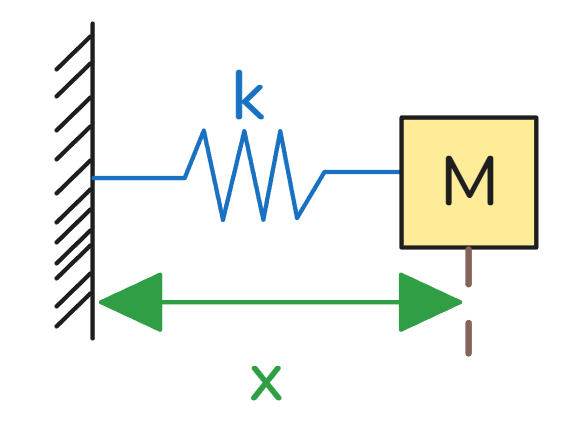

# 10_二阶ODE-求谐振子的四种方式  

[TOC]

## ODE：二阶微分方程，弹簧振子，弦/振荡问题
弹簧力：
$F_{\text{spring}} = -kx,F = ma=m\ddot x$

令 $m=1,\ k=1$，则：
$$
\frac{d^2 x}{dt^2} = \frac{F}{m} = -x \quad \Rightarrow \quad \ddot{x} = -x
$$

----------------

## M1：猜测振荡函数

初始条件

$x(0) = x_0,\quad \dot{x}(0) = v_0$

**猜测有解析解**

$$x(t) = \cos(\omega t)\,x_0,\quad \omega = \sqrt{\frac{k}{m}}$$

若 $m=1,\ k=1$，则 $\omega=1$，因此：
$x(t) = \cos(t)\,x_0$
$\dot{x}(t) = -\sin(t)\,x_0$
$\ddot{x}(t) = -\cos(t)\,x_0$

状态空间形式：
$$
\begin{pmatrix}
\dot{x} \\
\ddot{x}
\end{pmatrix}
=
\begin{pmatrix}
0 & 1 \\
-1 & 0
\end{pmatrix}
\begin{pmatrix}
x \\
\dot{x}
\end{pmatrix}
$$

---

## M2：Taylor 级数展开
设位移的泰勒展开式为：
$$x(t) = c_0 + c_1 t + c_2 t^2 + c_3 t^3 + \cdots$$

求导可得：
$\dot{x}(t) = c_1 + 2c_2 t + 3c_3 t^2 + 4c_4 t^3 + 5c_5 t^4 + \cdots$
$$\ddot{x}(t) = 2c_2 + 6c_3 t + 12c_4 t^2 + 20c_5 t^3 + \cdots$$

由 $\ddot{x} = -x$ 及初始条件 $x(0)=x_0,\ \dot{x}(0)=v_0$，可得：
$$
\begin{cases}
x(0) = x_0 \Rightarrow c_0 = x_0 \\
\dot{x}(0) = v_0 \Rightarrow c_1 = v_0 \\
\ddot{x} = -x \Rightarrow 2c_2 = -c_0 \Rightarrow c_2 = -\frac{1}{2}x_0
\end{cases}
$$

若进一步令 $v_0 = 0$，则：
$$x(t) = x_0 \cos(t) = x_0 \sum_{n=0}^{\infty} \frac{(-1)^n t^{2n}}{(2n)!}$$

#### 泰勒级数展开与系数递推

系数递推关系

由 $\ddot{x} = -x$ 及泰勒展开：
$$
x(t) = c_0 + c_1 t + c_2 t^2 + c_3 t^3 + \cdots
$$
$$
\dot{x}(t) = c_1 + 2c_2 t + 3c_3 t^2 + 4c_4 t^3 + \cdots
$$
$$
\ddot{x}(t) = 2c_2 + 6c_3 t + 12c_4 t^2 + 20c_5 t^4 + \cdots
$$

代入 $\ddot{x} = -x$，比较同次幂系数：
- $2c_2 = -c_0 \Rightarrow c_2 = -\frac{1}{2}c_0 = -\frac{1}{2}x_0$
- $6c_3 = -c_1 \Rightarrow c_3 = -\frac{1}{6}c_1 = -\frac{1}{6}v_0$
- $4 \cdot 3c_4 = -c_2 \Rightarrow c_4 = -\frac{1}{4 \cdot 3}c_2 = \frac{1}{4 \cdot 3 \cdot 2}c_0 = \frac{1}{4!}x_0$
- $5 \cdot 4c_5 = -c_3 \Rightarrow c_5 = -\frac{1}{5 \cdot 4}c_3 = \frac{1}{5 \cdot 4 \cdot 3 \cdot 2}c_1 = \frac{1}{5!}v_0$

以此类推，得到一般规律：
$$
c_{2n} = \frac{(-1)^n}{(2n)!}x_0,\quad c_{2n+1} = \frac{(-1)^n}{(2n+1)!}v_0
$$

完整泰勒解

将系数代入 $x(t)$ 的展开式：
$$
x(t) = x_0 + v_0 t - \frac{1}{2!}x_0 t^2 - \frac{1}{3!}v_0 t^3 + \frac{1}{4!}x_0 t^4 + \frac{1}{5!}v_0 t^5 - \cdots
$$

按 $x_0$ 和 $v_0$ 分组：
$$
x(t) = x_0 \left(1 - \frac{t^2}{2!} + \frac{t^4}{4!} - \frac{t^6}{6!} + \cdots\right) + v_0 \left(t - \frac{t^3}{3!} + \frac{t^5}{5!} - \cdots\right)
$$

这正是：
$$
x(t) = \cos(t)\,x_0 + \sin(t)\,v_0
$$

---

#### 状态空间矩阵形式（可选）

也可写成矩阵形式：
$$
\begin{pmatrix}
x(t) \\
\dot{x}(t)
\end{pmatrix}
=
\begin{pmatrix}
\cos t & \sin t \\
-\sin t & \cos t
\end{pmatrix}
\begin{pmatrix}
x_0 \\
v_0
\end{pmatrix}
$$

## M3：指数解（猜测 $e^{\lambda t}$ 方法）

假设解的形式为 $x(t) = e^{\lambda t}$，代入 $\ddot{x} = -x$：
- $\dot{x} = \lambda e^{\lambda t}$
- $\ddot{x} = \lambda^2 e^{\lambda t}$

代入方程：
$$
\lambda^2 e^{\lambda t} = -e^{\lambda t} \implies \lambda^2 = -1 \implies \lambda = \pm i
$$

因此通解为：
$$
x(t) = c_1 e^{it} + c_2 e^{-it}
$$

利用欧拉公式 $e^{it} = \cos t + i \sin t$，展开为实函数形式：
$$
x(t) = (c_1 + c_2)\cos t + i(c_1 - c_2)\sin t
$$

由初始条件 $x(0) = x_0$ 和 $\dot{x}(0) = v_0$ 确定系数：
- $x(0) = c_1 + c_2 = x_0$
- $\dot{x}(0) = i(c_1 - c_2) = v_0$

当 $v_0 = 0$ 时，$c_1 = c_2 = \frac{x_0}{2}$，解简化为：
$$
x(t) = x_0 \cos t
$$

---

## M4：状态空间表示（解线性系统）

引入状态变量：
$$
\begin{cases}
\dot{x} = v \\
\dot{v} = -x
\end{cases}
$$

写成矩阵形式：
$$
\frac{d}{dt} \begin{bmatrix} x \\ v \end{bmatrix} = \begin{bmatrix} 0 & 1 \\ -1 & 0 \end{bmatrix} \begin{bmatrix} x \\ v \end{bmatrix}
$$
即 $\dot{\mathbf{X}} = A \mathbf{X}$，其解为：
$$
\mathbf{X}(t) = e^{At} \mathbf{X}(0)
$$
其中矩阵 $A$ 的特征值为 $\lambda = \pm i$。

