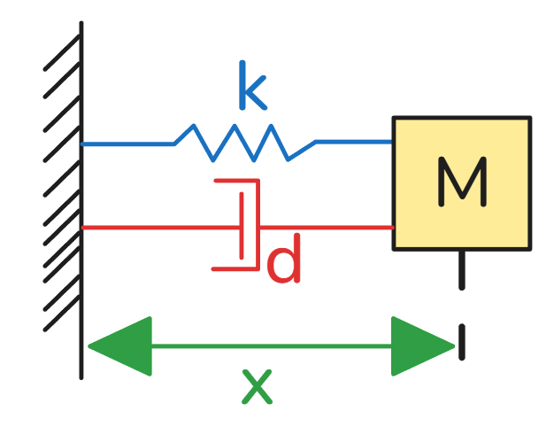

# 12_二阶ODE-弹簧质量阻尼器

[TOC]

## 有阻尼振动（Damped Harmonic Oscillator）

受力分析：$F = ma$，包含弹簧力 $-kx$ 和阻尼力 $-d\dot{x}$：
$$
m\ddot{x} + d\dot{x} + kx = 0
$$

标准化：
$$
\ddot{x} + \underbrace{\frac{d}{m}}_{2\xi} \dot{x} + \underbrace{\frac{k}{m}}_{\omega^2} x = 0 \implies \ddot{x} + 2\xi \dot{x} + \omega^2 x = 0
$$

假设解为 $x(t) = e^{\lambda t}$，代入得特征方程：
$$
\lambda^2 e^{\lambda t} + 2\xi \lambda e^{\lambda t} + \omega^2 e^{\lambda t} = 0
$$

$$
\lambda^2 + 2\xi \lambda + \omega^2 = 0
$$

解得特征根：
$$
\lambda = \frac{ -2\xi \pm \sqrt{4\xi^2 - 4\omega^2} }{2} = -\xi \pm \sqrt{\xi^2 - \omega^2}
$$

通解为：
$$
x(t) = c_1 e^{\lambda_1 t} + c_2 e^{\lambda_2 t}
$$

由初始条件 $x(0) = x_0$ 和 $\dot{x}(0) = v_0$ 确定系数：

- $x(0) = c_1 + c_2 = x_0$
- $\dot{x}(0) = c_1 \lambda_1 + c_2 \lambda_2 = v_0$

---

## 阻尼系统的状态空间表示

引入状态变量：
$$
\begin{cases}
\dot{x} = v \\
\dot{v} = -2\xi v - \omega^2 x
\end{cases}
$$

写成矩阵形式：
$$
\frac{d}{dt} \begin{bmatrix} x \\ v \end{bmatrix} = \begin{bmatrix} 0 & 1 \\ -\omega^2 & -2\xi \end{bmatrix} \begin{bmatrix} x \\ v \end{bmatrix}
$$

特征方程由 $\det(A - \lambda I) = 0$ 得到：
$$
\begin{vmatrix}
-\lambda & 1 \\
-\omega^2 & -2\xi - \lambda
\end{vmatrix} = 0 \implies \lambda^2 + 2\xi \lambda + \omega^2 = 0
$$

数值离散化（欧拉法）：
$$
\mathbf{X}_{n+1} = A \Delta t \cdot \mathbf{X}_n + \mathbf{X}_n
$$

## 二阶线性常系数齐次微分方程示例

### 例1：$\ddot{x} + 3\dot{x} + 2x = 0$

### 特征方程
假设解为 $x(t) = e^{\lambda t}$，代入方程得：
$$
\lambda^2 + 3\lambda + 2 = 0
$$
解得特征根：
$$
\lambda = -1,\ -2
$$

### 通解
$$
x(t) = c_1 e^{-t} + c_2 e^{-2t}
$$

### 初始条件
$x(0) = 2,\ \dot{x}(0) = -3$

代入通解：
- $x(0) = c_1 + c_2 = 2$
- $\dot{x}(0) = -c_1 - 2c_2 = -3$

解得：$c_1 = 1,\ c_2 = 1$

### 特解
$$
x(t) = e^{-t} + e^{-2t}
$$

---

## 例2：$\ddot{x} - 3\dot{x} + 2x = 0$

### 特征方程
$$
\lambda^2 - 3\lambda + 2 = 0
$$
解得特征根：
$$
\lambda = 1,\ 2
$$

### 通解
$$
x(t) = c_1 e^{t} + c_2 e^{2t}
$$

### 初始条件
$x(0) = 2,\ \dot{x}(0) = 3$

代入通解：
- $x(0) = c_1 + c_2 = 2$
- $\dot{x}(0) = c_1 + 2c_2 = 3$

解得：$c_1 = 1,\ c_2 = 1$

### 特解
$$
x(t) = e^{t} + e^{2t}
$$
（注：此解随 $t \to \infty$ 发散）

---

## 例3：$\ddot{x} + \dot{x} - 2x = 0$

### 特征方程
$$
\lambda^2 + \lambda - 2 = 0
$$
解得特征根：
$$
\lambda = 1,\ -2
$$

### 通解
$$
x(t) = c_1 e^{t} + c_2 e^{-2t}
$$

### 初始条件
$x(0) = 2,\ \dot{x}(0) = 0$

代入通解：
- $x(0) = c_1 + c_2 = 2$
- $\dot{x}(0) = c_1 - 2c_2 = 0$

解得：$c_1 = \frac{4}{3},\ c_2 = \frac{2}{3}$

### 特解
$$
x(t) = \frac{4}{3} e^{t} + \frac{2}{3} e^{-2t}
$$

---

## 状态空间表示（以例1为例）

引入状态变量：
$$
\begin{cases}
\dot{x} = v \\
\dot{v} = -2x - 3v
\end{cases}
$$

写成矩阵形式：
$$
\frac{d}{dt} \begin{bmatrix} x \\ v \end{bmatrix} = \begin{bmatrix} 0 & 1 \\ -2 & -3 \end{bmatrix} \begin{bmatrix} x \\ v \end{bmatrix}
$$
矩阵 $A = \begin{bmatrix} 0 & 1 \\ -2 & -3 \end{bmatrix}$ 的特征值为 $\lambda = -1,\ -2$。

