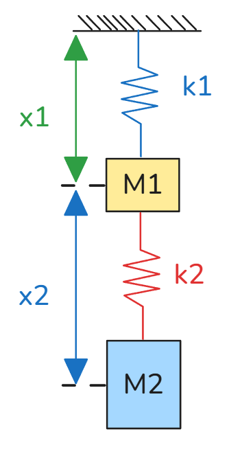

# 14_更高阶ODE

[TOC]

## 高阶线性常系数齐次 ODE

### 一般形式
$$
a_n \frac{d^n x}{dt^n} + a_{n-1} \frac{d^{n-1} x}{dt^{n-1}} + \dots + a_1 \frac{dx}{dt} + a_0 x = 0
$$

### 指数解假设
假设解为 $x(t) = e^{\lambda t}$，代入方程得特征多项式：
$$
(a_n \lambda^n + a_{n-1} \lambda^{n-1} + \dots + a_1 \lambda + a_0)e^{\lambda t} = 0
$$

由于 $e^{\lambda t} > 0$，可约去，得到纯代数方程，特征多方程：
$$
a_n \lambda^n + a_{n-1} \lambda^{n-1} + \dots + a_1 \lambda + a_0 = 0
$$
### 通解形式
若特征方程有 $n$ 个互异根 $\lambda_1, \lambda_2, \dots, \lambda_n$，则通解为：
$$
x(t) = c_1 e^{\lambda_1 t} + c_2 e^{\lambda_2 t} + \dots + c_n e^{\lambda_n t}
$$

### 初始条件与系数确定
由初始条件 $x(0), \dot{x}(0), \dots, x^{(n-1)}(0)$ 确定系数 $c_1, \dots, c_n$：
$$
\begin{cases}
x(0) = c_1 + c_2 + \dots + c_n \\
\dot{x}(0) = c_1 \lambda_1 + c_2 \lambda_2 + \dots + c_n \lambda_n \\
\vdots \\
x^{(n-1)}(0) = c_1 \lambda_1^{n-1} + c_2 \lambda_2^{n-1} + \dots + c_n \lambda_n^{n-1}
\end{cases}
$$

写成矩阵形式：
$$
\begin{bmatrix}
x(0) \\
\dot{x}(0) \\
\vdots \\
x^{(n-1)}(0)
\end{bmatrix}
=
\begin{bmatrix}
1 & 1 & \dots & 1 \\
\lambda_1 & \lambda_2 & \dots & \lambda_n \\
\lambda_1^2 & \lambda_2^2 & \dots & \lambda_n^2 \\
\vdots & \vdots & \ddots & \vdots \\
\lambda_1^{n-1} & \lambda_2^{n-1} & \dots & \lambda_n^{n-1}
\end{bmatrix}
\begin{bmatrix}
c_1 \\
c_2 \\
\vdots \\
c_n
\end{bmatrix}
$$
即 $\mathbf{D} = \mathbf{V} \mathbf{C}$，其中 $\mathbf{V}$ 为范德蒙德矩阵，因此：
$$
\mathbf{C} = \mathbf{V}^{-1} \mathbf{D}
$$

---

## 两自由度耦合振动系统

### 物理模型
两个质量块 $m_1, m_2$ 通过弹簧 $k_1, k_2$ 耦合，受力分析得：
$$
\begin{cases}
m_1 \ddot{x}_1 + k_1 x_1 + k_2 (x_1 - x_2) = 0 \\
m_2 \ddot{x}_2 + k_2 (x_2 - x_1) = 0
\end{cases}
$$

### 状态空间表示
引入状态变量 $\mathbf{X} = [x_1, \dot{x}_1, x_2, \dot{x}_2]^T$，可写成一阶线性系统：
$$
\dot{\mathbf{X}} = A \mathbf{X}
$$
其中 $A$ 为 $4 \times 4$ 矩阵，系统等价于 4 阶 ODE。

### 高阶微分方程形式
也可消元得到单变量高阶方程，例如：
$$
\begin{aligned}
\ddot{x}_2 &= \frac{k_2}{m_2} x_1 + \frac{k_1 + k_2}{m_2} x_2 + \ddot{x}_1 \\
x_2 &= \frac{m_1}{k_2} \ddot{x}_1 + \frac{k_1 + k_2}{k_2} x_1 + \ddot{x}_1
\end{aligned}
$$
代入后可得到关于 $x_1$ 的 4 阶线性常系数齐次微分方程，其特征方程为 4 次多项式，对应 4 个特征根（两对共轭复根，代表两种振动模式）。

## 高阶 ODE 与状态空间对角化

### 高阶 ODE 转一阶状态空间

对于 $n$ 阶线性常系数齐次 ODE：
$$
a_n x^{(n)} + a_{n-1} x^{(n-1)} + \dots + a_1 \dot{x} + a_0 x = 0
$$

定义状态变量：
$$
\begin{cases}
x_1 = x \\
x_2 = \dot{x} = \dot{x}_1 \\
x_3 = \ddot{x} = \dot{x}_2 \\
\vdots \\
x_{n-1} = x^{(n-1)} = \dot{x}_{n-2}\\
x_n = x^{(n)} = \dot{x}_{n-1}
\end{cases}
$$

则
$$
a_n x_{n-1} + a_{n-1} x_{n-2} + \dots + a_1 x_2 + a_0 x_1 = 0
\\
a_n \dot x_{n-2} + a_{n-1} \dot x_{n-3} + \dots + a_1 \dot x_1 + a_0 x_1 = 0
$$
则
$$
\begin{cases}
\dot{x}_1 = x_2  \\
\dot{x}_2= {x}_3 \\
\vdots \\
\dot{x}_{n-1} =  x^{(n)}  \\
\dot x_n = x^{(n+1)}=-a_0x_1-a_1x_2-a_2x_3-...-a_{n-1}x_n 
\end{cases}
$$
则 ODE 可写成一阶线性系统：
$$
\dot{\mathbf{X}} = A \mathbf{X}
$$
其中状态矩阵 $A$ 为**伴随矩阵**（companion matrix）也称 **友矩阵**：
$$
\frac{d}{dt}
\begin{bmatrix}
x_1 \\
x_2 \\
\vdots \\
x_n
\end{bmatrix}
=
\begin{bmatrix}
0 & 1 & 0 & \dots & 0 \\
0 & 0 & 1 & \dots & 0 \\
\vdots & \vdots & \ddots & \ddots & \vdots \\
0 & 0 & 0 & \dots & 1 \\
-a_0 & -a_1 & -a_2 & \dots & -a_{n-1}
\end{bmatrix}
\begin{bmatrix}
x_1 \\
x_2 \\
\vdots \\
x_n
\end{bmatrix}
$$

特征方程由 $\det(A - \lambda I) = 0$ 得到：
$$
\lambda^n + a_{n-1} \lambda^{n-1} + \dots + a_1 \lambda + a_0 = 0
$$
与原高阶 ODE 的特征方程完全一致。

---

### 对角化解耦：$\dot{\mathbf{X}} = A \mathbf{X}$

若矩阵 $A$ 有 $n$ 个线性无关的特征向量，则可对角化：
$$
\exists T: \quad T^{-1} A T = D = \text{diag}(\lambda_1, \lambda_2, \dots, \lambda_n)
$$
其中 $T$ 是由特征向量作为列构成的矩阵，$D$ 是对角矩阵，对角元为特征值。

### 变量代换
令 $\mathbf{X} = T \mathbf{Z}$，代入 $\dot{\mathbf{X}} = A \mathbf{X}$：
$$
T \dot{\mathbf{Z}} = A T \mathbf{Z} \implies \dot{\mathbf{Z}} = T^{-1} A T \mathbf{Z} = D \mathbf{Z}
\\
AT=TD
\\
D= T^{-1} A T
\\
A =T D T^{-1} 
$$

### 解耦方程
解耦后的系统为：
$$
\frac{d}{dt}
\begin{bmatrix}
z_1 \\
z_2 \\
\vdots \\
z_n
\end{bmatrix}
=
\begin{bmatrix}
\lambda_1 & 0 & \dots & 0 \\
0 & \lambda_2 & \dots & 0 \\
\vdots & \vdots & \ddots & \vdots \\
0 & 0 & \dots & \lambda_n
\end{bmatrix}
\begin{bmatrix}
z_1 \\
z_2 \\
\vdots \\
z_n
\end{bmatrix}
$$
即：
$$
\dot{z}_i = \lambda_i z_i \implies z_i(t) = e^{\lambda_i t} z_i(0)
$$

### 原变量解
由 $\mathbf{X}(t) = T \mathbf{Z}(t)$ 可得：
$$
\mathbf{X}(t) = T e^{D t} T^{-1} \mathbf{X}(0)
$$
其中 $e^{D t} = \text{diag}(e^{\lambda_1 t}, e^{\lambda_2 t}, \dots, e^{\lambda_n t})$。

---

### 特征值与模态

- 矩阵 $A$ 的特征值 $\lambda_i$ 对应原系统的**模态**（mode）。
- 每个模态独立演化：$z_i(t) = e^{\lambda_i t} z_i(0)$。
- 若 $\lambda_i$ 为实数，对应指数增长/衰减；若为共轭复数，对应振荡模态。
- 变换矩阵 $T$ 的列是特征向量，代表各模态在原状态空间中的方向。

---

### 核心结论

1.  **高阶 ODE $\iff$ 一阶线性系统**：通过状态空间实现等价转换。
2.  **对角化 = 解耦**：找到特征向量基，将耦合系统分解为独立单模态方程。
3.  **解的结构**：通解是各模态解的线性组合，系数由初始条件确定。

 