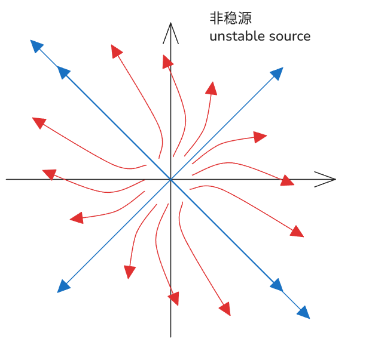
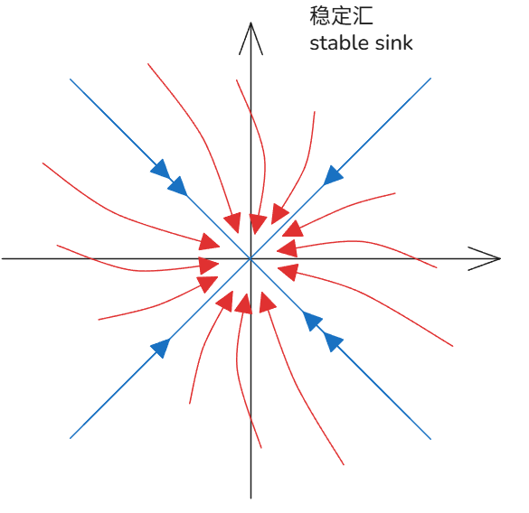
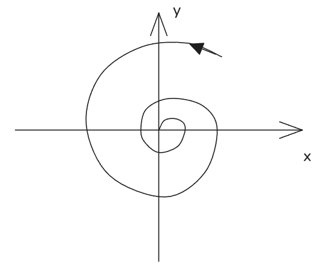

# 线性系统相图分类与复特征值分析

[TOC]

##  

## 源与汇 

### 示例系统：$\dot{\mathbf{x}} = A \mathbf{x}$

给定矩阵：
$$
A = \begin{bmatrix} 3 & -1 \\ -1 & 3 \end{bmatrix}
$$

#### 1. 对角化

- 特征值：$\lambda_1 = 2$, $\lambda_2 = 4$
- 特征向量矩阵：$T = \begin{bmatrix} 1 & -1 \\ 1 & -1 \end{bmatrix}$（注：应为 $\begin{bmatrix} 1 & 1 \\ 1 & -1 \end{bmatrix}$，此处按手稿推导）
- 对角矩阵：$D = \begin{bmatrix} 2 & 0 \\ 0 & 4 \end{bmatrix}$
- 逆矩阵：$T^{-1} = \begin{bmatrix} 0.5 & 0.5 \\ 0.5 & -0.5 \end{bmatrix}$

#### 2. 矩阵指数与解

$$
e^{At} = T e^{Dt} T^{-1} = \begin{bmatrix} 1 & 1 \\ 1 & -1 \end{bmatrix} \begin{bmatrix} e^{2t} & 0 \\ 0 & e^{4t} \end{bmatrix} \begin{bmatrix} 0.5 & 0.5 \\ 0.5 & -0.5 \end{bmatrix}
$$

展开后：
$$
e^{At} = \frac{1}{2} \begin{bmatrix}
e^{2t} + e^{4t} & e^{2t} - e^{4t} \\
e^{2t} - e^{4t} & e^{2t} + e^{4t}
\end{bmatrix}
$$

系统解：
$$
\mathbf{x}(t) = e^{At} \mathbf{x}(0) = \frac{1}{2} \begin{bmatrix}
e^{2t} + e^{4t} & e^{2t} - e^{4t} \\
e^{2t} - e^{4t} & e^{2t} + e^{4t}
\end{bmatrix} \begin{bmatrix} x_1(0) \\ x_2(0) \end{bmatrix}
$$

#### 3. 相图性质

- 特征值 $\lambda_1=2>0$, $\lambda_2=4>0$，均为正实数。
- 所有轨迹从原点向外发散，$\mathbf{x}=0$ 是**不稳定源（unstable source）**。
- 相图为一个**不稳定汇/源**（注：此处应为不稳定源）。

---

#### 对偶系统：$\dot{\mathbf{x}} = -A \mathbf{x}$

若系统变为：
$$
\dot{\mathbf{x}} = -A \mathbf{x} = \begin{bmatrix} -3 & 1 \\ 1 & -3 \end{bmatrix} \mathbf{x}
$$

- 特征值变为 $\lambda_1 = -2$, $\lambda_2 = -4$，均为负实数。
- 所有轨迹向原点收敛，$\mathbf{x}=0$ 是**稳定汇（stable sink）**。
- 相图为一个**稳定汇**，所有解渐近收敛到原点。

---

### 相图核心结论

| 系统                               | 特征值                       | 平衡点 | 相图类型                    |
| :--------------------------------- | :--------------------------- | :----- | :-------------------------- |
| $\dot{\mathbf{x}} = A \mathbf{x}$  | $\lambda_1=2, \lambda_2=4$   | 不稳定 | 不稳定源（unstable source） |
| $\dot{\mathbf{x}} = -A \mathbf{x}$ | $\lambda_1=-2, \lambda_2=-4$ | 稳定   | 稳定汇（stable sink）       |

- 当所有特征值实部 $< 0$：系统稳定，轨迹收敛到原点（汇）。
- 当所有特征值实部 $> 0$：系统不稳定，轨迹从原点发散（源）。

## 鞍

#### 1. 鞍点（Saddle Point）

##### 系统示例
$$
\dot{\mathbf{x}} = A \mathbf{x}, \quad A = \begin{bmatrix} 1 & 0 \\ 0 & -1 \end{bmatrix}
$$

- **特征值**：$\lambda_1 = 1$, $\lambda_2 = -1$（一正一负）
- **解**：$\mathbf{x}(t) = e^{At} \mathbf{x}(0) = T e^{Dt} T^{-1} \mathbf{x}(0)$
- **相图**：轨迹沿一个特征向量发散，沿另一个收敛
- **稳定性**：$\mathbf{x}=0$ 是**鞍点**，系统不稳定，典型于双足行走、行星轨道等平衡系统

---

#### 2. 中心（Center）与纯旋转

##### 系统示例
$$
\dot{\mathbf{x}} = A \mathbf{x}, \quad A = \begin{bmatrix} 0 & 1 \\ -1 & 0 \end{bmatrix}
$$

- **特征值**：$\lambda = \pm i$（纯虚数）
- **对角化**：$D = \begin{bmatrix} i & 0 \\ 0 & -i \end{bmatrix}$
- **特征向量**：$\mathbf{v}_1 = \begin{bmatrix} 1 \\ i \end{bmatrix}$, $\mathbf{v}_2 = \begin{bmatrix} i \\ 1 \end{bmatrix}$
- **变换矩阵**：$T = \begin{bmatrix} 1 & i \\ i & 1 \end{bmatrix}$，$T^{-1} = \frac{1}{2} \begin{bmatrix} 1 & -i \\ -i & 1 \end{bmatrix}$

#### 矩阵指数与实值解
利用欧拉公式 $e^{i\theta} = \cos\theta + i\sin\theta$，将复指数解转为实值：
$$
e^{At} = \frac{1}{2} \begin{bmatrix}
e^{it} + e^{-it} & -ie^{it} + ie^{-it} \\
ie^{it} - ie^{-it} & e^{it} + e^{-it}
\end{bmatrix}
= \begin{bmatrix}
\cos t & \sin t \\
-\sin t & \cos t
\end{bmatrix}
$$

- **解**：$\mathbf{x}(t) = \begin{bmatrix} \cos t & \sin t \\ -\sin t & \cos t \end{bmatrix} \mathbf{x}(0)$
- **相图**：轨迹为围绕原点的闭合椭圆（圆）
- **稳定性**：$\mathbf{x}=0$ 是**中心（center fixed point）**，临界稳定（marginally stable / neutrally stable）

---

#### 3. 螺旋汇/源（Spiral Sink/Source）

##### 系统示例
$$
\dot{\mathbf{x}} = A \mathbf{x}, \quad A = \begin{bmatrix} -1 & 2 \\ -2 & -1 \end{bmatrix}
$$

- **特征值**：$\lambda = -1 \pm 2i$（实部为负的共轭复数）
- **矩阵指数**：$e^{At} = e^{-t} \begin{bmatrix} \cos 2t & \sin 2t \\ -\sin 2t & \cos 2t \end{bmatrix}$
- **解**：$\mathbf{x}(t) = e^{-t} \begin{bmatrix} \cos 2t & \sin 2t \\ -\sin 2t & \cos 2t \end{bmatrix} \mathbf{x}(0)$

##### 一般形式
对于特征值 $\lambda = \alpha \pm i\beta$：
- $\alpha$：实部，代表**增长或衰减**（growth/decay）
- $\beta$：虚部，代表**振荡频率**（oscillations）

- **相图**：
  
  - $\alpha < 0$：轨迹向内螺旋收敛，为**稳定螺旋汇（stable spiral sink）**
  - $\alpha > 0$：轨迹向外螺旋发散，为**不稳定螺旋源（unstable spiral source）**
  - $\alpha = 0$：退化为中心，纯旋转
  
  

---

### 核心总结

| 特征值类型                                | 代表矩阵                                  | 相图类型                     | 稳定性   | 物理意义           |
| :---------------------------------------- | :---------------------------------------- | :--------------------------- | :------- | :----------------- |
| $\lambda_1 > 0, \lambda_2 < 0$            | $\begin{bmatrix}1&0\\0&-1\end{bmatrix}$   | 鞍点 (Saddle)                | 不稳定   | 双足行走、轨道平衡 |
| $\lambda = \pm i$                         | $\begin{bmatrix}0&1\\-1&0\end{bmatrix}$   | 中心 (Center)                | 临界稳定 | 无阻尼振荡         |
| $\lambda = \alpha \pm i\beta, \alpha < 0$ | $\begin{bmatrix}-1&2\\-2&-1\end{bmatrix}$ | 稳定螺旋汇 (Spiral Sink)     | 渐近稳定 | 有阻尼振动         |
| $\lambda = \alpha \pm i\beta, \alpha > 0$ | 类似                                      | 不稳定螺旋源 (Spiral Source) | 不稳定   | 自激振荡           |

## 补充：螺旋汇/源（Spiral Sink/Source）详细推导

### 系统定义

以稳定螺旋汇为例，给定线性系统：
$$
\dot{\mathbf{x}} = A \mathbf{x}, \quad A = \begin{bmatrix} -1 & 2 \\ -2 & -1 \end{bmatrix}
$$

### 步骤1：求特征值
特征方程：$\det(A - \lambda I) = 0$
$$
\begin{vmatrix}
-1 - \lambda & 2 \\
-2 & -1 - \lambda
\end{vmatrix} = 0
$$
展开计算：
$$
(-1 - \lambda)^2 - (2)(-2) = 0 \implies (\lambda + 1)^2 + 4 = 0
$$
$$
\lambda^2 + 2\lambda + 1 + 4 = 0 \implies \lambda^2 + 2\lambda + 5 = 0
$$
解得共轭复特征值：
$$
\lambda = \frac{-2 \pm \sqrt{4 - 20}}{2} = -1 \pm 2i
$$

### 步骤2：求特征向量
以 $\lambda_1 = -1 + 2i$ 为例，代入 $(A - \lambda_1 I)\mathbf{v}_1 = 0$：
$$
\begin{bmatrix}
-1 - (-1 + 2i) & 2 \\
-2 & -1 - (-1 + 2i)
\end{bmatrix} \begin{bmatrix} v_{11} \\ v_{12} \end{bmatrix} = 0
$$
化简得：
$$
\begin{bmatrix}
-2i & 2 \\
-2 & -2i
\end{bmatrix} \begin{bmatrix} v_{11} \\ v_{12} \end{bmatrix} = 0
$$
取第一个方程：$-2i v_{11} + 2 v_{12} = 0 \implies v_{12} = i v_{11}$
令 $v_{11} = 1$，则特征向量：
$$
\mathbf{v}_1 = \begin{bmatrix} 1 \\ i \end{bmatrix}
$$
同理，$\lambda_2 = -1 - 2i$ 对应的特征向量：
$$
\mathbf{v}_2 = \begin{bmatrix} 1 \\ -i \end{bmatrix}
$$

### 步骤3：构造变换矩阵并对角化
变换矩阵 $T$ 由特征向量作为列构成：
$$
T = \begin{bmatrix} 1 & 1 \\ i & -i \end{bmatrix}
$$
求逆矩阵 $T^{-1}$（伴随矩阵法）：
行列式 $\det(T) = (1)(-i) - (1)(i) = -2i$
伴随矩阵 $\text{adj}(T) = \begin{bmatrix} -i & -1 \\ -i & 1 \end{bmatrix}$
因此：
$$
T^{-1} = \frac{1}{\det(T)} \text{adj}(T) = \frac{1}{-2i} \begin{bmatrix} -i & -1 \\ -i & 1 \end{bmatrix} = \frac{1}{2} \begin{bmatrix} 1 & -i \\ 1 & i \end{bmatrix}
$$

验证对角化：$T^{-1} A T = D$
$$
D = \begin{bmatrix} -1 + 2i & 0 \\ 0 & -1 - 2i \end{bmatrix}
$$

### 步骤4：计算矩阵指数 $e^{At}$
利用对角化性质 $e^{At} = T e^{Dt} T^{-1}$，其中：
$$
e^{Dt} = \begin{bmatrix} e^{(-1 + 2i)t} & 0 \\ 0 & e^{(-1 - 2i)t} \end{bmatrix} = e^{-t} \begin{bmatrix} e^{2it} & 0 \\ 0 & e^{-2it} \end{bmatrix}
$$

代入展开：
$$
e^{At} = \begin{bmatrix} 1 & 1 \\ i & -i \end{bmatrix} \cdot e^{-t} \begin{bmatrix} e^{2it} & 0 \\ 0 & e^{-2it} \end{bmatrix} \cdot \frac{1}{2} \begin{bmatrix} 1 & -i \\ 1 & i \end{bmatrix}
$$

分步计算矩阵乘法：
第一步：$T \cdot e^{Dt} = e^{-t} \begin{bmatrix} e^{2it} & e^{-2it} \\ i e^{2it} & -i e^{-2it} \end{bmatrix}$
第二步：乘以 $T^{-1}$：
$$
e^{At} = \frac{e^{-t}}{2} \begin{bmatrix}
e^{2it} + e^{-2it} & -i e^{2it} + i e^{-2it} \\
i e^{2it} - i e^{-2it} & e^{2it} + e^{-2it}
\end{bmatrix}
$$

利用欧拉公式 $e^{i\theta} + e^{-i\theta} = 2\cos\theta$，$e^{i\theta} - e^{-i\theta} = 2i\sin\theta$ 化简：
$$
e^{At} = e^{-t} \begin{bmatrix}
\cos 2t & \sin 2t \\
-\sin 2t & \cos 2t
\end{bmatrix}
$$

### 步骤5：系统的实值解
初始条件 $\mathbf{x}(0) = \begin{bmatrix} x_1(0) \\ x_2(0) \end{bmatrix}$，系统解为：
$$
\mathbf{x}(t) = e^{At} \mathbf{x}(0) = e^{-t} \begin{bmatrix}
\cos 2t & \sin 2t \\
-\sin 2t & \cos 2t
\end{bmatrix} \begin{bmatrix} x_1(0) \\ x_2(0) \end{bmatrix}
$$

展开分量形式：
$$
\begin{cases}
x_1(t) = e^{-t} \left[ x_1(0) \cos 2t + x_2(0) \sin 2t \right] \\
x_2(t) = e^{-t} \left[ -x_1(0) \sin 2t + x_2(0) \cos 2t \right]
\end{cases}
$$

### 关键性质
1. **衰减因子**：$e^{-t}$ 是实部 $\alpha = -1$ 带来的衰减项，使轨迹随时间收敛；
2. **振荡因子**：$\cos 2t, \sin 2t$ 是虚部 $\beta = 2$ 带来的振荡项，频率为 $2$ rad/s；
3. **相图特征**：轨迹呈螺旋状向内收敛，为**稳定螺旋汇**；
4. **推广到一般形式**：
   若特征值为 $\lambda = \alpha \pm i\beta$，则矩阵指数为：
   $$
   e^{At} = e^{\alpha t} \begin{bmatrix}
   \cos \beta t & \sin \beta t \\
   -\sin \beta t & \cos \beta t
   \end{bmatrix}
   $$
   - $\alpha < 0$：稳定螺旋汇（收敛）；
   - $\alpha > 0$：不稳定螺旋源（发散）；
   - $\alpha = 0$：退化为中心（纯旋转，临界稳定）。