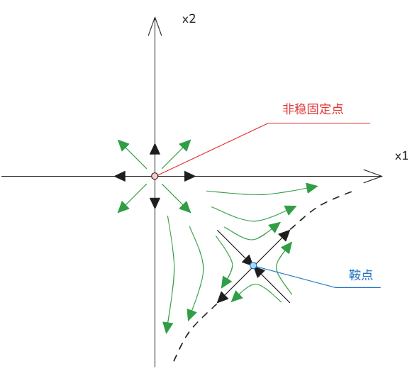

# 22_非线性系统固定点线性分析

[TOC]

##  任务

从 $\dot{x} = f(x)$ 线性化得到 $\dot{x} = Ax$。

---

## 1. 固定点定义

对于系统
$$
\dot{x} = f(x)
$$
若 $f(\bar{x}) = 0$，则 $\bar{x}$ 为**固定点**（fixed point）。

在固定点附近，令
$$
x = \bar{x} + \delta x,\quad \delta x = x - \bar{x}
$$
则有：
$$
\dot{x} = f(x) = f(\bar{x} + \delta x)
$$

---

## 2. 泰勒展开与线性化

对 $f(\bar{x} + \delta x)$ 在 $\bar{x}$ 处做泰勒展开：
$$
f(\bar{x} + \delta x) = f(\bar{x}) + \frac{Df}{Dx}(\bar{x}) \cdot \delta x + \frac{D^2 f}{Dx^2}(\bar{x}) \cdot \delta x^2 + \cdots + O(\delta x^3)
$$
其中 $x$ 为向量：
$$
x = \begin{bmatrix}
x_1 \\
x_2 \\
\vdots \\
x_n
\end{bmatrix}, \quad
\frac{d}{dt}\begin{bmatrix}
x_1 \\
x_2 \\
\vdots \\
x_n
\end{bmatrix}
=
\begin{bmatrix}
f_1(x_1,x_2,\dots) \\
f_2(x_1,x_2,\dots) \\
\vdots \\
f_n(x_1,x_2,\dots)
\end{bmatrix}
$$

由于 $f(\bar{x}) = 0$，且忽略高阶小项 $O(\delta x^2)$，得到：
$$
\dot{\tilde{x}} = \frac{d}{dt}(\bar{x} + \delta x) = \frac{d}{dt}\delta x \approx \frac{Df}{Dx}(\bar{x}) \cdot \delta x
$$
其中 $\bar{x}$ 为常数，因此得到关于 $\delta x$ 的线性 ODE。

---

## 3. 雅可比矩阵（Jacobian Matrix）

雅可比矩阵定义为：
$$
\frac{Df}{Dx} =
\begin{bmatrix}
\frac{\partial f_1}{\partial x_1} & \frac{\partial f_1}{\partial x_2} & \frac{\partial f_1}{\partial x_3} & \dots & \frac{\partial f_1}{\partial x_n} \\
\frac{\partial f_2}{\partial x_1} & \frac{\partial f_2}{\partial x_2} & \frac{\partial f_2}{\partial x_3} & \dots & \frac{\partial f_2}{\partial x_n} \\
\vdots & \vdots & \vdots & \ddots & \vdots \\
\frac{\partial f_n}{\partial x_1} & \frac{\partial f_n}{\partial x_2} & \frac{\partial f_n}{\partial x_3} & \dots & \frac{\partial f_n}{\partial x_n}
\end{bmatrix}
$$

---

## 4. 示例：二维系统

考虑系统：
$$
\dot{x} = f(x) =
\begin{bmatrix}
f_1(x_1,x_2) \\
f_2(x_1,x_2)
\end{bmatrix}
=
\begin{bmatrix}
x_1 - x_1^2 \\
x_1 + x_2
\end{bmatrix}
$$

### 4.1 求固定点

令 $f(x) = 0$：
$$
\begin{cases}
x_1 - x_1^2 = 0 \\
x_1 + x_2 = 0
\end{cases}
$$
解得两个固定点：
$$
x_1 = \begin{bmatrix} 0 \\ 0 \end{bmatrix}, \quad x_2 = \begin{bmatrix} 1 \\ -1 \end{bmatrix}
$$

### 4.2 计算雅可比矩阵

$$
\frac{Df}{Dx} =
\begin{bmatrix}
\frac{\partial f_1}{\partial x_1} & \frac{\partial f_1}{\partial x_2} \\
\frac{\partial f_2}{\partial x_1} & \frac{\partial f_2}{\partial x_2}
\end{bmatrix}
=
\begin{bmatrix}
1 - 2x_1 & 0 \\
1 & 1
\end{bmatrix}
$$

### 4.3 在固定点处线性化

1.  **固定点 $\bar{x}_1 = \begin{bmatrix} 0 \\ 0 \end{bmatrix}$**：
    $$
    \frac{Df}{Dx}(\bar{x}_1) =
    \begin{bmatrix}
    1 & 0 \\
    1 & 1
    \end{bmatrix}
    $$
    特征值 $\lambda = 1, 1$，为**不稳定结点**（unstable node）。

2.  **固定点 $\bar{x}_2 = \begin{bmatrix} 1 \\ -1 \end{bmatrix}$**：
    $$
    \frac{Df}{Dx}(\bar{x}_2) =
    \begin{bmatrix}
    -1 & 0 \\
    1 & 1
    \end{bmatrix}
    $$
    特征值 $\lambda = \pm 1$，为**鞍点**（saddle point）。

---

## 5. 相图示意

-   稳定焦点（stable focus）：轨迹向固定点收敛。
-   鞍点（saddle point）：存在稳定和不稳定流形。
-   不稳定结点（unstable node）：轨迹远离固定点。

可见分析几个固定点的稳定性可以大致得出区间附近的走势；