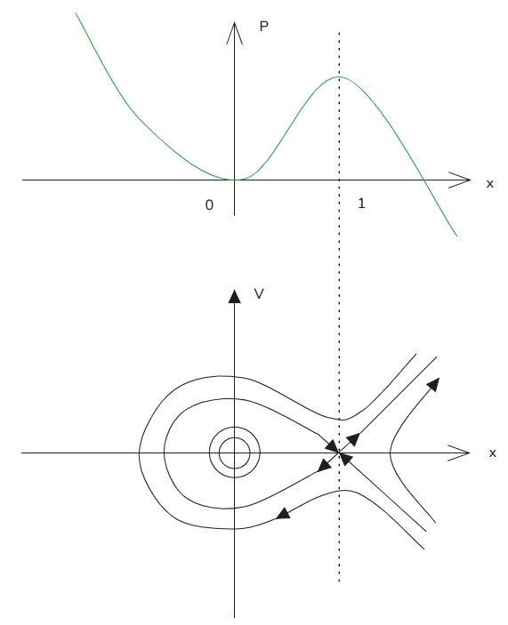
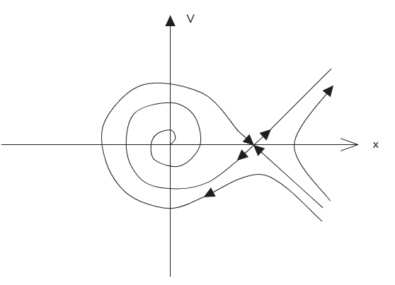
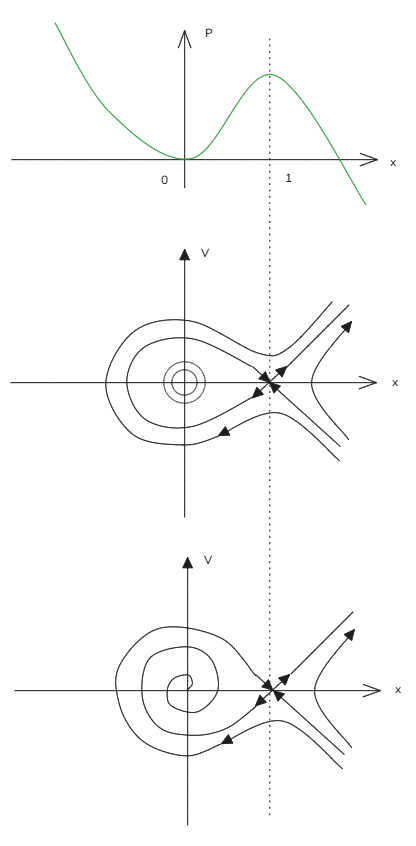
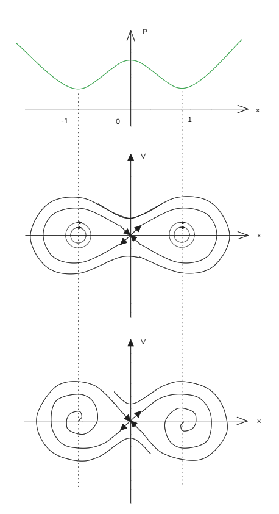

# 23_势阱中的粒子（Particle in a Potential Well）

[TOC]

 

考虑一个势函数 $V(x)$，想象小球在势阱上滚动（越陡，加速度越大）。

力的表达式为：
$$
F = -\frac{dV}{dx}
$$
牛顿第二定律：
$$
\ddot{x} = -\frac{\partial V}{\partial x}
$$

---

## 拉格朗日力学（Lagrangian Mechanics）

定义动能 $T$ 和势能 $V$：
- 动能：$T = \frac{1}{2}\dot{x}^2$
- 势能：$V(x)$

拉格朗日量 $L$ 定义为：
$$
L(x,\dot{x}) = T(\dot{x}) - V(x) = \frac{1}{2}\dot{x}^2 - V(x)
$$
通过 $E-L$ 方程可导出一维二阶微分方程（Euler–Lagrange 方程）。

欧拉-拉格朗日方程（一般形式）：
$$
\boxed{\frac{d}{dt} \frac{\partial L}{\partial \dot{x}} - \frac{\partial L}{\partial x} = 0}
$$
这是最小作用量原理的更通用表达。

代入 $L = \frac{1}{2}\dot{x}^2 - V(x)$：
$$
\frac{\partial L}{\partial \dot{x}} = \dot{x} \implies \frac{d}{dt} \frac{\partial L}{\partial \dot{x}} = \ddot{x}
$$
$$
\frac{\partial L}{\partial x} = -\frac{dV}{dx}
$$
因此：
$$
\ddot{x} + \frac{\partial V}{\partial x} = 0 \implies \ddot{x} = -\frac{\partial V}{\partial x}
$$
与牛顿第二定律一致。

---

## 示例：单摆（Pendulum）

- 动能：$T = \frac{1}{2}mL^2\dot{\theta}^2$
- 势能：$V = -mgL\cos(\theta)$

拉格朗日量：
$$
L = T(\dot{\theta}) - V(\theta) = \frac{1}{2}mL^2\dot{\theta}^2 + mgL\cos(\theta)
$$

应用欧拉-拉格朗日方程：
$$
\frac{\partial L}{\partial \dot{\theta}} = mL^2\dot{\theta} \implies \frac{d}{dt} \frac{\partial L}{\partial \dot{\theta}} = mL^2\ddot{\theta}
$$
$$
\frac{\partial L}{\partial \theta} = -mgL\sin(\theta)
$$

代入方程：
$$
mL^2\ddot{\theta} + mgL\sin(\theta) = 0
$$
化简得：
$$
mL^2\ddot{\theta} = -mgL\sin(\theta) \implies L^2\ddot{\theta} = -gL\sin(\theta)
$$
即：
$$
\ddot{\theta} = -\frac{g}{L}\sin(\theta)
$$
 

## 保守力场下的运动方程

由势能 \( $V(x) = \frac{x^2}{2} - \frac{x^3}{3}$ \)，可得运动方程：
$$
\ddot{x} = -\frac{\partial V}{\partial x} = -x + x^2
$$
将其化为一阶方程组：
$$
\begin{cases}
\dot{x} = v \\
\dot{v} = -x + x^2
\end{cases}
$$

### 不动点求解
令 \(\dot{x}=0, \dot{v}=0\)，解得不动点：
$$
(x, v) = \begin{bmatrix} 0 \\ 0 \end{bmatrix}, \quad \begin{bmatrix} 1 \\ 0 \end{bmatrix}
$$

### 局部线性化
雅可比矩阵：
$$
\frac{Df}{Dx} = \begin{bmatrix}
0 & 1 \\
-1 + 2x & 0
\end{bmatrix}
$$

- 在 \($\begin{bmatrix} 0 \\ 0 \end{bmatrix}$\) 处：
$$
\frac{Df}{Dx}\left(\begin{bmatrix} 0 \\ 0 \end{bmatrix}\right) = \begin{bmatrix}
0 & 1 \\
-1 & 0
\end{bmatrix}
$$
特征值 \($\lambda = \pm i$\)，对应**线性中心**。

- 在 \($\begin{bmatrix} 1 \\ 0 \end{bmatrix}$\) 处：
$$
\frac{Df}{Dx}\left(\begin{bmatrix} 1 \\ 0 \end{bmatrix}\right) = \begin{bmatrix}
0 & 1 \\
1 & 0
\end{bmatrix}
$$
特征值 \($\lambda = \pm 1$\)，对应**鞍点**，特征向量 \($\xi_1 = \begin{bmatrix} 1 \\ 1 \end{bmatrix}, \xi_2 = \begin{bmatrix} 1 \\ -1 \end{bmatrix}$\)。

---

## 含阻尼项的修正方程（作业）

$$
\begin{cases}
\dot{x} = v \\
\dot{v} = -x + x^2 - v
\end{cases}
$$

### 不动点求解
令 $\dot{x}=0, \dot{v}=0$ ，解得不动点：
$$
(x, v) = \begin{bmatrix} 0 \\ 0 \end{bmatrix}, \quad \begin{bmatrix} 1 \\ 0 \end{bmatrix}
$$

### 局部线性化
雅可比矩阵：
$$
\frac{Df}{Dx} = \begin{bmatrix}
0 & 1 \\
-1 + 2x & -1
\end{bmatrix}
$$

- 在 \($\begin{bmatrix} 0 \\ 0 \end{bmatrix}$\) 处：
$$
\frac{Df}{Dx}\left(\begin{bmatrix} 0 \\ 0 \end{bmatrix}\right) = \begin{bmatrix}
0 & 1 \\
-1 & -1
\end{bmatrix}
$$
特征值 \($\lambda = -0.5 \pm 0.866j$\)，对应**稳定螺旋（螺旋汇）**。

- 在 \($\begin{bmatrix} 1 \\ 0 \end{bmatrix}$\) 处：
$$
\frac{Df}{Dx}\left(\begin{bmatrix} 1 \\ 0 \end{bmatrix}\right) = \begin{bmatrix}
0 & 1 \\
1 & -1
\end{bmatrix}
$$
特征值 \($\lambda = 0.618, -1.618$\)，对应**鞍点**。

> 注：右侧相图显示，阻尼项的引入将原点处的线性中心转变为稳定螺旋汇，而 \($(1,0)$\) 处仍为鞍点，整体相图呈现“螺旋汇 + 鞍点”的典型结构。

# 粒子在双势阱中的运动

## 1. 保守力场下的运动方程

由势能 \( $ V(x) = \frac{1}{4}x^4 - \frac{1}{2}x^2$ \)，可得牛顿第二定律形式：
$$
\ddot{x} = -\frac{\partial V}{\partial x} = x - x^3 - \dot{x} \quad (\text{open-free})
$$
将其化为一阶方程组：
$$
\begin{cases}
\dot{x} = v \\
\dot{v} = x - x^3 - v
\end{cases}
$$

### 不动点求解
令 \($\dot{x}=0, \dot{v}=0$\)，解得不动点：
$$
(x, v) = \begin{bmatrix} -1 \\ 0 \end{bmatrix}, \quad \begin{bmatrix} 0 \\ 0 \end{bmatrix}, \quad \begin{bmatrix} 1 \\ 0 \end{bmatrix}
$$

### 局部线性化
雅可比矩阵：
$$
\frac{Df}{Dx} = \begin{bmatrix}
0 & 1 \\
1 - 3x^2 & -1
\end{bmatrix}
$$

- 在 \($\begin{bmatrix} 0 \\ 0 \end{bmatrix}$\) 处：
$$
\frac{Df}{Dx}\left(\begin{bmatrix} 0 \\ 0 \end{bmatrix}\right) = \begin{bmatrix}
0 & 1 \\
1 & -1
\end{bmatrix}
$$
特征值 \($\lambda \approx 0.618, -1.618$\)，对应**鞍点 (saddle)**。

- 在 \($\begin{bmatrix} 1 \\ 0 \end{bmatrix}$\) 处：
$$
\frac{Df}{Dx}\left(\begin{bmatrix} 1 \\ 0 \end{bmatrix}\right) = \begin{bmatrix}
0 & 1 \\
-2 & -1
\end{bmatrix}
$$
特征值 \($\lambda = -0.5 \pm \frac{\sqrt{7}}{2}i$\)，对应**稳定螺旋 (spiral sink)**。

- 在 \($\begin{bmatrix} -1 \\ 0 \end{bmatrix}$\) 处：
$$
\frac{Df}{Dx}\left(\begin{bmatrix} -1 \\ 0 \end{bmatrix}\right) = \begin{bmatrix}
0 & 1 \\
-2 & -1
\end{bmatrix}
$$
特征值 \($\lambda = -0.5 \pm \frac{\sqrt{7}}{2}i$\)，对应**稳定螺旋 (spiral sink)**。

---

## 2. 相图结构说明

- **无摩擦 (no friction)**：相图呈现双势阱结构，原点$(0,0)$为鞍点，$(\pm 1, 0)$为中心，轨道为闭合的椭圆。
- **有摩擦 (has friction)**：阻尼项将中心转变为稳定螺旋汇，鞍点$(0,0)$保持不变，整体相图呈现“双螺旋汇 + 鞍点”的典型结构。

