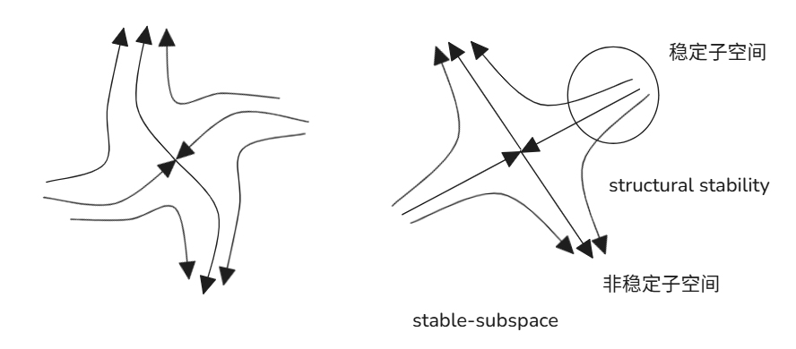

# Hartman-Grobman 定理与中心流形示例

## 1. Hartman-Grobman 定理

对于非线性系统
$$
\dot{x} = f(x)
$$
在不动点 $\vec {x}$ 处，其局部线性化方程为
$$
\dot{x} = A x, \quad A = \frac{Df}{Dx}(\vec{x})
$$

**Hartman-Grobman 定理**：
若矩阵 $ A $  的所有特征值 $\lambda$都具有非零实部（即 $ \text{Re}(\lambda) \neq 0$，则称该不动点为**双曲不动点 (hyperbolic fixed point)**。此时，非线性系统在不动点附近的拓扑结构与其线性化系统
$$
\dot{x} = Ax
$$
完全等价，即双曲不动点不会因小扰动而改变系统的局部拓扑结构。

- **稳定子空间 (stable subspace)**：由所有满足 $\text{Re}(\lambda) < 0$的特征值对应的特征向量张成。
- **不稳定子空间 (unstable subspace)**：由所有满足 $\text{Re}(\lambda) > 0$ 的特征值对应的特征向量张成。

---

## 2. 中心流形示例

考虑系统：
$$
\begin{cases}
\dot{x} = x \\
\dot{y} = -y + x^2
\end{cases}
$$

假设中心流形可表示为 $$y = \varphi(x)$$，直接微分：
$$
\dot{y} = \varphi'(x) \dot{x} = \varphi'(x) x
$$
同时，由代入系统方程有：
$$
\dot{y} = -y + x^2 = -\varphi(x) + x^2
$$
联立得：
$$
\varphi'(x) x + \varphi(x) - x^2 = 0
$$

假设 $$\varphi(x)$$ 可展开为幂级数：
$$
\varphi(x) = c_0 + c_1 x + c_2 x^2 + \cdots
$$
代入方程求解，可得：
$$
\varphi(x) = \frac{1}{2} x^2
$$
