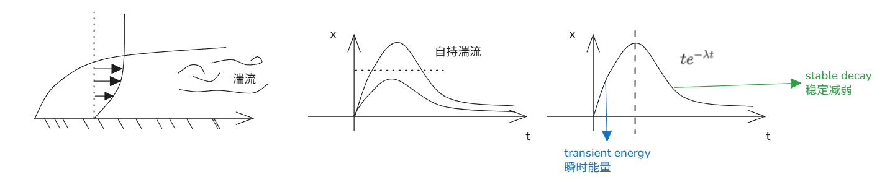
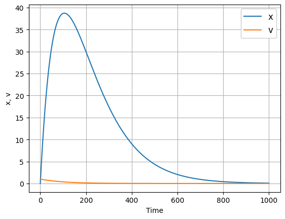

# 非线性瞬态特征

[TOC]



#  非正规系统 (Non-normal systems)

对于系统 $\dot{x} = Ax$，当矩阵 $A$ 不满足正规性条件，即 $A^T A \neq AA^T$ 时，系统表现出非正规特性。

### 示例 1：二维非正规矩阵
考虑矩阵：
$$
A = \begin{bmatrix} -0.009 & 1 \\ 0 & -0.09 \end{bmatrix}
$$
其特征值为 $\lambda_1 = -0.009$，$\lambda_2 = -0.09$。

求解特征向量：
- 对于 $\lambda_1 = -0.009$，由 $(A - \lambda I)\xi = 0$ 可得 $\xi_1 = \begin{bmatrix} 1 \\ -0.001 \end{bmatrix}$
- 对于 $\lambda_2 = -0.09$，可得 $\xi_2 = \begin{bmatrix} 1 \\ 0 \end{bmatrix}$

### 示例 2：约当块 (Jordan block)
考虑约当块矩阵：
$$
A = \begin{bmatrix} \lambda & 1 \\ 0 & \lambda \end{bmatrix}
$$
其矩阵指数为：
$$
e^{At} = \begin{bmatrix} e^{\lambda t} & t e^{\lambda t} \\ 0 & e^{\lambda t} \end{bmatrix}
$$

**证明思路**：
将矩阵 $A$ 分解为 $A = S + T$，其中 $S = \begin{bmatrix} \lambda & 0 \\ 0 & \lambda \end{bmatrix}$，$T = \begin{bmatrix} 0 & 1 \\ 0 & 0 \end{bmatrix}$。
由于 $ST = TS$，满足矩阵指数可交换条件 $e^{(S+T)t} = e^{St} e^{Tt}$。

- $e^{St} = \begin{bmatrix} e^{\lambda t} & 0 \\ 0 & e^{\lambda t} \end{bmatrix}$
- $e^{Tt} = I + Tt + \frac{T^2 t^2}{2!} + \dots = \begin{bmatrix} 1 & t \\ 0 & 1 \end{bmatrix}$（因 $T^2 = 0$，高阶项为0）

因此：
$$
e^{At} = e^{St} e^{Tt} = \begin{bmatrix} e^{\lambda t} & 0 \\ 0 & e^{\lambda t} \end{bmatrix} \begin{bmatrix} 1 & t \\ 0 & 1 \end{bmatrix} = \begin{bmatrix} e^{\lambda t} & t e^{\lambda t} \\ 0 & e^{\lambda t} \end{bmatrix}
$$

---

## 矩阵指数的核心性质
- 核心条件：若 $ST = TS$，则 $e^{(S+T)t} = e^{St} e^{Tt}$（非交换时该等式不成立）。
- 证明依据：二项式定理推广
  $$
  (S+T)^n = \sum_{j+k=n} \frac{n!}{j! k!} S^j T^k
  $$
  仅当 $ST=TS$ 时，上述展开式对矩阵运算有效。

---

## 正规矩阵 (Normal matrices)
定义：若矩阵 $A$ 满足 $A^T A = AA^T = D$（$D$ 为对角矩阵），则称 $A$ 为正规矩阵。正规矩阵可通过正交变换实现对角化。

### 示例：二维正规矩阵
$$
A = \begin{bmatrix} 0 & -1 \\ 1 & 0 \end{bmatrix}
$$
验证正规性：
$$
A^T A = \begin{bmatrix} 0 & 1 \\ -1 & 0 \end{bmatrix} \begin{bmatrix} 0 & -1 \\ 1 & 0 \end{bmatrix} = \begin{bmatrix} 1 & 0 \\ 0 & 1 \end{bmatrix} = I
$$
$$
AA^T = \begin{bmatrix} 0 & -1 \\ 1 & 0 \end{bmatrix} \begin{bmatrix} 0 & 1 \\ -1 & 0 \end{bmatrix} = \begin{bmatrix} 1 & 0 \\ 0 & 1 \end{bmatrix} = I
$$
其特征值为 $\lambda_1 = i$，$\lambda_2 = -i$，对应的特征向量为：
$\xi_1 = \begin{bmatrix} 1 \\ i \end{bmatrix}$，$\xi_2 = \begin{bmatrix} 1 \\ -i \end{bmatrix}$。

---

## 约当标准型 (Jordan Canonical Form)
当矩阵 $A$ 的**几何重数 < 代数重数**时，无法对角化，其相似标准型为约当标准型。

### 三种典型情况
**Case I：完全对角化**
$T^{-1}AT = D$，其中 $D = \text{diag}(\lambda_1, \lambda_2, \dots, \lambda_n)$。
此时 $A = PDP^{-1}$，矩阵可完全对角化。

**Case II：复特征值参数化**
若特征值为共轭复根 $\lambda_1 = a+ib$，$\lambda_2 = a-ib$，则存在变换：
$$
T^{-1}AT = \begin{bmatrix} a & b \\ -b & a \end{bmatrix}
$$
对应的矩阵指数：
$$
e^{At} = e^{at} \begin{bmatrix} \cos(bt) & \sin(bt) \\ -\sin(bt) & \cos(bt) \end{bmatrix}
$$

**Case III：重特征值（几何重数不足）**
以三维重特征值 $\lambda$ 为例，按秩分类：
1.  $\begin{bmatrix} \lambda & 1 & 0 \\ 0 & \lambda & 1 \\ 0 & 0 & \lambda \end{bmatrix}$，$\text{rank}(A - \lambda I) = 2$
2.  $\begin{bmatrix} \lambda & 1 & 0 \\ 0 & \lambda & 0 \\ 0 & 0 & \lambda \end{bmatrix}$，$\text{rank}(A - \lambda I) = 1$
3.  $\begin{bmatrix} \lambda & 0 & 0 \\ 0 & \lambda & 0 \\ 0 & 0 & \lambda \end{bmatrix}$，$\text{rank}(A - \lambda I) = 0$

#### 广义特征向量求解规则
1.  先解 $(A - \lambda I)\xi = 0$，得到基础特征向量；
2.  若向量数量不足，解 $(A - \lambda I)^2 \xi = 0$，补充一阶广义特征向量；
3.  依次求解 $(A - \lambda I)^k \xi = 0$（$k=3,4,\dots$），直到获得 $n$ 个线性无关向量。

---

## 系统响应与能量特性
- **暂态响应**：典型曲线为 $t e^{-\alpha t}$（$\alpha > 0$），能量先增后减，最终趋于0；
- **自激振荡**：典型曲线为 $e^{\alpha t}$（$\alpha > 0$），能量随时间指数增长，系统失稳；
- **高度剪切流 (Highly sheared)**：流体力学概念，对应矩阵非正规性导致的能量放大现象。

---

## 广义特征向量求解步骤
当特征值 $\lambda$ 的几何重数小于代数重数时，按以下步骤求解：
1.  计算 $(A - \lambda I)$，求解齐次方程 $(A - \lambda I)\xi = 0$，得到特征向量；
2.  若特征向量数量不足，计算 $(A - \lambda I)^2$，求解 $(A - \lambda I)^2 \xi = 0$，得到一阶广义特征向量；
3.  重复上述过程，计算 $(A - \lambda I)^k$ 并求解对应齐次方程，直到获得足够数量的线性无关向量；
4.  最终构成约当标准型的变换矩阵。


------------------------------

-----------------------


## 补充：约当块矩阵指数详细推导

考虑约当块矩阵：
$$
A = \begin{bmatrix} \lambda & 1 \\ 0 & \lambda \end{bmatrix}
$$

将其分解为可交换矩阵之和：
$$
A = S + T, \quad \text{其中 } S = \begin{bmatrix} \lambda & 0 \\ 0 & \lambda \end{bmatrix}, \quad T = \begin{bmatrix} 0 & 1 \\ 0 & 0 \end{bmatrix}
$$

验证可交换性：
$$
ST = \begin{bmatrix} \lambda & 0 \\ 0 & \lambda \end{bmatrix} \begin{bmatrix} 0 & 1 \\ 0 & 0 \end{bmatrix} = \begin{bmatrix} 0 & \lambda \\ 0 & 0 \end{bmatrix}
$$
$$
TS = \begin{bmatrix} 0 & 1 \\ 0 & 0 \end{bmatrix} \begin{bmatrix} \lambda & 0 \\ 0 & \lambda \end{bmatrix} = \begin{bmatrix} 0 & \lambda \\ 0 & 0 \end{bmatrix}
$$
因此 $ST = TS$，满足矩阵指数可交换条件 $e^{(S+T)t} = e^{St} e^{Tt}$。

---

#### 计算各部分矩阵指数

1.  计算 $e^{St}$：
    由于 $S$ 是对角矩阵，其矩阵指数为：
    $$
    e^{St} = \begin{bmatrix} e^{\lambda t} & 0 \\ 0 & e^{\lambda t} \end{bmatrix}
    $$

2.  计算 $e^{Tt}$：
    注意到 $T$ 是幂零矩阵，$T^2 = \begin{bmatrix} 0 & 0 \\ 0 & 0 \end{bmatrix}$，因此 $T^k = 0$ 对所有 $k \ge 2$ 成立。
    根据矩阵指数定义展开：
    $$
    e^{Tt} = I + Tt + \frac{T^2 t^2}{2!} + \frac{T^3 t^3}{3!} + \dots
    $$
    代入幂零性质，高阶项均为零矩阵，因此：
    $$
    e^{Tt} = I + Tt = \begin{bmatrix} 1 & 0 \\ 0 & 1 \end{bmatrix} + \begin{bmatrix} 0 & t \\ 0 & 0 \end{bmatrix} = \begin{bmatrix} 1 & t \\ 0 & 1 \end{bmatrix}
    $$

---

#### 组合得到最终结果

将 $e^{St}$ 和 $e^{Tt}$ 相乘：
$$
e^{At} = e^{St} e^{Tt} = \begin{bmatrix} e^{\lambda t} & 0 \\ 0 & e^{\lambda t} \end{bmatrix} \begin{bmatrix} 1 & t \\ 0 & 1 \end{bmatrix}
$$

进行矩阵乘法运算：
$$
e^{At} = \begin{bmatrix} e^{\lambda t} \cdot 1 + 0 \cdot 0 & e^{\lambda t} \cdot t + 0 \cdot 1 \\ 0 \cdot 1 + e^{\lambda t} \cdot 0 & 0 \cdot t + e^{\lambda t} \cdot 1 \end{bmatrix}
$$

最终得到：
$$
e^{At} = \begin{bmatrix} e^{\lambda t} & t e^{\lambda t} \\ 0 & e^{\lambda t} \end{bmatrix}
$$
其中，非对角线上的 $t e^{\lambda t}$ 项被称为**次级项 (secondary term)**，它是由约当块中的非对角元素 $1$ 产生的。

---

### 后续内容 

- 对于 $n \times n$ 矩阵，若有不同特征值 $\lambda_1, \lambda_2, \dots, \lambda_m$，设 $m_i$ 为其代数重数。
- 若矩阵 $A - \lambda I$ 的零空间维度为 $r \times r$，则其零空间维度为 $1$。
- 约当标准型 (Jordan Canonical Form)：$T^{-1}AT = J$，用于求解通解。
- 若标准型中有任何一个特征值有正实数的约当块，则系统不稳定。


## 约当标准型与广义特征向量

对于 $n \times n$ 矩阵 $A$，其不同特征值为 $\lambda_1, \lambda_2, \dots, \lambda_m$，设 $m_j$ 为特征值 $\lambda_j$ 的代数重数。对于重特征值 $\lambda$，矩阵 $A - \lambda I$ 的零空间维度决定了约当块的数量和结构。

---

#### 1. 零空间与秩的关系

- 若 $\text{rank}(A - \lambda I) = 0$，则 $A - \lambda I = 0$，矩阵 $A$ 本身就是对角矩阵，对应 $n$ 个约当块。
- 若 $\text{rank}(A - \lambda I) = 1$，则 $A - \lambda I$ 的零空间维度为 $n-1$，对应 $n-1$ 个约当块。
- 若 $\text{rank}(A - \lambda I) = 2$，则 $A - \lambda I$ 的零空间维度为 $n-2$，对应 $n-2$ 个约当块。

以三维矩阵为例：
- $\begin{bmatrix} \lambda & 0 & 0 \\ 0 & \lambda & 0 \\ 0 & 0 & \lambda \end{bmatrix}$，$\text{rank}(A - \lambda I) = 0$，零空间维度为 $3$。
- $\begin{bmatrix} \lambda & 1 & 0 \\ 0 & \lambda & 0 \\ 0 & 0 & \lambda \end{bmatrix}$，$\text{rank}(A - \lambda I) = 1$，零空间维度为 $2$。
- $\begin{bmatrix} \lambda & 1 & 0 \\ 0 & \lambda & 1 \\ 0 & 0 & \lambda \end{bmatrix}$，$\text{rank}(A - \lambda I) = 2$，零空间维度为 $1$。

---

#### 2. 广义特征向量与矩阵幂

当零空间维度不足时，需要通过矩阵幂来求解广义特征向量：
- 求解 $(A - \lambda I)\xi = 0$，得到基础特征向量。
- 若向量数量不足，求解 $(A - \lambda I)^2 \xi = 0$，得到一阶广义特征向量。
- 依次类推，求解 $(A - \lambda I)^k \xi = 0$，直到获得足够数量的线性无关向量。

例如，对于约当块 $J = \begin{bmatrix} \lambda & 1 \\ 0 & \lambda \end{bmatrix}$：
- $J - \lambda I = \begin{bmatrix} 0 & 1 \\ 0 & 0 \end{bmatrix}$
- $(J - \lambda I)^2 = \begin{bmatrix} 0 & 0 \\ 0 & 0 \end{bmatrix}$

其矩阵指数为：
$$
e^{Jt} = \begin{bmatrix} e^{\lambda t} & t e^{\lambda t} \\ 0 & e^{\lambda t} \end{bmatrix}
$$

对于三维约当块 $J = \begin{bmatrix} \lambda & 1 & 0 \\ 0 & \lambda & 1 \\ 0 & 0 & \lambda \end{bmatrix}$：
- $J - \lambda I = \begin{bmatrix} 0 & 1 & 0 \\ 0 & 0 & 1 \\ 0 & 0 & 0 \end{bmatrix}$
- $(J - \lambda I)^2 = \begin{bmatrix} 0 & 0 & 1 \\ 0 & 0 & 0 \\ 0 & 0 & 0 \end{bmatrix}$
- $(J - \lambda I)^3 = \begin{bmatrix} 0 & 0 & 0 \\ 0 & 0 & 0 \\ 0 & 0 & 0 \end{bmatrix}$

其矩阵指数为：
$$
e^{Jt} = \begin{bmatrix} e^{\lambda t} & t e^{\lambda t} & \frac{t^2}{2!} e^{\lambda t} \\ 0 & e^{\lambda t} & t e^{\lambda t} \\ 0 & 0 & e^{\lambda t} \end{bmatrix}
$$

---

#### 3. 约当标准型与系统稳定性

约当标准型的一般形式为 $T^{-1}AT = J$，其中 $J$ 是由约当块组成的分块对角矩阵，

一个 $n\times n $ 的矩阵有不同的特征值 比如：实数  $ \lambda_1,\lambda_2 $ ， 共轭复数 ：$ a \pm i b$ ，有重复 ： $\mu$ ( $A-\mu I$ 有二维null空间) , 有重复 ： $\gamma$ ( $A-\gamma I$ 有一维null空间) 

则有：
$$
J = \begin{bmatrix}
\begin{bmatrix} \lambda_1 & 0 \\ 0 & \lambda_2 \end{bmatrix} & & \\
& \begin{bmatrix} a & b \\ -b & a \end{bmatrix} & \\
& & \begin{bmatrix} \mu  & 1 \\ 0 & \mu  \end{bmatrix} \\
& & & \begin{bmatrix} \gamma & 1 \\ 0 & \gamma \end{bmatrix}
\end{bmatrix}
$$

**系统稳定性判据**：
若约当标准型中存在一个特征值 $\lambda$，其约当块的大小大于 $1$（即存在次级项），且 $\text{Re}(\lambda) \ge 0$，则系统是不稳定的。即使 $\text{Re}(\lambda) = 0$，次级项 $t e^{\lambda t}$ 也会导致响应随时间线性增长，系统不稳定。

---

#### 4. 复特征值的约当块

对于共轭复特征值 $\lambda = a \pm ib$，其对应的约当块形式为：
$$
\begin{bmatrix} a & b \\ -b & a \end{bmatrix}
$$
其矩阵指数为：
$$
e^{At} = e^{at} \begin{bmatrix} \cos(bt) & \sin(bt) \\ -\sin(bt) & \cos(bt) \end{bmatrix}
$$
当 $a > 0$ 时，系统响应呈振荡增长，不稳定；当 $a = 0$ 时，系统响应为等幅振荡，临界稳定；当 $a < 0$ 时，系统响应为衰减振荡，稳定。


## 代码模拟

```python
import numpy as np
from matplotlib import pyplot as plt
from scipy.integrate import solve_ivp

t = np.linspace(0, 1000, 10000)
A = np.array([[-0.009, 1], [0, -0.01]])
y0 = np.array([0, 1])

def linear_ode(t, y):
    return A @ y

# integrate linear system from (0, 1000) with
# initial condition of y0 and returning solution at times t_eval
linear_ode_solution = solve_ivp(linear_ode, (0, 1000), y0, t_eval=t)
y = linear_ode_solution.y.T

plt.plot(t, y)
plt.legend(['x', 'v'], fontsize=12, framealpha=1.0)
plt.ylabel('x, v')
plt.xlabel('Time')
plt.grid(True)
plt.show()
```

