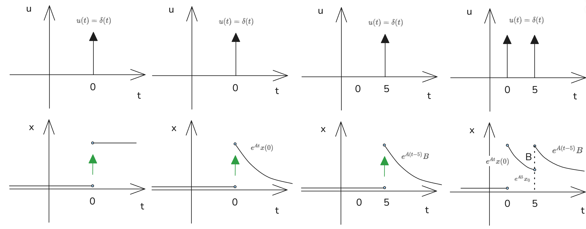
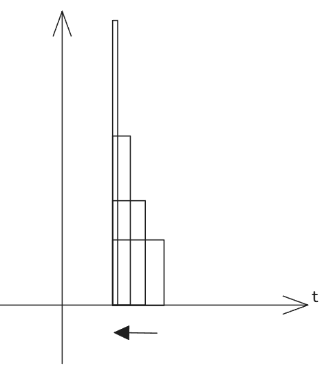
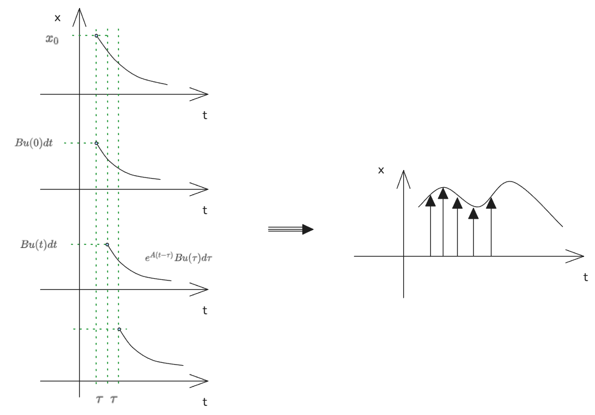

# 线性时不变系统

[TOC]

## 1. 状态空间与卷积积分

系统状态方程：
$$\dot{x} = A x + B u \implies x(t) = e^{A t} x(0) + \int_0^t e^{A(t-\tau)} B u(\tau) d\tau$$

针对倒立摆系统，状态方程表示为：
$$\dot{x} = A x + B u$$
其中系统矩阵与输入矩阵为：
$$A = \begin{bmatrix} 0 & 1 \\ -2 & -2 \end{bmatrix}, \quad B = \begin{bmatrix} 0 \\ 1 \end{bmatrix}$$

 

**E.x:倒立摆**
有 $\ddot{\theta} = -\sin\theta + \tau \implies \begin{cases} \dot{\theta} = \omega \\ \dot{\omega} = -\sin\theta + \tau \end{cases}$
$\implies \frac{d}{dt} \begin{bmatrix} \theta \\ \omega \end{bmatrix} = \begin{bmatrix} \omega \\ -\sin\theta \end{bmatrix} + \begin{bmatrix} 0 \\ 1 \end{bmatrix} \tau$

其中 $\begin{bmatrix} \omega \\ -\sin\theta \end{bmatrix} = f(x) \implies \frac{\partial f}{\partial x} = \begin{bmatrix} 0 & 1 \\ -\cos\theta & 0 \end{bmatrix} \implies \left. \frac{\partial f}{\partial x} \right|_{\theta = \pi} = \begin{bmatrix} 0 & 1 \\ 1 & 0 \end{bmatrix} \implies \lambda = \pm 1$

其中 $\frac{d}{dt} \begin{bmatrix} \theta \\ \omega \end{bmatrix} = \begin{bmatrix} 0 & 1 \\ 1 &  0 \end{bmatrix} \begin{bmatrix} \theta \\ \omega \end{bmatrix} + \begin{bmatrix} 0 \\ 1 \end{bmatrix} \tau \implies \dot{x} = A x + B u$

若 $\tau = -2\theta - 2\omega \implies \tau = \begin{bmatrix} -2 & -2 \end{bmatrix} \begin{bmatrix} \theta \\ \omega \end{bmatrix} \implies \begin{bmatrix} 0 & 1 \end{bmatrix} \tau = \begin{bmatrix} 0 & 1 \end{bmatrix} \begin{bmatrix} -2 & -2 \end{bmatrix} \begin{bmatrix} \theta \\ \omega \end{bmatrix} = \begin{bmatrix} -2 & -2 \end{bmatrix} \begin{bmatrix} \theta \\ \omega \end{bmatrix}$

$\therefore \frac{d}{dt} \begin{bmatrix} \theta \\ \omega \end{bmatrix} = \begin{bmatrix} 0 & 1 \\ 0 & 0 \end{bmatrix} \begin{bmatrix} \theta \\ \omega \end{bmatrix} + \begin{bmatrix} 0 \\ -2 & -2 \end{bmatrix} \begin{bmatrix} \theta \\ \omega \end{bmatrix} = \begin{bmatrix} 0 & 1 \\ -2 & -2 \end{bmatrix} \begin{bmatrix} \theta \\ \omega \end{bmatrix}$
$\implies \lambda = -1, -1 \implies \text{stable! 稳!}$

有 $\dot{x} = A x + B u = A x + B K x = (A + B K) x$ 有新动态特性.

---

## 2. 特征值与稳定性分析

计算矩阵 $A$ 的特征值，通过特征方程求解：
$$\det \left( \lambda I - A \right) = \det \begin{bmatrix} \lambda & -1 \\ 2 & \lambda + 2 \end{bmatrix} = \lambda^2 + 2\lambda + 2 = 0$$
解得特征值：
$$\lambda = -1 \pm j$$
由于特征值实部为负，判定该系统为**稳定系统**。

---

## 3. 三种典型控制情形

### Case I：无输入 + 非零初态
- 系统方程：$\dot{x} = A x$
- 解析解：$x(t) = e^{A t} x(0)$
- 物理意义：系统**自由响应**，仅由初始条件驱动系统状态变化。

### Case II：零初态 + 脉冲输入
- 系统方程：$\dot{x} = A x + B \delta(t)$ ， $\delta(t)$ 为 为狄拉克函数
- 解析解：$x(t) = e^{A t} B$
- 物理意义：系统**脉冲响应**，是卷积积分的核心核函数，描述系统对瞬时脉冲信号的响应。

### Case III：一般输入 + 任意初态
- 系统方程：$\dot{x} = A x + B u$
- 解析解：$x(t) = e^{A t} x_0 + \int_0^t e^{A \tau} B u(t-\tau) d\tau$
- 物理意义：系统**完全响应**，由初始状态引起的自由响应与输入信号驱动的强迫响应叠加而成。

 

---

## 4. 闭环控制与极点配置

引入状态反馈控制律 $u = -K x$，构建闭环系统状态方程：
$$\dot{x} = (A - B K) x$$
通过设计反馈矩阵 $K$，可将闭环系统的极点配置至期望位置，以此调整系统的动态响应特性，实现精准控制。

---

## 5. 典型响应曲线逻辑

### 自由响应
对应条件：$u=0, x(0)=x_0$
表达式：$x(t) = e^{A t} x_0$
曲线特征：呈衰减振荡趋势，与特征值 $\lambda = -1 \pm j$ 对应的动态特性一致。

### 脉冲响应
对应条件：$x(0)=0, u(t)=\delta(t)$  ， $\delta(t)$ 为 为狄拉克函数
表达式：$x(t) = e^{A t} B$
曲线特征：描述系统对瞬时冲击信号的动态响应过程。

### 卷积响应
对应条件：$x(0)=x_0, u(t)$ 任意
表达式：$x(t) = e^{A t} x_0 + \int_0^t e^{A(t-\tau)} B u(\tau) d\tau$
曲线特征：自由响应与输入驱动响应的叠加，完整反映系统全状态变化过程。

## 补充说明 狄拉克函数

 $\delta(t)$ 为 为狄拉克函数，有特点： $\int_{-\infin}^{\infin} \delta(t)dt = 1$

 

## **Ex:卷积**

$x(t) = e^{A t} x_0 + \int_0^t e^{A(t-\tau)} B u(\tau) d\tau$

$\implies \text{Step response: } x(t) = e^{A t} B$

$\implies \text{Impulse response: } h(t) = e^{A t} B \implies h * u = \int_0^t e^{A(t-\tau)} B u(\tau) d\tau$

现代控制理论A中有

$\dot{x} = A x + B u$
$y = C x + D u$ 

