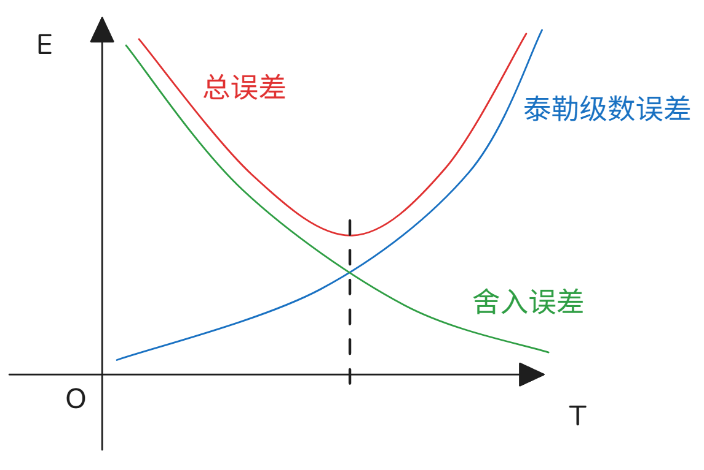

# 数值微分

[TOC]

## 二阶数值微分 + 工程实操注意事项
### 一、二阶导数中心差分推导
二阶导数定义：
$$
\frac{d^2f}{dt^2} = \lim_{\Delta t \to 0} \frac{f(t+\Delta t)-2f(t)+f(t-\Delta t)}{\Delta t^2}
$$

对 $f(t+\Delta t),\ f(t-\Delta t)$ 泰勒展开：
$$
\begin{aligned}
f(t+\Delta t) &= f(t) + \Delta t f'(t) + \frac{\Delta t^2}{2!}f''(t) + \frac{\Delta t^3}{3!}f'''(t) + O(\Delta t^4) \\
f(t-\Delta t) &= f(t) - \Delta t f'(t) + \frac{\Delta t^2}{2!}f''(t) - \frac{\Delta t^3}{3!}f'''(t) + O(\Delta t^4)
\end{aligned}
$$

两式相加消去一阶奇次项：
$$
f(t+\Delta t)+f(t-\Delta t) = 2f(t) + \Delta t^2 f''(t) + O(\Delta t^4)
$$

移项整理得到二阶中心差分公式：
$$
\frac{f(t+\Delta t)-2f(t)+f(t-\Delta t)}{\Delta t^2} \approx f''(t)
$$
误差量级：$\boldsymbol{O(\Delta t^2)}$，二阶精度。


前向差分 后向差分 中心差分 的代码

```python
import numpy as np
from matplotlib import pyplot as plt

# 基础参数
dt = 0.2
t = np.linspace(-2, 4, 60)
f = np.sin(t)

# 1. 解析精确导数
dfdt = np.cos(t)

# 2. 三种有限差分数值近似
# 前向差分 Forward Difference
dfdtF = (np.sin(t + dt) - np.sin(t)) / dt
# 后向差分 Backward Difference
dfdtB = (np.sin(t) - np.sin(t - dt)) / dt
# 中心差分 Central Difference
dfdtC = (np.sin(t + dt) - np.sin(t - dt)) / (2 * dt)

# 创建画布，一行两列子图，画布宽20高4
plt.figure(figsize=(20, 4))

# 左子图：全局对比
plt.subplot(1, 2, 1)
plt.plot(t, dfdt, 'k', linewidth=3, label='Exact Derivative')
plt.plot(t, dfdtF, 'b', linewidth=1.2, label='Forward Diff')
plt.plot(t, dfdtB, 'g', linewidth=1.2, label='Backward Diff')
plt.plot(t, dfdtC, 'r', linewidth=1.2, label='Central Diff')
plt.legend(fontsize=14, framealpha=1.0)  # 图例不透明
plt.grid(True)

# 右子图：局部放大对比（可手动加xlim/ylim实现放大）
plt.subplot(1, 2, 2)
plt.plot(t, dfdt, 'k', linewidth=3)
plt.plot(t, dfdtF, 'b', linewidth=1.2)
plt.plot(t, dfdtB, 'g', linewidth=1.2)
plt.plot(t, dfdtC, 'r', linewidth=1.2)
plt.grid(True)
plt.xlim(0,2)

plt.tight_layout()
plt.show()
```


### 二、实际数据处理边界注意事项 ⚠️
离散序列 $f_k = f(x_k),\ x_k = k\Delta x$，仅能使用有限采样点，分三种边界场景：
1. **数据末端（预测场景）**
    无 $f(t+\Delta t)$，仅存在 $f(t-\Delta t),\ f(t-2\Delta t)$，只能使用**向后差分**。
2. **数据起点**
    仅有 $f(t),\ f(t+\Delta t)$，无左侧历史点，只能使用**向前差分**。
3. **数据中间点**
    同时存在左右两侧采样点，优先使用**中心差分**，精度更高。

### 导数分段选择规则
离散数据集：
$$
\begin{bmatrix}
x_1 \\ x_2 \\ \vdots \\ x_n
\end{bmatrix},\quad
\begin{bmatrix}
f_1 \\ f_2 \\ \vdots \\ f_n
\end{bmatrix}
$$
$$
\frac{df}{dx}=
\begin{cases}
\text{FD（向前差分）} & \text{在端点 } x_1 \\
\text{CD（中心差分）} & \text{中间区间 } x_2\sim x_{n-1} \\
\text{BD（向后差分）} & \text{端点 } x_n
\end{cases}
$$

---


```python
import numpy as np
from matplotlib import pyplot as plt

# 1. 生成原始数据（承接上一段代码）
n = 30
x = np.linspace(0.1, 3, n)
f = np.sin(x)

# 2. 有限差分数值求导
dx = x[1] - x[0]          # 均匀网格步长
dfdx = np.zeros(n)        # 初始化导数存储数组

# 左端点：向前差分 forward difference
dfdx[0] = (f[1] - f[0]) / (x[1] - x[0])
# 中间点：中心差分 central difference（精度更高）
for i in range(1, n - 1):
    dfdx[i] = (f[i + 1] - f[i - 1]) / (x[i + 1] - x[i - 1])
# 右端点：向后差分 backward difference
dfdx[-1] = (f[-1] - f[-2]) / (x[-1] - x[-2])

# 3. 绘图对比数值导数 & 理论解析导数 cos(x)
plt.figure()
plt.plot(x, np.cos(x), 'k', label='true derivative')    # 理论精确导数
plt.plot(x, dfdx, 'rx', label='computed derivative')    # 有限差分计算导数
plt.legend()
plt.show()
```


### 三、计算机数值截断误差说明 💡

数学上要求 $\Delta t \to 0$，但计算机浮点数（double 双精度）存在**截断误差**：

- 双精度浮点数机器精度：$\varepsilon \approx 10^{-16}$
- 若 $\Delta t$ 取过小，浮点舍入误差会抵消差分截断误差，反而降低精度；
- 工程计算需选取合适步长 $\Delta t$，平衡截断误差与浮点舍入误差。

---

## 配套差分精度对比表

| 差分类型    | 一阶导数精度    | 二阶导数精度    | 适用位置     |
| ----------- | --------------- | --------------- | ------------ |
| 向前差分 FD | $O(\Delta t)$   | $O(\Delta t)$   | 数据起点     |
| 向后差分 BD | $O(\Delta t)$   | $O(\Delta t)$   | 数据终点     |
| 中心差分 CD | $O(\Delta t^2)$ | $O(\Delta t^2)$ | 数据中间区间 |

 

### 数值微分总误差分析（舍入误差 + 泰勒截断误差）
#### 基础符号说明
$e_r$：机器舍入误差，双精度浮点数 $e_r \approx 10^{-16}$
$\Delta t$：离散时间步长
$m = \max_{t\in[t-\Delta t,t+\Delta t]} |f''(t)|$，二阶导数最大绝对值

### 1. 两种差分误差形式
##### 向前差分（一阶精度）
$$
\frac{df}{dt} \approx \frac{f(t+\Delta t)-f(t)}{\Delta t} + O(\Delta t)
$$

##### 中心差分（二阶精度）
考虑浮点舍入带来的函数值误差 $\pm e_r$：
$$
\frac{df}{dt} \approx \frac{f(t+\Delta t)-f(t-\Delta t) \pm 2e_r}{2\Delta t} + O(\Delta t^2)
$$
拆分两项误差：
$$
\frac{df}{dt} = \frac{f(t+\Delta t)-f(t-\Delta t)}{2\Delta t} \pm \frac{e_r}{\Delta t} + O(\Delta t^2)
$$
- $\displaystyle \frac{e_r}{\Delta t}$：**舍入误差（Roundoff Error）**

- $O(\Delta t^2)$：**泰勒级数截断误差（Truncation Error）**

  **观察到  舍入误差 和 泰勒级数截断误差 增长相反 ， 那么 其总误差一定在两者相等处！**

### 2. 总误差上界
总误差绝对值满足：
$$
|E_{\text{total}}| \le \frac{e_r}{\Delta t} + \frac{\Delta t^2 \cdot m}{3!}
$$
两项误差随 $\Delta t$ 变化趋势相反：
1. $\Delta t \downarrow$：舍入误差 $\displaystyle \frac{e_r}{\Delta t} \uparrow$，截断误差 $\displaystyle \frac{\Delta t^2 m}{6} \downarrow$
2. $\Delta t \uparrow$：舍入误差 $\displaystyle \frac{e_r}{\Delta t} \downarrow$，截断误差 $\displaystyle \frac{\Delta t^2 m}{6} \uparrow$

### 3. 最优步长求解（最小总误差）
对总误差关于 $\Delta t$ 求导并令导数为0，取极值：
$$
\frac{\partial E_{\text{max}}}{\partial \Delta t} = -\frac{e_r}{\Delta t^2} + \frac{2\Delta t \cdot m}{6} = 0
$$
化简：
$$
\frac{\Delta t \cdot m}{3} = \frac{e_r}{\Delta t^2} \implies \Delta t^3 = \frac{3e_r}{m}
$$
得到最优步长：
$$
\Delta t_{\text{opt}} = \sqrt[3]{\frac{3e_r}{m}}
$$
代入 $e_r \approx 10^{-16}$，工程上最优步长约 $\boldsymbol{\Delta t \approx 10^{-5}}$。

### 4. 核心结论
1. 总误差是舍入误差与截断误差的叠加，二者存在此消彼长的制衡关系；
2. 当舍入误差与泰勒截断误差量级相等时，总误差取得最小值；
3. 可通过调整步长 $\Delta t$ 控制整体数值微分误差，存在唯一最优步长平衡两类误差。




