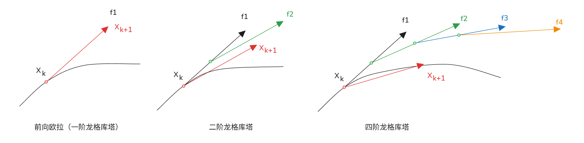

# 常微分方程 ODE 数值 

[TOC]

## 常微分方程 ODE 数值 

### 一、基础问题背景

一阶常微分方程初值问题：
$$
\dot{\boldsymbol{x}} = \frac{d\boldsymbol{x}}{dt} = f(\boldsymbol{x}),\quad \boldsymbol{x}(0)=\boldsymbol{x}_0
$$
- $\boldsymbol{x}$：系统状态向量，可线性/非线性；
- $f(\boldsymbol{x})$：状态导数函数；
- $\boldsymbol{x}_0$：初始条件；
求解目标：得到离散轨迹 $x_0 \to x_1 \to x_2 \dots \to x_N$，其中 $x_k = x(t_k),\ t_k = k\Delta t$。

#### 离散递推通用形式

$$
x_{k+1} = F(x_k)
$$
用于描述系统轨道演化，典型算法：向前欧拉、龙格-库塔、变分积分、混沌积分器等。

#### 关键注意点

数值离散会引入**误差与稳定性**问题；步长 $\Delta t$ 选取会直接影响长期演化精度与稳定性。

---
### 二、向前欧拉法（Forward Euler）推导

#### 1. 差分近似导数
由一阶向前差分定义：
$$
\frac{d\boldsymbol{x}}{dt} \approx \frac{\boldsymbol{x}(t+\Delta t)-\boldsymbol{x}(t)}{\Delta t} = f\big[\boldsymbol{x}(t)\big]
$$

#### 2. 递推迭代公式
移项整理得到最简洁显式数值迭代格式：
$$
\boldsymbol{x}(t+\Delta t) = \boldsymbol{x}(t) + \Delta t \cdot f\big[\boldsymbol{x}(t)\big]
$$
离散下标形式：
$$
x_{k+1} = x_k + \Delta t \cdot f(x_k)
$$

#### 3. 泰勒展开误差分析
对 $\boldsymbol{x}(t+\Delta t)$ 泰勒展开：
$$
\boldsymbol{x}(t+\Delta t) = \boldsymbol{x}(t) + \Delta t \dot{\boldsymbol{x}}(t) + \frac{\Delta t^2}{2}\ddot{\boldsymbol{x}}(t) + O(\Delta t^3)
$$
对比欧拉公式可知：
- 局部截断误差：$O(\Delta t^2)$
- 全局总误差：$O(\Delta t)$，一阶精度

---
### 三、核心知识点总结

1. **适用场景**：显式、计算量最小，适合快速粗略仿真；
2. **精度短板**：仅一阶精度，步长稍大会快速累积误差、发散；
3. **稳定性**：显式欧拉稳定区间窄，刚性微分方程不推荐；
4. 拓展方向：提升精度可采用中点欧拉、梯形法、4阶龙格-库塔(RK4)等高阶积分格式。


## 向前欧拉 / 向后欧拉 数值解法 

### 基础ODE问题
一阶常微分方程初值问题：
$$
\dot{x} = \frac{dx}{dt} = f(x)
$$
离散时间定义：$t_k = k\Delta t,\quad x_k = x(t_k)$，轨迹递推：$x_0 \to x_1 \to x_2 \dots \to x_n$

---
### 一、向前欧拉法（显式欧拉 Explicit Euler）
### 1. 差分推导
用**向前差分**近似导数：
$$
\frac{dx(t)}{dt} \approx \frac{x(t+\Delta t)-x(t)}{\Delta t} = f\big(x(t)\big)
$$
移项得到连续形式：
$$
x(t+\Delta t) = x(t) + \Delta t \cdot f\big(x(t)\big)
$$
离散迭代式：
$$
\boldsymbol{x_{k+1} = x_k + \Delta t \cdot f(x_k)}
$$
- 特点：只使用当前时刻 $x_k$ 计算下一时刻，**显式格式**；
- 精度：一阶泰勒近似，全局误差 $O(\Delta t)$。

### 线性特例 $\dot{x}=Ax$
代入向前欧拉公式：
$$
x_{k+1} = x_k + \Delta t \cdot A x_k = \left(\boldsymbol{I} + \Delta t A\right) x_k
$$
解析精确解：$x_{k+1}=e^{A\Delta t}x_k$，矩阵 $I+\Delta t A$ 是指数矩阵一阶泰勒截断近似。

---
### 二、向后欧拉法（隐式欧拉 Implicit Euler）
### 1. 差分推导
用**向后差分**，导数取下一时刻点：
$$
\frac{x_{k+1}-x_k}{\Delta t} = \dot{x}(t_{k+1}) = f(x_{k+1})
$$
整理得到迭代方程：
$$
\boldsymbol{x_{k+1} = x_k + \Delta t \cdot f(x_{k+1})}
$$
- 特点：等式两侧同时含未知 $x_{k+1}$，**隐式格式**；
- 优缺点：数值稳定性远优于向前欧拉，但每一步需要解方程，若 $f$ 非线性需要求逆/迭代求解 $f^{-1}(x_{k+1})$。

#### 线性特例 $\dot{x}=Ax$
$$
x_{k+1} = x_k + \Delta t A x_{k+1}
$$
移项合并同类项：
$$
(I - \Delta t A) x_{k+1} = x_k
$$
左乘逆矩阵得到显式递推：
$$
\boldsymbol{x_{k+1} = \left(I - \Delta t A\right)^{-1} x_k}
$$

---
### 三、两种欧拉方法对比
| 方法     | 格式类型 | 递推形式                          | 稳定性         | 计算成本         | 适用场景            |
| -------- | -------- | --------------------------------- | -------------- | ---------------- | ------------------- |
| 向前欧拉 | 显式     | $x_{k+1}=x_k+\Delta t f(x_k)$     | 差，稳定区间窄 | 低，一步直接计算 | 非刚性、短时间仿真  |
| 向后欧拉 | 隐式     | $x_{k+1}=x_k+\Delta t f(x_{k+1})$ | 极好（A稳定）  | 高，每步解方程   | 刚性ODE、长时间演化 |


## 单自由度阻尼振动系统 状态空间矩阵形式方程数值解
### 一、力学原始方程
弹簧-质量-阻尼系统受力平衡：
$$
m\ddot{x} = -kx - c\dot{x}
$$
整理为标准二阶线性齐次ODE：
$$
\ddot{x} + \frac{c}{m}\dot{x} + \frac{k}{m}x = 0
$$

#### 固有参数定义
1. 固有角频率：
$$
\omega_0 = \sqrt{\frac{k}{m}}
$$
2. 阻尼比：
$$
\zeta = \frac{c}{2\sqrt{mk}}
$$
代入化简得到标准振动方程：
$$
\ddot{x} + 2\zeta\omega_0 \dot{x} + \omega_0^2 x = 0
$$

#### 阻尼分类
- $\boldsymbol{\zeta < 1}$：欠阻尼，振荡衰减
- $\boldsymbol{\zeta = 1}$：临界阻尼，无振荡最快收敛
- $\boldsymbol{\zeta > 1}$：过阻尼，无振荡缓慢收敛

---
### 二、转化为一阶状态微分方程组

定义二维状态向量：
$$
\boldsymbol{x} = \begin{bmatrix} x \\ v \end{bmatrix},\quad v = \dot{x}
$$
拆分一阶微分：
$$
\begin{cases}
\dot{x} = v \\
\dot{v} = -2\zeta\omega_0 \,v - \omega_0^2 \,x
\end{cases}
$$

### 三、矩阵状态空间形式 $\dot{\boldsymbol{x}} = A\boldsymbol{x}$
$$
\frac{d}{dt}\begin{bmatrix} x \\ v \end{bmatrix}
=
\underbrace{\begin{bmatrix}
0 & 1 \\
-\omega_0^2 & -2\zeta\omega_0
\end{bmatrix}}_{A}
\begin{bmatrix} x \\ v \end{bmatrix}
$$
- $A$：系统状态矩阵；
- 该形式适合使用向前/向后欧拉、RK等数值积分离散求解。

注：向前欧拉在步长过大的时候 会产生发散问题

### 代码

```python
# 导入所需库
import numpy as np
from matplotlib import pyplot as plt
from scipy.integrate import solve_ivp

# ===================== 系统参数定义 =====================
w = 2 * np.pi       # 固有角频率 natural frequency
d = 0.25            # 阻尼比 damping ratio
# 弹簧-质量-阻尼二阶ODE转化为一阶线性系统矩阵
A = np.array([[0, 1], [-w ** 2, -2 * d * w]])

dt = 0.01           # 仿真时间步长
T = 10              # 总积分时长
x0 = [2, 0]         # 初始条件 [位移x=2, 速度v=0]

# 生成时间网格
num_time_slices = int(T / dt)
time_slices = np.linspace(0, T, num_time_slices)

# ===================== 1. 前向欧拉 Forward Euler 迭代 =====================
xF = np.zeros((2, num_time_slices))
xF[:, 0] = x0  # 赋值初始状态
for k in range(num_time_slices - 1):
    # 前向欧拉公式：x_{k+1} = (I + dt*A) @ x_k
    xF[:, k + 1] = (np.eye(2) + dt * A) @ xF[:, k]

# ===================== 2. 后向欧拉 Backward Euler 迭代 =====================
xB = np.zeros((2, num_time_slices))
xB[:, 0] = x0
for k in range(num_time_slices - 1):
    # 隐式格式求逆：x_{k+1} = (I - dt*A)^{-1} @ x_k
    xB[:, k + 1] = np.linalg.pinv(np.eye(2) - A * dt) @ xB[:, k]

# ===================== 3. Scipy内置四阶龙格库塔RK45高精度参考解 =====================
# ODE右侧函数定义
def ode_func(t, x):
    return A @ x

# 求解初值问题，输出指定时间点的解
ivp_solution = solve_ivp(ode_func, (0, T), x0, t_eval=time_slices)
xRK4 = ivp_solution.y

# ===================== 绘图对比三种算法位移曲线 =====================
plt.figure(figsize=(12, 6))
plt.plot(time_slices, xF[0, :], label="Forward Euler", linewidth=1.3)
plt.plot(time_slices, xB[0, :], label="Backward Euler", linewidth=1.3)
plt.plot(time_slices, xRK4[0, :], 'k--', label="RK45 (Reference)", linewidth=2)

plt.xlabel("Time t")
plt.ylabel("Displacement x(t)")
plt.title("ODE Integration Schemes: Spring-Mass-Damper System")
plt.grid(True)
plt.legend()
plt.show()
```


## 线性系统连续/离散稳定性理论 
### 1. 连续线性系统 $\dot{\boldsymbol{x}} = A\boldsymbol{x}$
#### 解析解
设特征值 $\lambda = a + ib$，单模态解：
$$
\boldsymbol{x}(t) = e^{\lambda t}\boldsymbol{x}_0 = e^{at}\big[\cos(bt)+i\sin(bt)\big]\boldsymbol{x}_0
$$
连续稳定判据：
- $\mathrm{Re}(\lambda) < 0$：指数衰减，**稳定**
- $\mathrm{Re}(\lambda) > 0$：指数发散，**不稳定**

#### 两种欧拉离散格式
1. **向前欧拉 FE（显式）**
$$
\boldsymbol{x}_{k+1} = (I+\Delta t A)\boldsymbol{x}_k
$$
离散迭代形式：$\boldsymbol{x}_{k+1} = \beta \boldsymbol{x}_k,\ \beta=I+\Delta t A$
稳定条件：谱半径 $\rho(I+\Delta t A) < 1$

2. **向后欧拉 BE（隐式）**
$$
\boldsymbol{x}_{k+1} = (I-\Delta t A)^{-1}\boldsymbol{x}_k
$$
离散迭代形式：$\boldsymbol{x}_{k+1} = \beta^{-1}\boldsymbol{x}_k,\ \beta=I-\Delta t A$
稳定条件：谱半径 $\rho\big((I-\Delta t A)^{-1}\big) < 1$

### 2. 离散线性系统 $\boldsymbol{x}_{k+1}=M\boldsymbol{x}_k$
单特征值模态 $\lambda = a+ib$，模长 $R=\sqrt{a^2+b^2}$
$$
\boldsymbol{x}_{k+1} = \lambda \boldsymbol{x}_k,\quad \boldsymbol{x}_k = \lambda^k \boldsymbol{x}_0
$$
离散稳定判据：
- $R<1$：$k\to\infty$ 幅值衰减，**稳定**
- $R>1$：$k\to\infty$ 幅值发散，**不稳定**

#### 矩阵对角化稳定性通用判据
对离散递推 $\boldsymbol{x}_{k+1}=M\boldsymbol{x}_k$，对角分解 $M=T D T^{-1}$，$D=\mathrm{diag}(\lambda_1,\lambda_2\dots)$
$$
\boldsymbol{x}_n = M^n \boldsymbol{x}_0 = T D^n T^{-1}\boldsymbol{x}_0
$$
稳定充要条件：所有特征值模长 $\rho(\mathrm{eig}(M)) < 1$
- FE 稳定条件：$\rho(I+\Delta t A) < 1$
- BE 稳定条件：$\rho\big((I-\Delta t A)^{-1}\big) < 1$

---
## 二、龙格-库塔数值积分（第二张笔记，通用二阶/四阶RK）
基础ODE
$$
\dot{\boldsymbol{x}} = f(\boldsymbol{x},t)
$$
### 1. 二阶龙格-库塔（中点RK2，改进欧拉）
迭代公式：
$$
\begin{aligned}
\boldsymbol{x}_{k+1} &= \boldsymbol{x}_k + \Delta t \cdot f_2 \\
f_1 &= f(\boldsymbol{x}_k,\ t_k) \\
f_2 &= f\left(\boldsymbol{x}_k+\frac{\Delta t}{2}f_1,\ t_k+\frac{\Delta t}{2}\right)
\end{aligned}
$$
- 局部截断误差：$O(\Delta t^3)$
- 全局总误差：$O(\Delta t^2)$

### 2. 四阶经典龙格-库塔 RK4（工程最常用）
$$
\boldsymbol{x}_{k+1} = \boldsymbol{x}_k + \frac{\Delta t}{6}\big(f_1 + 2f_2 + 2f_3 + f_4\big)
$$
四段斜率：
$$
\begin{aligned}
f_1 &= f(\boldsymbol{x}_k,\ t_k) \\
f_2 &= f\left(\boldsymbol{x}_k+\frac{\Delta t}{2}f_1,\ t_k+\frac{\Delta t}{2}\right) \\
f_3 &= f\left(\boldsymbol{x}_k+\frac{\Delta t}{2}f_2,\ t_k+\frac{\Delta t}{2}\right) \\
f_4 &= f\left(\boldsymbol{x}_k+\Delta t f_3,\ t_k+\Delta t\right)
\end{aligned}
$$
- 局部截断误差：$O(\Delta t^5)$
- 全局总误差：$O(\Delta t^4)$

### 3. 方法对比
| 算法        | 每步函数调用次数 | 全局误差阶      | 稳定性 | 计算量 |
| ----------- | ---------------- | --------------- | ------ | ------ |
| 向前欧拉 FE | 1                | $O(\Delta t)$   | 差     | 极小   |
| 二阶RK2     | 2                | $O(\Delta t^2)$ | 中等   | 低     |
| 四阶RK4     | 4                | $O(\Delta t^4)$ | 优良   | 中等   |

### 核心说明
1. 欧拉法仅使用起点单斜率；RK系列通过多步中间采样斜率加权平均，大幅提升精度；
2. RK4 精度极高，无需隐式求解，是动力学、振动、控制系统仿真标准算法；
3. 误差阶数越高，同等步长下仿真精度越高，同等精度下可使用更大步长。

