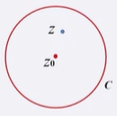
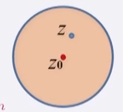

# 复变函数

[TOC]

## 复数定义和运算

虚数单位  
$$
i\equiv\sqrt{-1}
$$
复数表达
$$
复数：z=x+iy
\\
共轭复数：z^*=x-iy
\\
实部：x\equiv Re\ z
,
虚部：y\equiv Im\ z
$$
若判断两个复数相等必然是实部和虚部分别相等
$$
z_1=x_1+iy_1
\\
z_2=x_2+iy_2
\\
z_1=z_2  \Leftrightarrow x_1=x_2,y_1=y_2
$$
加减乘除
$$
z_1=x_1+iy_1
\\
z_2=x_2+iy_2
\\
z_1+z_2  = (x_1+x_2)+ i(y_1+y_2)
\\
z=z_1\cdot z_2=
(x_1+iy_1)\cdot(x_2+iy_2)=(x_1x_2-y_1y_2)+i(x_1y_2+x_2y_1)
\\
z_1\cdot z_1^* = x_1^2+y_1^2
\\
\frac{z_1}{z_2}=\frac{z_1\cdot z_2^*}{z_2\cdot z_2^*}=
\frac{x_1x_2+y_1y_2}{x_2^2+y_2^2}+i\frac{x_2y_1-x_1y_2}{x_2^2+y_2^2}
$$
例题

$ \lim\limits_{y\to0}\frac1{x+iy} = ?$

> $  \lim\limits_{y\to0}\frac1{x+iy} = ?$
>
>  要考虑分母为0的情况，先将内部分母处理
>
> $  \lim\limits_{y\to0}\frac1{x+iy} \Rightarrow   \lim\limits_{y\to0}\frac{x-iy}{(x+iy)(x-iy)}=\lim\limits_{y\to0}[\frac{x}{x^2+y^2}-i\frac{iy}{x^2+y^2}]$ 
>
> 所以
>
> $  Re\ z =\frac1x,x\neq0 \\ Re\ z=0,x=0 \\ Im\ z=-i\pi\delta(x)$

## 复数几何表达和无穷远点

### 复数几何表示

构建复平面，其横轴x为复数实部，纵轴为复数虚部，复平面上一点表示复数

复数的模：复平面上一点到其原点距离
$$
\rho\equiv|z|=\sqrt{x^2+y^2}
\\
z\cdot z^*=x^2+y^2=\rho^2
$$
复数的辐角：其和原点连线与实轴的角度为辐角
$$
\theta\equiv Arg\ z
\\
其辐角具有多个值，故需要确定主辐角
\\
主辐角：0\leq arg\ z \lt 2\pi
\\
\theta\equiv Arg\ z = arg\ z+2n\pi
$$
由于其在坐标轴的投影关系有
$$
x=\rho\cos\theta,y=\rho\sin\theta
\\
z=\rho(\cos\theta+i\sin\theta)
$$
有推论，复数倒数的模就是原本复数模的导数，辐角则为原本复数辐角相反数
$$
\frac1z=\frac1{\rho(\cos\theta+i\sin\theta)}=\frac1{\rho}(\cos\theta-i\sin\theta)
\\
\rho_{\frac1z}=\frac1{\rho_z},Arg\frac1z=-Arg\ z
$$
多个复数相乘，就是其模的乘积以及辐角的相加
$$
z_1\cdot z_2=\rho_1\rho_2(\cos\theta_1+i\sin\theta_1)(\cos\theta_2+i\sin\theta_2)=\rho_1\rho_2[\cos(\theta_1+\theta_2)+i\sin(\theta_1+\theta_2)]
\\
z=z_1z_2...z_n=\rho(cos\theta+i\sin\theta)
\\
\rho=\rho_1\rho_2...\rho_n,\theta=\theta_1+\theta_2+...+\theta_n
\\
z_1/ z_2=\frac{\rho_1}{\rho_2}[\cos(\theta_1-\theta_2)+i\sin(\theta_1-\theta_2)]
$$
不等式推论
$$
||z_1|-|z_2||\leq|z_1+z_2|\leq|z_1|+|z_2|
$$

### 复球面和无穷远点

## 欧拉公式和复数的指数表达

### 复数指数表达

欧拉公式
$$
e^{i\theta}=\cos\theta+i\sin\theta
$$
对比欧拉公式和复数的模和辐角表达形式得到简化的复数指数表达型式
$$
z=\rho(\cos\theta+i\sin\theta) = \rho e^{i\theta}
$$
复数表达型式进行加减乘除运算
$$
z_1=\rho_1e^{i\theta_1}
,
z_2=\rho_2e^{i\theta_2}
\\
z_1\cdot z_2=\rho_1\rho_2e^{i(\theta_1+\theta_2)}
\\
z_1z_2...z_n=\rho_1\rho_2...\rho_n e^{i(\theta_1+\theta_2+...+\theta_n)}
\\
z_1/z_2=\frac{\rho_1}{\rho_2}e^{i(\theta_1-\theta_2)}
\\
棣美弗定理：z^n=\rho^ne^{in\theta}
$$

### 欧拉公式证明

方法1：
$$
泰勒级数展开\\
e^{ax}=\sum\limits^\infin_{n=0}\frac{a^nx^n}{n!} 
\to 
e^{i\theta}=\sum\limits^\infin_{n=0}\frac{i^n\theta^n}{n!}
\\
上式奇偶分开得到
\\
e^{i\theta}=\sum\limits^\infin_{n=0}\frac{i^n\theta^n}{n!}=
[1-\frac{\theta^2}2+\frac{\theta^4}{4!}+...]+i[\theta-\frac{\theta^3}{3!}+\frac{\theta^5}{5!}+...]=
\cos\theta+i\sin\theta
$$
方法2：
$$
\frac{de^{ax}}{dx} = ae^{ax} \to \frac{de^{i\theta}}{d\theta} = ie^{i\theta}
\\
e^{i\theta}=\rho(\cos\alpha+i\sin\alpha)
\\
\frac{de^{i\theta}}{d\theta} = 
(\cos\alpha+i\sin\alpha)\frac{d\rho}{d\theta}+i(\cos\alpha+i\sin\alpha)\frac{d\alpha}{d\theta}=
ie^{i\theta}
\\
\to 
\\
\rho(\cos\alpha+i\sin\alpha)=
(\cos\alpha+i\sin\alpha)\frac{d\rho}{d\theta}+i(\cos\alpha+i\sin\alpha)\frac{d\alpha}{d\theta}
\\
\to
\\
\frac{d\rho}{d\theta}=0,\frac{d\alpha}{d\theta}=1 
\\
\to 
\\
\rho=C,\alpha=\theta+C_0
$$
取边界条件
$$
\rho=C,\alpha=\theta+C_0
\\
e^{i0}=1 \to C=1,C_0=0
\to 
\rho=1,\alpha=\theta
\\
e^{i\theta}=\rho(\cos\alpha+i\sin\alpha) =(\cos\theta+i\sin\theta)
$$

## 复变函数概念

实变函数定义

复变函数定义

复变函数表达
$$
z=x+iy
\\
f(z)=u(x,y)+iv(x,y)
$$

### 区域概念

定义复平面上的点D，如满足：

开集性：对于D中任一点$z_0$，总能找到一个 $\epsilon > 0$，使得所有满足$|z-z_0|<\epsilon$ 的点 $z$ 都包含在点集之内

连通性：点集内任意两点都可以由点集内点构成的曲线连接起来，称点集D为区域；

闭区域概念：$\bar D=D+\part D$  加上边界

区域分类：按照连通性分类

单连通区域：

复联通区域：

## 复变函数和黎曼面

复变函数定义
$$
定义域  { {w=f(z)}\over\rightarrow 单值 }值域
$$
由于复变函数使用辐角表达是的多值性导致了表达式的多值性
$$
z=\rho e^{i(\theta+2n\pi)}
\\
\theta \in [0,2\pi]
$$
### 例1

$$
w=\sqrt{z}=\sqrt\rho e^{i(\frac\theta2+n\pi)}
=
\left\{
\begin{array}{l}
 \sqrt\rho e^{i\frac\theta2 } ,n=0,2,4,...
\\
-\sqrt\rho e^{i\frac\theta2 } ,n=1,3,5,...

\end{array}
\right.
$$
就出现了一个自变量通过这个表达出现了值域上出现两个值和因变量对应，这就违反了函数的定义；于是考虑控制自变量的取值来实现单值性；

故将同样一个值拆为两个不同的复平面；需要对自变量做区分；

支点：当自变量$z$绕着某点$z_0$转一圈回到原处函数值变了，这 $z_0$ 就是函数支点；

$w=\sqrt z$ 的支点 ： $z_1=0 , z_2=\infin$

$w=\sqrt {z-a}$ 的支点 ： $z_1=a , z_2=\infin$

其值域所构成的叫做黎曼面

### 例2

$$
w=\ln z = \ln[\rho e^{i(\theta+2n\pi)}] = \ln\rho+i(\theta+2n\pi)
$$
其支点为  $z_1=0,z_2=\infin$

复数具体形态来做相应黎曼面；

## 复变函数的导数及解析函数的定义

复变函数
$$
f(z)=w(x,y)+iv(x,y)
$$

#### 复变函数连续情况：

$f(z)$  在  $z_0$点和其邻域上有定义，且当沿着任何路径 $z\to z_0$有 $\lim\limits_{z\to z_0}=f(z_0)$  ，$f(z)$在 $z_0$点连续；

$f(z)$  在其定义域内处处连续，则 $f(z)$  为连续函数；

#### 复变函数可导情况：

$f(z)$在 $z_0$点连续，且当以任何方式 $\Delta z\to 0 $ 是 有  $f'(z_0)\equiv\lim\limits_{\Delta z\to 0}\frac{f(z_0+\Delta z) -f(z_0)}{\Delta z}$ 存在且唯一，则 $f'(z_0)$ 为函数 在 $z_0$点导数；

#### 复变函数解析情况：

$f(z)$  在  $z_0$点和其邻域上各个点均匀可导，则 $f(z)$  在 $z_0$点解析；

#### 解析函数

若函数在区域D上处处解析，则该函数为区域D的解析函数；

### 性质

$$
[f_1(z)+f_2(z)]'=f_1'(z)+f_2'(z)
\\ 
[f_1(z)\cdot f_2(z)]'=f_1'(z)f_2(z)+f_1(z)f_2'(z)
\\ 
[f_1(z) / f_2(z)]'=\frac{ f_1'(z)f_2(z)-f_1(z)f_2'(z)}{|f_2(z)|^2}
$$

$$
f=f(w),w=w(z)
\to
\frac{df}{dz}=\frac{df}{dw}\frac{dw}{dz}
$$

 

## 柯西黎曼条件

若可导 则有
$$
f'(z_0)\equiv\lim\limits_{\Delta z\to 0}\frac{f(z_0+\Delta z) -f(z_0)}{\Delta z}
$$

既然定义上说应该从任意路径都成立，则在直角坐标系中选取两个特殊路径，沿着x轴路径其虚部不变，沿着y轴路径，其实部不变

则有
$$
x: f'(z)=\lim\limits_{\Delta x\to 0}
[\frac
{u(x+\Delta x,y)-u(x,y)}
{  \Delta x }
+
i
\frac
{v(x+\Delta x,y)-v(x,y)}
{  \Delta x }
]
=
\frac{\part u(x,y)}{\part x}+i\frac{\part v(x,y)}{\part x}
\\
y: f'(z)=\lim\limits_{\Delta y\to 0}
[\frac
{u(x,y+\Delta y)-u(x,y)}
{  i\Delta y }
+
i
\frac
{v(x,y+\Delta y)-v(x,y)}
{  i\Delta y }
]
=
\frac{\part v(x,y)}{\part y}-i\frac{\part u(x,y)}{\part y}
$$

上述两条路径应该相等，则会得到一个结论
$$
\frac{\part u(x,y)}{\part x} = \frac{\part v(x,y)}{\part y} 
\\
\frac{\part u(x,y)}{\part y} =-\frac{\part v(x,y)}{\part x}
$$
这个就是柯西黎曼条件，是复变函数解析的必要条件；

### 函数可导充分必要条件：

1 函数实部和虚部均为二元可微实函数

2 满足柯西黎曼条件

根据二元可微实函数定义
$$
\Delta u=\frac{\part u}{\part x}\Delta x+\frac{\part u}{\part y}\Delta y +\epsilon_1\Delta x+\epsilon_2\Delta y
\\
\Delta v=\frac{\part v}{\part x}\Delta x+\frac{\part v}{\part y}\Delta y +\epsilon_3\Delta x+\epsilon_4\Delta y
\\
\lim\limits_{\Delta x,\Delta y\to 0} \epsilon_i=0
$$
于是有
$$
\Delta f=\Delta u+i\Delta v 
\\
= 
[\frac{\part u}{\part x}+i\frac{\part v}{\part x}]\Delta x+[\frac{\part u}{\part y}+i\frac{\part v}{\part y}]\Delta y +(\epsilon_1+i\epsilon_3)\Delta x+(\epsilon_2+i\epsilon_4)\Delta y
\\
 =
[\frac{\part u}{\part x}+i\frac{\part v}{\part x}]\Delta x+[\frac{\part v}{\part y}-i\frac{\part u}{\part y}]i\Delta y +(\epsilon_1+i\epsilon_3)\Delta x+(\epsilon_2+i\epsilon_4)\Delta y
\\
 =
[\frac{\part u}{\part x}+i\frac{\part v}{\part x}]\Delta x+[\frac{\part u}{\part x}+i\frac{\part v}{\part x}]i\Delta y +(\epsilon_1+i\epsilon_3)\Delta x+(\epsilon_2+i\epsilon_4)\Delta y
\\
 =
[\frac{\part u}{\part x}+i\frac{\part v}{\part x}]\Delta z +(\epsilon_1+i\epsilon_3)\Delta x+(\epsilon_2+i\epsilon_4)\Delta y
$$

$$
\lim\limits_{\Delta z\to0}\frac{\Delta f}{\Delta z}=\frac{\part u}{\part x}+i\frac{\part v}{\part x}
$$

如函数解析，则必然有如此比值唯一的值；

## 复变函数解析特性

### 解析函数 调和函数

$$
f(z) = u(x,y)+iv(x,y)
\\
柯西黎曼条件:
\\
\frac{\part u(x,y)}{\part x} = \frac{\part v(x,y)}{\part y} 
\\
\frac{\part u(x,y)}{\part y} =-\frac{\part v(x,y)}{\part x}
\\
$$

柯西黎曼条件两式分别对x，y偏导：
$$
\\
\frac{\part u(x,y)}{\part x} = \frac{\part v(x,y)}{\part y}  
\stackrel{\part x}{\longrightarrow}
\frac{\part^2 u(x,y)}{\part x^2} = \frac{\part v^2(x,y)}{\part x\part y}
\\
\frac{\part u(x,y)}{\part y} =-\frac{\part v(x,y)}{\part x}
\stackrel{\part y}{\longrightarrow}
\frac{\part^2 u(x,y)}{\part y^2} =-\frac{\part^2 v(x,y)}{\part x\part y}
\\
\Rightarrow
\\
\frac{\part^2 u(x,y)}{\part x^2} +\frac{\part^2 u(x,y)}{\part y^2}=0
$$
于是可以看到实部满足拉普拉斯方程

同理,柯西黎曼条件两式分别对y，x偏导：
$$
\frac{\part u(x,y)}{\part x} = \frac{\part v(x,y)}{\part y}  
\stackrel{\part y}{\longrightarrow}
\frac{\part^2 u(x,y)}{\part x\part y} = \frac{\part v^2(x,y)}{\part y^2}
\\
\frac{\part u(x,y)}{\part y} =-\frac{\part v(x,y)}{\part x}
\stackrel{\part x}{\longrightarrow}
\frac{\part^2 u(x,y)}{\part x\part y} =-\frac{\part^2 v(x,y)}{\part x^2}
\\
\Rightarrow
\\
\frac{\part^2 v(x,y)}{\part x^2}+\frac{\part v^2(x,y)}{\part y^2}=0
$$
所以解析函数的实部和虚部为满足柯西黎曼条件的调和函数
$$
\frac{\part^2 u(x,y)}{\part x^2} +\frac{\part^2 u(x,y)}{\part y^2}=0
\to
\nabla^2u
\\
\frac{\part^2 v(x,y)}{\part x^2}+\frac{\part v^2(x,y)}{\part y^2}=0
\to
\nabla^2v
$$

### 问题

有解析函数
$$
f(z) = u(x,y)+iv(x,y)
\\
x=\frac{z+z^*}2,y=\frac{z-z^*}{2i}
$$
两者代入，是否可以将函数表达为复数和其共轭的函数？

$f(x)\equiv f(z,z^*) ?$

此时对共轭复数求导，如果为0，则无关；
$$
\frac {\part f}{\part z^*}
=
\frac{\part f}{\part x}\frac{\part x}{\part z^*}+\frac{\part f}{\part y}\frac{\part y}{\part z^*}
\\=
\frac12[\frac{\part u}{\part x}+i\frac{\part v}{\part x}]+\frac i2[\frac{\part u}{\part y}+i\frac{\part v}{\part y}]
\\=
\frac12[\frac{\part u}{\part x}-\frac{\part v}{\part y}]+\frac i2[\frac{\part u}{\part y}+\frac{\part v}{\part x}]
\\
\stackrel{柯西黎曼条件}{\longrightarrow}
\\
\frac{\part f(z)}{z^*}=0
$$
这就是说明解析函数和其自变量复数的共轭是无关的！！

## 解析函数的确定

### 由部分确定整个解析函数

已知解析函数的实部 $u(x,y)$ 以及 某一点 $z_0$ 取值$f(z_0)$，如何确定该解析函数？

通过柯西黎曼条件来推算；

解析函数有柯西黎曼条件
$$
\frac{\part u(x,y)}{\part x} = \frac{\part v(x,y)}{\part y} 
\\
\frac{\part u(x,y)}{\part y} =-\frac{\part v(x,y)}{\part x}
$$
此时将虚部以一种方法表达，假设知道虚部对于x的偏导，就使用不定积分表达出来：
$$
v(x,y)=\int\frac{\part v}{\part x}dx+h(y)
\\
\to 
v(x,y)=-\int\frac{\part u}{\part y}dx+h(y)
\\
\to 
\frac{v(x,y)}{\part y}=-\int\frac{\part^2 u(x,y)}{\part y^2}dx+h'(y)=\frac{\part u(x,y)}{\part x}
\\
\to 
h'(y)=\frac{\part u(x,y)}{\part x}+\int\frac{\part^2 u(x,y)}{\part y^2}dx
\\
\to 
h(y)=\int h'(y)dy + C
$$
待定常数 使用某点取值进行确定；

### 例

已知解析函数  实部为   $u(x,y)=2xy$  且  $f(0)=0$ 求解析函数表达式
$$
\frac{\part v(x,y)}{\part x}=-\frac{\part u(x,y)}{\part y}=-2x
\\
\frac{\part v(x,y)}{\part y}=\frac{\part u(x,y)}{\part x}=2y
$$

$$
v(x,y)=-x^2+h(y),\frac{\part v}{\part y}=h'(y)=2y
\\
\to 
h(y)=y^2+C
\\
\to 
f(z)=2xy+i(-x^2+y^2)+iC=-iz^2+iC
$$

待定常数确定
$$
f(0)=0\to C=0
$$

### 利用柯西黎曼条件找到解析函数导数

解析函数在某点，从任意轴接近极限其导数唯一，此处取从X轴逼近
$$
f(z)=u(x,y)+iv(x,y)
\\
\frac{df}{dz}=\frac{\part f}{\part x}=\frac{\part u}{\part x}+i\frac{\part v}{\part x}=\frac{\part u}{\part x}-i\frac{\part u}{\part y}\equiv g(z)
\\
f(z)=\int g(z)dz+C
$$

### 方法3

$$
f(z)=u(x,y)+iv(x,y) 
\\
|f(z)|^*=u(x,y)-iv(x,y)
\\
u(x,y)=\frac{f(z)+|f(z)|^*}2
\\
v(x,y)=\frac{f(z)-|f(z)|^*}{2i}
$$
之前已证明，解析函数仅仅包含自变量，而不包含自变量复共轭的函数；
$$
u(x,y)=u(\frac{z+z^*}{2},\frac{z-z^*}{2i})=h(z)+g(z^*)
\\
=h(z)+|h(z)|^*=[h(z)+iC]+[h(z)+iC]^*
\\
\to 
f(z)=2h(z)+iC
$$

## 积分和柯西黎曼定理

### 复变函数积分定义

$$
\int\limits_Lf(z)dz\equiv\lim_{n\to\infin}\sum^{n}_{j=1}f(\xi_j)(z_j-z_{j-1})
$$
积分结果一般依赖路径
$$
\int\limits_L=[f_1(z)+f_2(z)]dz=\int\limits_Lf_1(z)dz+\int\limits_Lf_2(z)dz
\\
\int\limits_{-L}f(z)dz =-\int\limits_{L}f(z)dz 
\\
\int\limits_{L_1}f(z)dz+\int\limits_{L_2}f(z)dz =\int\limits_{L_1+L_2}f(z)dz 
$$

### 解析函数积分特性

我们在一个单联通的解析区域进行积分
$$
\oint\limits_Cf(z)dz = \oint\limits_C[u(x,y)+iv(x,y)](dx+idy)
\\
=\oint\limits_C[udx-udy]+i\oint\limits_C[udy+vdx]
$$
于是依据格林公式
$$
\oint\limits_C[Pdx+Qdy]=\iint\limits_\sum[-\frac{\part P}{\part y}+\frac{\part Q}{\part x}]dxdy
$$
使得上述变为
$$
\oint\limits_Cf(z)dz
=
\iint\limits_\sum[-\frac{\part u}{\part y}-\frac{\part v}{\part x}]dxdy + 
i\iint\limits_\sum[\frac{\part u}{\part x}-\frac{\part v}{\part y}]dxdy
$$
由于柯西黎曼条件得到
$$
\oint\limits_Cf(z)dz=0
$$
**这就是单连通区域上的柯西积分定理**

单连通域上解析函数的积分只是决定于起终位置和路径没有关系

#### 复连通区域的积分

需要重构造回路积分， 

$L=AA‘+AB+BD+DE+EE'+E'D'+D'B'+B'A'$

此路径构成了 单连通区域   于是  $\oint\limits_Cf(z)dz=0$

由于函数在解析区的连续性
$$
\int\limits^B_A f(z)dz+\int\limits^{A'}_{B'}f(z)dz=0
\\
\int\limits^{E}_{D} f(z)dz+\int\limits^{D'}_{E'}f(z)dz=0
\\
\int\limits^{D}_{B} f(z)dz+\int\limits^{B'}_{D'}f(z)dz
=\oint\limits_{C_1}f(z)dz
\\
\int\limits^{E'}_{E} f(z)dz=\oint\limits_{C_2}f(z)dz
\\
\int\limits^{A}_{A’} f(z)dz =\oint\limits_{C}f(z)dz
\\
\oint\limits_{L}f(z)dz=\oint\limits_{C}f(z)dz+\oint\limits_{C_1}f(z)dz+\oint\limits_{C_2}f(z)dz=0
\\
\to 
\oint\limits_{C}f(z)dz=-[\oint\limits_{C_1}f(z)dz+\oint\limits_{C_2}f(z)dz]
$$
于是我们得到了复联通区域的通用积分公式
$$
\oint\limits_C f(z)dz=\sum_{n=1}^N \oint\limits_{C_n}f(z)dz
$$
**这个就是复连通区域的柯西积分定理**

## 柯西积分公式

### 柯西积分证明

C 所包围的区域为$f(z)$ 单连通解析区域，$z_0$ 为区域内一点；函数在该点的取值可以用柯西积分公式表达 ；

柯西积分公式：
$$
f(z_0)=\frac1{2\pi i}\oint\frac{f(z)}{z-z_0}dz
$$
即可以使用包含该点的解析区域的积分来表示该点的值；

证明：

对于柯西积分定理可见，在 目标点$z_0$ 处非解析 ，那么 就以目标点$z_0$ 为圆心处绘制圆形区域，并使用极限方式收缩该圆的半径；
$$
\oint\limits_C\frac{f(z)}{z-z_0}dz = \oint\limits_{C_r}\frac{f(z)}{z-z_0}dz 
\\
z\in C_r,z=z_0+re^{i\theta}
\\
\oint\limits_{C_r}\frac{f(z)}{z-z_0}dz 
=\int\limits^{2\pi}_0\frac{f(z_0+re^{i\theta})}{re^{i\theta}}ire^{i\theta}d\theta
=i\int\limits^{2\pi}_0f(z_0+re^{i\theta})d\theta
\\
\oint\limits_{C_r}\frac{f(z)}{z-z_0}dz  
= i\lim_{r\to0} \int\limits^{2\pi}_0	f(z_0+re^{i\theta})	d\theta
= i		f(z_0 )\lim_{r\to0} \int\limits^{2\pi}_0 	d\theta
=2\pi if(z_0)
$$
常值函数情况下柯西积分公式的推论如下：
$$
\frac1{2\pi i}\oint\limits_C\frac1{z-z_0}dz
=
\left\{
\begin{array}{l}
1, z_0 \in \sum_C
\\
0 , z_0\notin \sum_C
\end{array}
\right.
$$

### 柯西积分公式推论

$$
f(z)=\frac1{2\pi i}\oint\frac{f(\xi)}{\xi-z}d\xi
\\
一次求导：
\\
f'(z)
=\frac1{2\pi i} \frac{d}{dz} \oint\frac{f(\xi)}{\xi-z}d\xi
=\frac1{2\pi i}   \oint\frac{f(\xi)}{(\xi-z)^2}d\xi
\\
二次求导：
\\
f''(z)=\frac{2!}{2\pi i}   \oint\frac{f(\xi)}{(\xi-z)^3}d\xi
\\
n次求导:
\\
f^n(z)=\frac{n!}{2\pi i}   \oint\frac{f(\xi)}{(\xi-z)^{n+1}}d\xi
$$

解析函数是任意阶可导，得到的任意导数也都是解析函数；

## 最大模定理

### 证明

若一个复变函数$f(z)$在比区域上解析，其模$|f(z)|$最大值的最大值只能出现在边界上，除非函数为常值函数：

证明：使用柯西积分公式，若函数解析 ，其乘方也是解析
$$
[f(z)]^n=\frac1{2\pi i}\oint\limits_C\frac{[f(z)]^n}{\xi-z}d\xi
\\
|f(z)|^n=|[f(z)]^n|=
|\frac1{2\pi i}\oint\limits_C\frac{[f(z)]^n}{\xi-z}d\xi|
\leq 
\frac1{2\pi }\oint\limits_C\frac{|f(z)|^n}{|\xi-z|}|d\xi|
$$
$z$ 至边界最短距离为 $d$   ,  $|\xi-d|\geq d$  

边界上函数莫最大为 $M$  ， $|f(\xi)|\leq M$
$$
\frac1{2\pi }\oint\limits_C\frac{|f(z)|^n}{|\xi-z|}|d\xi| 
 \leq
 \frac{M^n}{2\pi d}\oint\limits_C|d\xi|=\frac{M^n l}{2\pi d}
 \\l为回路长度
 \\
 |f(z)|\leq M[\frac{l}{2\pi d}]^{\frac1n}
$$
其中取得一个半径为d 的圆周长 $2\pi d$ ，最大也是内切于区域边界，其必然周长小于边界长度
$$
l \geq2\pi d \to \frac{l}{2\pi d}\geq1
\\
 |f(z)|\leq \lim_{n\to\infin} M[\frac{l}{2\pi d}]^{\frac1n} = M
$$
得到最大模；

## 泰勒级数展开

### 复变的泰勒展开

$f(z)$在以 $z_0$ 为圆心的圆域内解析，则对于圆域内任一点 $z$ 有 ，泰勒级数展开
$$
f(z)=\sum^\infin_{n=0}a_n(z-z_0)^n
\\
a_n=\frac1{2\pi i}\oint\limits_C\frac{f(\xi)}{(\xi-z_0)^{n+1}}d\xi=\frac{f^{(n)}(z_0)}{n!}
$$

证明：

函数在园内解析，其函数值使用柯西积分公式用圆区域范围表达；
$$
f(z)=
\frac1{2\pi i}\oint\limits_C\frac{f(\xi)}{\xi-z}d\xi=
\frac1{2\pi i}\oint\limits_C\frac{f(\xi)}{(\xi-z_0)-(z-z_0)}d\xi
$$

$$
\frac1{1-t}=\sum_{n=0}^\infin t^n,|t|<1
$$

可见分母处，
$$
\frac1{2\pi i}\oint\limits_C\frac{f(\xi)}{(\xi-z_0)-(z-z_0)}d\xi=
\frac1{2\pi i}\oint\limits_C\frac{f(\xi)}{\xi-z_0}\frac1{1-\frac{z-z_0}{\xi-z_0}}d\xi
\\
后项分母必然小于1，做简单幂级数展开
\\
\frac1{2\pi i}\oint\limits_C\frac{f(\xi)}{\xi-z_0}\frac1{1-\frac{z-z_0}{\xi-z_0}}d\xi=
\frac1{2\pi i}\oint\limits_C\frac{f(\xi)}{\xi-z_0}\sum_{n=0}^\infin \frac{(z-z_0)^n}{(\xi-z_0^n)}d\xi=
\sum_{n=0}^\infin[\frac1{2\pi i}\oint\limits_C\frac{f(\xi)}{(\xi-z_0)^{n+1}}d\xi](z-z_0)^n
$$
泰勒级数展开的收敛半径
$$
R=\lim_{n\to\infin}\frac1{\sqrt[n]{|a_n|} }
\\
R=\lim_{n\to\infin}|\frac{a_n}{a_{n+1}}|
$$
虽然可以使用以上公式计算收敛半径，但是我们这里的情况比较特殊；

以上泰勒技术展开讨论的唯一条件为 $f(z)$ 在以$z_0$为圆心的圆域内解析，这就是泰勒级数使用范围

$R=|z_0-z_1| ,z_1--是距离z_0最近函数的奇点$

## 最大模2

### 克罗内克符号

首先是克罗内克符号
$$
\frac1{2\pi}\int\limits_0^{2\pi} e^{i(n-m)\theta}d\theta
=
\left\{
\begin{array}{l}
0, m \neq n
\\
1 , m = n 

\end{array}
\right.
\equiv
\delta _{mn}
$$
用于求和，可将双指标转为单指标求和
$$
\sum\limits_{m,n=0}^\infin a_m b_n \delta_{mn} = \sum\limits_{n=0}^\infin a_n b_n
$$
可见只有下标相同时才会有值，否则都为零；若多维情况下都有一个量需要拿出来点积求和，那么克罗内克符号可充分保证正交量之间的独立性；

### 回顾最大模定理

设复变函数$f(z)$在闭区域$\Sigma$上解析，该函数的模最$|f(z)|$大只只能出现在该区域边界上，除非是个常函数；

证明： 

假设  $|f(z_0)|=max|f(z)|,z\in \Sigma ,z_0\not\in\part\Sigma$   ,即假设最大模的点不在边界，而在内部；
寻找该点的解析圆域，以此为中心做泰勒展开，
$$
f(z)=\sum_{n=0}^\infin a_n(z-z_0)^n,a_0\equiv f(z_0)
\\
\to
\\
|a_0|^2=\frac1{2\pi}\int\limits_0^{2\pi}|a_0|^2d\theta=\frac1{2\pi}\int\limits_0^{2\pi}|f(z_0)|^2d\theta
\geq 
\frac1{2\pi}\int\limits_0^{2\pi}|f(z)|^2d\theta=
\frac1{2\pi}\int\limits_0^{2\pi}f^*(z)f(z)d\theta
$$
把泰勒展开带入上式
$$
\frac1{2\pi}\int\limits_0^{2\pi}  \sum_{m=0}^\infin a_m^*[(z-z_0)^*]^m \sum_{n=0}^\infin a_n(z-z_0)^n    \theta ,z-z_0=re^{i\theta}
\\=
\sum\limits^\infin_{m,n=0} a_m^*a_nr^{m+n} \frac1{2\pi} \int\limits_0^{2\pi} e^{i(n-m)\theta}d\theta
\\=
\sum\limits^\infin_{m,n=0} a_m^*a_nr^{m+n} \delta_{mn}=\sum\limits^\infin_{n=0} a_n^*a_nr^{2n}
$$
如果希望  $|a_0|^2\geq \sum\limits_{n=0}^\infin |a_n|^2r^{2n}$  成立  ， 必然只能   $a_n=0,n\neq0$

### 刘维尔定理

**在全复平面内解析且有界（存在最大模）的复变函数必然为常函数；**

 证明： 以 $z_0=0$  为中心做泰勒展开  

$$
f(z)\sum_{n=0}^\infin a_nz^n ,a_n=\frac1{2\pi i} \oint\limits_C  \frac{f(\xi)}{\xi^{n+1}}d\xi
\\
|a_n|
=
|\frac1{2\pi i} \oint\limits_C \frac{f(\xi)}{\xi^{n+1}}d\xi|
\leq
\frac1{2\pi} \oint\limits_C \frac{|f(\xi)|}{|\xi^{n+1}|}|d\xi|
\\
由于存在最大模  |f(\xi)\leq M|   ，存在  \xi=re^{i\theta},\xi\in C ,d\xi=ire^{i\theta}d\theta 
\\
|a_n|\leq \frac1{2\pi} \oint\limits_C  \frac M{r^n} d\theta = \frac M{r^n}
\\
r\to\infin \Rightarrow  \frac M{r^n} \to 0,|a_n|\to 0
$$
 故
$$
f(z)=a_0\equiv M
$$

## 解析函数零点和孤立性

### 零点定义

$f(z)$ 在  $z_0$ 点 有 $f(z_0)=0$ ,且  $f(z)$在以  $z_0$ 为圆心的圆域内的泰勒级数展开式最低次幂为 k 次幂
$$
f(z)=\sum\limits^\infin_{n=k} a_n(z-z_0)^n
\\
z_0为 f(z)的k 阶零点
\\
f(z_0)=f'(z_0)=f''(z_0)=...=f^{(k-1)}(z_0)=0,f^{(k)}(z_0)\neq0
$$
非常函数的解析函数的零点必定是孤立的：

$f(z)$ 在  $z_0$ 点 有一定存在一个 $r$  使得在 $|z-z_0|<r$ 的区域内除了 $z_0$  点外函数 $f(z)$ 不存在其他零点；

### 零点孤立性证明

 $z_0$ 为 $f(z)$  的 k 阶段零点
$$
f(z)=\sum\limits^\infin_{n=k} a_n(z-z_0)^n=(z-z_0)^k\sum\limits^\infin_{m=0} a_{m+k}(z-z_0)^m
=
(z-z_0)^k\phi(z) 
\\
\phi(z_0)\equiv a_k\neq0
$$
如果存在另外一点 $z$   为  $f(z)$   函数零点的话 应该有  $\phi(z)=0$ 

然而  ， 由于函数的连续性，则任意给一个小量 $\epsilon>0$  总存在 $r>0$ ，使得当   $|z-z_0|<r$ 有
$$
|\phi(z_0)-\phi(z)|<\epsilon=\frac12|\phi(z_0)|
\\
|\phi(z_0)|-|\phi(z)|\leq|\phi(z_0)-\phi(z)|<\frac12|\phi(z_0)|
\\
|\phi(z)|>\frac12|\phi(z_0)|=\frac12|a_k|
$$

## 洛朗级数

### 复变函数在其解析环域上的洛朗级数展开

主要还是有些函数在需要某点处展开的周围区域不解析，导致了目前的情况；

洛朗级数展开描述为：

$f(z)$ 在以 $z_0$ 为圆心的环域内解析，则对于该环域内任意一点$z$，有
$$
f(z)=\sum\limits^\infin_{n=-\infin}a_n(z-z_0)^n
\\
a_n=\frac1{2\pi i}\oint\limits_C f(\xi)(\xi-z_0)^{-n-1}d\xi
$$
证明：类似于泰勒展开得证明方法

重构造区域，

$$
f(z)=\frac1{2\pi i}\oint\limits_L \frac{f(\xi)}{\xi-z}d\xi
=
\frac1{2\pi i}\oint\limits_{C_2} \frac{f(\xi)}{\xi-z}d\xi
-
\frac1{2\pi i}\oint\limits_{C_1} \frac{f(\xi)}{\xi-z}d\xi
$$
左侧项
$$
\frac1{2\pi i}\oint\limits_{C_2} \frac{f(\xi)}{\xi-z}d\xi
\\=
\frac1{2\pi i}\oint\limits_{C_2} \frac{f(\xi)}{(\xi-z_0)-(z-z_0)}d\xi
\\=
\frac1{2\pi i}\oint\limits_{C_2} \frac{f(\xi)}{(\xi-z_0)}\sum\limits^\infin_{n=0}\frac{(z-z_0)^n}{(\xi-z_0)^n} d\xi
$$
右侧项
$$
-
\frac1{2\pi i}\oint\limits_{C_1} \frac{f(\xi)}{\xi-z}d\xi
\\=-
\frac1{2\pi i}\oint\limits_{C_1} \frac{f(\xi)}{(\xi-z_0)-(z-z_0)}d\xi
\\
=
\frac1{2\pi i}\oint\limits_{C_1} \frac{f(\xi)}{(z-z_0)}\sum\limits^\infin_{n=0}\frac{(\xi-z_0)^n}{(z-z_0)^n} d\xi
$$
两边代入
$$
f(z)=
\sum\limits^\infin_{n=0}[\frac1{2\pi i}\oint\limits_{C_2}\frac{f(\xi)}{(\xi-z_0)^{n+1}}d\xi](z-z_0)^n
+
\sum\limits^{-1}_{n=-\infin}[\frac1{2\pi i}\oint\limits_{C_1}\frac{f(\xi)}{(\xi-z_0)^{n+1}}d\xi](z-z_0)^n
$$

### 收敛半径

洛朗级数为双边幂级数，内外半径
$$
f(z)=f_1(z)+f_2(z)
\\
f_1(z)=\sum\limits^{-1}_{n=-\infin}a_n(z-z_0)^n
\\
f_2(z)=\sum\limits^\infin_{n=0}a_n(z-z_0)^n
$$

$$
|z-z_0|<R_2=\lim_{n\to\infin}|\frac{a_n}{a_{n+1}}|
\\
t\equiv\frac1{z-z_0},
g_1(t)=\sum\limits^\infin_{n=1}a_{-n}t^n
\\
|t|<\frac1{R_1}=\lim_{n\to\infin}|\frac{a_{-n}}{a_{-n-1}}|
\to
|z-z_0|>R_1=\lim_{n\to-\infin}|\frac{a_{n-1}}{a_n}|
\\
R_1<|z-z_0|<R2
$$
以上洛朗级数展开讨论得唯一条件为 $f(z)$ 在 以 $z_0$ 为圆心的环域内解析；

## 奇点类型

### 奇点及其分类

$f(z)$的奇点$z_0$ ：$f(z)$ 在点 $z_0$ 不解析或没有定义

孤立奇点 ： $f(z)$ 在点 $z_0$ 的无心邻域 $0<|z-z_0|<r$ 内解析 

解析函数的奇点不一定孤立

比如寻找  $f(z)=\frac1{\sin(1/z)}$  奇点，为  $z_0=0,z_n=\frac1{n\pi}$	，此时发现两个奇点的关系  $\lim\limits_{n\to\infin}z_n=z_0$

所以  $z_0=0$ 为 $f(z)$  非孤立奇点

### 孤立奇点的分类

#### 可去奇点

 $f(z)$ 在点 $z_0$ 的无心邻域 $0<|z-z_0|<r$ 内的洛朗级数展开不含负幂次

 注意：洛朗级数不一定包含负幂次项
$$
f(z)=\sum\limits_{n=0}^\infin a_n(z-z_0)^n  \to   \lim\limits_{z\to z_0}f(z)=a_0
$$
此时可以构造一个新函数
$$
\phi(z)=
\left\{
\begin{array}{l}
f(z), z \neq z_0
\\
a_0 , z = z_0
\end{array}
\right.
$$

#### m-阶极点

 $f(z)$ 在点 $z_0$ 的无心邻域 $0<|z-z_0|<r$ 内的洛朗级数展开的负幂次项最低为 $-m,m\in Z^+$ 
$$
f(z)=\sum\limits_{n=-m}^\infin a_n(z-z_0)^n \to   \lim\limits_{z\to z_0}(z-z_0)^m f(z)=a_{-m}
$$
一阶极点也叫单极点

#### 本性奇点

 $f(z)$ 在点 $z_0$ 的无心邻域 $0<|z-z_0|<r$ 内的洛朗级数展开的负幂次项具有无穷多个
$$
\lim\limits_{z\to z_0}f(z) 不存在！
$$

### 无穷远点的奇异性

无穷远点是所有函数奇点，考察该奇点的方式则是将原有函数构造一个倒数将无穷远点转为新函数零点；这是只要考察新函数的零点就可以知道原函数无穷远点性质；
$$
f(z) = f(\frac1{z'})=g(z')
\\故
\\
z'=0为g(z')的解析点或者可去奇点 \to z=\infin 为 f(z)的可去奇点
\\
z'=0为g(z')的m阶奇点 \to z=\infin 为 f(z)的m阶奇点
\\
z'=0为g(z')的本性奇点 \to z=\infin 为 f(z)的本性奇点
$$

