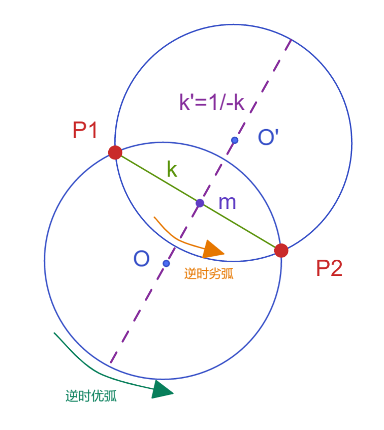

# 圆心求解专题

## 问题：

给出一个问题，在实平面上，已知不重合的两个点 $P_1(x_1,y_1) , P_2(x_2,y_2)$  ，两者位于某个半径为 $R$ 的圆上，此时需要求该圆的圆心位置，判断解与转向优劣弧关系；且让计算过程可使用使用编程求解；附C#代码；

## 解法：

可见我们需要将圆形坐标设为 $O(x,y)$，那么通过圆解析几何式就列出方程如下
$$
(x-x_1)^2+(y-y_1)^2=R^2 \\
(x-x_2)^2+(y-y_2)^2=R^2
$$
这个二元二次方程在数学方面求出来就可以了，我们可以预先判断出可能具有两个解；

但是计算机编程需要进行一定的简化技巧，计算机每次只能针对一个值求解析解，因此优先需要将二元化为一元；

我们先来看图



我们可见，已知圆上两点和半径，判断出可能的圆形有两处，且两点连线即为弦长，且其中垂线经过两个可能的圆心，那么中垂线上所有点的x坐标和y坐标具有一定的关系，该关系由中垂线的斜率决定，那么既然已知弦的斜率，那么中垂线的斜率也是可求的；

由于涉及斜率，所以我们首先需要假设两点不在同一y轴上（此时斜率无穷大，该情况可以退化计算，此处不考虑），于是具有如下公式；


$$
P_1P_2弦斜率 : k=\frac{y_2-y_1}{x_2-x_1} \\
弦中心点：m=(x_m,y_m)=(\frac{x_1+x_2}2,\frac{y_1+y_2}2)\\
中垂线斜率   : k'=-\frac1k=-\frac{x_2-x_1}{y_2-y_1} \\
k_{mO}=k_{mO'}=k_{OO'}=k' \to  \frac{y-y_m}{x-x_m} =k'\\
那么具有关系 y=y_m-\frac1k(x-x_m)
$$
此时圆心的坐标关联出现了，那么就可以将上述二元方程组改为一元方程求解，对每个方程都做一次展开
$$
(x-x_1)^2+(y-y_1)^2=R^2 \\
\to (x-x_1)^2+[y_m-\frac1k(x-x_m)-y_1]^2=R^2\\
\to (1+\frac1{k^2})x^2-2x[x_1+\frac1{k^2}x_m+\frac1k(y_m-y_1)]=R^2-x_1^2-[\frac1kx_m+(y_m-y_1)]^2 \\
同理第二方程也有 \\
 (1+\frac1{k^2})x^2-2x[x_2+\frac1{k^2}x_m+\frac1k(y_m-y_2)]=R^2-x_2^2-[\frac1kx_m+(y_m-y_2)]^2
$$
可见我们此时得到两个较为复杂的一元二次方程，使用简单的求根公式
$$
A =1+\frac1{k^2}  \\
B =x_2+\frac1{k^2}x_m+\frac1k(y_m-y_2) \\
C=-R^2+x_2^2+[\frac1kx_m+(y_m-y_2)]^2 \\
Ax^2+Bx+C=0,x=\frac{-B\pm\sqrt{B^2-4AC} }{2A}\\
$$
既然x求出那么y也就求出了，这里式子较为复杂不再赘述；

那么接下来的问题是，两个方程各自都算出了两个解，那么真正的圆心应该有四个才对，其实经过验证只有两个不同解；

接下来需要通过逆时针或顺时针或者劣弧优弧来判断需要选取哪一个？

由于上述的通解有个斜率限制，而斜率非无穷则决定了横坐标的大小不同，那么我们可以将两个解分为左解O和右解O'
我们再次根据上述的图，得出结论：

逆时针劣弧：右解O'

顺时针优弧：右解O'

顺时针劣弧：左解O

逆时针优弧：左解O

可见这里可以使用一个异或逻辑判断；


如下附C#代码

```c#
public static UV GetArcCenter(UV stp, UV edp, double radius, int majorArc, int clockwise)
{
    double x1 = stp.U;
    double y1 = stp.V;
    double x2 = edp.U;
    double y2 = edp.V;

    double dRadius = radius;

    /* 1:变量定义 */
    double k = 0.0, k_verticle = 0.0;      //圆弧上两点（起点和终点）线段的斜率 和 垂直于线段的斜率（圆心所在直线的斜率）
    double mid_x = 0.0, mid_y = 0.0;       //圆弧上两点（起点和终点）线段的中心位置坐标
    double a = 1.0;                        //一元二次方程二次项系数（求解圆心坐标的一元二次方程）
    double b = 1.0;                        //一元二次方程一次项系数（求解圆心坐标的一元二次方程）
    double c = 1.0;                        //一元二次方程常数项系数（求解圆心坐标的一元二次方程）
    double center_x1, center_y1, center_x2, center_y2;

    if (y2 == y1)                           //斜率为零，说明圆弧上两点（起点和终点）在同一水平线上面，
    {
        center_x1 = (x1 + x2) / 2.0;        //圆心x坐标为X之间中点
        center_x2 = (x1 + x2) / 2.0;        //圆心x坐标为X之间中点
        center_y1 = y1 + Math.Sqrt(dRadius * dRadius - (x1 - x2) * (x1 - x2) / 4.0); //圆心y坐标
        center_y2 = y2 - Math.Sqrt(dRadius * dRadius - (x1 - x2) * (x1 - x2) / 4.0); //圆心y坐标 
    }
    else if (x2 == x1)                      //斜率无穷大，说明圆弧上两点（起点和终点）在同一垂直线上面，
    {
        center_x1 = x1 + Math.Sqrt(dRadius * dRadius - (y1 - y2) * (y1 - y2) / 4.0); //圆心x坐标
        center_x2 = x2 - Math.Sqrt(dRadius * dRadius - (y1 - y2) * (y1 - y2) / 4.0); //圆心x坐标
        center_y1 = (y1 + y2) / 2.0;        //圆心y坐标为Y之间中点
        center_y2 = (y1 + y2) / 2.0;        //圆心y坐标为Y之间中点 
    }
    else
    {
        k = (y2 - y1) / (x2 - x1);          //圆弧上两点（起点和终点）线段斜率
        k_verticle = -1.0 / k;              //垂直于线段的斜率（圆心所在直线的斜率）
        mid_x = (x1 + x2) / 2.0;    //线段中心坐标X
        mid_y = (y1 + y2) / 2.0;    //线段中心坐标Y
        a = 1.0 + k_verticle * k_verticle;  //一元二次方程二次项系数（求解圆心坐标的一元二次方程）
        b = -2 * mid_x - k_verticle * k_verticle * (x1 + x2);   //一元二次方程一次项系数（求解圆心坐标的一元二次方程）
        c = mid_x * mid_x + k_verticle * k_verticle * (x1 + x2) * (x1 + x2) / 4.0 -
            (dRadius * dRadius - ((mid_x - x1) * (mid_x - x1) + (mid_y - y1) * (mid_y - y1)));  //一元二次方程常数项系数（求解圆心坐标的一元二次方程）

        center_x1 = (-1.0 * b + Math.Sqrt(b * b - 4 * a * c)) / (2 * a);     //求得坐标x(右上角)
        center_x2 = (-1.0 * b - Math.Sqrt(b * b - 4 * a * c)) / (2 * a);     //求得坐标x(左下角)
        center_y1 = Y_Coordinates(mid_x, mid_y, k_verticle, center_x1); //求得坐标y(右上角)
        center_y2 = Y_Coordinates(mid_x, mid_y, k_verticle, center_x2); //求得坐标y(左下角)
    } 
    
    //解判断
    UV center = UV.Zero;

    UV center1 = new UV(center_x1, center_y1); //(右上角)
    UV center2 = new UV(center_x2, center_y2); //(左下角)

    //clockwise 0 为逆  1 为顺
	///逆时针劣弧：右解O'
	///顺时针优弧：右解O'
	///顺时针劣弧：左解O
	///逆时针优弧：左解O
    if (y1 >= y2 && majorArc == 0 && clockwise == 0) { center = center1; }
    if (y1 >= y2 && majorArc == 0 && clockwise == 1) { center = center2; }
    if (y1 >= y2 && majorArc == 1 && clockwise == 0) { center = center2; }
    if (y1 >= y2 && majorArc == 1 && clockwise == 1) { center = center1; }

    if (y1 <= y2 && majorArc == 0 && clockwise == 0) { center = center2; }
    if (y1 <= y2 && majorArc == 0 && clockwise == 1) { center = center1; }
    if (y1 <= y2 && majorArc == 1 && clockwise == 0) { center = center1; }
    if (y1 <= y2 && majorArc == 1 && clockwise == 1) { center = center2; }


    //result
    //UV center = new UV(center_x, center_y);
    return center;
}


/// <summary>
///     函数功能：通过直线上一点和斜率，求得容易X下对应的Y的坐标值。
///       函数类型：立即函数，调用后立即生效。
///函数形参：
///	double x：直线上的一点的X坐标（圆弧两点的中点坐标）
///	double y：直线上的一点的Y坐标（圆弧两点的中点坐标）
///	double k：直线斜率（垂直于圆弧上两点的直线斜率）
///	double x0：直线上的一点的X坐标（圆心的X坐标）
///返 回 值：
///其他： 
/// </summary>
/// <param name="x"></param>
/// <param name="y"></param>
/// <param name="k"></param>
/// <param name="x0"></param>
/// <returns></returns>
static double Y_Coordinates(double x, double y, double k, double x0)
{
    return k * x0 - k * x + y;
}
```


 


