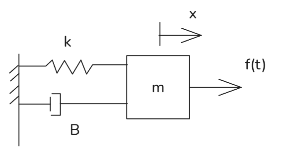
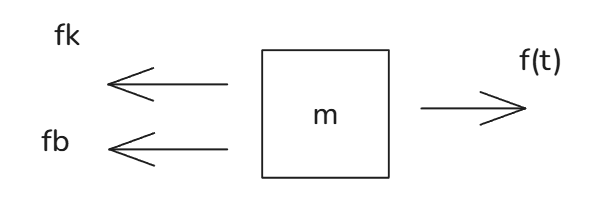

# 状态空间方程

[TOC]

## 基础模型

$$
输入：u(t)=f(t)
\\
输出：x
$$
这是一个 质量-弹簧-阻尼 mass spring damping 系统

## 传递函数

$$
f_k = kx
\\
f_B = B\dot x
\\
m\ddot x = f(t)-f_k-f_B= f(t)-kx-B\dot x 
\\\to 
m\ddot x+kx+B\dot x=f_k
\\
此时两侧进行laplace变换
\\
ms^2X(s)+BsX(s)+kX(s)=F(s)
\\
传递方程
G(s) = \frac{X(s)}{F(s)} = \frac1{ms^2+Bs+k}
$$

### 状态空间表达

state-space:状态空间 是另一种表达

集合 （输入 输出 状态变量）构成的 一阶微分方程
$$
把该式改为一阶
m\ddot x+kx+B\dot x=f_k
\\
令  z_1 = x, \dot z_1= \dot x = z_2,\dot z_2=\ddot x=\ddot z_1
\\
则
\\
\ddot x = \frac{f_k - kx - B\dot x }m =  \frac{f_k - kz_1 - B z_2 }m  
=\frac{ u(t)  }m -\frac{ k  }m z_1-\frac{ B }m z_2 = \dot z_2
\\
so:\frac{ u(t)  }m -\frac{ k  }m z_1-\frac{ B }m z_2 = \dot z_2
\\
然后写为矩阵
\\
\begin{bmatrix}
\dot z_1  \\ 
\dot z_2  \\ 
\end{bmatrix}
=\begin{bmatrix}
0 & 1  \\ 
-\frac km & -\frac Bm   \\ 
\end{bmatrix}
\begin{bmatrix}
 z_1  \\ 
 z_2  \\ 
\end{bmatrix}
+ 
\begin{bmatrix}
0  \\ 
\frac1m  \\ 
\end{bmatrix}
\begin{bmatrix}
u(t)  \\  
\end{bmatrix}
\\
由于y=x
\\
则 
y=
\begin{bmatrix}
1  & 0
\end{bmatrix}
\begin{bmatrix}
 z_1  \\ 
 z_2  \\ 
\end{bmatrix}
+
\begin{bmatrix}
0 \\  
\end{bmatrix}
\begin{bmatrix}
u(t)  \\  
\end{bmatrix}
$$
那么可以得到一个通用的矩阵形式
$$
\dot z = Az+Bu(t)
\\
y=Cz+Du(t)
$$

