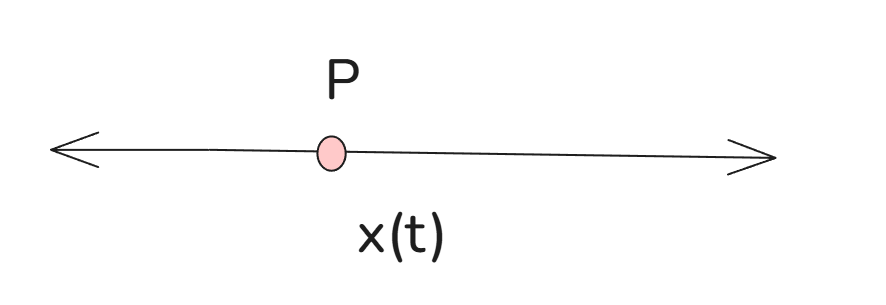
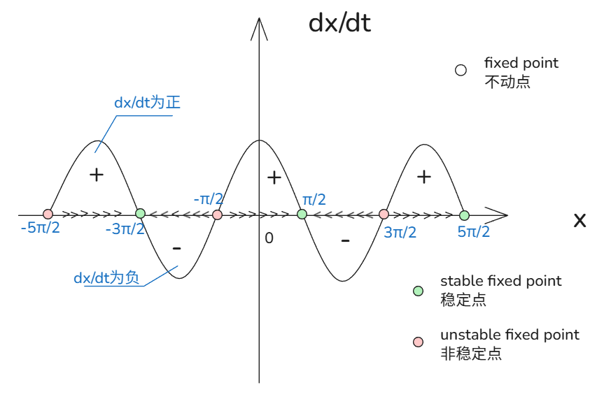

# 01_非线性动力学导论  Dynamical  Systems

[TOC]

## nonlinear dynamics 非线性动力学方程

ananlyze 1st order ODEs

1D system
$$
\frac{dx}{dt}=f(x)
$$

2D system
$$
\frac{dx}{dt}=g(x,t)
$$

$$
\frac{dx}{dt}\ is\ velocity 速度
\\
f(x)\ is\ position位置
\\
一般由当前速度和位置可以推测下一步的位置
$$

## e.g. 例 解一个简单非线性方程

$$
\frac{dx}{dt}=\cos(x)
\\
初始条件：x(x)=x_0
\\
找到当 t\to\infin 时 x 值
$$

由于可分解，有
$$
\int \frac{dx}{\cos x}=\int dt
\to
\int \sec x dx = t+c
\to
\ln|\sec x+\tan x|=t+c
\\
由初始条件：t=0,x=x_0\to \ln|\sec x_0+\tan x_0|=0+c
\to 
t=\ln|\frac{\sec x + \tan x}{\sec x_0 + \tan x_0}|
\\
当t\to \infin , 则\sec x + \tan x=\frac1{\cos x} + \frac{\sin x}{\cos x}\to \infin
\\
\cos x \to 0 , x = \frac\pi2, \frac{3\pi}2,...
$$
那么如果在一个更加复杂的式子呢？
$$
\frac{dx}{dx} = x^3-\sin x
$$
可能情况会更加复杂

## 图像分析

对方程绘图
$$
\frac{dx}{dt}=\cos(x)
$$

我们采用上述方程的图像进行分析

上图可见，当将 $dx/dt$ 作为因变量，当 $dx/dt>0$ 说明下接下来有变大的趋势则右移，否则  $dx/dt<0$ 就是左移动；
那么总能在 $dx/dt$ 正负交接处出现不动点 (fixed point)；
若两侧的趋势都是靠近不动点的，该点就是稳定点；
若两侧的趋势都是远离不动点的，该点就是非稳定点；

所以
当我的初始条件为$x=2\pi$ ，那么其x随t变大，最终稳定在$x=5\pi/2$ 处；
当我的初始条件为$x=\pi$ ，那么其x随t变大，最终稳定在$x=\pi/2$ 处；
当我的初始条件为$x=\pi/2$ ，那么其x不做任何变化，一直稳定在原处；
当我的初始条件为$x=-\pi/2$ ，那么其x不做任何变化，一直稳定在原处；

这个图像就是相图，其x轴就是相空间；

