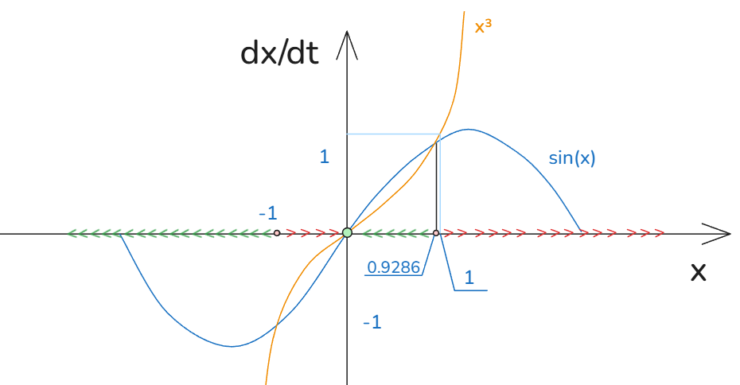

# 02_动力系统定义术语和分析

[TOC]

## 相空间 phase space

相空间：包含动力系统所有可能状态点的集合；对于1D动力系统，相空间就是X轴；

phase space : a se opf points whick contains all possible states of a dynamical system.For a 1-D dynamical system given by $dx/dt=f(x)$ phase space is the x-axis;

轨迹：基本上是直线或曲线，其表达微分方程给出动力系统变化路径，表示动力系统从某个初始条件出发遵循的变化路径；其包含在相空间内；

trajectory:path a dynamical system follows starting from the initial condition x0 ，path is contained in phase space;

相图：表达了微分动力方程的倾向和遵循的轨迹；

phase portrait:a graph which shows the trajectories a dynamical system/differential equation tends to follow.

这个图像就是相图

不动点：是微分方程的一个定点，其满足微分方程 $\frac{dx}{dt} = f(x)=0 时的x_f$    ，也称驻点、稳态点、平衡点；

fixed point: a fixed point of a dynamical system given by equition, AKA . stationary point , steady state ,equilibrium point

稳定点：即为附近轨迹会收敛的不动点；

stable fixed point:fixed point to which mearny trajectories converge.

稳定点：即为附近轨迹会发散的不动点；

unstable fixed point:fixed point to which mearny trajectories diverge.

## 分析1-D微分动力方程的步骤

steps to analyze $\frac{dx}{dt}=f(x)$

1. draw eht graph of f(x)
2. find hte fixed points graphjically , or by solving $\frac{dx}{dt}=f(x)=0$
3. draw the flows.
4. determine stability of the fixed points.
   fixed points where f(x) slopes down :stable
   fixed points where f(x) slopes up : unstable
5. determine trajectory starting from initial point x0;

1. 画出f(x)图像；
2. 找出不动点，一般是解方程 $\frac{dx}{dt}=f(x)=0$  得到；
3. 绘制大致图像；
4. 判断标记不动点；可能出现半稳定点
   发现
   一般下降趋势出现的定点是稳定点；
   上升趋势出现的定点是不稳定的；
5. 从初始条件判断其系统的后续走向

## e.g. 例

$$
\frac{dx}{dx} = x^3-\sin x
$$

绘制相图

$$
x^3>\sin x \Rightarrow \frac{dx}{dt} >0
\\
x^3<\sin x \Rightarrow \frac{dx}{dt} <0
$$

