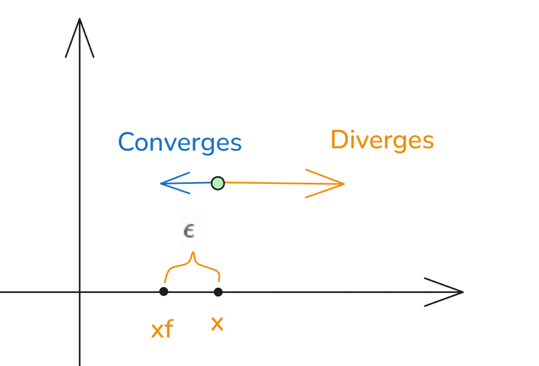

# 03_线性稳定性分析 Linear Stability Analysis

[TOC]

## 用处

线性稳定性分析可以让我们通过代数方法确定不动点稳定性，这样就可节约时间，无需绘图，即可知道发散和收敛情况；

allows algebraic determination of fixed point stability , gives information about bow quickly nearby trajectories converge / diverge  from the fixed points,linearize f(x) around the fixed points.

即为 一个局部小范围的线性变化情况；

## 分析

$$
\frac{dx}{dt} = f(x),x_f是其一个不动点
\\
考虑当有不动点周围微小扰动 \epsilon=x-x_f ,
\\
那么 \epsilon 随着时间如何变化？
$$

$$
\frac{d\epsilon}{dt} = \frac{dx}{dt}- \frac{dx_f}{dt}
\\
\frac{d\epsilon}{dt} =\frac{dx}{dt} =f(x)=f(\epsilon+x_f)
\\
\frac{d\epsilon}{dt} =f(x)=f(\epsilon+x_f)
$$
现在需要将所得的函数线性化 （泰勒展开）
$$
g(y)在y_0展开:g(y)=g(y_0)+g'(y_0)(y-y_0)+\frac{g''(y_0)}{2!}(y-y_0)^2+...
\\
\frac{d\epsilon}{dt}=f(\epsilon+x_f)在x_f展开：\\
f(\epsilon+x_f)
=f(x_f)+f'(x_f)(\epsilon+x_f-x_f)+O[(\epsilon+x_f-x_f)^2]
=f(x_f)+f'(x_f)\epsilon+O[\epsilon^2]
\\
f(x_f)=0
\\
so:
\\
\frac{d\epsilon}{dt}=f'(x_f)\epsilon \Rightarrow \epsilon(t)=\epsilon_0e^{f'(x_f)t}
\\
IF \ f'(x_f)>0 \ , x_f \to Diverge
\\
IF \ f'(x_f)<0 \ , x_f \to Converge
$$
if $f'(x_f)>0$ solutions near $x_f$ will diverge and point is unstable, fixed point of f(x) was unstable when graph of f(x) sloped upward ,which agrees with the fact that $f'(x_f)>0$ for instability.

可见若  其在不动点附近有 $f'(x_f)>0$ ，那么说明其函数为发散，且该定点非稳定。同样其函数有上升趋势，那么一样判断为该点不稳定；

 

thus,when finding the nature of fixed points of $dx/dt=f(x)$ 

1. differentiate f(x) w.r.t. x
2. evaluate f' at $x= x_f$
3. determine the sign of $f'(x)$

所以我们只需要找到其函数固定点处的一阶导数 $f'(x_f)$ 判断其和0的大小即可决定不动点的稳定性；

exponential must be dimensionless ,thus $f'(x_f)$ has dimension of 1/time ; 

指数无量纲，所以  $f'(x_f)$  的量纲为 1/t 
$$
\tau=\frac1{|f'(x_f)|}
$$

e.g.

找出不动点 $\frac{dx}{dt}=\cos x$

$$
\frac{dx}{dt}=\cos x = 0
\to x_f=\frac{2n+1}2\pi,
n \in Z
\\
f'(x)=-\sin(x)
\\
当 x_f=\frac{4k+1}2\pi,k \in Z , 有f'(x_f)=-\sin(x_f)=-1 ,x_f为稳定点；
\\
当 x_f=\frac{4k-1}2\pi,k \in Z , 有f'(x_f)=-\sin(x_f)=1 ,x_f为非稳定点；
$$

