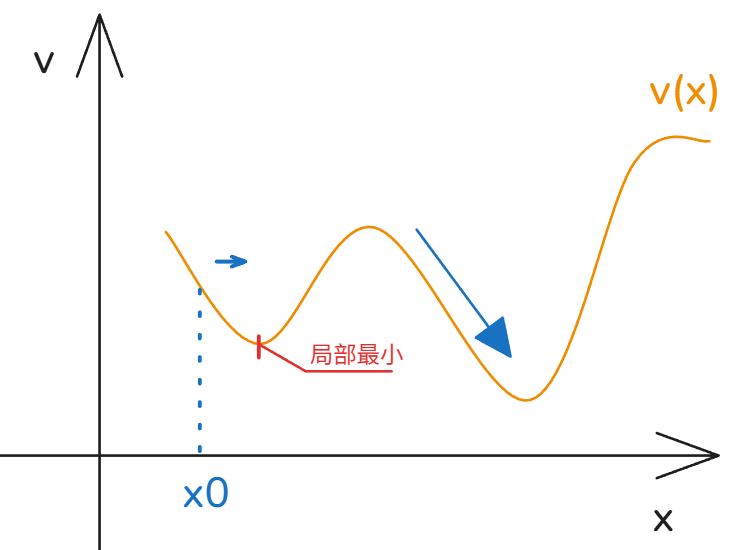
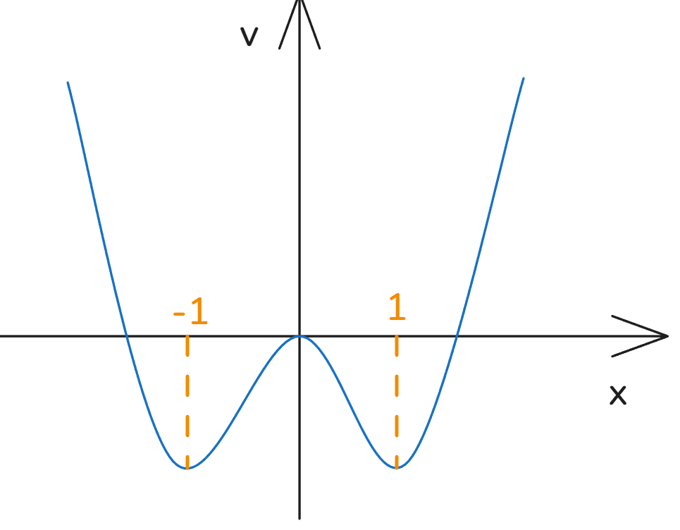

# 04_振荡的潜力和不可能性 Impossibility of Oscillations

[TOC]

## 证明

对于一个ODE来讲，其解 永远不可能为周期性的；

反证法可证明：

设解 $x(t)$ 是一个周期函数 ，周期为 $T>0$ 那么 $x(t)=x(t+T)$  ，得到
$$
\int^{t+T}_t f(x)\frac{dx}{dt}dt = \int_{x(t)}^{x(t+T)}f(x)dx =0
$$
然而，原式有
$$
\frac{dx}{dt} = f(x)
\to
\int^{t+T}_t f(x)\frac{dx}{dt}dt =\int^{t+T}_t( \frac{dx}{dt})^2 dt >0
$$
平方项通常为正，则与假设冲突；

### 注

振荡不可能性仅仅适用于一维自治系统，如果我有一个时间相关的ODE $\frac{dx}{dt} = f(x,t)$ 则不适用了；

## 势能概念

设
$$
\frac{dx}{dt} = f(x)
$$
则势能定义为
$$
\frac{dV}{dx}=f(x)
$$
根据链式法则
$$
\frac{dV}{dt} = \frac{dV}{dx}\frac{dx}{dt}=-f(x)f(x)
\to
\frac{dV}{dx}=-[f(x)]^2
$$
由于这里的函数为实数函数，则
$$
\frac{dV}{dx} \leq 0
$$
所以一维系统，其势能总是随着时间下降；

可见，
局部最小值即为动力系统收敛处，对应动力系统稳定固定点 stable fixed point
局部最大值即为动力系统发散处，对应动力系统非稳固定点 unstable fixed point

## 例

绘制下列方程势能图，找出方程固定点：
$$
\frac{dx}{dt} = x-x^3=f(x)
$$

**解：**
$$
\frac{dV}{dx} = -f(x) =  x^3-x 
\to 
V(x) = \frac{x^4}4-\frac{x^2}2+C
$$

那么可见 固定点为 $x_f=-1,0,1$

