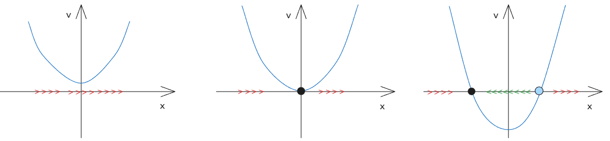
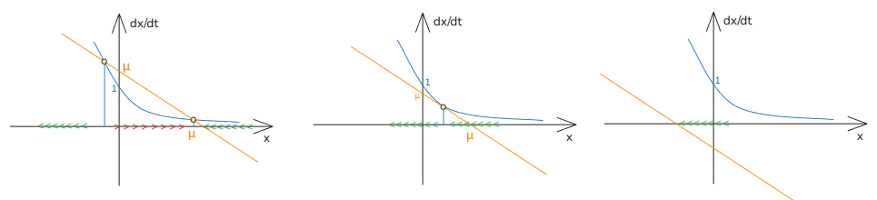

# 06_鞍结分岔 saddle node bifucation

[TOC]

## 鞍结分岔 

有方程
$$
\frac{dx}{dt} = x^2+\mu
$$
其中 $\mu$ 有三种可能
$$
\mu>0: \frac{dx}{dt} = 0 \to x^2 = -\mu \ 无实数解，无固定点
\\
\mu=0:\frac{dx}{dt} = 0 \to x^2 = -\mu=0 \to x_f = 0 , 唯一解，一个固定点
\\
\mu<0:\frac{dx}{dt} = 0 \to x^2 = -\mu=0 \to x_f =\pm\sqrt{-\mu},两个解，两个固定点
$$

## 分岔图 bifurcation diagram

坐标轴为   $x_f 和 \mu $  ，其中 $\mu$  为分岔临界参数，其分岔图如下：

分岔点：使得系统稳定性发生变化的点；
为找到分岔点，则需要让找出不动点稳定性的解；

$$
\frac{dx}{dt} = x^2+\mu
$$

上述动力系统则为典型的鞍结点分岔的系统微分方程；正规型；

## 例

$$
\frac{dx}{dt} = \mu-x - e^{-x}
$$

分析： 将 $\frac{dx}{dt}=\mu-x-e^{-x} $ 在 点 $\mu_c=1,x_{ft}=0$ 泰勒展开
$$
\frac{dx}{dt}=\mu-x-e^{-x}=\mu-x-(1-x+\frac{x^2}2-\frac{x^3}3+...)
\to 
\frac{dx}{dt} = (\mu-1)-\frac{x^2}2
$$
可见与标准型  $\frac{dx}{dt} = x^2+\mu$ 非常相似

## 总结

所以一般来说，在动力系统  $\frac{dx}{dt} = f(x,\mu)$ 带有分岔点 $(\mu_c,x_{ft})$ 
可以在该点进行泰勒展开，得到 $\frac{dx}{dt}=a(\mu-\mu_c)+b(x-x_{ft})^2$

