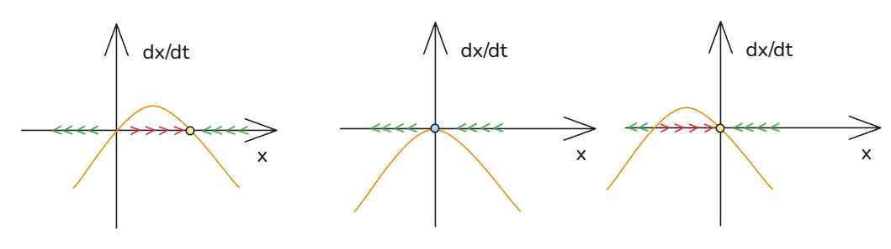
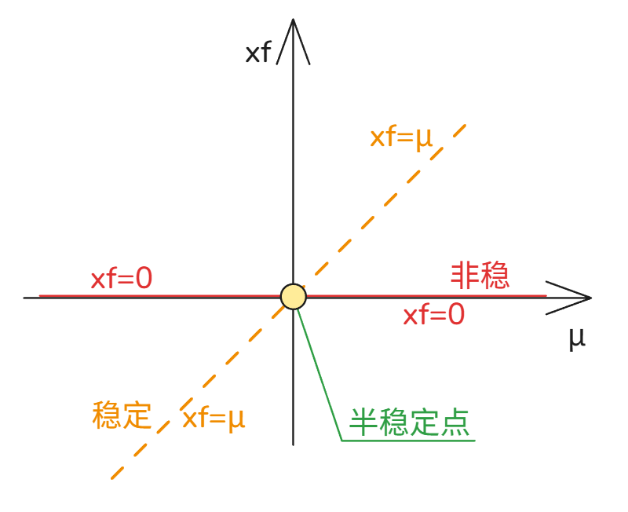

# 07_跨临界分岔  transcritical bifurcations

[TOC]

考虑如下系统的不动点、函数图、分岔图：
$$
\frac{dx}{dt} =\mu x - x^2
$$

$$
\mu > 0 :\mu x_f - x_f^2 = 0 \to x_{f1}= 0 ,x_{f2}=  \mu
\\
\mu = 0 : \mu x_f - x_f^2 = - x_f^2=0 \to x_{f}= 0 
\\
\mu < 0 :\mu x_f - x_f^2 = 0 \to x_{f1}= 0 ,x_{f2}=  \mu
$$
分岔图:

所以 其为跨临界分岔系统的标准型：
$$
\frac{dx}{dt} =\mu x - x^2
$$

### 例

有
$$
\frac{dx}{dt} = \mu\ln{x}+x-1
$$
可见有个简单的解：
$$
 \mu\ln{x}+x-1 = 0 \to x_f =1
$$
依照线性稳定性分析：
$$
f(x) = \mu\ln{x}+x-1
\to 
f'(x)=\frac\mu x+1
\\
当 x = 1时,f'(x)= \mu +1
\\
\mu > -1 :\mu +1 > 0 \to f'(x)>  0\to 非稳 
\\
\mu = -1 :\mu +1 = 0 \to f'(x)= 0 \to 半稳
\\
\mu < -1 :\mu +1 < 0 \to f'(x)< 0 \to  稳定
$$
 

