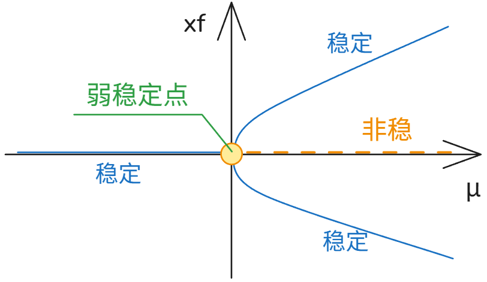
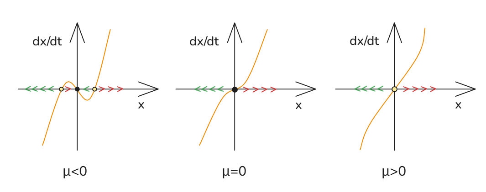

# 08_超临界分岔与亚临界分岔 fitchfork bifurcations

[TOC]

## 介绍

两种变体：
超临界分岔 supercritical pitchfork
亚临界分岔 subritical pitchfork

## 超临界分岔  supercritical pitchfork

考虑 如下系统
$$
\frac{dx}{dt} = \mu x - x^3
$$

找出不动点
$$
\frac{dx}{dt}= \mu x - x^3 = (\mu+x_f)(\mu-x_f)x_f = 0
\to
可能的解：
x_{f1}=0,x_{f2}= \sqrt{\mu},x_{f3}= -\sqrt{\mu}
\\
\\
\mu > 0 : x_{f1}=0,x_{f2}= \sqrt{\mu},x_{f3}= -\sqrt{\mu}
\\
\mu = 0 : x_f=0 
\\
\mu < 0 : x_f=0
$$
可见 0  为一直存在的不动点

### 线性稳定性分析

当
$$
f(x) = \mu x - x^3
\to 
f'_x = \mu-3x^2
\\
$$
先看 0 解
$$
在 x_f = 0  时,\frac{df}{dx} = \mu 
\\
则
\\
\mu>0:\frac{df}{dx} = \mu  >0 \to 非稳
\\
\mu=0:\frac{df}{dx} = \mu  = 0 \to 半稳
\\
\mu<0:\frac{df}{dx} = \mu  <0 \to 稳定
$$

但是线性的限制导致判断错误，这里半稳情况其实是弱稳定的；
线性稳定性分析无法捕捉到弱稳定性；我们需要更加高阶的分析手段；
$$
在\mu>0, x_f=+\sqrt{\mu} 时,f'_x = -2\mu <0 \to 稳定
\\
在\mu>0, x_f=-\sqrt{\mu} 时,f'_x = -2\mu <0 \to 稳定
$$

### 分岔图

可见 参数 从负变正时，原本零点处固定点改变了性质，分叉为两个稳定点 和一个非稳固定点 

故该方程为超临界分岔系统标准型
$$
\frac{dx}{dt} = \mu x - x^3
$$

## 亚临界分岔  subritical pitchfork

标准型为
$$
\frac{dx}{dt} = \mu x + x^3
$$
寻找固定点：
$$
\frac{dx}{dt}= \mu x + x^3 = (\mu+x^2_f) x_f = 0
\to
可能的解：
x_{f1}=0,x_{f2}= \sqrt{-\mu},x_{f3}= -\sqrt{-\mu}
\\
\\
\mu < 0 : x_{f1}=0,x_{f2}= \sqrt{-\mu},x_{f3}= -\sqrt{-\mu}
\\
\mu = 0 : x_f=0 
\\
\mu > 0 : x_f=0
$$

### 线性稳定性分析

0解时
$$
在 x_f = 0  时, f'= \mu   + 3x^2=\mu
\\
则
\\
\mu>0:\frac{df}{dx} = \mu  >0 \to 非稳
\\
\mu=0:\frac{df}{dx} = \mu  = 0 \to 半稳
\\
\mu<0:\frac{df}{dx} = \mu  <0 \to 稳定
$$
其他解
$$
在\mu<0, x_f=+\sqrt{-\mu} 时,f'_x = -2\mu >0 \to 非稳 
\\
在\mu<0, x_f=-\sqrt{-\mu} 时,f'_x = -2\mu >0 \to 非稳 
$$

### 系统图像

### 分岔图

可见 参数 从负变正时，原本零点处固定点改变了性质，原本两个非稳定点 和 一个稳定点 消失了 ， 合并为一个非稳定的固定点 ；

