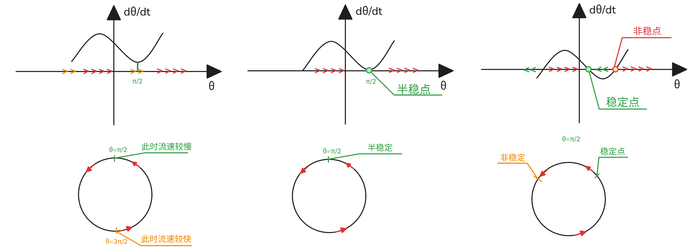

# 09_圆上的动力系统 flows on a circle 

[TOC]

## 圆上动力系统

$\frac{dx}{dt}=f(x)$ 在一个线性系统内定义向量场，x为直线上的变量；

$\frac{d\theta}{dt}=g(\theta)$ 在一个极坐标系统内定义向量场，$\theta$ 为定义在圆上的变量；

圆上定义，可以让系统振荡；

 若 $f(\theta)$ 是圆上的向量场，那么其必然周期性，且周期必然是 $2\pi$ 
$$
f(\theta+2\pi) = f(\theta),\theta \in R
$$
该周期必然性可以反证证明；

## 例

### 均匀振子 uniform oscillator

$$
\frac{d\theta}{dt} =\omega,\omega=const
\\
\theta(t)=\omega t +\theta_0 
\\
$$

### 非均匀振子  non-uniform oscillator

$$
\frac{d\theta}{dt} = \omega - a\sin{\theta}
\\a,\omega\geq 0
$$
求不动点
$$
\omega-a\sin{\theta_f} = 0
\to 
\theta_f=\arcsin{\frac\omega a}
\\
\omega > a: \frac\omega a > 1 \to \arcsin{\frac\omega a}  不成立,  没有固定点
\\
\omega = a：\arcsin{1} =\frac\pi2+2n\pi,n\in Z\to   \frac\pi2 和 \frac{5\pi}2 重合，仅一个固定点
\\
\omega <  a ：\arcsin{\frac\omega a} 在2\pi范围内， 有两个解\to 两个固定点
\\
比如 \arcsin{\frac\omega a}  = \arcsin{0.5}  = \frac\pi6,\frac{5\pi}6
$$
  

