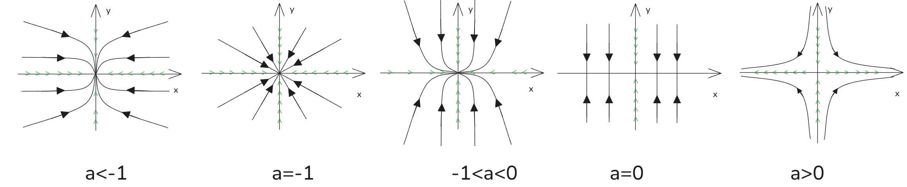
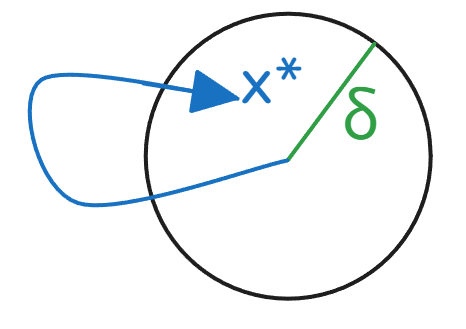

# 10_二维动力系统 2-dimensional dynamical system : linear systems

[TOC]

## 介绍

二维动力系统包含两个函数 ， $ x(t) , y(t)$  ，不出现平方或者高阶对象
$$
\frac{dx}{dt} = f(x,y)
\\
\frac{dy}{dt}  = g(x,y)
$$
由于其线性特性可写为
$$
\frac{dx}{dt} = f(x,y) = ax+by
\\
\frac{dy}{dt}  = g(x,y)=cx+dy
\\
\begin{bmatrix}
\frac{dx}{dt}\\
\frac{dy}{dt}
\end{bmatrix}
=
\begin{bmatrix}
a & b\\
c & d\\
\end{bmatrix}
\begin{bmatrix}
x\\
y\\
\end{bmatrix}

\\
\vec {\dot x} = A\vec x
$$

性质1：$\vec x = \begin{bmatrix} 0\\0 \end{bmatrix} = \vec 0$  为固定点
性质2：其遵循常规的线性特性，  动力系统有解 $ \vec x_1\vec x_2 $,  则  $ c_1\vec x_1+ c_2\vec x_2$ 也是系统的解；
当二维系统方程存在常数项目，那么两个性质就都不存在了

## 例

$$
\frac{dx}{dt} =ax , \frac{dy}{dt}=-y
\\
\begin{bmatrix}
\frac{dx}{dt}\\
\frac{dy}{dt}
\end{bmatrix}
=
\begin{bmatrix}
a & 0\\
0 & -1\\
\end{bmatrix}
\begin{bmatrix}
x\\
y\\
\end{bmatrix}
$$

可见这是一个非耦合的方程系统 uncouple dynamical，$\frac{dx}{dt} $ 之和 x 有关 $\frac{dy}{dt} $ 之和y有关；

其中$\vec x = \begin{bmatrix} x_f\\y_f \end{bmatrix} = \vec 0$ 为系统的固定点；

直接解可得
$$
\frac{dx}{dt} = ax \to x = x_0e^{at},x_0=x(0)
\\
\frac{dy}{dt} = -y \to y = y_0e^{-t},y_0=y(0)
$$

## 相图

我们需要不同的a分类分析
$$
a<-1: x轴收敛，y轴收敛，x轴比y轴收敛速度快
\\
a=-1: x轴收敛，y轴收敛，x轴比y轴收敛速度相同
\\
-1<a<0:x轴收敛，y轴收敛，y轴比x轴收敛速度快
\\
a=0:x轴为常数不收敛，而y轴依然收敛
\\
a>0:y轴收敛，x轴发散
$$

## 术语 terminology

固定点为原点$ x^* = (0,0)$ 

稳定结点 stable node ： 在上述前三种情况下，其 $x^*$ 为稳定结点， 即为 x，y 都汇聚；

鞍点 saddle point： 如同马鞍，情景5中就是只有一个固定点，在y方向是稳定的，其他方向则非稳定；

稳定流形： 情景5中，y轴就是稳定流形，而x是非稳定流形 ， 稳定流形就是根据初始条件，状态会趋于固定点；

非稳定流形： 情景5中，x是非稳定流形 ，**其时间反向时，状态归于固定点才能成为非稳定流形**；

吸引点：原点$ x^* = (0,0)$  就是吸引点，从任意处出发都会在长时间后回到固定点；
$$
若有 \delta >0 使得 \lim_{t\to\infin}=\vec x^* 在||\vec x(0)-\vec x^*||<\delta,则在\vec x^*的\delta半径内为吸引区
$$

## 李雅普诺夫稳定性

$$
从x^*附近 \delta 范围出发的轨迹 ，始终在x^*附近有限值 \epsilon范围内运动
	\\
\vec x^* 是李雅普诺夫稳定点：对于所有  \epsilon>0 ,有 \delta>0使得||\vec x(0)-\vec x^*||<\epsilon，有任意t>0和||\vec x(0)-\vec x^*||<\delta
$$

