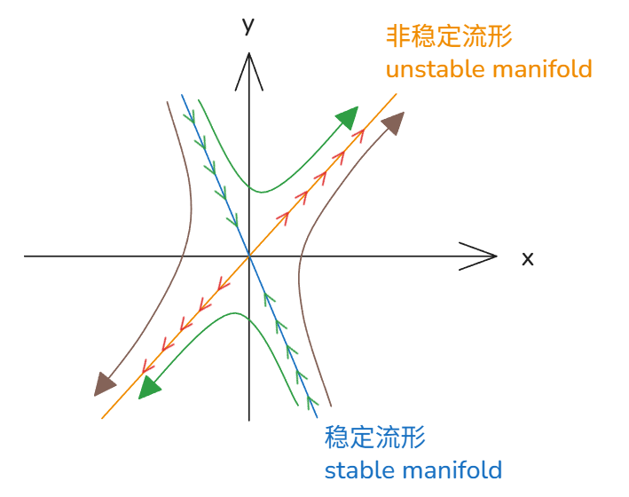

# 11_特征值分析二维系统

[TOC]

给出
$$
\frac{dx}{dt} = f(x,y) = ax+by
\\
\frac{dy}{dt}  = g(x,y)=cx+dy
\\
\begin{bmatrix}
\frac{dx}{dt}\\
\frac{dy}{dt}
\end{bmatrix}
=
\begin{bmatrix}
a & b\\
c & d\\
\end{bmatrix}
\begin{bmatrix}
x\\
y\\
\end{bmatrix}

\\
\vec {\dot x} = A\vec x
$$
给出例
$$
\vec{\dot x} = 
\begin{bmatrix}
a&0\\
0&-1
\end{bmatrix}
\vec x
\to
\vec x = 
\begin{bmatrix}
x_0e^{at}\\
y_0e^{-t}
\end{bmatrix}
=
x_0
\begin{bmatrix}
1\\
0
\end{bmatrix}
e^{at}
+
y_0
\begin{bmatrix}
0\\
1
\end{bmatrix}
e^{-t}
$$

我们对如下矩阵寻找特征值
$$
\begin{bmatrix}
a&0\\
0&-1
\end{bmatrix}
\to 
\lambda_1 = 1,\lambda_2 =-1,
$$
可发现，其特征值就是方程指数解的指数！

再次寻找特征向量
$$
\begin{bmatrix}
a&0\\
0&-1
\end{bmatrix}
\to 
\vec v_1=
\begin{bmatrix}
1\\
0
\end{bmatrix}
,
\vec v_2=
\begin{bmatrix}
0\\
1
\end{bmatrix}
$$
可见这就是上述的各轴的相同向量

由此可见 若求出了矩阵的特征值和特征向量则能构造出解
$$
\vec x = c_1\vec v_1 e^{\lambda_1t}+ c_2\vec v_2 e^{\lambda_2t}
\\
 c 由初值决定
$$

## 例

$$
\frac{dx}{dt} = f(x,y) =  x+ y
\\
\frac{dy}{dt}  = g(x,y)=4x-2y
\\
\begin{bmatrix}
\frac{dx}{dt}\\
\frac{dy}{dt}
\end{bmatrix}
=
\begin{bmatrix}
1 & 1\\
4 & -2\\
\end{bmatrix}
\begin{bmatrix}
x\\
y\\
\end{bmatrix}

\\
\vec {\dot x} = A\vec x
$$

### 解

$$
\begin{bmatrix}
1 & 1\\
4 & -2\\
\end{bmatrix} 
\to 
A\vec v = \lambda\vec v
\\
\lambda_1=-3,\lambda_2=2
\\
\vec v_1=
\begin{bmatrix}
1\\
-4
\end{bmatrix}
,
\vec v_2=
\begin{bmatrix}
1\\
1
\end{bmatrix}
$$

$$
\vec x =  
\begin{bmatrix}
x(t)\\
y(t)
\end{bmatrix} 
=
c_1
\begin{bmatrix}
1\\
-4
\end{bmatrix} 
e^{-3t}
+c_2
\begin{bmatrix}
1\\
1
\end{bmatrix} 
e^{2t}
$$

### 相图绘制

首先沿着特征向量方向绘制直线
$$
\vec x  
=
c_1
\begin{bmatrix}
1\\
-4
\end{bmatrix} 
e^{-3t}
+c_2
\begin{bmatrix}
1\\
1
\end{bmatrix} 
e^{2t}
\\
c_2=0 \to
\vec x  
=
c_1
\begin{bmatrix}
1\\
-4
\end{bmatrix} 
e^{-3t} 
\\
c_1 = 0 \to 
\vec x  
= c_2
\begin{bmatrix}
1\\
1
\end{bmatrix} 
e^{2t}
$$

