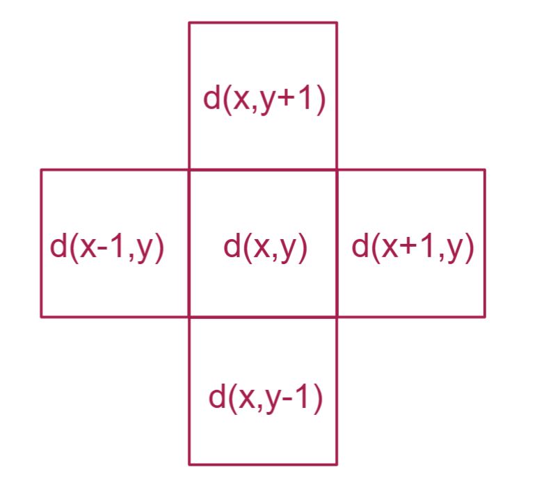
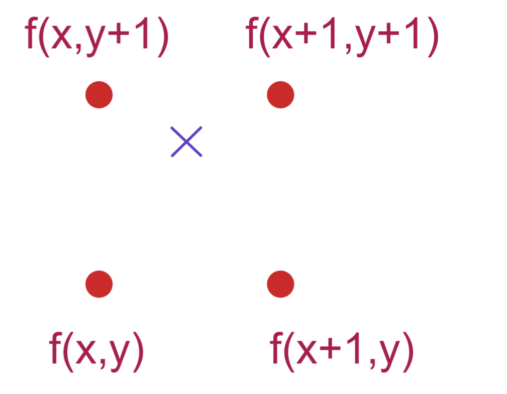

# 流体模拟数学解算原理

[TOC]

## 纳维斯托克斯方程 Navier-Stokes Equations

$$
\nabla \cdot u = 0
\\
\rho\frac{D_u}{D_t}=-\nabla p+\mu\nabla^2u+\rho F
$$
首个等式意义为散度为 0  ，这是密度不变时的守恒方程 ；

第二个等式表达为 ，流体的加速度 决定于  压力梯度 和 粘度 和 外力影响

如果区域之间的压差过大 则 压力梯度就越大，流体就从高压区流向低压区；
粘度意味着流体颗粒之间的摩擦力大，其中一点的速度很快像周围扩散；高粘度流体比如蜂蜜这种非牛顿流体；
外力则包括中立和流体或者周围墙壁中物体干扰等；

这里的原理只是阐明了必须遵守的规则，单对于流体模拟过程是几乎没有用的；

## 网格

由于流体模拟主要为欧拉法和拉格朗日法，欧拉法考察固定分隔空间中的流体微团物理量的变化，拉格朗日则假定微团为颗粒在流场中四处流动时的物理量变化；

欧拉法较为直观，这里直接采用画网格的欧拉法来举例；

欧拉法对空间划分网格，并考察每个空间内流体的相互影响和随时间的物理量变化；网格内考察的物理量，除了速度还能够有其他物理量，如密度、湿度、温度等，但是最终计算的数值都规约到速度属性上；

## 扩散 diffusion

一个流体微团在其周围的扩散影响，有网格如下：

有一个当前流体微团密度  $d_c(x,y) $ 其密度为周围微团密度的平均

$s(x,y)=\frac{d(x+1,y)+d(x-1,y)+d(x,y+1)+d(x,y-1)}4$

假设改变量为 $d_c$ 为当前属性，  $d_n$ 为下一单位时间属性；

此时我们逐渐改变值得 以达到当前值和周围均值的一致  $d(x,y)\to s(x,y)$ 

### 当前解未来

于是得到了由当前解未来的公式

$d_n=d_c+k(S_c-d_c), S_c=\frac{d_c(x+1,y)+d_c(x-1,y)+d_c(x,y+1)+d_c(x,y-1)}4$

但是这个线性插值有问题，如果K 增加则最终会超过1 ， 导致不稳定或者密度变负，模拟时跳动；

### 未来解未来

于是采用一种由未来返回的方式，这样构造一个双曲关系， K 无限增加则结果接近 1，趋于稳态；

$d_c=d_n-(S_n-d_n) \to \\ d_n=\frac{d_c+kS_n}{1+k} , S_n=\frac{d_n(x+1,y)+d_n(x-1,y)+d_n(x,y+1)+d_n(x,y-1)}4$

但是上述的$S_n$ 我们不知道，于是采用矩阵求解，对网格 $ (x+1,y) $ 来说
$$
d_n(x+1,y)=\frac{d_c(x+1,y)+kS_n}{1+k} \\
S_n=\frac{d_n(x+1,y)+d_n(x-1,y)+d_n(x,y+1)+d_n(x,y-1)}4\\ 
d_n(x+1,y)=\frac{d_c(x+1,y)+\frac{k}4[d_n(x+1,y)+d_n(x-1,y)+d_n(x,y+1)+d_n(x,y-1)]}{1+k} \\ 
d_n(x+1,y)=\frac{ 4d_c(x+1,y)+k[d_n(x+1,y)+d_n(x-1,y)+d_n(x,y+1)+d_n(x,y-1)]}{4 (1+k)} \\
\\
$$
 那么我们针对所有周边网格$(x+1,y),(x-1,y),(x,y+1),(x,y-1)$联立方程
$$
d_n(x+1,y)=\frac{ 4d_c(x+1,y)+k[d_n(x+1,y)+d_n(x-1,y)+d_n(x,y+1)+d_n(x,y-1)]}{4 (1+k)} \\
d_n(x-1,y)=\frac{ 4d_c(x-1,y)+k[d_n(x+1,y)+d_n(x-1,y)+d_n(x,y+1)+d_n(x,y-1)]}{4 (1+k)} \\
d_n(x,y+1)=\frac{ 4d_c(x,y+1)+k[d_n(x+1,y)+d_n(x-1,y)+d_n(x,y+1)+d_n(x,y-1)]}{4 (1+k)} \\
d_n(x,y-1)=\frac{ 4d_c(x,y-1)+k[d_n(x+1,y)+d_n(x-1,y)+d_n(x,y+1)+d_n(x,y-1)]}{4 (1+k)} \\
$$
化简
$$
d_n(x+1,y)=\frac1{4+3k} \{4d_c(x+1,y)+k[d_n(x-1,y)+d_n(x,y+1)+d_n(x,y-1)]\}\\
d_n(x-1,y)=\frac1{4+3k} \{4d_c(x-1,y)+k[d_n(x+1,y)+d_n(x,y+1)+d_n(x,y-1)]\}\\
d_n(x,y+1)=\frac1{4+3k} \{4d_c(x,y+1)+k[d_n(x+1,y)+d_n(x-1,y)+d_n(x,y-1)]\}\\
d_n(x,y-1)=\frac1{4+3k} \{4d_c(x,y-1)+k[d_n(x+1,y)+d_n(x-1,y)+d_n(x,y+1)]\}\\
$$

为了便于计算机快速迭代求解，这里需要使用进行高斯赛德尔迭代法求解

------

这里简单举例
$$
4x-2y+z=-2 \\
3x+6y-2z=49 \\
-x-3y+5z=-31 \\
\\
x=\frac{-2+2y-z}4\\
y=\frac{49-3x+2z}6\\
z=\frac{-31+x+3y}5
$$

| iteration | 0    | 1      | 2      | 3      | 4      |
| --------- | ---- | ------ | ------ | ------ | ------ |
| x         | 0    | -0.5   | 4.021  | 2.858  | 3.038  |
| y         | 0    | 8.417  | 5.740  | 6.087  | 5.989  |
| z         | 0    | -1.250 | -1.952 | -1.976 | -1.999 |

给定初始值，步步逼近即可；

但是注意一个条件：矩阵整个主对角线的系数必须大于其该行内所有系数的大小和，否则将收敛到其他区域或者发散；

所以在对矩阵迭代前需要作矩阵特征化；

----

当然对于我们上述流体模拟的矩阵来说 每个系数都是  1/4  ， 正好适用；

由此重复解方程，密度就会扩散到应该有的扩散密度 

## 平流 advection

流体流动时，微团密度传递方向几乎不会直接只作用于下一个微团的质心，无法简单相加，那么再次采用回溯法，寻找下一单位时间四个相邻的微团密度的线性平均作用，以找到目标密度；

假设 $f=(x,y)-v(x,y)\Delta t$  对于 f 取得整数部分和小数部分；
$$
f=(x,y)-v(x,y)\Delta t   \\
i_x=floor(f_x) 	\\ 
i_y=floor(f_y) 	\\ 
-e.g. floor(12.36) = 12 \\
j_x=fract(f_x) 	\\ 
j_y=fract(f_y) 	\\ 
-e.g. fract(12.36) = 0.36 \\
$$
首先取得四个点中的整数部分，和小数部分，小数部分作为线性差分系数
$$
lerp(a,b,k) = a+k(b-a) \\
z_1=lerp[d(i_x,i_y),d(i_x+1,i_y),j_x] \\
z_2=lerp[d(i_x,i_y+1),d(i_x+1,i_y+1),j_x] \\
d_n=lerp(z_1,z_2,j_y)
$$
采用线性插值做法，对横向两行行内做x插值，然后将结果做y插值；以得到结果；

## 清除散度 clearing divergence

我们在任何向量场内 都可以将其表现为 散度场和旋度场之和；

由于理论上不可压缩流体不可能无故出现和消失，所以我们只希望模拟时速度场内只出现旋度，而消除流体散度；

但是我们进行了扩散和平流计算得到速度场是散度和旋度混合的，故要提取无散度部分；

### 赫尔姆 霍兹 分解

矢量微积分基本定理，任何矢量场都可以表达为两个矢量场的和，一个没有散度，一个没有旋度 ； 

由于无法直接计算无散度部分的方法，我们决定先计算无旋度部分然后在原场扣除该部分即可；

原场 = 无散场 + 无旋场   

无散场 = 原场 - 无旋场（仅散度）

### 计算无旋场 即 仅计算散度场

$$
\nabla \cdot v(x,y) = \frac{\Delta v_x+\Delta v_y}2 \\
\nabla \cdot v(x,y) = \frac{v_x(x+1,y)-v_x(x-1,y)+v_y(x,y+1)-v_y(x,y-1)}2 \\
$$

某点速度场的散度为 x方向速度差 和 y方向速度差的 平均 ， 可见如果远离集散点的速度大，靠近集散点的流场速度小，则梯度是正的，则流出多于流入，反之亦然；

将速度场放入位置计算
$$
p(x,y) = \frac{[p(x+1,y)+p(x-1,y)+p(x,y+1)+p(x,y-1)]-\nabla \cdot v(x,y) }4
$$
可以再次做高斯赛德尔迭代求得4个P值

有一个P的标量场，构造并找到这个场的梯度向量场；
$$
\nabla  p(x,y) = (\frac{p(x+1,y)-p(x-1,y)}2,\frac{p(x,y+1)-p(x,y-1)}2) \\ 
$$
此时P的梯度向量场没有旋度，这就是需要求的无旋场；

## 格子玻尔兹曼算法

### 网格情况

既然选用了欧拉法，首先需要指定网格分为两种 

第二种交错网格能够更好的分析微团的流体出入情况，

### 三步走

模拟一般分为三步：

1 外力调整速度，一般只加重力
2 流体不可压缩 ，投影
3 计算不同单元速度场，也叫平流

#### 第一步：外力

我们遍历场中所有微团单元格的ij，且将重力影响$\Delta t \cdot g$ 加入垂直速度分量，g 就是重力加速度，时间步长可以为 0.02 秒
$$
{v_n}_{(i,j)} ={v_c}_{(i,j)} + \Delta t \cdot g  
\\
Gravity:g=-9.81 m/s
\\
Timestep:\Delta t = \frac1{30} s
$$
#### 第二步：不可压缩投影，边界处理

注意：此步骤考察，单个微团和周围微团之间的影响随着时间的渐变；

此处是决定流体不可压缩性，需要利用散度概念；
一个微团在一个单位时间步长内， 散度和其流出的液体总量成正比；如图：

$$
d \leftarrow u_{i+1,j}-u_{i,j}+v_{i,j+1}-v_{i,j}
$$
这里规定了右侧流出为正，流入为负，左侧则正负符号相反，左侧流入为正，流出为负；符号规则上下亦然；

而不可压缩决定了，流体微团必须散度为0，流出和流入的液体总量是相同的；

首先将某一时刻的散度计算出来，然后将该散度在其四个边界分量上分别施加四分之一的影响，以此保证散度为0

$$
d \leftarrow u_{i+1,j}-u_{i,j}+v_{i,j+1}-v_{i,j} 
\\
{u_n}_{(i,j)}  \leftarrow {u_c}_{(i,j)}  + \frac d4
\\
{u_n}_{(i+1,j)}  \leftarrow {u_c}_{(i+1,j)}  - \frac d4
\\
{v_n}_{(i,j)}  \leftarrow {v_c}_{(i,j)}  + \frac d4
\\
{v_n}_{(i,j+1)}  \leftarrow {v_c}_{(i,j+1)}  - \frac d4
$$
如果此时左侧为墙面直接阻挡时，那么该微团则只有三个面需要处理  那么散度的修正分量就需要变为三分之一，如图

$$
u_{i,j} = 0
\\
{u_n}_{(i+1,j)}  \leftarrow {u_c}_{(i+1,j)}  - \frac d3
\\
{v_n}_{(i,j)}  \leftarrow {v_c}_{(i,j)}  + \frac d3
\\
{v_n}_{(i,j+1)}  \leftarrow {v_c}_{(i,j+1)}  - \frac d3
$$
当然这里抛弃的 $u_{i+1,j}$ 通常为0
但是如果这个固体界面在移动，那么这里也会出现一个非零的量 $u_{i,j} \neq 0$，常常用在叶轮对流体的作用模拟上；

于是可以优化上述式子 将每个 单元存入一个标量值，如果为固定的就设置0自由单元则设置1 ；
$$
d \leftarrow u_{i+1,j}-u_{i,j}+v_{i,j+1}-v_{i,j} 
\\
s \leftarrow s_{i+1,j}+s_{i-1,j}+s_{i,j+1}+s_{i,j-1} 
\\
{u_n}_{(i,j)}  \leftarrow {u_c}_{(i,j)}  + \frac {s_{i-1,j}}s d
\\
{u_n}_{(i+1,j)}  \leftarrow {u_c}_{(i+1,j)}  +\frac {s_{i+1,j}}s d 
\\
{v_n}_{(i,j)}  \leftarrow {v_c}_{(i,j)}  +  \frac {s_{i,j-1}}s d 
\\
{v_n}_{(i,j+1)}  \leftarrow {v_c}_{(i,j+1)} +  \frac {s_{i,j+1}}s d
$$
那么 这里用到了上一节说过的高斯赛德尔方法；

给定所有网格的初值，不断在上式做迭代，由初始四个速度求出散度，散度放入公式计算出下一刻四个速度，并再次迭代计算散度；

$(u,v)_{t=0} \to (d,s)_{t=0} \to (u,v)_{t=1} \to (d,s)_{t=1} \to (u,v)_{t=2} \to (d,s)_{t=2}  \to ...$

但是在边界部分需要小心对待，我们采用扩大网格的方式来处理，用更大的网格覆盖原有的流场，并流出一到两个网格边界，让边界外围网格设定为固定壁面或者和相邻单位元格共享一样的属性（压力密度）等；

##### 附：压力计算

进行流体模拟时，我们在每个单元格中存入压力值，开始时设定压力为0，然后在每个单元格的【投影】之后用这个方程更新压力值；
$$
p_{i,j} \leftarrow 0
\\
p_{i,j} \leftarrow p_{i,j} + \frac ds\cdot \frac{\rho h}{\Delta t}
\\
\rho 为流体密度，h为网格间距，\Delta t 为时间步长 ， d 依然为上述散度 ， s依然为上述标量场
$$
要注意，压力是提供了额外的信息，而不是模拟必须的项；

然后我们需要考虑如何加速高斯塞尔德迭代，将其快速收敛；

方法叫做 overrelaxation-magic，一般用来保证压力值的正确性；
将散度d 乘以一个常数，该数值范围在1-2之间，其越大越好，一般为1.9
$$
d \leftarrow c(u_{i+1,j}-u_{i,j}+v_{i,j+1}-v_{i,j} ) 
\\
1<c<2,set \ c=1.9
$$

### 第三步：平流

由于流体的速度是由粒子（流体微团）携带的，粒子是动态移动的，而网格是场内静止的，我们需要在网格内更新速度；

这里有个简单稳定的方法叫做半拉格朗日平流，以更新单元格速度分量；

考察粒子移动的终点位置，设定新速度 $u(t+\Delta t)$  和之前速度 $u(t)$  ， 然后进行位置计算 ， 目前知道了速度 既可以用 $x-\Delta t\cdot v(x)$  得到之前的位置，这种简化的方法引入了粘性，但可以采用很多方法缓解；

#### 缓解方法：涡流限制

某位置的Y向分量直接使用周围4个Y向速度分量算平均；那么当我们需要网格中任意位置的速度分量就直接使用加权平均线性插值即可;

#### 流线

将位置变量X设置为初始位置，设定步长s 然后利用速度计算即可

