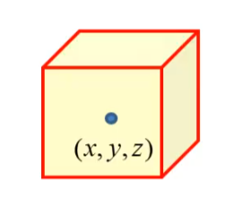
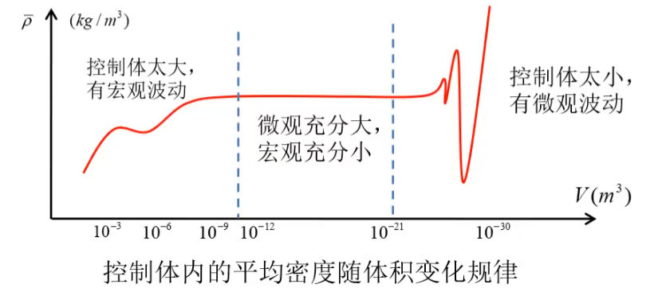
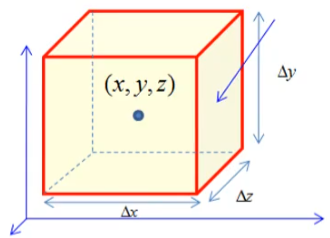
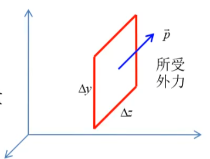
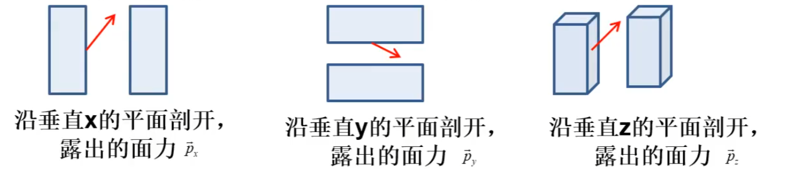
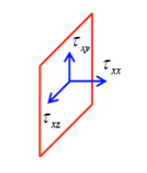

# 计算流体力学-基本方程组

[TOC]

## 连续介质假设

流体连续充满整个空间

取得流体微团做控制体

流体密度定义  
$$
\rho(x,y,z)=\lim_{V\to0}\bar\rho(x,y,z)
$$
平均密度：控制体内流动的总质量/控制体体积

控制体内部均密度随着变化，宏观微观情况都有不均匀和大扰动的情况：

## 流体描述方法

| 欧拉方法                           | 拉格朗日方法                           | 随体导数                                                     |
| ---------------------------------- | -------------------------------------- | ------------------------------------------------------------ |
| 给出每个时刻每个固定空间点上物理量 | 跟踪每个流体质点记录物理量随时间的变化 | 物质导数                                                     |
| $f=f(x,y,z,t)$                     | $f=f(x_0,y_0,z_0,t)$                   | $\frac{df}{dt}=\frac{\part f}{\part t}+\vec V\cdot \nabla f$ |
| 场研究方法                         | 点研究方法                             |                                                              |

上述对应CFD方法：

1 计算网格不动，求解NS方程：欧拉描述
2 计算网格跟踪流体质点：拉格朗日方法
3 计算网格运动，但是不完全跟踪流体质点，ALE 动网格方法（任意拉格朗日）

关于上述物质导数的解释：

物质导数本来是个拉格朗日的概念
流体质点自身物理量随时间变化 为 $\frac{\part f}{\part t}$  
流体质点也和空间影响有关，物理量随着不同位置变化也有变化率，并通过速度 $\vec V$ 联系空间和时间， 则为 $\vec V\cdot \nabla f$

 

## 基本方程

### 基于欧拉描述建立基本方程

首先在位置$(x,y,z)$ 取得一个立方流体微团，目的时给出物理量满足的方程，通常为
密度方程：$\rho(x,y,z,t)$
速度：$\vec V(x,y,z,t)$
压力：$p(x,y,z,t)$
温度： $T(x,y,z,t)$
注意这里的速度为矢量，压力在有粘性情况下也是矢量；

通过三大守恒列出变化规律： 质量守恒，动量守恒，能量守恒

令控制体尺度趋向于0 得到微分方程；

### 定义

质量密度：$\rho$  单位体积内的质量，其实即为常规概念的密度，量纲为   $kg/m^3$
$$
\rho=\frac{m}{V}
$$
动量密度：$\theta$  单位体积内的动量 ，即为 总动量/体积 ， 如下定义
$$
\theta=\frac{m\vec v}{V}=\frac{m}{V}\vec v=\rho \vec v  
$$
能量密度：$E$  单位体积内的总能量，其内部含有 总能=内能+动能做功 
$$
E=C_v\rho T+\frac12\rho(u^2+v^2+w^2)=\frac p{\gamma -1}+\frac12\rho(u^2+v^2+w^2) 
\\
C_v\rho T=\frac {C_v}{R}p=\frac p{\gamma -1}
\\
C_v:定容比热,C_p:定压比热，\frac{C_p}{C_v} =\gamma:比热容比,空气取为1.40
$$
然后上述三密度对于体积积分即可得到总的密度、动量、能量
$$
总质量:\int_\Omega\rho dV
\\
总动量:\int_\Omega\rho \vec v dV
\\
总能量:\int_\Omega E dV
$$

### 守恒方程

我们先考察总质量：

控制体质量增量=穿过控制面流入的净质量；
流体微团具有前后上下左右6控制面；

流体微团的长宽高为 $\Delta x ,\Delta y,\Delta z$   体积为 $ \Delta V =\Delta x\Delta y\Delta z$

其中可见 流体微团具有前后上下左右6控制面
每个相对的面作为同轴面都有其质量通量
那么定义质量通量 为 $F_x$为穿过x方向单位面积面元的质量通量，有 $F_x = (F_x^右-F_x^左)\Delta y\Delta z$ ，
同理可得
有 $F_x = (F_x^右-F_x^左)\Delta y\Delta z$ ，
有 $F_y=(F_y^上-F_y^下)\Delta x\Delta z$ ，
有 $F_z=(F_z^前-F_z^后)\Delta y\Delta x$  

控制体质量增量 $[\bar\rho(t+\Delta t)-\bar\rho(t)]\Delta V =[\bar\rho(t+\Delta t)-\bar\rho(t)]\Delta x\Delta y\Delta z $

那么根据质量守恒列出
$$
[\bar\rho(t+\Delta t)-\bar\rho(t)]\Delta V =
-[(F_x^右-F_x^左)\Delta y\Delta z+(F_y^上-F_y^下)\Delta x\Delta z+(F_z^前-F_z^后)\Delta y\Delta x]\Delta t
\\
\Rightarrow
\\

\frac{[\bar\rho(t+\Delta t)-\bar\rho(t)]}{\Delta t} =
-\frac{ (F_x^右-F_x^左)\Delta y\Delta z+(F_y^上-F_y^下)\Delta x\Delta z+(F_z^前-F_z^后)\Delta y\Delta x }{\Delta V}
\\
\Rightarrow
\\
\frac{[\bar\rho(t+\Delta t)-\bar\rho(t)]}{\Delta t} =
- \frac{ F_x^右-F_x^左 }{\Delta x}-\frac{ F_y^上-F_y^下 }{\Delta y}-\frac{F_z^前-F_z^后 }{\Delta z}  
\\
\Delta t\to 0,\Delta x\to 0,\Delta y\to 0,\Delta z\to 0
\\
\Rightarrow
\\
\frac{\part \rho}{\part t}=
-\frac{\part F_x}{\part x}-\frac{\part F_y}{\part y}-\frac{\part F_z}{\part z}=
-[\frac{\part F_x}{\part x}+\frac{\part F_y}{\part y}+\frac{\part F_z}{\part z}]
$$
于是我们得到了质量密度的守恒方程式
$$
\frac{\part \rho}{\part t}= 
-[\frac{\part F_{x_\rho}}{\part x}+\frac{\part F_{y_\rho}}{\part y}+\frac{\part F_{z_\rho}}{\part z}]
$$
其中 $\frac{\part F_{x_\rho}}{\part x}$ 表达流量在不同位置的变化 ，暗示在x轴左右的的控制面上的流量可能存在不同；

同理针对动量密度和能量密度也列出该方程
$$
\frac{\part \rho}{\part t}= 
-[\frac{\part F_{x_\rho}}{\part x}+\frac{\part F_{y_\rho}}{\part y}+\frac{\part F_{z_\rho}}{\part z}]
\\
\frac{\part \theta}{\part t}= 
-[\frac{\part F_{x_\theta}}{\part x}+\frac{\part F_{y_\theta}}{\part y}+\frac{\part F_{z_\theta}}{\part z}]
\\
\frac{\part E}{\part t}= 
-[\frac{\part F_{x_E}}{\part x}+\frac{\part F_{y_E}}{\part y}+\frac{\part F_{z_E}}{\part z}]
$$
其物理含义就是，某时刻内，控制体凭空增加或者减少了一些质量或能量，这个通量变化就是散度；通量的变化（散度）导致了净通量

既然我们定义过通量，那么这个通量如何进一步表达？

### 计算通量

计算单位时间内流过右侧单位面积面元的质量、动量、总能量；
其外力冲量等同于流过的动量（冲量就是瞬时的动量，是等价的），外力做功=流过的能量

质量通量：
$$
F_{x_\rho}=\frac m {\Delta t} = 
\frac{\rho \Delta V}{\Delta t}  = 
\frac{\rho \Delta x \Delta y \Delta z}{\Delta t} =
\rho \frac{\Delta x}{\Delta t} \Delta y \Delta z=
\rho \frac{\Delta x}{\Delta t} =
\rho u
$$
动量通量：流过质量附带动量 + 表面上外力的冲量
$$
F_{x_\theta}=\rho u\vec V + \vec p
$$
能量通量：流过质量附带能量（单位体积能量） + 表面上外力做功 + 热传递
$$
F_{x_E}=uE+\vec p\cdot \vec V-k\frac{\part T}{\part x}
\\
k\frac{\part T}{\part x}:傅里叶热传导定律，热流和温度梯度正比
$$

### 应力张量

这里就来到了上述最后一个未完全表达的外力作用的表示了；上述的  $\vec p$  应该如何表达？

应力即为 将物体切开 暴露其内部，切的方向不同，其切开的表面上的力也不同；
那么，在空间XYZ直角坐标系，垂直于每个轴切一次即可；

$$
\vec p_x=(p_{xx},p_{xy},p_{xz})^\top
\\
\vec p_y=(p_{yx},p_{yy},p_{yz})^\top
\\
\vec p_z=(p_{zx},p_{xy},p_{zz})^\top
$$
所以组合后得到张量 P
$$
P=
\begin{bmatrix}
p_{xx} & p_{yx} & p_{zx}
 \\ 
p_{xy} & p_{yy} & p_{zy}
 \\ 
p_{xz} & p_{yz} & p_{zz} 
\end{bmatrix}
\\
以 \vec n 为切面法线， 	切开得到力
\\
\vec p_n=P \cdot \vec n
$$

### 流体张量表达 

一般流体由静止部分和运动部分，由于流体特性，其只能受到压力和切向力，无法承受拉力（呈现拉力的粘稠体是粘性取代了拉力）
且静止流体仅承受压力，不承受切向力，否则其不静止；
粘性力和变形速率成正比，这是牛顿粘性定律决定的；

所以有  静止部分 + 运动部分
$$
P_{ij} = -p\delta_{ij}+\tau_{ij}
\\
静止流体： P_{ij} = -p\delta_{ij}
$$

>  注：广义牛顿粘性定律
> $$
> \tau_ij=\lambda V_{k,k}\delta_{ij}+\mu(V_{i,j}+V_{j,i})
> $$
> 一般：$\lambda=-\frac23\mu$
>
> $\frac{\part}{\part t}\rho\vec V+\nabla\cdot(\rho\vec V\vec V)=\rho\vec F-\nabla p+\nabla\cdot \overleftrightarrow \tau $
>
> $\tau_{ij}=\frac23\mu\delta_{ij}V_{k,k}+\mu(V_{i,j}+V_{j,i})$

所以一般流体的受力表达为  
$$
\vec p_x=-p\vec i+\tau_{xx}\vec i+\tau_{xy}\vec j+\tau_{xz}\vec k
\\
-p\vec i ： 压力项，向内，所以为负
\\
\tau_{xx}\vec i+\tau_{xy}\vec j+\tau_{xz}\vec k:粘性剪切项
$$
同理其他两轴方向有同样的表达
$$
\vec p_x=-p\vec i+\tau_{xx}\vec i+\tau_{xy}\vec j+\tau_{xz}\vec k
\\
\vec p_y=-p\vec j+\tau_{yx}\vec i+\tau_{yy}\vec j+\tau_{yz}\vec k
\\
\vec p_z=-p\vec z+\tau_{zx}\vec i+\tau_{zy}\vec j+\tau_{zz}\vec k
$$

### 最后整理

于是我们再次回到上述的守恒得到通量表达中，将这个外力带入式子 

质量通量：不受力影响
$$
F_{x_\rho} = \rho u
\\
F_{y_\rho} = \rho v
\\
F_{z_\rho} = \rho w 
$$
动量通量：注意压力作用方向
$$
F_{x_\theta}=\rho u\vec V + \vec p
=
\rho u
\begin{bmatrix}
 u  	\\
 v		\\
 w		\\
\end{bmatrix}
-
\begin{bmatrix}
-p+\tau_{xx}  	\\
\tau_{xy}		\\
\tau_{xz}		\\
\end{bmatrix}
=
\begin{bmatrix}
\rho uu + p \\
\rho uv		\\
\rho uw		\\
\end{bmatrix}
-
\begin{bmatrix}
\tau_{xx}  	\\
\tau_{xy}		\\
\tau_{xz}		\\
\end{bmatrix}
\\
\begin{bmatrix}
\rho uu + p \\
\rho uv		\\
\rho uw		\\
\end{bmatrix} 
：无粘通量
\\
\begin{bmatrix}
\tau_{xx}  	\\
\tau_{xy}		\\
\tau_{xz}		\\
\end{bmatrix}
:粘性通量
$$
故三个方向的动量有
$$
F_{x_\theta}=\rho u\vec V + \vec p 
=
\begin{bmatrix}
\rho uu + p \\
\rho uv		\\
\rho uw		\\
\end{bmatrix}
-
\begin{bmatrix}
\tau_{xx}  	\\
\tau_{xy}		\\
\tau_{xz}		\\
\end{bmatrix}

\\

F_{y_\theta}=\rho v\vec V + \vec p 
=
\begin{bmatrix}
\rho vu  	\\
\rho vv	+ p	\\
\rho vw		\\
\end{bmatrix}
-
\begin{bmatrix}
\tau_{yx}  	\\
\tau_{yy}		\\
\tau_{yz}		\\
\end{bmatrix}

\\

F_{z_\theta}=\rho w\vec V + \vec p 
=
\begin{bmatrix}
\rho wu  	\\
\rho wv		\\
\rho ww	+ p	\\
\end{bmatrix}
-
\begin{bmatrix}
\tau_{zx}  	\\
\tau_{zy}		\\
\tau_{zz}		\\
\end{bmatrix}
$$
能量通量：
$$
F_E 
= 
uE +\vec p\cdot\vec V -k\frac{\part T}{\part x}
\\=
uE -
\begin{bmatrix}
-p+\tau_{xx}  	\\
\tau_{xy}		\\
\tau_{xz}		\\
\end{bmatrix}
\cdot
\begin{bmatrix}
 u  	\\
 v		\\
 w		\\
\end{bmatrix}
-k\frac{\part T}{\part x}
\\=
uE +pu-u\tau_{xx} -v\tau_{xy} -w\tau_{xz} -k\frac{\part T}{\part x}
\\=
(E+p)u-(u\tau_{xx} +v\tau_{xy}+w\tau_{xz}+k\frac{\part T}{\part x})
$$
所以整个场的能量可表达为 
$$
F_{E_x}  =(E+p)u-(u\tau_{xx} +v\tau_{xy}+w\tau_{xz}+k\frac{\part T}{\part x})
\\
F_{E_y}  =(E+p)v-(u\tau_{yx} +v\tau_{yy}+w\tau_{xz}+k\frac{\part T}{\part x})
\\
F_{E_z}  =(E+p)w-(u\tau_{zx} +v\tau_{xy}+w\tau_{xz}+k\frac{\part T}{\part x})
\\
$$
**接下来带入先前提到的守恒方程，于是得到N-S控制方程**
$$
\frac{\part U}{\part t}= 
-[\frac{\part F_{U_x}}{\part x}+\frac{\part F_{U_y}}{\part y}+\frac{\part F_{U_z}}{\part z}]
\\
由于微分可线性拆分，
故将其分为粘性通量和无粘通量：\frac{\part F_{U_x}}{\part x} =\frac{\part F_{1}}{\part x}+\frac{\part G_{1}}{\part x}
\\
于是得到了如下
\\
\frac{\part U}{\part t}= 
-[\frac{\part F_{1}}{\part x}+\frac{\part G_{1}}{\part x}+\frac{\part F_{2}}{\part y}+\frac{\part G_{2}}{\part y}+\frac{\part F_{3}}{\part z}+\frac{\part G_{3}}{\part z}] 
\\ \Rightarrow \\
\frac{\part U}{\part t} 
+
[\frac{\part F_{1}}{\part x}+\frac{\part F_{2}}{\part y}+\frac{\part F_{3}}{\part z}]
=
\frac{\part G_{1}}{\part x}+\frac{\part G_{2}}{\part y}+\frac{\part G_{3}}{\part z}
\\
\frac{\part F_{1}}{\part x}+\frac{\part F_{2}}{\part y}+\frac{\part F_{3}}{\part z}:无粘通量
\\
\frac{\part G_{1}}{\part x}+\frac{\part G_{2}}{\part y}+\frac{\part G_{3}}{\part z}：粘性通量
$$
然后将质量密度、动量密度、能量密度 作为向量 表达
$$
U=
\begin{bmatrix}
  \rho 			\\
  \rho u  		\\
  \rho v		\\
  \rho w		\\
  E
\end{bmatrix}
,
\begin{bmatrix} 
  \rho u  		\\
  \rho v		\\
  \rho w		\\ 
\end{bmatrix}
为动力密度

\\

F_1(U)
=
\begin{bmatrix}
  \rho u 			\\
  \rho u^2+p  		\\
  \rho uv		\\
  \rho uw		\\
  u(E+p)
\end{bmatrix}
,
F_2(U)
=
\begin{bmatrix}
  \rho v 			\\
  \rho v^2+p  		\\
  \rho vv		\\
  \rho vw		\\
  v(E+p)
\end{bmatrix}
,
F_3(U)
=
\begin{bmatrix}
  \rho w 			\\
  \rho w^2+p  		\\
  \rho wv		\\
  \rho ww		\\
  w(E+p)
\end{bmatrix}

 \\
 
G_1(U)
=
\begin{bmatrix}
  0 				\\
  \tau_{11}  		\\
  \tau_{12}			\\
  \tau_{13}			\\
  k\frac{\part T}{\part x}+u\tau_{11}+v\tau_{12}+w\tau_{13}
\end{bmatrix}
,
G_2(U)
=
\begin{bmatrix}
  0 				\\
  \tau_{21}  		\\
  \tau_{22}			\\
  \tau_{23}			\\
  k\frac{\part T}{\part y}+u\tau_{21}+v\tau_{22}+w\tau_{23}
\end{bmatrix}
,
G_3(U)
=
\begin{bmatrix}
  0 				\\
  \tau_{31}  		\\
  \tau_{32}			\\
  \tau_{33}			\\
  k\frac{\part T}{\part z}+u\tau_{31}+v\tau_{32}+w\tau_{33}
\end{bmatrix}
\\
$$

> 补充关系 ： $p=\rho RT$ 
>
> $\tau_{ij}= \left \{ \begin{aligned} \mu(\frac{\part u_i}{\part x_j}+\frac{\part u_j}{\part x_i}),i\neq j  \\  \mu(2\frac{\part u_i}{\part x_i}-\frac23divV),i = j \end{aligned} \right.  $

可见上述，无粘性通量部分
$$
F_1(U)
=
\begin{bmatrix}
  \rho u 			\\
  \rho u^2+p  		\\
  \rho uv		\\
  \rho uw		\\
  u(E+p)
\end{bmatrix}
\\
\rho u ：质量流量
\\
 \rho u^2+p ：流入质量带来的 x- 方向动量 ， 以及 压力提供的冲量
\\
\rho uv ：流入质量带来的 y- 方向动量
\\
 \rho uw ：流入质量带来的 z- 方向动量
 \\
  u(E+p)：流入质量带来的能量，以及压力做功
$$
粘性通量部分
$$
G_1(U)=
\begin{bmatrix}
  0 				\\
  \tau_{11}  		\\
  \tau_{12}			\\
  \tau_{13}			\\
  k\frac{\part T}{\part x}+u\tau_{11}+v\tau_{12}+w\tau_{13}
\end{bmatrix}
\\
 \tau_{11}  ：粘性力提供的x-方向冲量
 \\
 \tau_{12}	：粘性力提供的y-方向冲量
 \\
 \tau_{13}	：粘性力提供的z-方向冲量
 \\
  k\frac{\part T}{\part x}+u\tau_{11}+v\tau_{12}+w\tau_{13} ：热传导输入热量，以及粘性力做功
$$

#### 无量纲化（可选）

物理量和特征量之比 ， 可便于理解当前点情况相对于环境的差异；  雷诺数、马赫数就是著名的无量纲数

### N-S 方程简化

在不可压缩情况下 
$$
密度不变：\frac{d\rho}{dt}=0,\rho=const
\\
散度为0：\nabla\cdot\vec V=0
\\
\frac{\part}{\part t} \vec V+\nabla\cdot( \vec V\vec V)= \vec F-\frac1\rho\nabla p+\frac1\rho\nabla\cdot \overleftrightarrow \tau 
\\
 假设粘性系数为常数（温度变化小） ：\frac1\rho\nabla\cdot \overleftrightarrow \tau =v\Delta\vec V
 \to 
\nabla\cdot(\vec V\vec V)=\vec V\cdot\nabla\vec V=[\nabla\cdot(\vec V\vec V)+\vec V\cdot\nabla\vec V]/2 
$$
无粘性情况下 转为欧拉方程
$$
\frac{\part U}{\part t}= 
-[\frac{\part F_{U_x}}{\part x}+\frac{\part F_{U_y}}{\part y}+\frac{\part F_{U_z}}{\part z}]
\\
\Rightarrow
\frac{\part U}{\part t}+[\frac{\part F_{U_x}}{\part x}+\frac{\part F_{U_y}}{\part y}+\frac{\part F_{U_z}}{\part z}]
$$

