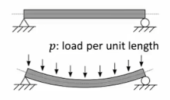
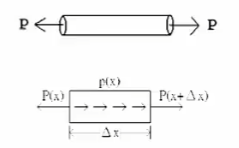
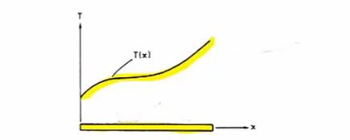
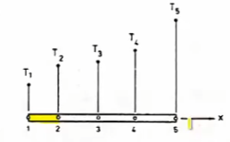
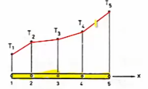
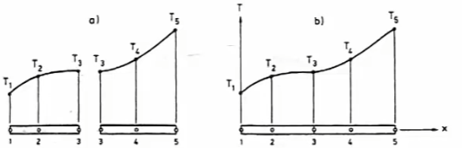

# 初等有限元教程

## 02介绍

### 引

Basic Of  FEM

有限元的特色和优点

任何物理问题  都可以找出其微分方程

如 梁板柱的结构计算等

微分方程需要配合边界条件使用，此时如果微分方程较为简单可以得到其解析解

但是，现实的工况总是非常复杂，我们基本在复杂的工况中才会采用有限元方法，比如梁中有不规则的缺陷时候；

有限元可以求解静不定、静定问题；

有限元只能给出近似解，但是只要精度够就可以作为参考；

### 例

描述 微分方程

#### 梁：

$$
M=EI\frac{d^2v}{dx^2}=EIv''
\\
\frac{d^2}{dx^2}(EI\frac{d^2v}{dx^2})=p
\\
v - transverse\_deflection\ 梁元素的纵向位移
\\
p - 施加在梁单元长度上的压力
$$
 看梁的弯矩（挠度）其和变形为二阶微分的关系

M 即为变形时的抵抗力  横行挠度  即为外加Moment

但是其控制方程还需对M二阶微分，即可得到在梁单元上施加的力

#### 轴力杆

$$
P=EA\frac{du}{dx}=EAu'
\\
\frac{d}{dx}(EA\frac{du}{dx})+p(x)=0
$$

### 有限元处理流程

观察物理现象  Physical phenomenon

数学模型建立 model

建立微分方程Differential equation  强形式   且列出边界条件

条件逼近 Approximation

有限元方程Finite element equations 弱形式  开始考虑网格切分的问题 比如开洞的网格编辑

### 有限元特征

有限元可以处理多维问题  1D 2D 3D 各类问题，尤其涉及复杂的三维高自由度问题；

有限元的网格基本元素的数量和形状都是人来决定的；

有限元只能给出一个近似解，很难给出解析解，除非是使用symbolic符号计算的特殊软件；

有限元利用可变网格适用于非线性的工况；

指定的元素有自己的形状函数 shape function，元素的形状函数一般是线性的linear，也可以使用二阶形状函数quadratic元素，特殊情况才使用三阶形状函数cubic元素；

形状函数 shape function ，即为数值分析中的内插函数（插值函数） interpolation function ，可以插值求得元素内部某点的具体数值；

一般的节点都在mesh的element的角点和边界上；

一般使用了cubic元素时候需要超算才可以进行合适的计算，不是很经济，除非是特种问题，如核爆模拟和战斗机的气动模拟，才会使用；

#### 例

简单的杆件传热数据如上图，此时需要使用FEM进行验证，此时将杆件分为五点四段；

如果我们使用的是线性元素，就得到折线图，当然若此时想要更高的精度，可以采用更多更小的元素；

当然也可使用二阶元素（单向曲线）进行分析。利用三个节点建立一个quadratic元素，此时能得到较为符合实验数据的图形：

### 问题分类

boundary value problem  BVP  控制方程式+边界条件

initial  value problem  IVP 这种问题和动力学有关，需要初始条件，一般用于流体和流体和动力学，和时间有关；

variational methods 变分法 较为高级 需要较多涉及数学

### 各类材料

非均匀材料，复杂分配的材料，；

关于有限元的curve需要使用多折线近似；

如果遇到方程和边界条件都是对称的，就只计算单一部分；

应力集中处需要使用更密集的网格；

均匀材料可以各种巧妙简化；

关于热流 电磁学 等都可以使用有限元

## 应用

前处理 Pre-processing：建立几何形状 给定材料性质，指定边界条件；

求解 Solution：选择解算器，开始计算迭代；线性分析、非线性分析、动力分析

后处理 Post-processing：将数据进行云图显示；杆件内力、机构位移、应力分布图；

商用软体：abaqus、ansys、comsol

结构力学、动力学、多体力学、流体力学、电磁、流体动力学

