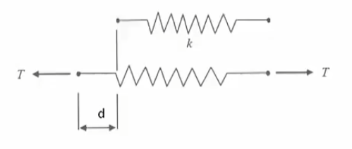
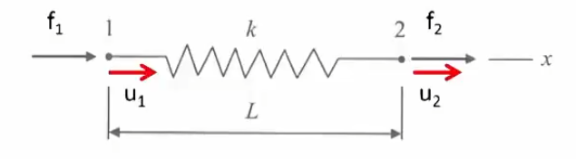
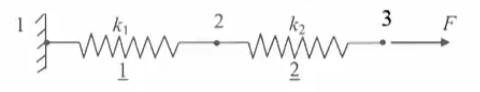
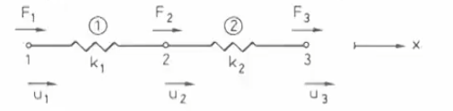
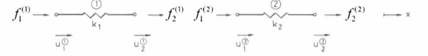
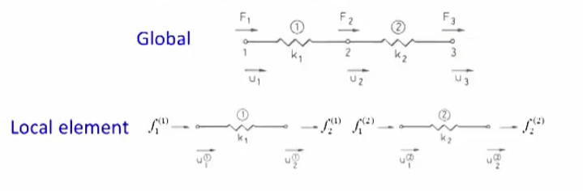
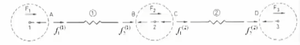
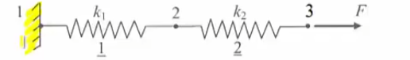

# 初等有限元-03-直接逼近法  DirectApproach 轴力弹簧AxialSpring

[TOC]

## 轴力弹簧 axial spring

一个简单的构件，只是在一个维度上拉伸和收缩；

假设轴力弹簧的刚度stiffness 为 k  ，弹簧原始长度L，受到外力T ， 位移了d，

$$
T=kd
$$
然后将其使用有限元开始定义这个轴力弹簧

分为节点1 节点2 ， 决定右x为正，节点1受力f1位移u1，节点2受力f2位移u2

那么 两个描述方法的等价效果为
$$
d=u_2-u_1\to T=kd=k(u_2-u_1)
\\
f_2=T=k(u_2-u_1)
\\
f_1=-T=k(u_1-u_2)
$$
弹簧为静止，那么内力平衡
$$
f_1+f_2=0
$$
两者结合为矩阵表达元素的刚度矩阵
$$
\left [\begin{matrix}
f_1   \\
f_2   \\
\end{matrix}\right]
=
\left [\begin{matrix}
k & -k   \\
-k & k   \\
\end{matrix}\right]
\left [\begin{matrix}
u_1   \\
u_2   \\
\end{matrix}\right]
$$

## 刚度矩阵方程

$$
\left [\begin{matrix}
f_1   \\
f_2   \\
\end{matrix}\right]
=
\left [\begin{matrix}
k & -k   \\
-k & k   \\
\end{matrix}\right]
\left [\begin{matrix}
u_1   \\
u_2   \\
\end{matrix}\right]
\\
f=kd
$$

刚度矩阵对称且奇异

## 元素方程组以及结构系统

两个轴力弹簧组合的系统

整个系统有三个自由度

那么我们分别考虑两个元素得到其刚度方程和刚度矩阵

$$
\left [\begin{matrix}
k_1 & -k_1   \\
-k_1 & k_1   \\
\end{matrix}\right]
\left [\begin{matrix}
u_1^{(1)}   \\
u_2^{(1)}   \\
\end{matrix}\right]
=
\left [\begin{matrix}
f_1^{(1)}   \\
f_2^{(1)}   \\
\end{matrix}\right]
\\
\left [\begin{matrix}
k_2 & -k_2   \\
-k_2 & k_2   \\
\end{matrix}\right]
\left [\begin{matrix}
u_1^{(2)}   \\
u_2^{(2)}   \\
\end{matrix}\right]
=
\left [\begin{matrix}
f_1^{(2)}   \\
f_2^{(2)}   \\
\end{matrix}\right]
\\
u_2^{(1)} = u_1^{(2)} 
\\
f_2^{(1)} = f_1^{(2)}
$$
那么结合上述全局，处理位移

$$
u_1^{(1)} =u_1
\\
u_2^{(1)} = u_1^{(2)} =u_2
\\
u_2^{(2)} =u_3
$$
再次写出整体刚度方程，并扩充
$$
\left [\begin{matrix}
k_1  & -k_1 &0  \\
-k_1 & k_1 	&0  \\
0	 &0		&0 	\\
\end{matrix}\right]
\left [\begin{matrix}
u_1    \\
u_2    \\
u_3			\\
\end{matrix}\right]
=
\left [\begin{matrix}
f_1^{(1)}   \\
f_2^{(1)}   \\
0			\\
\end{matrix}\right]
\\
\left [\begin{matrix}
0	&0		&0 		\\
0 	&k_2  	& -k_2  \\
0 	&-k_2 	& k_2  	\\
\end{matrix}\right]
\left [\begin{matrix}
u_1   	\\
u_2   	\\
u_3		\\
\end{matrix}\right]
=
\left [\begin{matrix}
0			\\
f_1^{(2)}   \\
f_2^{(2)}   \\			
\end{matrix}\right]
$$
接下来处理力的部分

$$
f_2^{(1)}=F_1
\\
f_2^{(1)} + f_1^{(2)}=F_2
\\
f_2^{(2)}=F_3
\\
\left [\begin{matrix}
f_1^{(1)}   \\
f_2^{(1)}   \\
0			\\
\end{matrix}\right]
+
\left [\begin{matrix}
0			\\
f_1^{(2)}   \\
f_2^{(2)}   \\ 
\end{matrix}\right]
=
\left [\begin{matrix}
F_1			\\
F_2	   \\
F_3	   \\ 
\end{matrix}\right]
$$

#### 矩阵位移法

结合位移扩充的方程以及力的方程得到弹簧组的刚度方程结合
$$
\left [\begin{matrix}
F_1			\\
F_2	   \\
F_3	   \\ 
\end{matrix}\right]
=
\left [\begin{matrix}
f_1^{(1)}   \\
f_2^{(1)}   \\
0			\\
\end{matrix}\right]
+
\left [\begin{matrix}
0			\\
f_1^{(2)}   \\
f_2^{(2)}   \\ 
\end{matrix}\right]
=
\left [\begin{matrix}
k_1  & -k_1 &0  \\
-k_1 & k_1 	&0  \\
0	 &0		&0 	\\
\end{matrix}\right]
\left [\begin{matrix}
u_1    \\
u_2    \\
u_3			\\
\end{matrix}\right] 
+
\left [\begin{matrix}
0	&0		&0 		\\
0 	&k_2  	& -k_2  \\
0 	&-k_2 	& k_2  	\\
\end{matrix}\right]
\left [\begin{matrix}
u_1   	\\
u_2   	\\
u_3		\\
\end{matrix}\right]
=
\left [\begin{matrix}
k_1			&-k_1		&0 		\\
-k_1 		&k_1+k_2  	& -k_2  \\
0 			&-k_2 		& k_2  	\\
\end{matrix}\right]
\left [\begin{matrix}
u_1   	\\
u_2   	\\
u_3		\\
\end{matrix}\right]

\\
Kd=F
$$
此时构成了组合的刚度矩阵K ， 该矩阵K是对称的，detK=0 ，是奇异矩阵；

#### 边界条件BoundaryCondition

得到了刚度矩阵K之后，发现是奇异矩阵，固有无穷多解，如果没有对其任何节点固定的话，所有刚体就是活动的，所以需要加边界条件来确定特有工况；

将节点1固定，节点3给予外力F，节点2为自由节点；
$$
\left [\begin{matrix}
k_1			&-k_1		&0 		\\
-k_1 		&k_1+k_2  	& -k_2  \\
0 			&-k_2 		& k_2  	\\
\end{matrix}\right]
\left [\begin{matrix}
0   	\\
u_2   	\\
u_3		\\
\end{matrix}\right]
=
\left [\begin{matrix}
F_1			\\
0	   		\\
F	   		\\ 
\end{matrix}\right]
\\
简化
\\
-k_1u_2=F_1
\\
\left [\begin{matrix} 
 		&k_1+k_2  	& -k_2  \\
 		&-k_2 		& k_2  	\\
\end{matrix}\right]
\left [\begin{matrix} 
u_2   	\\
u_3		\\
\end{matrix}\right]
=
\left [\begin{matrix} 
0   		\\
F	   		\\ 
\end{matrix}\right]
$$
然后就算出所有的位移和力的值；

那么定义
$$
\left [\begin{matrix} 
 		&k_1+k_2  	& -k_2  \\
 		&-k_2 		& k_2  	\\
\end{matrix}\right]
=K_g
\\
det K_g \neq 0  , 为非奇异阵
$$
注意 ： 边界条件必须有一个位移限制，且限制了位移，受力必未知，反之亦然；

$$
K_g是正定矩阵
\\
x^\top K_gx=k_1x_1^2+k_2(x_1-x_2)^2>0
$$

### 有限元步骤

1. 构建每个元素的刚度矩阵方程
2. 组合各个元素为系统
3. 确定系统的力平衡
4. 得到系统刚度矩阵方程
5. 设置恰当的边界条件
6. 解方程

