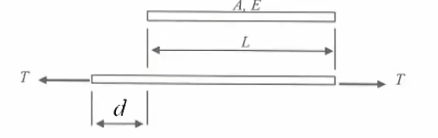
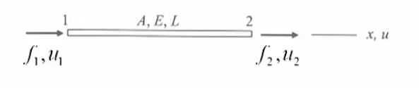
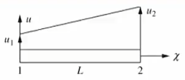
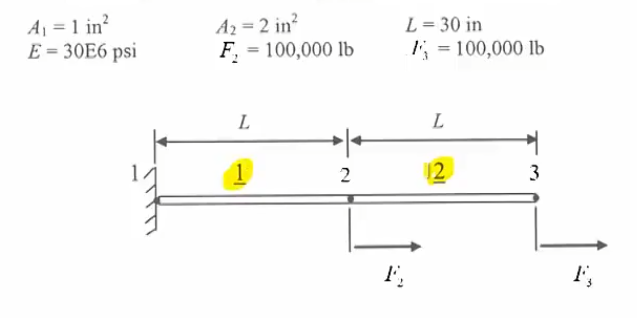
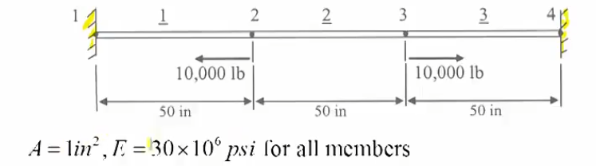

# 初等有限元-04-杆件元素 BarElement

[TOC]

## 轴力杆件结构

### 杆件结构

基本只能接受轴向力的简单元素；

一个杆件，原长L ， 外力T ， 位移d，杨氏模量E，截面积A，构建其刚度矩阵

首先不考虑均布载重
$$
T=\sigma A=const
 
$$
应力应变关系
$$
\sigma=E\varepsilon
$$
应变微分定义
$$
\varepsilon=\frac{du}{dx}
$$
全部组合起来就是
$$
EA\frac{du}{dx}=T=const
$$
既然外力是个常数定值，那么其微分为零，此时可以得到其控制方程governing equation
$$
\frac d{dx}(EA\frac{du}{dx})=0
$$
注意：对轴力杆件需要忽略其剪切shear影响，竖直方向的位移都忽略，利用胡克定律考虑问题；

### 形状函数

对于线性位移来说，构建一个简单的式子 $u=a_1+a_2 x$ 
其实可以通过该线性方程求得杆件上不同位置的位移,
那么边界条件也就定为 ： $u(0)=u_1,u(L)=u_2$
$$
u=(\frac{u_2-u_1}L)x+u_1
\\
转为矩阵
\\
u=
\left[
\begin{matrix}
1-\frac xL & \frac xL 
\end{matrix}
\right]
\left[
\begin{matrix}
u_1 \\
u_2
\end{matrix}
\right]
=
\left[
\begin{matrix}
N_1 &N_2 
\end{matrix}
\right]

\left[
\begin{matrix}
u_1 \\
u_2
\end{matrix}
\right]
$$
可见这里出现了一个插值矩阵，这个也叫插值函数、形状函数；
其决定了杆件元素内部的力和位移的分布情况；
就是元素边界值确定后，需要获得其内部的某点情况使用的插值曲线方式不同而已；

## 元素刚度方程

$$
d=u_2-u_1
\\
\varepsilon=\frac dL=\frac{u_2-u_1}L
\\
T = EA\varepsilon = \frac {EA}L (u_2-u_1)
\\
f_1=-T,f_2=T
$$

合并
$$
f_1=- T= -EA\varepsilon = \frac {EA}L (u_1-u_2)
\\
f_2=T = EA\varepsilon = \frac {EA}L (u_2-u_1)
\\
\frac {EA}L
\left[
\begin{matrix}
 1 & -1\\
 -1 & 1\\
\end{matrix}
\right]
\left[
\begin{matrix}
u_1 \\
u_2
\end{matrix}
\right]
=
\left[
\begin{matrix}
f_1 \\
f_2
\end{matrix}
\right]
$$
注意：
其他剪切方向的变化忽略；
其实这里可以将模量系数类别为弹簧的刚度系数，两者非常类似；

得到杆件的刚度矩阵
$$
\frac {EA}L
\left[
\begin{matrix}
 1 & -1\\
 -1 & 1\\
\end{matrix}
\right]
\left[
\begin{matrix}
u_1 \\
u_2
\end{matrix}
\right]
=
\left[
\begin{matrix}
f_1 \\
f_2
\end{matrix}
\right]
\\
ku=f
\\
k=
\frac {EA}L
\left[
\begin{matrix}
 1 & -1\\
 -1 & 1\\
\end{matrix}
\right]
\\
u=
\left[
\begin{matrix}
u_1 \\
u_2
\end{matrix}
\right]
\\
f=
\left[
\begin{matrix}
f_1 \\
f_2
\end{matrix}
\right]
$$

## 组合

考虑节点一致性，元素刚度矩阵构成整体刚度矩阵
$$
K=\Sigma^n_{e=1}k^e
\\
F=\Sigma^n_{e=1}f^e
$$
那么整个系统的刚度矩阵方程
$$
Kd=F
$$
然后开始求解位移

## 后处理

元素受力使用如下后处理内力
$$
\left[
\begin{matrix}
f_1 \\
f_2
\end{matrix}
\right]
=
\frac {EA}L
\left[
\begin{matrix}
 1 & -1\\
 -1 & 1\\
\end{matrix}
\right]
\left[
\begin{matrix}
u_1 \\
u_2
\end{matrix}
\right]
$$
应变后处理
$$
\varepsilon=\frac dL=\frac{u_2-u_1}L
$$
应力后处理
$$
\sigma=E\varepsilon
$$

## 例

### 例1

$$
\frac EL
\left [\begin{matrix}
A_1			&-A_1		&0 		\\
-A_1 		&A_1+A_2  	& -A_2  \\
0 			&-A_2 		& A_2  	\\
\end{matrix}\right]
\left [\begin{matrix}
u_1   	\\
u_2   	\\
u_3		\\
\end{matrix}\right]
=
\left [\begin{matrix}
F_1			\\
F_2	   \\
F_3	   \\ 
\end{matrix}\right]
$$
加边界条件
$$
\frac {30E6}{30}
\left [\begin{matrix}
1			&-1		&0 		\\
-1 			&3  	& -2  \\
0 			&-2 	& 2  	\\
\end{matrix}\right]
\left [\begin{matrix}
0   	\\
u_2   	\\
u_3		\\
\end{matrix}\right]
=
\left [\begin{matrix}
F_1			\\
1E5	   \\
1E5   \\ 
\end{matrix}\right]
$$

### 例2

