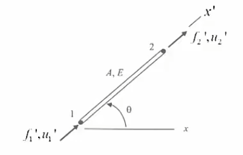

# 初等有限元-05-行架元素Truss

[TOC]

## 行架结构

### 介绍

行架的变型会有空间多维度，但是受力依然是轴向为主；

很多轴力元素相接，朝向不同方向，节点处相接；

每个元素都有自己的局部坐标系 local

而全局有全局坐标 global

然后每个元素的本地刚度矩阵为
$$
\frac {EA}L
\left[
\begin{matrix}
 1 & -1\\
 -1 & 1\\
\end{matrix}
\right]
\left[
\begin{matrix}
u_1' \\
u_2'
\end{matrix}
\right]
=
\left[
\begin{matrix}
f_1' \\
f_2'
\end{matrix}
\right]
$$

### 方向处理

行架在本地的应变d可以作为向量分解到各种不同的坐标，包括世界坐标系，由此需要旋转矩阵；

$$
d=d_x\vec i+d_y\vec j=d_x'\vec {i'}+d_y'\vec {j'}
\\
\left[
\begin{matrix}
d_x' \\
d_y'
\end{matrix}
\right]
=
\left[
\begin{matrix}
c  & s\\
-s & c
\end{matrix}
\right]
\left[
\begin{matrix}
d_x  \\
d_y 
\end{matrix}
\right]
$$
那么如果一个杆子的两个节点位移都需要放入矩阵，就可以采用如下
$$
\left[
\begin{matrix}
u_{1x}' \\
u_{1y}'	\\
u_{2x}' \\
u_{2y}' \\
\end{matrix}
\right]
=
\left[
\begin{matrix}
c  	&s	&0	&0\\
-s 	&c	&0	&0	\\
0	&0 	&c 	&s \\
0	&0 	&-s &c \\
\end{matrix}
\right]
\left[
\begin{matrix}
u_{1x}  \\
u_{1y}  \\
u_{2x}  \\
u_{2y}  \\
\end{matrix}
\right]
$$
同理力也是矢量，那么也可以同样操作
$$
\left[
\begin{matrix}
f_{1x}' \\
f_{1y}'	\\
f_{2x}' \\
f_{2x}' \\
\end{matrix}
\right]
=
\left[
\begin{matrix}
c  	&s	&0	&0\\
-s 	&c	&0	&0	\\
0	&0 	&c 	&s \\
0	&0 	&-s &c \\
\end{matrix}
\right]
\left[
\begin{matrix}
f_{1x}  \\
f_{1y}  \\
f_{2x}  \\
f_{2y}  \\
\end{matrix}
\right]
$$
上述解释了世界坐标系下应力应变和和本地坐标的应力应变的关系；

所以有
$$
T =\left[
\begin{matrix}
c  	&s	&0	&0\\
-s 	&c	&0	&0	\\
0	&0 	&c 	&s \\
0	&0 	&-s &c \\
\end{matrix}
\right]
\\
f'=Tf
\\
d'=Td
$$

### 应用到杆件元素上

水平杆的本地坐标系下的刚度矩阵
$$
k'
=
\frac {EA}L
\left[
\begin{matrix}
 1 & -1\\
 -1 & 1\\
\end{matrix}
\right]
$$
由于杆件构成行架系统会有四个自由度，那么最终的变换矩阵为4X4

那么行架的本地刚度矩阵
$$
\frac {EA}L
\left[
\begin{matrix}
1 	&0 	&-1 	&0\\
0 	&0 	&0 		&0\\
-1 	&0 	&1 		&0\\
0 	&0 	&0 		&0\\
\end{matrix}
\right]

\left[
\begin{matrix}
u_{1x}' \\
u_{1y}' \\
u_{2x}' \\
u_{2y}' \\
\end{matrix}
\right]

=

\left[
\begin{matrix}
f_{1x}' \\
f_{1y}' \\
f_{2x}' \\
f_{2y}' \\
\end{matrix}
\right]
$$
考虑到转换为世界坐标
$$
f'=Tf
\\
d'=Td
\\
k'd'=f'
\\
k'Td=Tf
\to 
T^\top k'Td=T^\top Tf  
\\
T^\top k'T=k  ,T^\top Tf =f
\to 
kd=f
$$
那么世界坐标中的行架的刚度矩阵就是
$$
k=T^\top k'T
=
\frac {EA}L
\left[
\begin{matrix}
c^2 	&cs 	&-c^2 	&-cs\\
cs 		&s^2 	&-cs 	&-s^2\\
-c^2 	&-cs 	&c^2 	&cs\\
-cs 	&-s^2 	&cs 	&s^2\\
\end{matrix}
\right]
\\
d=
\left[
\begin{matrix}
u_{1x}\\
u_{1y}\\
u_{2x}\\
u_{2y}\\
\end{matrix}
\right]
,
f=
\left[
\begin{matrix}
f_{1x}\\
f_{1y}\\
f_{2x}\\
f_{2y}\\
\end{matrix}
\right]
$$
显然刚度矩阵依然是对称的

### 矩阵组合

考虑节点一致性，元素刚度矩阵构成整体刚度矩阵
$$
K=\Sigma^n_{e=1}k^e\\F=\Sigma^n_{e=1}f^e
$$
那么整个系统的刚度矩阵方程
$$
Kd=F
$$
然后开始求解位移

### 后处理

建议进入本地坐标是不考虑正交方向的力的可以简化矩阵
$$
\left[
\begin{matrix}
u_{1x}' \\ 
u_{2x}' \\ 
\end{matrix}
\right]
=
\left[
\begin{matrix}
c  	&s	&0	&0\\ 
0	&0 	&c 	&s \\ 
\end{matrix}
\right]
\left[
\begin{matrix}
u_{1x}  \\
u_{1y}  \\
u_{2x}  \\
u_{2y}  \\
\end{matrix}
\right]
$$
那么应力矩阵则表达为
$$
\sigma=\frac EL
\left[
\begin{matrix}
-1 \\ 
1 \\ 
\end{matrix}
\right]
\left[
\begin{matrix}
c  	&s	&0	&0\\ 
0	&0 	&c 	&s \\ 
\end{matrix}
\right]
\left[
\begin{matrix}
u_{1x}  \\
u_{1y}  \\
u_{2x}  \\
u_{2y}  \\
\end{matrix}
\right]
=
\frac EL
(-cu_{1x}  -su_{1y}  +cu_{2x} +  su_{12y}  )
$$

## 例题

 
$$
\theta_1=45^o,\theta_2=135^o
\\
\cos\theta_1=\frac{\sqrt2}2,\sin\theta_1=\frac{\sqrt2}2
\\
\cos\theta_2=-\frac{\sqrt2}2,\sin\theta_2=\frac{\sqrt2}2
$$

$$
K=
\frac {EA}L
\left[
\begin{matrix}
c_1^2 		&c_1s_1 	&-c_1^2 		&-c_1s_1		&0			&0			\\
c_1s_1 		&s_1^2 		&-c_1s_1 		&-s_1^2			&0			&0			\\
-c_1^2 		&-c_1s_1 	&c_1^2+c_2^2 	&c_1s_1+c_2s_2	&-c_2^2 	&-c_2s_2	\\
-c_1s_1 	&-s_1^2 	&c_1s_1+c_2s_2 	&s_1^2+s_2^2	&-c_2s_2 	&-s_2^2		\\
0			&0			&-c_2^2 		&-c_2s_2		&c_2^2 		&c_2s_1	 	\\
0			&0			&-c_2s_2 		&-s_2^2			&c_2s_2 	&s_2^2	 	\\
\end{matrix}
\right]
\\
\frac {EA}L
\left[
\begin{matrix}
c_1^2 		&c_1s_1 	&-c_1^2 		&-c_1s_1		&0			&0			\\
c_1s_1 		&s_1^2 		&-c_1s_1 		&-s_1^2			&0			&0			\\
-c_1^2 		&-c_1s_1 	&c_1^2+c_2^2 	&c_1s_1+c_2s_2	&-c_2^2 	&-c_2s_2	\\
-c_1s_1 	&-s_1^2 	&c_1s_1+c_2s_2 	&s_1^2+s_2^2	&-c_2s_2 	&-s_2^2		\\
0			&0			&-c_2^2 		&-c_2s_2		&c_2^2 		&c_2s_1	 	\\
0			&0			&-c_2s_2 		&-s_2^2			&c_2s_2 	&s_2^2	 	\\
\end{matrix}
\right]
\left[
\begin{matrix}
u_{1x}			\\
u_{1y}			\\
u_{3x}			\\
u_{3y}			\\
u_{2x}			\\
u_{2y}			\\
\end{matrix}
\right]
=
\left[
\begin{matrix}
f_{1x}			\\
f_{1y}			\\
f_{3x}			\\
f_{3y}			\\
f_{2x}			\\
f_{2y}			\\
\end{matrix}
\right]
$$
边界条件
$$
u_{1x}=u_{1y}=u_{2x}=u_{2y}=0
\\
f_{3x}=0,f_{3y}=F
$$
条件具备完成；

