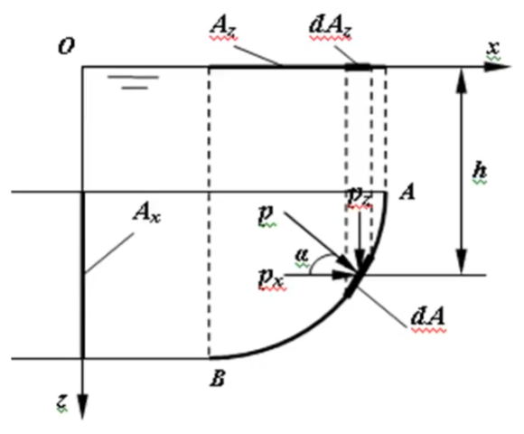
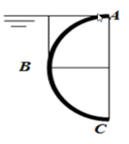
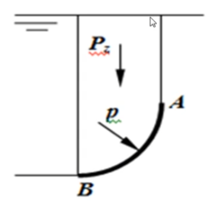
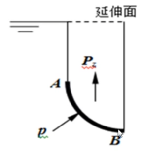
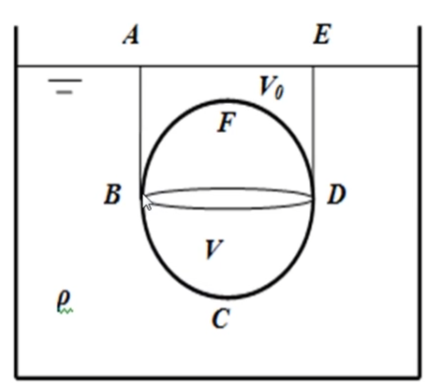

# 流体静力学

[TOC]

## 静止受力

### 定义静止

相对静止和绝对静止 都为静止  通常看牛顿参照系即可；
分析时的静止：假设流体微团之间没有相对运动；；

### 受力

处于静止的流体受到两种力：
1 质量力
2 沿内法线方向的表面力；
注意：流体微团表面无摩擦；

静力学规律适用于理想、实际都能用；

## 质量力、静压强和特征

### 质量力

由于流体质点具有质量产生

1 重力
2 加速运动和角速旋转，惯性力和离心向心力；

所有和质量相关的力都是质量力

### 表面力

质点外界的流体通过质点表面作用给流体质点的力

#### 质量力和表现方法

假设质量m的流体质点收到质量力含有重力和惯性力 记为  $\vec F$ 以分量表达：
$$
\vec F = F_x\vec i+F_y\vec j+F_z\vec k = m(X\vec i+Y\vec j +Z \vec k)
$$
那么单位质量的质量力直接可以表达为
$$
\vec f = \frac{\vec F}m=X\vec i+Y\vec j +Z \vec k
$$
其中 $X,Y,Z$ 称为质量力，如果动起来其实就叫做加速度；
**质量力（加速度）就是有质量物体的空间运动潜力；**

例：仅仅有重力场作用的绝对静止流体，收到的质量力为 $\vec F = -mg\vec k$ ，其负号为里向下，则单位质量力表达则为  $\vec f =0\vec i +0\vec j -g\vec k$，即 $X=0,Y=0,Z=-g$ 

### 流体静压强  221

静止流体中取得一个作用面 $\Delta A$ ，其上作用力为  $\Delta P$ ，定义
$$
p=\lim_{\Delta A\to0}\frac{\Delta P}{\Delta A}
\\
N/m^2=Pa
\\
bar=10^5Pa=标准大气压
$$
这个极限就是静压强；

#### 压强特性：

作用域微团表面的静压强具有两个特性：

1 方向具有垂直指向作用面
2 大小和作用面方位无关

可以把压强看作为空间点的函数
$$
p=f(x,y,z)
$$
垂直指向作用面：静止流体没有切向力，其流体无法承受拉力；

切应力必然让流体运动，这和静止矛盾；
实践来看，牛顿流体无法承受拉力；

#### 静压大小

在静止流体中取 O点，分别沿着 空间直角坐标做出$dx,dy,dz$ 构造四面体

作用在四面体的四个面上分别具有
表面力  $\Delta P_x,\Delta P_y,\Delta P_z,\Delta P_n $ 
和质量力 $\Delta F_x,\Delta F_y,\Delta F_z$
质量力较为容易确定
$$
\Delta F_x=\frac16\rho Xdxdydz
\\
\Delta F_y=\frac16\rho Ydxdydz
\\
\Delta F_z=\frac16\rho Zdxdydz
\\
$$
力平衡状态分析，仅仅就针对x轴，yoz平面来看；
$$
\Delta P_x=\Delta P_n\cos(n,x)+\Delta F_x = 0
\\
\Delta A_x =\Delta A_n\cos(n,x)=\frac12dydz
\\
\frac{\Delta P_x}{\Delta A_x}-\frac{\Delta P_n}{\Delta A_n}+\frac13\rho Xdx=0
$$
取极限后得到  $p_x=p_n$ ,同理  $p_x=p_y=p_z=p_n=p$

于是得出结论，流体静力大小和方向无关

## 流体平衡微分方程

取得长方体微团   也叫平行六面体，大小  $dx,dy,dz$  

质量力
$$
\vec F =m\vec f=\rho dxdydz(X\vec i+Y\vec j+Z\vec k)
$$
表面力，以x方向为例，由于无切向和拉力，仅仅存在压力（推导时用了泰勒展开）
$$
[p(x,y,z)-p(x+dx,y,z)]dydz = -\frac{\part p}{\part x}dxdydz
$$
x轴方向力，X为质量力（静加速度）
$$
\rho Xdxdydz
$$
x轴方向的表面力，来自上述压力泰勒展开推导
$$
-\frac{\part p}{\part x}dxdydz
$$
于是得到了两者平衡得到 沿x方向平衡方程
$$
\rho X dxdydz-\frac{\part p}{\part x}dxdydz=0
\to
\rho X -\frac{\part p}{\part x} =0
$$
同理得到另外两个轴也有，流体微团处于静止时的方程
$$
X=\frac1\rho\frac{\part p}{\part x}
\\
Y=\frac1\rho\frac{\part p}{\part y}
\\
Z=\frac1\rho\frac{\part p}{\part z}
$$
这就是流体平衡微分方程，欧拉1775年导出，也叫 欧拉流体静力学微分方程；

### 全微分型式

将欧拉静力学微分方程各式分别乘以$dx,dy,dz $ ，然后相加，可见左侧正好为压强全微分
$$
\frac{\part p}{\part x}dx+\frac{\part p}{\part y}dy+\frac{\part p}{\part z}dz=\rho(Xdx+Ydy+Zdz)
\\
dp=\rho(Xdx+Ydy+Zdz)
$$
这就是欧拉平衡微分方程的全微分表达，也叫综合式；

### 积分计算

上述式子调整
$$
dp=\rho(Xdx+Ydy+Zdz) \to \frac{dp}{\rho}=Xdx+Ydy+Zdz
$$
分析其可以积分的条件；右侧需要写为全微分型式才能积分；

#### 右式积分条件

定义 ： 若有函数W 使得 
$$
dW=Xdx+Ydy+Zdz=\frac{\part W}{\part x}dx+\frac{\part W}{\part y}dy+\frac{\part W}{\part z}dz 
\\
得到
\\
X=\frac{\part W}{\part x}
\\
Y=\frac{\part W}{\part y}
\\
Z=\frac{\part W}{\part z}
$$
满足这个关系的函数W 为势函数；
当质量力可以用这样的函数表达时，称质量力为有势的；
**其实通过量纲分析就知道，其实所谓的势就是质量力激发速度的能力，只不过在平衡状态微团无法出现移动，故势有方向，类似于速度**；
只有在有势的情况下流体才处于平衡；

> 例如 ，只有重力作用时 $dW=-gdz\to W =-gz$ 就是质量力的势函数；

一般来说，如果质量力有势就能推得
$$
dp=\rho(Xdx+Ydy+Zdz)\to dp=\rho dW \to \frac{dp}\rho=dW
$$
可知右侧式有原函数W，故可积分；

#### 左式积分条件

若为不可压缩流体，左侧密度常数，那么左侧必然可以积分；

对于可压缩流体，质量力有势的平衡条件 $\frac{dp}\rho$ 为某一函数P的微分，那么函数P为压力函数，此时仅要求密度是压强p的函数，此时开可以积分，即
$$
\frac{dp}{\rho}=dP ,\rho=\rho(p)
$$
 这样的流体叫做正压流体；

只有正压流体，在有势的质量力作用时，才能处于平衡；

### 等压面

#### 等压面和等势面

压强相同的空间点构成等压面，其压强在面上为常数 ，$p=C,dp=0$ 
$$
\frac{dp}{\rho}=Xdx+Ydy+Zdz=0
$$

> 由于 $dW=Xdx+Ydy+Zdz = 0$   所以等压面也是等势面

仅重力场中，方程为势函数 $dW=-gdz\to W =-gz=c \to z=C$   ，等压面方程为 $z=C$  

**故等压面就是等势面**

#### 等压面和质量力正交

在等压面上任取一微元线段，$d\vec l=\vec idx+\vec jdy+\vec kdz $ 
单位质量的质量力为  $\vec f=\vec idX+\vec jdY+\vec kdZ$
将两者点积  $d\vec l\cdot \vec f=Xdx+Ydy+Zdz$

即可看出在等压面的情况就是两者点积式，值为0，所以两者正交；

等压面上任意线和质量力方向垂直；
物理意义：单位质量力沿着等压面任意方向运动做功为零；

#### 水平面

如果流体只有重力作用，那么水平面就是等压面；

静止流体内等压面为水平面需要两个墙体：

1  容器是联通的；

2  是同一种液体；

## 流体静压强分布规律

#### 常见压强公式

一个加单的静止液体容器，坐标如图，自由表面压强为 $p_0$  ，此时内部为不可压缩流体；

对于只有重力作用的绝对静止流体，其质量力仅重力，那么质量力的表达为 $X=Y=0,Z=-g$
带入静平衡全微分方程 $dp=\rho(0+0-gdz)\to dp=-\rho gdz$
两侧积分得到  $p=-\rho g z+C$ 
由于我们知道自由液面的压强
于是边界条件为 $z=z_0时p=p_0$  
带入积分结果式
$p_0=-\rho gz_0+C \to C=p_0+\rho gz_0$ 
并代回积分结果式
$p=-\rho gz+p_0+\rho gz_0=p_0+\rho g(z_0-z)=p_0+\rho gh$
于是得到熟悉的公式
$$
p=p_0+\rho gh
$$
在重力作用下的静止液体中，压强随着深度呈现线性关系；

同样也可以写为如下
$$
z+\frac p{\rho g}=c
\\
z-位置高度，位置水头，即单位重量液体具有的位置势能，就是 位能
\\
\frac p{\rho g} - 压强水头,即单位重量液体具有的压强势能，就是 压能
\\
两者之和就是测压管高度，测压管水头，就是单位液体具有的总体势能
$$

从上图就可能看出 A处位能小，压能大，B处位能大，压能小，但是两者的位能和压能总和相等，两侧管道水平面同高度；
$$
z_A+\frac{p_A}{\rho g}=z_B+\frac{p_B}{\rho g}
$$

#### 液体内任意两点压差

$$
p_A=-\rho gz_A+c
\\
p_B=-\rho gz_B+c
\\
p_B-p_A=\rho g(z_A-z_B)=\rho gh_{AB}
\\
p_B-p_A=\rho gh_{AB}
\\
p_B =p_A+\rho gh_{AB}
$$

#### 帕斯卡原理

处于平衡状态不可压缩流体，任意一点的压强变化，能等值传递到各点；

平衡状态有$p_B =p_A+\rho gh_{AB}$,此时A点增加压强导致如下变化
$p'=(p_A+\Delta p)+\rho gh_{AB}=(p_A+\rho gh_{AB})+\Delta p=p_B+\Delta p$

可见A点增加的压强，等值传递到B处；

## 压强的计算标准和度量单位

### 压强计算标准

压强起点不同分：绝对压强、相对压强、真空度

绝对压强和相对压强就差一个标准大气压；
低于标准大气压的数值叫做真空度；

绝对压强: 以无气体分子存在的完全真空为标准的压强 记为 $P_{abs}$
相对压强：以当地大气压作为起点计算压强记为  $p$
$$
P_{abs}=p+atm
$$
真空度：压强低于标准大气压的多少
$$

$$
绝对压强不可能为负值；

### 压强单位

应力单位：为 $Pa$  直接时用 $N/m^2$ 或者$kN/m^2$  表示  如果很高 则使用  $MPa，bar$  
$$
1MPa=10^6Pa
\\
1bar=10^5Pa
$$
液柱单位：压强常用，单位为 m水柱，mm汞柱

大气压单位：用大气压的倍数决定，国际上使用 atm
$$
1atm=101325N/m^2
$$
工程大气压：1平方厘米受到1公斤力
$$
1at=1\times9.8N/cm^2=9.8\times10^4N/m^2=98000Pa
\\
1at<0.1MPa<1atm
$$
一个标准大气压为多少米水柱？
$$
p=\rho gh \to h=\frac p{\rho g}=\frac{101325N/m^2}{1000kg/m^2\times9.8m/s^2}=10.339m
$$

## 静压强测量

求上述B点压强；

等压面得到 方程 $p_0=\rho gh$  ， B点得到压强方程 $p_0+\rho gh_0=\rho g(h+h_0)$

1 其中 $h+h_0$ 为测压管高度 ；

2 测压管只用于较小的压强，否则玻璃管太长；

### U型测压

采用水银测压和U型管配合

可在水银交界处获得等压面，1处和2处等压，故得到方程

$p_1=p_B+\rho_wga=\rho_{ag}gh=p_2 \to p_B=\rho_{ag}gh-\rho_wga$

### 压差计

求两个容器的压力差；使用倒U结构；

分析1处压力 和 2处压力差
$$
p_1=p_0+\rho g (h+y-a)
\\
p_2=p_0+\rho gy
\\
p_1-p_2=\rho g(h-a)
$$

### 倾斜压强计

为了测量较小的压强，采用斜管测压，倾斜角约为10-30度，常常能让读书放大2-5倍

$$
p=\rho gh = \rho g l \sin\theta
$$

### 真空高度

当某点小于大气压，小于多少就是真空度，如下装置就是吸管吸水的道理；

$$
p+\rho g h_v=p_a
\\
h_v=\frac{p-p_a}{\rho g}=\frac{p_v}{\rho g}
\\
其中的h_v为真空高度
\\
p_v 为真空度
$$

## 静压力作用

### 作用于平面情况

作用在平面上的静压力

右侧为一个闸门,宽度为1，水深H，该门受力多少？

以微分的视角可得到
$$
p=\int_0^Hpdh=\int_0^H\rho gdh=\frac12\rho gH^2
$$
以寻找形心的视角可得
$$
P=\rho g h_c\cdot A=\rho g \frac H2\cdot1\times H = p_cA
$$

#### 任意分析

任意形状平板面积 $A$ 和水面夹角为 $\alpha$

液体作用在dA上的小压力为
$$
dP=dp\cdot A=\rho g h \cdot dA=\rho g \cdot y\sin\alpha \cdot dA
$$
积分后就是总压力
$$
P=\rho g \sin\alpha \int_A y dA
$$
接下来考察平板，直接正视平板，A板的面积已知，面密度为常数$\rho_m$ 求A重心 $y_c$

分力矩之和等于合力矩 ，上述式子的$y$就是力臂，只需要将$dA$上受力乘以力臂即可得到该处力矩
$$
\int_A\rho_m ydA=\rho_m A y_c
\to
\int_A ydA= A y_c
\\
\int_A ydA 称为平板A对Ox的面积矩
\\
y_c为平板的型心
$$
所以 将这个面积距带入上述平板静压力公式得到
$$
P=\rho g \sin\alpha \int_A y dA=P=\rho g \sin\alpha\cdot y_c A=\rho g h_cA=p_c A
$$
任意形状平面上静水压大小 等于 作用在形心处的压强乘以受压面积，方向总是指向作用面；

#### 总压力作用点

其基本原理就是力和力矩的平衡原理，如图闸板，左侧又水静压力作用，右侧施加一个什么样的力会让闸板处于平衡；

我们看合力的大小为 $P=p_cA$ ，右侧的力矩为  $F_Py_D$
右侧的力矩为 $\int_A p y dA$   ，那么就有 力矩平衡  $\int_ApydA=F_Py_D$
由此求出右侧力作用位置；

显然作用在闸板的合力为  $P=p_cA=\rho g \frac H2 H=\frac12\rho g H^2$
那么左侧的合力矩为 $\int_0^H pydA=\int_0^H\rho g(H-y)ydy=\int_0^H\rho g (Hy-y^2)dy=\rho g (H\frac12y^2-\frac13y^3)|_0^H=\frac16\rho gH^3$

那么力矩平衡可写为 $F_Py_D=\frac16\rho gH^3\to y_D=\frac1{6F_p}\rho gH^3$

可见如果右侧给出的力 $F_P$  恰好就是左侧作用在闸板的合力，那么作用点就会是 $y_D=\frac1{6F_p}\rho gH^3\to \frac H3$

---

一般平板来说，

由于平板处于静态，所以总压强为 $F=P$

总压力作用点D 到Ox轴的距离为  $y_D$  对$Ox$轴列出力矩平衡方程，有
$$
Fy_D=\int ypdA=\rho g \sin\alpha\int_Ay^2dA
$$
其中 $\int_Ay^2dA=I_x$ 为平板A对$Ox$的惯性矩，代入上述
$$
Fy_D=\rho g I_x\sin\alpha 
 \\
 F=\rho g \sin\alpha y_cA
 \\
 \to
 y_D=\frac{I_x}{y_cA}
$$
由于平行移轴定理 $I_x=I_c+y_c^2A$  ，带入上述 $y_D=y_c+\frac{I_c}{y_cA}$

由此可知  $y_D>y_c$ 总压力作用点D 一般在平板形心之下；

#### 例

竖直闸板，宽度 $B = 4m $ 高度 $h=1m$ ，板顶水深 $h_2=3m$ ，求总压力大小和作用点；

简单求出静压力 
$$
F=PA=\frac12\rho gh_c\cdot Bh_2=\frac12\rho g(h_1+\frac{h_2}2)\cdot Bh_2 = 294kN
$$

假设压力中心D 深度为 $h_D$
$$
Fh_D=\int ypdA=\rho g\int_A y^2dA=\rho g\int_{h_1}^{h_1+h_2} y^2dy=823200Nm
\\
h_D=\frac{823200}{29400}=2.8m
$$

### 作用于曲面情况

情况如图，曲面AB的母线垂直于图面，曲面的面积为A ， 坐标 xoz平面与页面重合， oz轴向下； 求曲面上总压力；

将压力分为水平和竖直部分，同时分力作用在分面积上
然后转化为对于投影面的积分，显然积分结果是投影面的形心处的作用力
显然， x方向的投影面Ax垂直于x轴；
$$
dF_x=p\cos\alpha dA=\rho g h dA_x \to F_x=\rho g\int_{A_x}hdA_x=\rho g h_c A_x = p_cA_x
\\
dF_z=p\sin\alpha dA=\rho g h dA_z \to F_z=\rho g\int_{A_z}hdA_z 
\\
V_p=\int_{A_z}hdA_z  为压力体体积
\to 
F_z = \rho g V_p
$$
可见 ，曲面的水平投影算法如下：

1 将曲面垂直于坐标平面上投影，得到投影面；

2 此投影面形心处压强和投影面积乘积；

垂直方面：

1 压力体产生的压力就是曲面到页面垂直的曲面柱体的重量；

最后总压力为   $P=\sqrt{P_x^2+P_z^2}$

压力作用线和水平夹角 $\tan\alpha=\frac{P_z}{P_x}\to \alpha=\arctan{\frac{P_z}{P_x}}$

说明：

1 求压力体时，需要明确h的高度是哪个，积分的是那块体积

2 始终只计算垂直压力时，考虑液体在作用面上则压力向下，液体在作用面下则压力向上；

#### 压力体

当压力体充满液体，称为实压力体，液面作用在上方，力向下；
当压力体中没液体，称为虚压力体，液面作用在下方，力向上；
水平由重叠曲面，为压力体叠加；

适用压力体方式来证明浮力定理：体积为V的球体入水；

可见BCD曲面的压力体为 $V+V_0$ , 向上；BFD曲面压力体为 $V_0$，向下；
那么表面合力显然为 $F=\rho g (V+V_0)\rho g V_0 = \rho g V$

 

