# 流体动力学基础

[TOC]

## 主要内容

流体运动学 ，仅研究流体运动的方式和状态
流体动力学，研究流体运动的原因和条件
流体的流动必须复合守恒定理，质量守恒，动量守恒，能量守恒

利用守恒推导适用于流体流动的控制方程 ： 连续性方程，欧拉方程，伯努利方程，动量方程

## 描述方法

流体流动过程有两种描述方法：
1 利用理论力学的方法，即质点跟踪法，也叫拉格朗日法；
2 采用场的方法，称为欧拉法

### 拉格朗日法：

也叫质点跟踪法，着眼于流体内部各个质点的运动情况，将这个流动当作很多流体质点运动的总和研究；

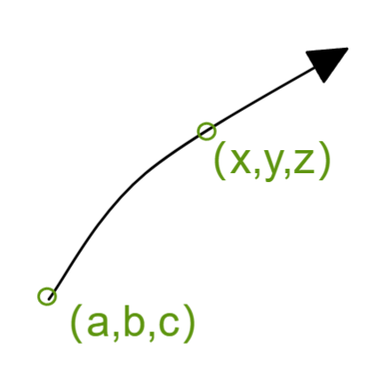

以某个流体质点为对象，时间$t=0$时刻位置$(a,b,c)$ ，时间$t=t$时刻位置$(x,y,z)$  
$$
位移方程\\
x=x(a,b,c,t)
\\
y=y(a,b,c,t)
\\
z=z(a,b,c,t)
\\
速度方程\\
u=\frac{dx(a,b,c,t)}{dt}
\\
v=\frac{dy(a,b,c,t)}{dt}
\\
w=\frac{dz(a,b,c,t)}{dt}
\\ 
$$
其中    a  b  c  为拉格朗日变量

如果大流场中每个质点都要这样研究，工作量巨大，那么其必须选取有代表性的点做研究，且方程较大，求解困难；

### 欧拉方法：

流体由无穷多流体质点构成的连续介质
流体的流动也是整个流域中无限过流体质点运动构成
这个流域叫做流场，使用场方法研究流体的流动问题，欧拉方法

欧拉法要点：

1 分析流动空间某固定位置处流体的运动参数（速度压强温度密度等）随之间变化规律；

2 某空间位置转到另一空间时，运动参数随空间变化规律

由于其分析物理量在不同空间和时间的变化 则 空间和之间则作为内部变量，于是在直角坐标中有物理量的速度方程
$$
u=u(x,y,z,t)
\\
v=v(x,y,z,t)
\\
w=w(x,y,z,t)
\\
$$
于是 $x,y,z,t$ 称为欧拉变量 ， 密度和压强也有类似表达；

然后开始求加速度，假设考察当前x方向物理量，无论是物理量的变化快慢还是自身运动速度都是同量纲的，都可以如下考察
物理量变化速度对时间求导数得到欧拉式的全微分
$$
a_x=\frac{du}{dt}=\frac{\part u}{\part t} + \frac{\part u}{\part x}\frac{dx}{dt}+ \frac{\part u}{\part y}\frac{dy}{dt}+ \frac{\part u}{\part z}\frac{dz}{dt}
$$
这里由于流场的速度定义  $\vec v_x= \frac{dx}{dt},\vec v_y =\frac{dy}{dt},\vec v_z =\frac{dz}{dt},$

于是加速度的表达式为
$$
a_x
=\frac{\part u}{\part t}+\vec v_x\frac{\part u}{\part x}+\vec v_y\frac{\part u}{\part y}+\vec v_z\frac{\part u}{\part z}
$$
全导数引入哈密尔顿算子，得到精简的质点加速度表达
$$
a_x=\frac{\part u}{\part t}+ (\vec V \cdot \nabla)u
$$
全导数也叫质点导数，两个部分组成：
1 当地加速度 $\frac{\part u}{\part t}$：在固定点处速度变化率，就是当前点上物理量速度对于时间的改变率；
2 迁移加速度 $(\vec V\cdot\nabla)\vec V$ ：由于空间位置变化引起的速度变化率；

#### 定常和非定常

**定常流动中，质点加速度一定是0吗？**

空间内每个点的物理属性可能随时间变化，如果不随时间变化，就是定常系统
定常系统不是均匀的，一个空间点的速度永远是不变的，但是质点从这个空间点移动到下个空间点，速度会变成下个空间点的固定速度，在这个运动中产生了迁移加速度；

流场中各个物理量不随时间变化，即定常流动；

定常流动中  $\frac{\part u}{\part t}=0$  ,但是 $\frac{du}{dt}\neq0, (\vec V \cdot \nabla)u\neq0$  

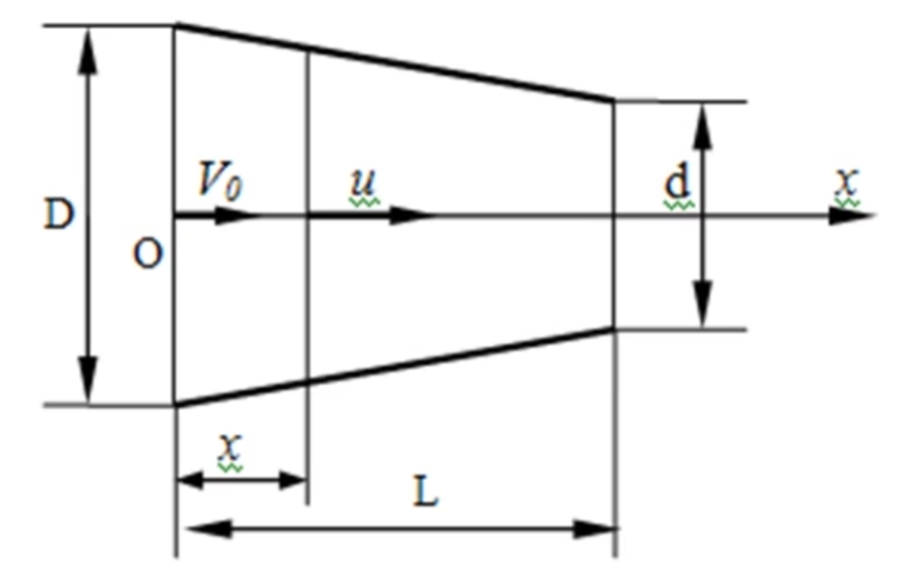

在任意时间同一位置的速度大小不变，但是改变位置速度就会变 
**所以欧拉全导公式可以描述整个流场的状态；**

### 概念定义

#### 迹线

流体质点在流场中连续占据的位置连线，就是质点的迹线；

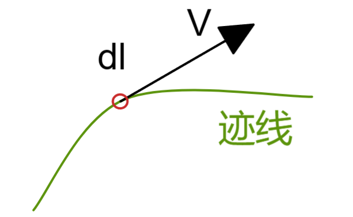

质点的运动方程 为  $dx=udt,dy=vdt,dz=wdt$ ，可得迹线方程
$$
\frac{dx}{u}=\frac{dy}{v}=\frac{dz}{w}=dt
$$
迹线是同一个质点在不同时刻所在位置连成线；
所以迹线就是针对一个质点录像，并纪录其所在位置并将位置连线；

#### 流线

某时刻t 流场中做出曲线，让线上素有流体质点的速度矢量都和这条线相切，这个曲线就是流场中的一个流线

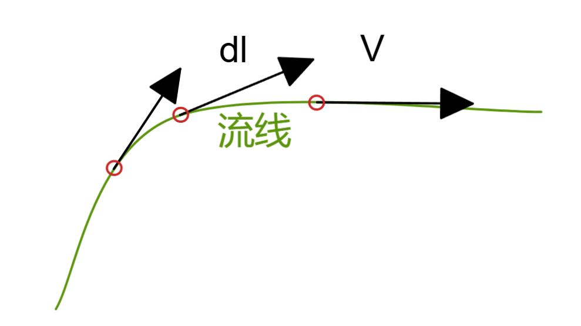

流线方程为
$$
\vec V \times d\vec l = 0 
\\
\frac{dx}{u}=\frac{dy}{v}=\frac{dz}{w}
$$
同一个时刻，不同质点位置连线；
所以流线相当于照相，并分析相片中的各质点倾向，找出连续影响的一串质点位置连线；

##### 流线性质：

1 流线无法相交和忽然转折；流线可能相交于驻点（速度为0点）或者奇点（点源 点汇 点涡）
2 流场每点都有流线通过；
3 定常流动流线形状位置不变，非定常流动流线形状位置随时间变化
4  定常流动流线和迹线重合，但是非定常中两者一般不重合；

#### 流面流管

流场中取得曲线，过线上所有流线组成面为流面，流面上每一点流速和流面相切；
如果AB为一个封闭的线，其构成的流面也就是流管；微小流管为元流，整股流体就是总流；

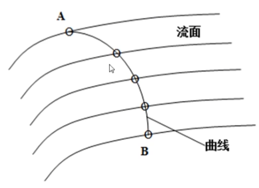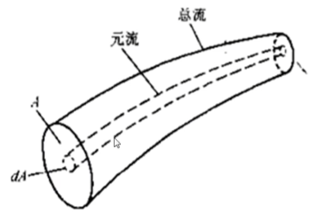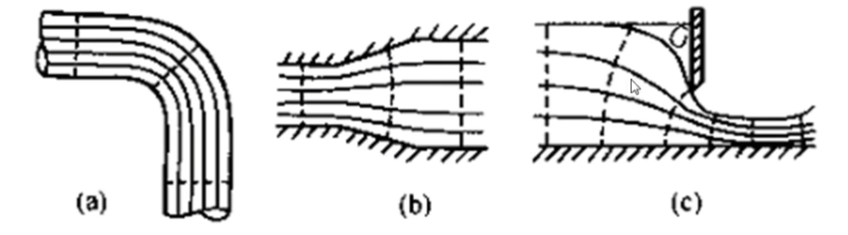

过流断面：垂直于流线的断面叫做过流断面；过流断面可以是平面也可以是曲面，当流线互相平行时为平面 否则为曲面；

#### 流量：

单位时间内通过某一个过流断面的流体体积为流量；积分表达为 
$$
Q=\int dQ=\int_A VdA
\\
Q=\int_A\vec V\cdot d\vec A
$$
过任意曲面A的流体体积流量应该为   在过流断面上速度矢量和面积法向平行 则有  $\vec V \cdot d\vec A = VdA$
此时点乘变为数乘
$$
Q=\int_A VdA
$$
因此断面平均速度就是 流量/面积
$$
\bar V =Q/A
$$

#### 一元流、二元流、三元流

流场中流体的速度和空间坐标有关，于是更具其和空间维度相关性分为 一元流、二元流、三元流

一元流：只流体质点速度之和一个空间变量有关，实际流体一般时三元或者二元流；

**问：**等径直圆管中定常流动为几元流动？

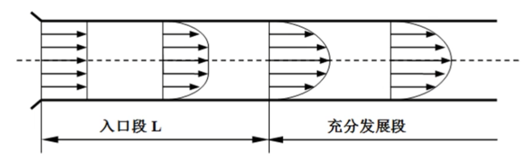

图中入口段中，速度和x轴相关，也和所在径位置R相关，那么为二元流动；
充分发展段中，速度和x轴无关，但是和径位置R相关，那么为一元流动；

**问：**在流场中，如果流线平行，流线一定为直线吗？ 可能在弯管中就不是了；

## 一元流动连续方程

流体流动连续性原理，是质量守恒定律体现；
流场中任意取得一个封闭面，称为控制体， 区域外表为控制面，，那么单位时间流入控制体的质量流量；

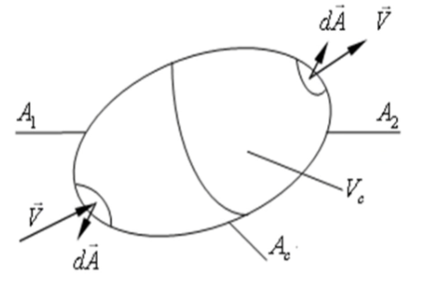

考察流入质量流量和流出质量流量
$$
M_1=-\iint_{A_{1}}\rho \vec V \cdot d \vec A
\\
M_2=+\iint_{A_{2}}\rho \vec V \cdot d \vec A
$$
单位时间内控制体内部的流体质量增量为
$$
\Delta M = \frac{\part}{\part t}\iiint_{V_c}\rho d V _c
$$
因此根据质量守恒定律， 流出的质量-流入的质量=内部的增量  ，对式子简化 流入面和流出面总和就是控制面 ；
如下就是**流动的连续性方程**
$$
M_1-M_2=\Delta M 
\\
\Rightarrow 
-\iint_{A_{1}}\rho \vec V \cdot d \vec A-\iint_{A_{2}}\rho \vec V \cdot d \vec A= \frac{\part}{\part t}\iiint_{V_c}\rho d V _c
\\
\Rightarrow 
\frac{\part}{\part t}\iiint_{V_c}\rho d V_c+  \oiint_{A_c}\rho\vec V \cdot d \vec A=0
$$
例：一元管流的连续性方程，一个管道入口断面A1 ，出口断面A2 和关闭构成流域控制体，推导不可呀流体流动必须满足的连续方程

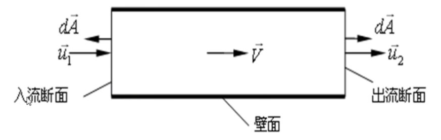

由于不可压缩流体，控制体内的质量不变，体积也就不变，于是得到  $\frac{\part}{\part t}\iiint_{V_c}\rho d V_c = 0$ 
所以依据连续性得到 $\oiint_{A_c}\rho\vec V \cdot d \vec A=0 \to -\iint_{A_{1}}\rho \vec V \cdot d \vec A-\iint_{A_{2}}\rho \vec V \cdot d \vec A= \rho(-u_1A_1+u_2A_2) =0$ 
所以**一元流动连续方程**就是 
$$
u_2A_2=u_1A_1
$$

## 理想流体的一元流动能量方程

讨论流体流动满足的动力学方程

欧拉方程：在流场中任意取出一条流线；沿着该线取出小圆柱作为流体微团；如图，柱轴长度ds ，半径 r ，端面面积dA

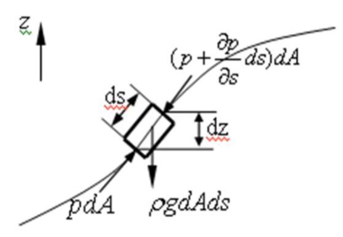

微团受力分析

**表面力**  
柱体根部s处压力为 $pdA$ 
柱体末端其压强受到长度s的影响所以是s的函数$p(s)$,将之泰勒展开 $p(s)=p(s_0)+\frac{p'(s_0)}{1!}ds++\frac{p''(s_0)}{2!}d^2s+O(s^n)$
抛弃高阶项后（当然为了精度也可自选保留数量），柱体末端s+ds处压力为 $(p+\frac{\part p}{\part s}ds)dA$

理想流体时，侧面没有摩擦力；

**重力**

重力就是质量和加速度乘积 ，于是得到该重力为  $\rho g	dAds$
假设只有重力作用
重力在流线切线方向分量 $\rho g \cos\theta	dAds$

#### 动力式 一元非定常欧拉方程

根据牛二，沿着流线得到方程
$$
pdA-(p+\frac{\part p}{\part s}ds)dA-\rho g \cos\theta	dAds=\rho dAds \cdot a_s
\\
\Rightarrow
\\
g\cos\theta + \frac1\rho\frac{\part p}{\part s}+a_s=0
$$
角度为 $\cos\theta=\frac{\part z}{\part s}$  ， 并使用先前推 导欧拉全微分的结论 $a_s=\frac{dV}{dt}=\frac{\part V}{\part t}+V\frac{\part V}{\part s}$  ，导入上述式子得到 流体微团运动的微分方程；
$$
g\frac{\part z}{\part s}+\frac1\rho\frac{\part p}{\part s}+\frac{\part V}{\part t}+V\frac{\part V}{\part s}=0
$$
这个方程是理想流体一元非定常流动的运动方程，也叫欧拉方程；

#### 推导伯努利方程 

我们拿到一元非定常欧拉方程，需要进行积分以便更加方便使用，尝试两侧都乘 $\part s$ ，并当作一元处理（$\part$ 变为 d）

$ \int( gdz+\frac{dp}{\rho}+\frac{dVds}{dt}+VdV)  $

此时可以看到，只有第三项较难以处理，那么如果将此项置0，那么流动情况就是定常流动；
然后得到了理想流体一元定常流动的运动方程如下
$$
gdz+\frac{dp}{\rho} + VdV
$$
对于不可压缩流体，密度是常数，于是可以对上述式子积分，得到了
$$
z+\frac{p}{\rho g}+\frac{V^2}{2g}=C
$$
于是我们得到了非常著名的**伯努利方程**，1738年瑞士数学家伯努利提出；

$$
z+\frac{p}{\rho g}+\frac{V^2}{2g}=C
\\
\frac{V^2}{2g}:表达单位重量流体 速度为V时的动能 （速度水头）
\\
\frac{p}{\rho g}:测压管高度，表示单位重量流体相对于大气压的压能 （压力水头）
\\
Z:位置高度，表达单位重量流体相对于某基准面的位置势能（位置水头）
$$

三者相加为常数，其物理意义考察如下

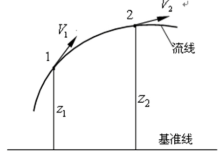

选取一条流线，取出两点列伯努利方程 $z_1+\frac{p_1}{\rho g}+\frac{V_1^2}{2g}=z_2+\frac{p_2}{\rho g}+\frac{V_2^2}{2g}$
这说明单位重量流体的机械能是守恒的（总水头不变）

**伯努利方程物理意义：沿着流线流体质点动能、压能、势能 之和为常数，就是机械能守恒，也叫能量方程；**

伯努利的使用条件：理想无摩擦无粘流体；不可压缩流体；定常流动；只有重力场；一条流线内

对水流来说，压力很低处，水会气化，此时方程就不适用了；

#### 常用名词

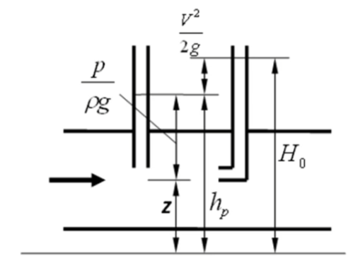

测压管水头，静压时，$h_p=\frac{p}{\rho g}+z$  为测压管水头 ；

总水头： 单位重量流体具有的总机械能称为总水头，即为伯努利方程的常数

总压：不考虑重力时，动压和静压之和就是总压 $p_0=p+\frac12\rho V^2$

### 伯努利方程应用

**例：**一根弯管如图 测河流流速，分析水流速度 V 和 垂直向上的管中页面高度h的关系；

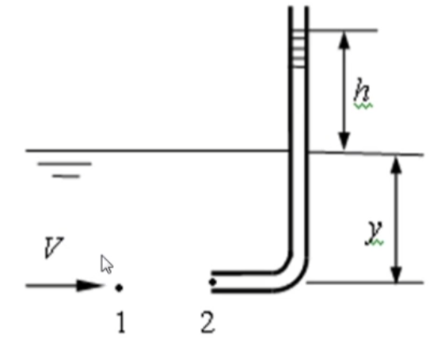

考察 1 点 2 点 ，两者高相同  则势能相同 ， 所以  $z_1=z_2=z$  , 
考察两者速度 ， 其中1点速度 V ， 2点为驻点，速度0 ， 所以  1点静压强 为$\rho g y $  , 2点静压强为  $ \rho g (h+y)$
那么由伯努利方程可知，两者总能量需守恒则有  
$z_1+\frac{p_1}{\rho g}+\frac{V_1^2}{2g}=z+y+\frac{V^2}{2g}=C=z_2+\frac{p_2}{\rho g}+\frac{V_2^2}{2g}=z+(h+y)+0$
$$
z_1+\frac{p_1}{\rho g}+\frac{V_1^2}{2g}=z_2+\frac{p_2}{\rho g}+\frac{V_2^2}{2g}\to 
\\
z+y+\frac{V^2}{2g}=z+(h+y)+\frac0{2g}=C
\to 
\\
V=\sqrt{2hg}
$$
于是我们可以直接依据测压管高度算的河流流速

#### 管内测压

**另：**若水流在封闭管道内，由于上述1点无法和大气联通，其压强无法确定，流速需如何测量？ 
**答：**可采用如下图装置测量，另外开出直管用于测量1点压强；

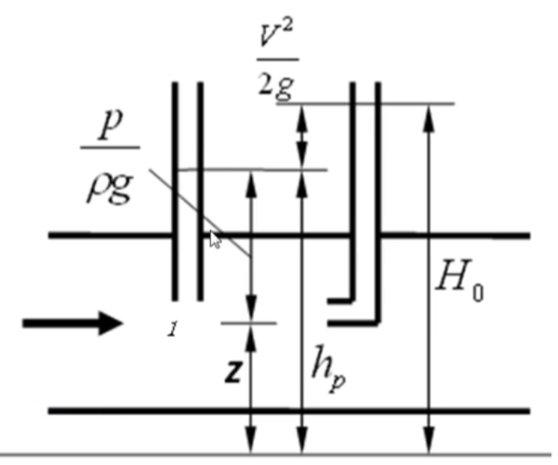

于是1点测压水头可得  $h_p=\frac p{\rho g}+z$  , 驻点总水头 $H_0=z+\frac p{\rho g}+\frac{V^2}{2g}$
可见两个测压管的高差就是速度水头导致的 $H_0-h_p=h=\frac{V^2}{2g}$

可见如此测压不方便，那么能否将两个管子合二为一呢？ 那就是 皮托管；

#### 皮托管

如图为皮托管，测量各点流速的仪器

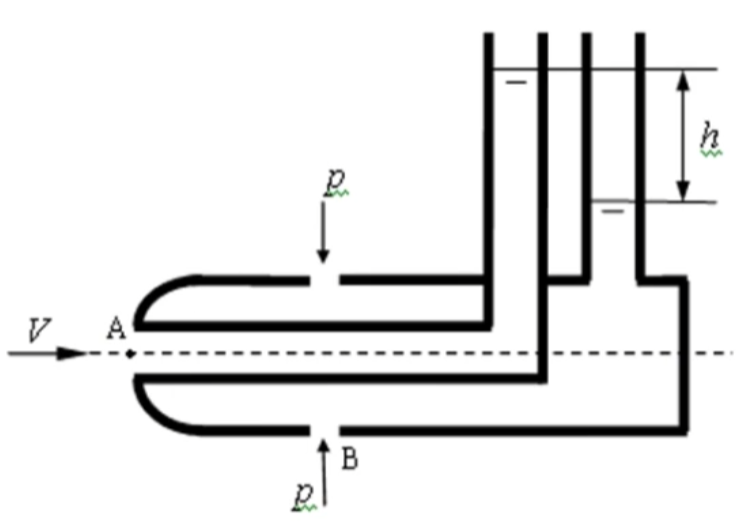

两者测压水头差就是速度水头，因此测速公式也是   $V=\sqrt{2hg}$
对于实际测量，应该有一个小于1的修正系数  $V=\xi\sqrt{2hg}$

#### 测速仪

如图，测风速，气流速度V 和 U型管内水柱液面差h之间的关系；

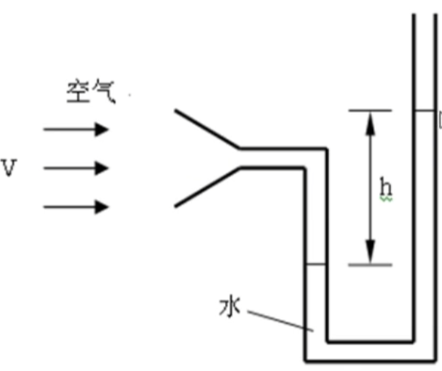

简单分析，可见，外侧总压有大气静压、势能、速度影响 ，管口总压没有速度影响，仅右侧提供静压以及当前势能
由于空气的势能小且基本实验范围在同高度，则势能忽略，而考察的压强为相对大气压强，则大气静压也忽略
于是得到 外部和管口的伯努利方程  $\frac{V^2}{2g}=\frac{p_0}{\rho_a g}$ ，这里的密度为空气密度 
此时我们需要知道驻点的静压强才能计算，那么右侧管道就可以提供参考，忽略小段空气柱的压强，在低液面做等压面  $p_0= \rho_w g h$
两个式子联立，消除静压得到  $V=\sqrt{\frac{\rho_w}{\rho_a}2gh}$

#### 泄空问题

水箱截面积A，出流孔面积为a若使水箱中的水完全流出需要多久？

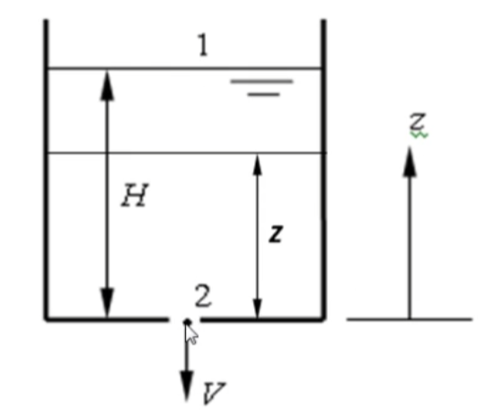

分析可见  液面高度和时间有关  某时刻 出流速度为 $V_t=\sqrt{2gz}$   
那么 从 从时间 $t$  到 $t+dt$   内流出  $dQ = a\sqrt{2gz}dt $
相应液面下降了 $dz$ 流出了 $Adz$    那么根据不可压情况质量守恒体积守恒 得到  $a\sqrt{2gz}dt=-Adz$
 然后两侧积分 $\int_0^Tdt=-\int_H^0\frac Aa\frac{dz}{\sqrt{2gz}} \to T = 2\frac{AH}{a\sqrt{2gH}}$

于是我们得到了泄空时间  ；  令人惊叹的是  这个时间是液面保持原高度H一直出流时间的2倍 ， 速度可见是线性的；

**增加竖管后出流速度的情况**

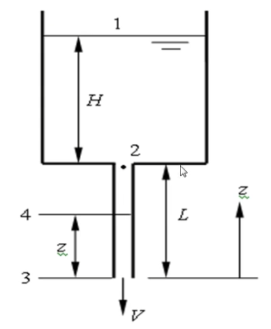

首先1234 四个点的伯努利方程列出为
$$
\\
由于相对性，大气压p_a置零，1点下降慢，故速度V_1忽略；
\\
1:\frac{p_a}{\rho g}+\frac{V_1^2}{2g}+H+L = 0+0+H+L
\\
2:\frac{p_2}{\rho g}+\frac{V^2}{2g}+L
\\
3:\frac{p_a}{\rho g}+\frac{V^2}{2g}+0 =0+\frac{V^2}{2g}+0
\\
4:\frac{p_4}{\rho g}+\frac{V^2}{2g}+z
$$

对1 点 和 3点 列出方程  ，有  $\frac0{\rho g}+\frac0{2g}+(H+L)=\frac0{\rho g}+\frac{V^2}{2g}+0 \to V=\sqrt{2g(H+L)}$
可见水流的出流速度变大了；
我们再考察4 点 和 3 点 伯努利  $\frac{p_4}{\rho g}+\frac{V^2}{2g}+z=0+\frac{V^2}{2g}+0 \to p_4=-\rho gz$
由此发现4点静压强小于大气压，具有真空度，可见整个下部管道具有真空度，其随着z增加；

**另：**那么问题又来了，如果继续增长管道L  出流速度可否无限增加下去？
**答：**当管道越来越长，其真空度达到液体饱和蒸汽压时，水就开始了汽化，此时管道内出现两相流，伯努利方程就不成立了；

伯努利方程在一条流线成立，而对于总流是否成立？这需要用到总流的伯努利方程；

如何考虑能量流动损失？要采用流动损失的伯努利方程；

### 理想总流的伯努利方程

将原有的伯努利方程两端乘以 $\rho g dQ $
$$
(\frac{u_1^2}{2g}+\frac{p_1}{\rho g}+z_1)\rho g dQ =
(\frac{u_2^2}{2g}+\frac{p_2}{\rho g}+z_2)\rho g dQ  
\\
dQ=u_1dA_1=u_2dA_2
\\
\int_{A_1}(\frac{u_1^2}{2g}+\frac{p_1}{\rho g}+z_1)\rho g u_1dA_1 =
\int_{A_2}(\frac{u_2^2}{2g}+\frac{p_2}{\rho g}+z_2)\rho g u_2dA_2
\\
\int_{A_1}(\frac{u_1^2}{2g}+\frac{p_1}{\rho g}+z_1) u_1dA_1 =
\int_{A_2}(\frac{u_2^2}{2g}+\frac{p_2}{\rho g}+z_2) u_2dA_2
\\
两侧形式相同，单独拿出一侧 分开 ， \int_{A }(\frac{u ^2}{2g}+\frac{p }{\rho g}+z ) u dA =  \int_{A }\frac{u ^2}{2g}udA+ \int_{A }(\frac{p }{\rho g}+z ) u dA 
$$
此时，考虑到 如果 测压管高度不变，则静压和势能项就可以为常数，方便积分，
**过流断面：其面上所有的压强分布规律和静水压强规律相同；**
而速度项中只要取平均速度即可方便积分，
**渐变流断面：流动方向变化不大的断面，各流线接近于平行；**

过流断面取在渐变流断面上 ，动能在此面上投影为0

那么对于静力学关系中，静压和势能和为常数  $\frac p{\rho g}+z=C \to \int_A(\frac p{\rho g}+z)udA=(\frac p{\rho g}+z)dQ$

