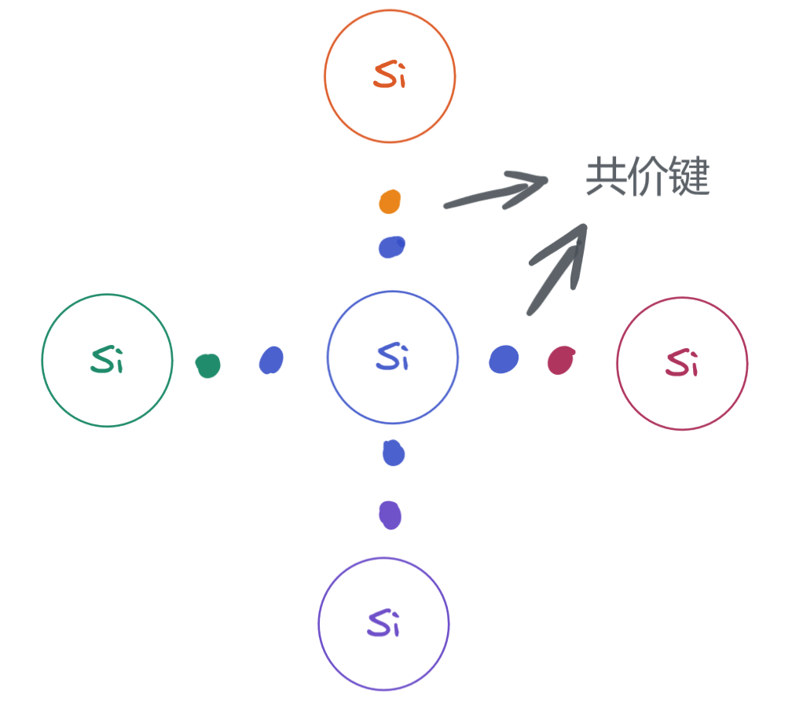
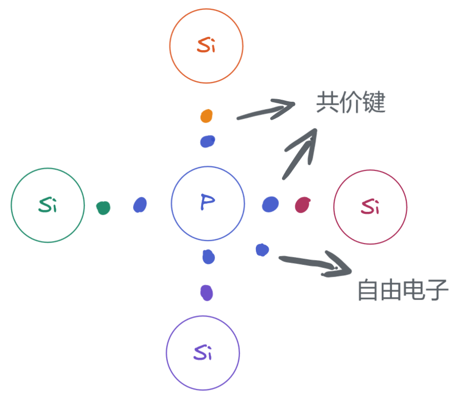
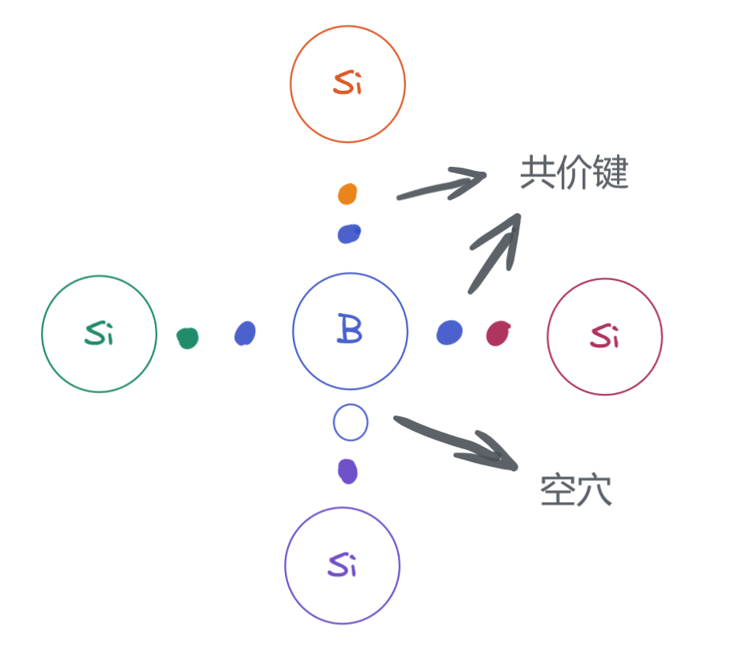
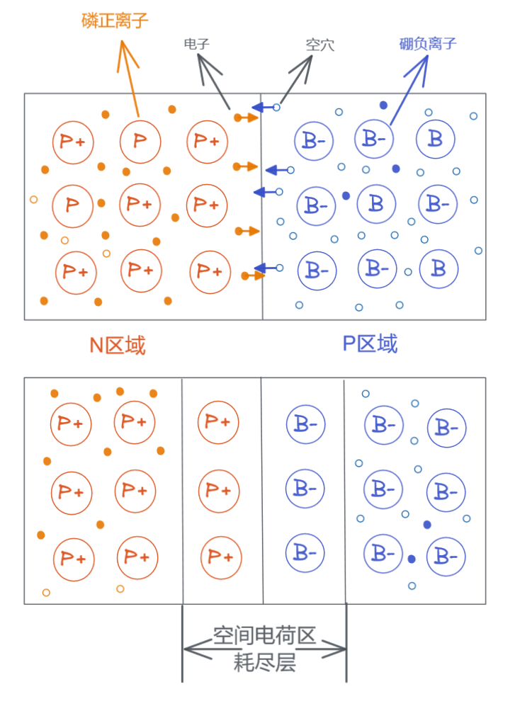
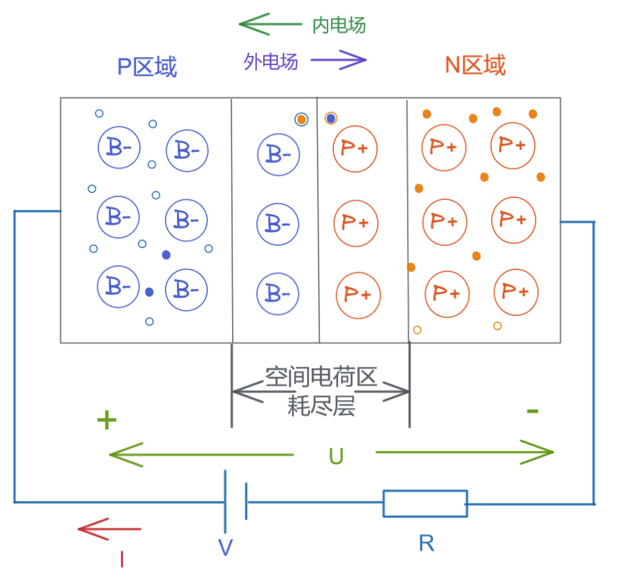
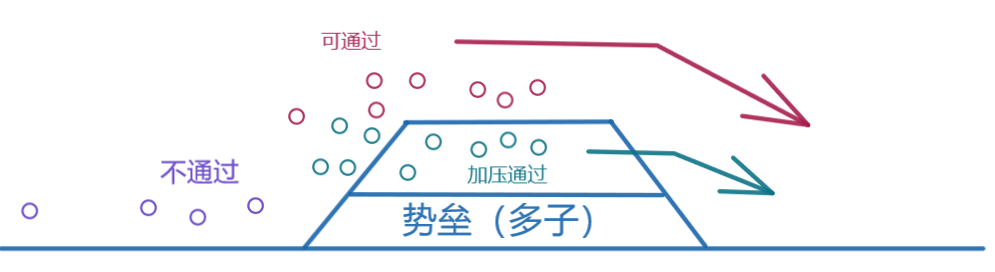
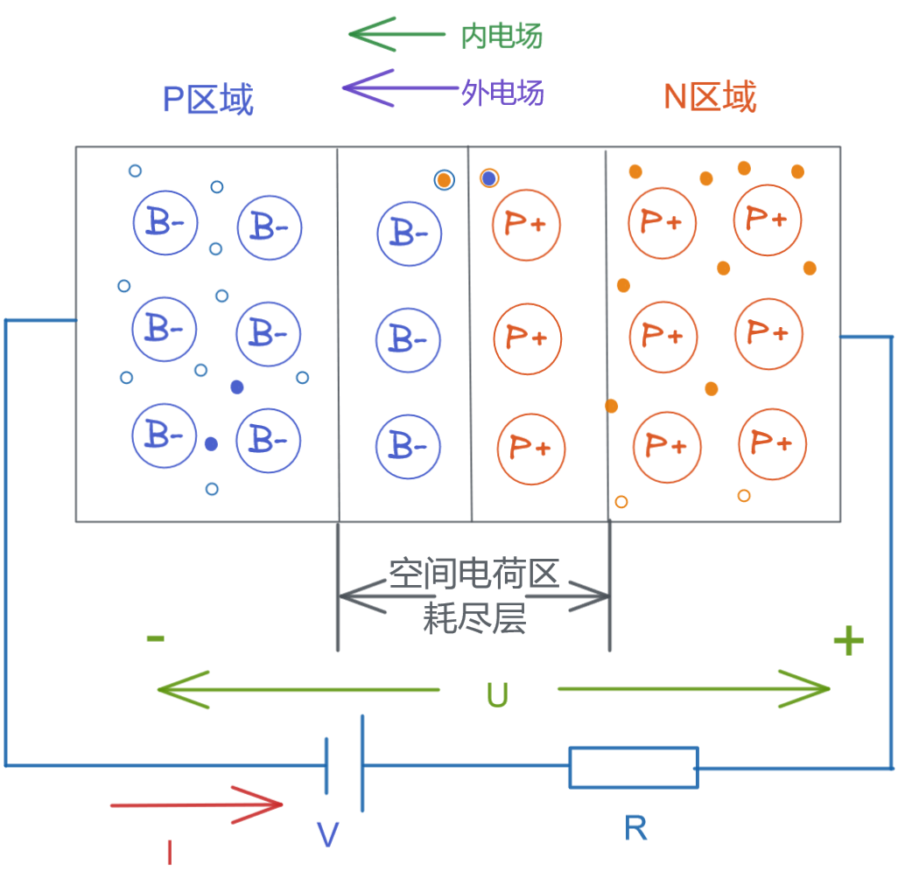
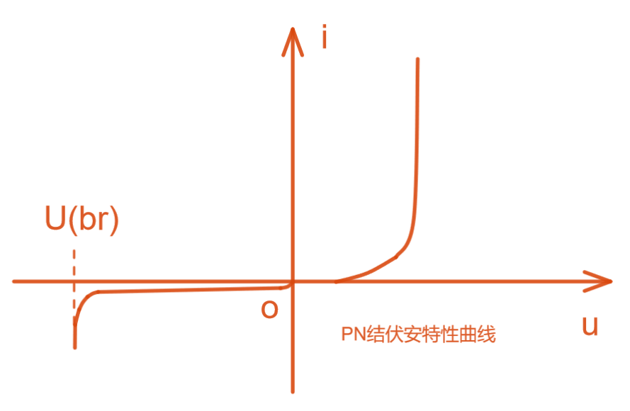

# 上海交通大学-模拟电子技术-笔记-1-绪论

[TOC]

## 1 常用半导体器件

### 1.1 基础

#### 1.1.1本征半导体

半导体：介于导体和半导体之间的材料

本征半导体：具有一定晶体结构的半导体

本征半导体的晶体结构：如硅晶体，每一个硅原子周围每个电子都和其他硅原子的电子结合成共价键，一个硅原子共四个外围电子，周围四个硅原子分别提供1个电子，达到每个硅原周围8电子的稳定结构；这些稳定的价电子难以流动，故本征半导体难以导电；

本征激发：非绝对零度情况，晶体结构共价键具有热运动，价电子会跳出，发生本征激发，但这样的自由电子较少；

空穴：共价键内缺少电子的位置，可俘获跳出的电子（复合），电子不断跳出并填补空穴，那么宏观上电子移动也伴随空穴的反向移动；

复合运动：电子填补空穴的运动；

载流子：活动电子或活动空穴都可以称为载流子，因为其改变了不同区域的能量即宏观看搬运了能量；

可见载流子浓度决定了材料的导电性；

温度越高本征激发越快，载流子浓度上升，则复合速度上涨，最后激发和复合达到动态平衡；

激发电子数量N = 复合空穴数量P

**一般本征半导体导电性很弱； 于是可以参入杂质来增加其导电性；**

#### 1.1.2 杂质半导体

其由扩散工艺带来；

杂质半导体：在本征半导体加入很少量（痕量）的杂志元素，为的就是制造载流子浓度；

**N型半导体：**硅基础参入磷元素；由于磷元素是5价元素外部多出一个可形成共价键的电子；就导致出现较多活动电子，能够使用极低的参杂浓度巨大提高半导体导电性；N就是 Negative 电子负电的意思；

此时，磷导致的自由电子变多，空穴在原有动态平衡内只有电子激发才能产生，电子是多数载流子，空穴为少数载流子，简称 **电子为多子，空穴为少子**；

激发电子数量N  + 自由电子数量 N' > 复合空穴数量P

多子对温度不敏感，少子对温度很敏感；

**P型半导体：**硅基础参入硼元素；由于硼元素是3价元素外部少一个可形成共价键的电子；就导致晶格共价键出现空穴，也能够使用极低的参杂浓度巨大提高半导体导电性；P是正电 Positive；此时空穴为多子，电子为少子；

##### 注

为何不加6或7价元素？

杂质电离能不一样，六价元素失去第一个电子和失去第二个电子所需的能量不一样，三五族杂质属于浅能级，容易失去或得到电子，其他族都属于深能级杂质，具体参考书籍半导体物理；因为5价P易失电子，6价7价易得电子，所以掺6价7价就不是N型半导体的特性了；我们需要的是易失电子的特性；

#### 1.1.3 PN结

任何物质都有从高浓度区扩散到低浓度区的趋势，由固体物理中发现的现象，PN内部的电子和空穴也遵循此规律；

##### 扩散运动

多子运动：在PN接触部位，N区高浓度电子向P区扩散，P区高浓度空穴向N区扩散，N区电子进入P区被P区占多数的空穴俘获（两者复合），P区空穴进入N区和N区占多数的电子复合；那么在PN两种材料的接触面上就产生一个动态平衡下的空间电荷区（耗尽层、阻挡层、PN结），在这个区域对多子来说耗尽层产生了一个高能势垒，多数载流子扩散运动无法通过耗尽层（其中有距离原因，距离导致需要撞击的共价键数量变多，传递过程中就产生能量损耗，载流子想要通过耗尽层就要更高能量）；

##### 漂移运动

少子运动：在PN接接触部位，产生的耗尽层，P区少量的电子会被N区的正离子吸引，直接被拉过去

多子由于布朗运动将产生W个高能多子幸运地穿过了PN结，那么少子被拉到对面的数量差不多因为是W个，达到通过PN结的动态平衡；这个通过目前可以理解为能量上的通过（牛顿摆假设模型）；

##### 不对称PN结

PN结左右两端的材料参杂浓度不同时，可以制作为不对称PN结；

**注：**

PN结耗尽层因为电子和空穴结合消失导致了耗尽层没有载流子所以有高电阻；

##### 单向导电性

**外加正向电压**

此时可看到外电场由P区向N区施加，外电场从0V开始加压：

加压初段，此时外电场电流导致P区的空穴的扩散能力上升，但由于P区耗尽层消耗了所有这些空穴扩散能力导致此处导电能力没有多大变化，N区电子的扩散也类似，称该电压区间依旧为死区；

继续加压，可以看到多子扩散能力进一步加强，超过了耗尽层的势垒（也可说势垒下降），耗尽层区域的共价键数量损耗无法完全阻挡多子通过（又因为多子不断撞击共价键导致耗尽层变薄），又因为势垒的特性曲线，导致越是电压升高。每单位增压能够通过的多子数量越多，最后导电性随电压上升呈现指数类似增长；

电阻R则为限流装置，将最大电流限制在 I=U/R

**外加反向电压**

对于多子来说，此时内外电场一致，导致P区域空穴和外电场电子复合概率上升，降低了空穴不稳定运动（空穴变少，运动能力下降），P区变少的多余空穴一方面向向电源负极移动，另一方面向P区耗尽层消耗N区来的电子，P区带有空穴的区域越来越少，导致P区域的普通区逐渐转变为P区耗尽层，导致P区耗尽层的变厚（势垒变高），此时能够通过耗尽层的多子幸运儿就更少了，注意此处的耗尽层虽然处于动态平衡，但其含有的潜能变高了，即单位时间交换的载流子变多但正负电量却相当；N区也是类似的反向活动；

但是在反向电压情况下，少子的漂移运动被增强了，但由于少子数量少能量小（通常为微安级电流），故可以忽略其导致的宏观变化；少子的电流称为反向饱和电流，其对温度非常敏感（可作为温敏电阻）；

PN结的电流方程
$$
i = I_s(e^{\frac{U}{U_T}}-1)
$$
$I_s为反向饱和电流,U_T为温度当量，室温下U_T=26mV，U为PN外接电压，常为上百mV，那么电流方程内可见括号内的-1可以忽略，几乎就是指数关系$

PN结伏安特性曲线：

一般锗管导通电压0.2V-03V ， 硅管0.6V-0.7V，

