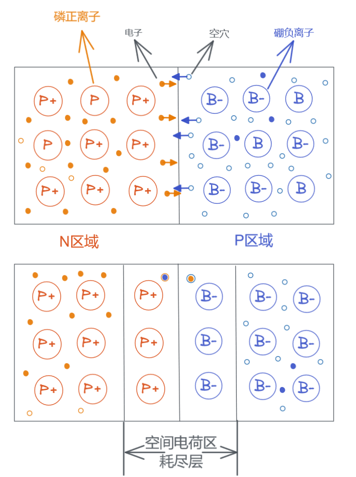
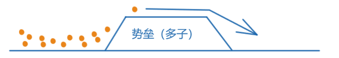
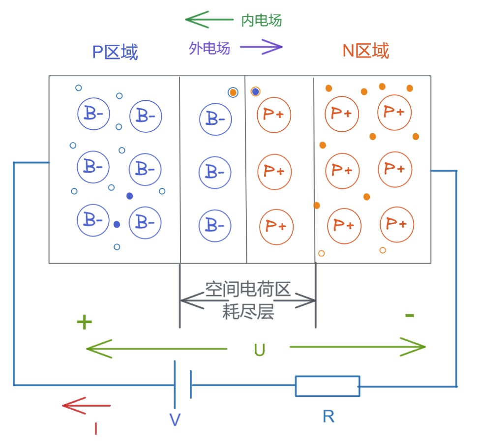
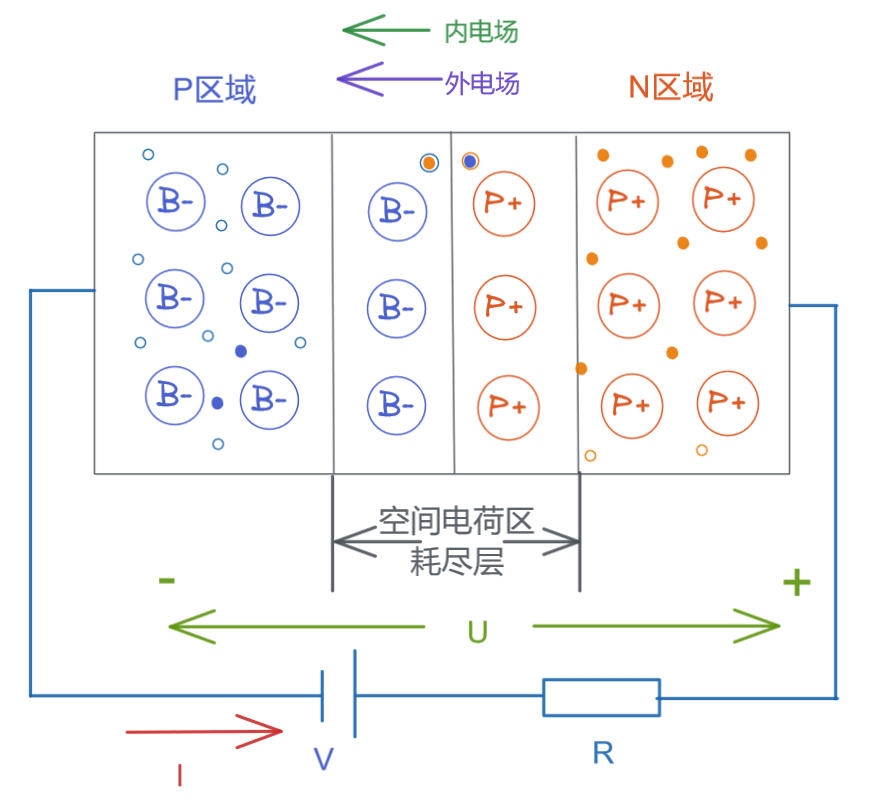
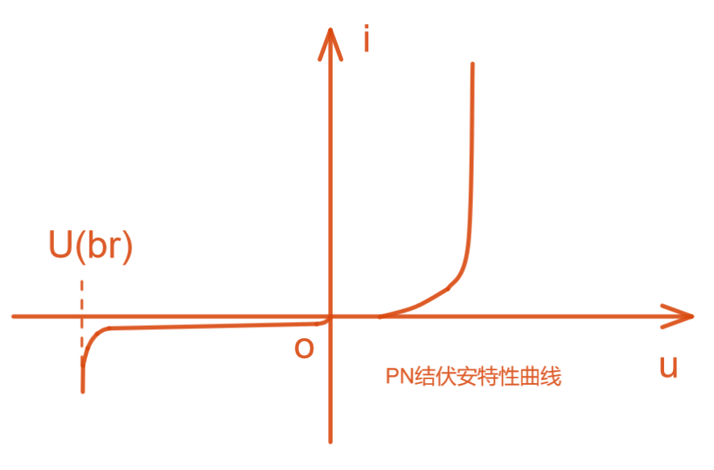

# 上海交通大学-模拟电子技术-笔记-2-PN结

[TOC]

 

## PN结

任何物质都有从高浓度区扩散到低浓度区的趋势，由固体物理中发现的现象，PN内部的电子和空穴也遵循此规律；

### 扩散运动

多子运动：在PN接触部位，N区高浓度电子向P区扩散，P区高浓度空穴向N区扩散，N区电子进入P区被P区占多数的空穴俘获（两者复合），P区空穴进入N区和N区占多数的电子复合；那么在PN两种材料的接触面上就产生一个动态平衡下的空间电荷区（耗尽层、阻挡层、PN结），在这个区域对多子来说耗尽层产生了一个高能势垒，多数载流子扩散运动无法通过耗尽层（其中有距离原因，距离导致需要撞击的共价键数量变多，传递过程中就产生能量损耗，载流子想要通过耗尽层就要更高能量）；

### 漂移运动

少子运动：在PN接接触部位，产生的耗尽层，P区少量的电子会被N区的正离子吸引，直接被拉过去

多子由于布朗运动将产生W个高能多子幸运地穿过了PN结，那么少子被拉到对面的数量差不多因为是W个，达到通过PN结的动态平衡；这个通过目前可以理解为能量上的通过（牛顿摆假设模型）；

### 不对称PN结

PN结左右两端的材料参杂浓度不同时，可以制作为不对称PN结；

**注：**

PN结耗尽层因为电子和空穴结合消失导致了耗尽层没有载流子所以有高电阻；

## 单向导电性

### 外加正向电压

此时可看到外电场由P区向N区施加，外电场从0V开始加压：

加压初段，此时外电场电流导致P区的空穴的扩散能力上升，但由于P区耗尽层消耗了所有这些空穴扩散能力导致此处导电能力没有多大变化，N区电子的扩散也类似，称该电压区间依旧为死区；

继续加压，可以看到多子扩散能力进一步加强，超过了耗尽层的势垒（也可说势垒下降），耗尽层区域的共价键数量损耗无法完全阻挡多子通过（又因为多子不断撞击共价键导致耗尽层变薄），又因为势垒的特性曲线，导致越是电压升高。每单位增压能够通过的多子数量越多，最后导电性随电压上升呈现指数类似增长；

电阻R则为限流装置，将最大电流限制在 I=U/R

### 外加反向电压

对于多子来说，此时内外电场一致，导致P区域空穴和外电场电子复合概率上升，降低了空穴不稳定运动（空穴变少，运动能力下降），P区变少的多余空穴一方面向向电源负极移动，另一方面向P区耗尽层消耗N区来的电子，P区带有空穴的区域越来越少，导致P区域的普通区逐渐转变为P区耗尽层，导致P区耗尽层的变厚（势垒变高），此时能够通过耗尽层的多子幸运儿就更少了，注意此处的耗尽层虽然处于动态平衡，但其含有的潜能变高了，即单位时间交换的载流子变多但正负电量却相当；N区也是类似的反向活动；

但是在反向电压情况下，少子的漂移运动被增强了，但由于少子数量少能量小（通常为微安级电流），故可以忽略少子导致的宏观变化；少子的电流称为反向饱和电流，其对温度非常敏感（此特性用于作为温敏电阻）；

### PN结的电流方程和伏安特性

$$
i = I_s(e^{\frac{U}{U_T}}-1)
$$

$I_s为反向饱和电流,U_T为温度当量，室温下U_T=26mV，U为PN外接电压，常为上百mV，那么电流方程内可见括号内的-1可以忽略，几乎就是指数关系$

PN结伏安特性曲线：

一般锗管导通电压0.2V-03V ， 硅管0.6V-0.7V

