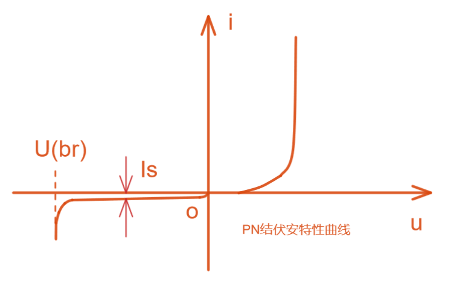
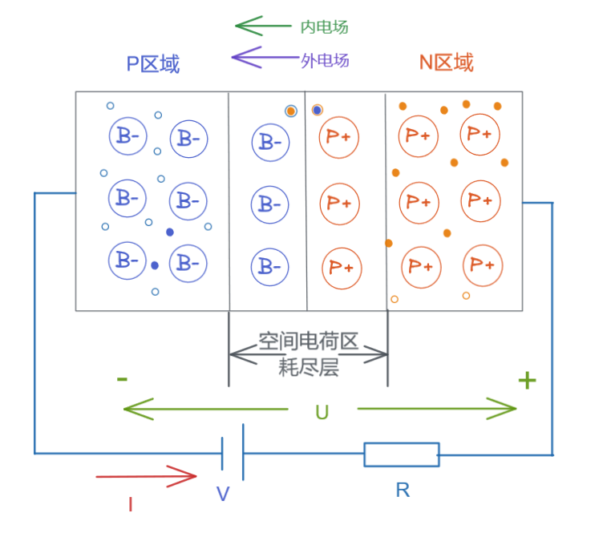
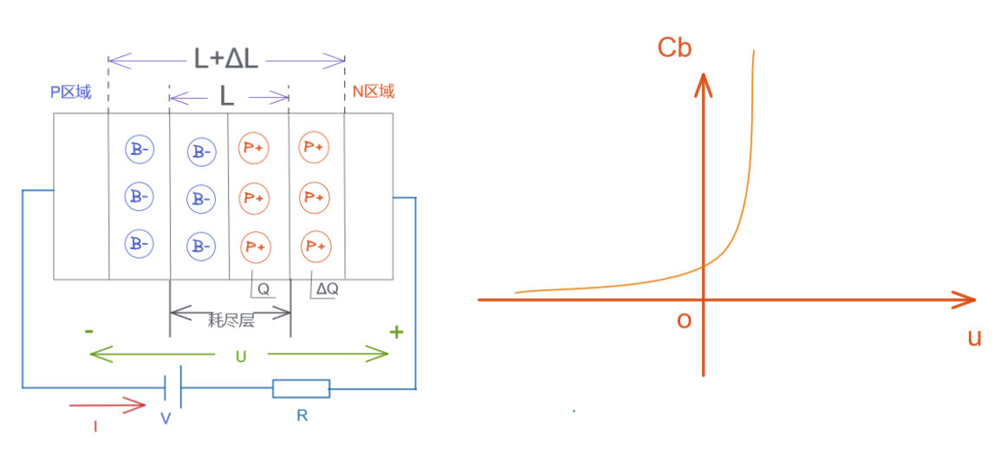
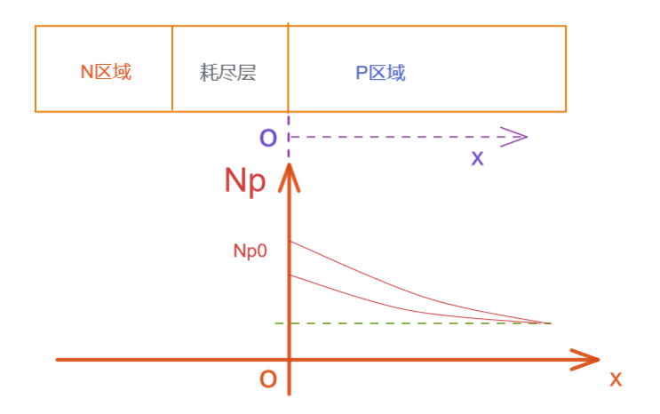
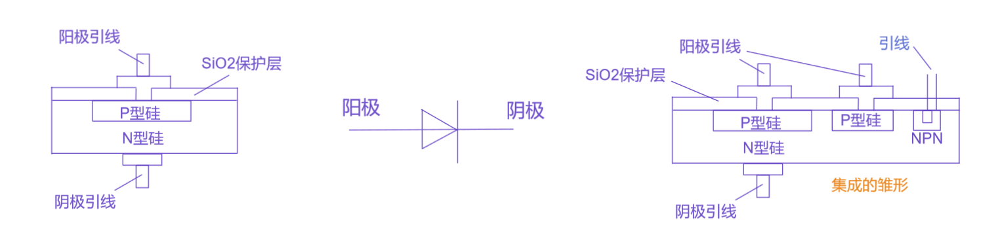
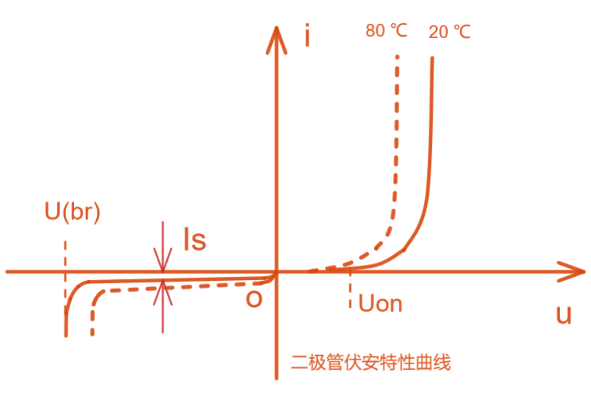

# 上海交通大学-模拟电子技术-笔记-3-PN结和二级管特性

[TOC]

## PN结的电流方程和伏安特性

### 1 正向特性

$$
i = I_s(e^{\frac{U}{U_T}}-1)
$$

$I_s为反向饱和电流,U_T为温度当量，室温下U_T=26mV，U为PN外接电压，常为上百mV，那么电流方程内可见括号内的-1可以忽略，几乎就是指数关系$

PN结伏安特性曲线：

一般锗管导通电压0.2V-03V ， 硅管0.6V-0.7V，

### 2 反向特性

反向电流  锗管 > 硅管

### 3 反向击穿

#### 雪崩击穿

参杂浓度时，反向电流加载时，PN耗尽层区域距离增厚，那么这个PN结成了一个粒子加速器，任何进入该区域的粒子都会被加速，若参杂浓度较低，则耗尽层较宽，随着 PN 外加反向电压不断增大，空间电荷区的电场不断增强，当超过某临界值时，载流子受电场加速获得很高的动能，与晶格点阵原子发生碰撞使之电离，产生新的电子—空穴对，再被电场加速，再产生更多的电子—空穴对，如此产生链式效应，于是雪崩击穿；相当于电子撞开了耗尽层内的共价键产生了新电子和新空穴，而新电子再被加速撞击其他共价键，导致空穴和电子的复合速度无法匹配被撞开共价键的速度；

温度越高，晶核振动幅度越大，越容易阻碍粒子运动，粒子运动轨迹变小，Ek=FS,因此需要更高的电压才能达到击穿所需能量

可见反向加压的时候，耗尽层中的动态平衡能量升高到无法保持，爆发潜力达到极限（厚度变厚，参与储能的共价键多），耗尽层内部潜力蓄势待发，直到外电场彻底打破平衡；

#### 齐纳击穿

参杂浓度高时，对重掺杂PN结，浓度高，很窄的区之中的粒子可以造出耗尽层，随着结上反偏电压增大，可能使P区价带顶高于N区导带底，P区价带的电子可以通过隧道效应直接穿过耗尽带到达N区导带，成为导电载流子，当结上反偏电压增大到一定程度，将使隧穿电流急剧增加，呈现击穿现象，称为隧道击穿，又称为齐纳击穿。

3.P区价带的电子可以通过隧道效应直接穿过禁带到达N区导带，成为导电载流子。

4.当结上反偏电压增大到一定程度，将使隧穿电流急剧增加，呈现击穿现象，称为隧道击穿，又称为齐纳击穿。

 就是高浓度时，反偏电压时很薄的PN结上承载巨大场强，直到这个场强直接破坏共价键；

#### 击穿分析

击穿时导致的大电流会使PN结过热烧毁，但是如果没发生热击穿则还有救；

反向击穿特性，在很大的电流范围内电压不变，可以用于稳压二极管；

雪崩击穿，温度越高，所需电压越高；

对于雪崩击穿，温度越高，少子明显增多，漂移运动所产生的的电场越强，内建电场越弱，则需要更大外加电压；雪崩击穿是依靠自由电子的能量来撞击价电子，而温度越高，热运动越强烈，会让自由电子更容易失去已经积累的能量，反而更不容易积累到足以撞击出价电子的能量；高温会增加晶格内离子热运动活性，晶格发生震动碰撞到自由电子的几率大，碰撞让自由电子失去了积蓄的能量；

齐纳击穿，温度越高，所需电压越低；

对于齐纳击穿，温度越高，价电子活跃程度高，共价键容易被破坏产生电子，所需电压就低；

那么如此，如果我们需要利用反向电压特性，那么可以控制参杂浓度来制作各种不同功能的器件；

#### PN结的电容效应

##### 势垒电容

反向加压时，PN内部会出现势垒电容；可以用于可变电容；

##### 扩散电容

正向导通时，N区多子（电子）会向P区扩散，电子变为P侧边界的非平衡少子，电压越高，P区导通层和耗尽层之间的非平衡少子越多，其在耗尽层边界上的浓度越高，然后在P区内成梯度下降，那么当电压能引起两边的载流子数量（电荷）变化时，可以等效为电容（扩散电容）；少子浓度分布：

## 半导体二极管

### 介绍

集成采用扩散工艺制成；

### 二极管伏安特性

二极管和PN结的差别不多：二极管封装表面会有泄露电流，引线上有微小电阻；

1 体电阻存在使得在等电压下，电流比PN结小

2 反向电流大一点

### 温度特性

温度上升，本征激发多，载流子变多，活性高；等电压下，温度高的电流大；

温度上升，少子影响明显，导致反向电流变大；

在室温下，上升1℃，正向压降减小2-2.5mV，上升10℃，反向电流加大一倍；

单项导通可用于整流；正向导通可以稳压；反向饱和特性可以作为二极管温度传感器；反向击穿特性也能做稳压二极管；

