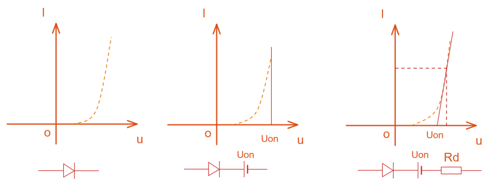
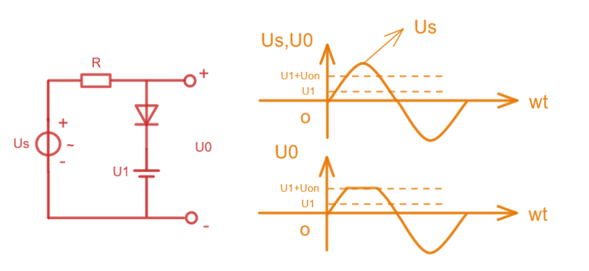
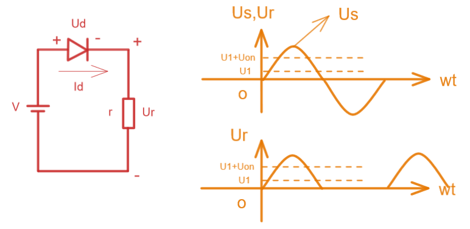
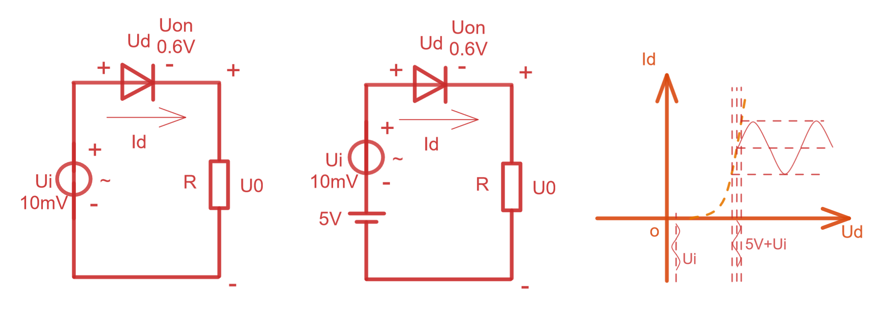

# 上海交通大学-模拟电子技术-笔记-4-二极管的直流等效电路

[TOC]

二极管的出现，人们首次有了可以随意控制电流的手段；

### 二极管的主要参数

#### $I_F$

二极管长期工作做能够通过电流的最大值，功率电流值，二极管有瓦数区别；

#### $U_R$

二极管最大的反向电压，$U_R$不能等于$U_{BR}$，需要留有裕度，通常能达到一半的裕度；

#### $I_R$

未击穿时的反向电流；

#### $f_M$

最大工作频率；电容会在高频情况下导通，那么已知二极管上有等效电容，其在反向截至工作情况下，高频会导致此处导通，可视为可导通容抗，PN结失效；高频电路二极管需要考虑；

二极管也可视为非线性电阻，我们通常把非线性元件用线性等效出来；

### 二极管等效电路

外特性等效模型：模仿其电流电压曲线电路模型；物理等效模型：按照二极管物理特性等效的电路，适用范围大；

### 伏安特性折线化

直流情况下

左侧时理想二极管模型，中间是常用的等效模型，由于一旦导通则工作电压区别不大，那么电压大于导通电压的时候，假设工作电压几乎不变；其实实际工作时很小的电压变化会带动巨大的电流变化；

分析如下电路：

当二极管截至的时候，二极管两端电压为$U_s-U_1$，

当$U_s-U_1 \leq U_{on} 即U_s \leq U_{on}+ U_1$时二极管死区截至，此时$U_0=U_s$

直到$U_s-U_1 > U_{on}$时导通工作，导通后电压几乎不变；

这是个限幅电路，用于保护电路；

是半波整流电路；

来看下面这个电路变化

这里的左图交流源电压太小，无法让二极管导通工作，于是在中图里添加一个直流源，得到基础电压5V且表面具有60mV微小电压波动的电源，5V远超二极管工作导通电压，且根据二极管导通时的伏安特性，60mV的电压波动导致了较大的电流波动，此时电路中的电流就有了一个放大的Ui电压波动曲线；

