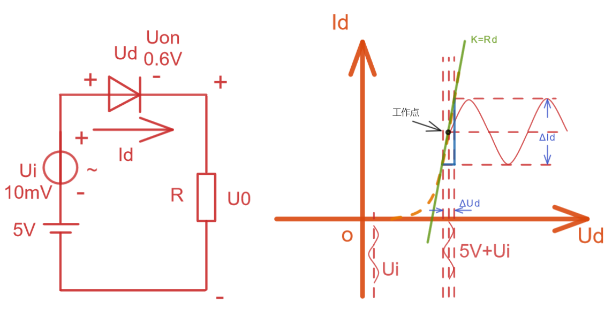
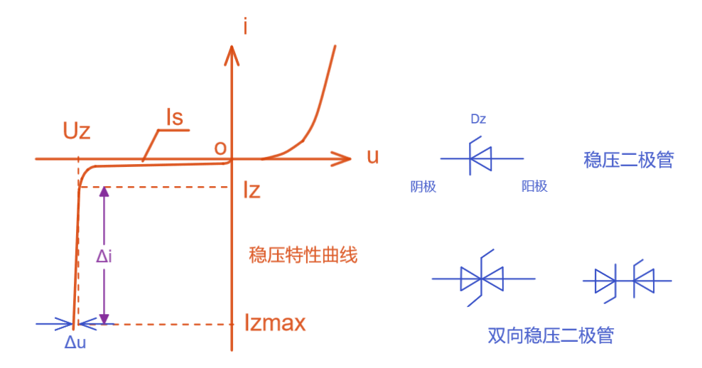
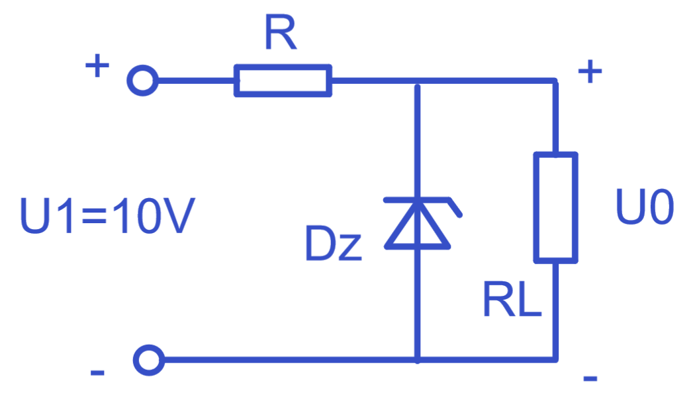
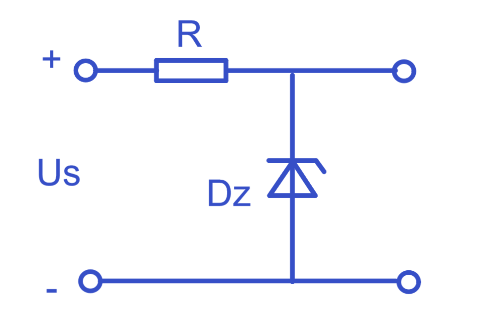

# 上海交通大学-模拟电子技术-笔记-5-二极管的微变等效和稳压二极管

[TOC]

## 微变等效定量

$$
i_D = I_s(e^{\frac{U}{U_T}}-1)
$$

如何对这个微变电流定量呢？由于在整个伏安曲线来说，是非线性的，那么无法使用直流来表征该特点；

但是我们可以看到在工作点附近波动的电压可以对应的电流变化曲线可以近似为直线；该直线则为二极管工作点对伏安特性曲线的切线，于是我们得到的斜率就能反应电压波动造成电流波动的比值；

那么电压波动影响电流处的比值就是线性的，可用三角函数得到；

$ \frac{\Delta U_D}{\Delta i_D} = r_d  \ ,\  i_d = \frac{u_i}{r_d+R}$ 可以看出当工作时，二极管几乎为一个纯的恒定电阻

$ \frac{1}{r_d} = \frac{\Delta i_D}{\Delta U_D}= \frac{d i_D}{d U_D}= I_s \frac{1}{U_T}e^{\frac{U_D}{U_T}}= \frac{ I_s e^{\frac{U_D}{U_T}}}{U_T} 此处分子约等于 i_D ,则r_d = \frac{U_T}{I_D}，可见阻值由温度和直流的工作点决定，而I_D=\frac{V-U_{ON}}{R}$

直流决定二极管的工作点，此时能够得到二极管等效为恒定电阻，然后使用存粹的交流电来分析整个电路；

## 稳压二极管

利用二极管反向特性建立稳压二极管

该二极管工作在反向电流中，需要好的散热；

通过调节参杂浓度来制造不同的稳压管；

#### 伏安特性

 

双向稳压二极管，只有击穿或截止工作状态，左击穿右截止、左截止右击穿、都截止；都击穿的话基本就烧坏了；

注意稳压二极管工作电流必须大于Iz（最小稳定电流）才能得到好的稳压效果；同时必须要与最大稳定电流，防止散热无法跟上烧坏；

#### 主要参数

温度系数$\alpha$ ： 反向击穿有个Uz电压值，温度系数代表了温度变化1度时Uz的变化；

稳压管小于6V齐纳击穿居多，大于6V时雪崩击穿较多；4V下基本都是齐纳击穿；

由于齐纳击穿在高温下更加容易发生，那么温度上升Uz就要降低，那么其温度系数为负数；

雪崩击穿在低温下容易发生，那么温度下降Uz也降低，那么温度系数为正；

例：

$U_Z=6V , R = 0.2k\Omega , R_L = 0.8k\Omega,求 I_{DZ}$

若直接假设稳压管已经在击穿工作区时：得到如下：

$I_R = 20mA ，I_L=7.5mA，则 I_{DZ} = 12.5mA$

这个方法在稳压管可能工作在截至或其他的情况下不能用来分析；

如改变条件：

$U_Z=6V , R = 0.8k\Omega , R_L = 0.2k\Omega,求 I_{DZ}$

那就要先假设稳压管开路，求出RL电阻两端分的电压，再来判断稳压二极管是否能够处于稳压状态；

可以看懂这个歌情况下稳压管没有击穿，是截止状态； 

所以我们需要关注RL负载的大小是否能够让电源给予足够分压来开通稳压管的稳压击穿工作区；尤其是RL电阻很小的时候（继电器，电机等）；

注意：使用稳压二极管必须带有一个限流电阻

当Us上升时，达到稳压管Dz的稳压工作区，可以使得Dz上一点点的电压上升导致大量电流上升，电流上升导致R上的分压线性上升，则可以更多的分担电源的电压，以便让Dz能够在电流变化大的情况下支付出少量电压变化的代价，以达到稳压目的；所以这个电阻R非常重要；

