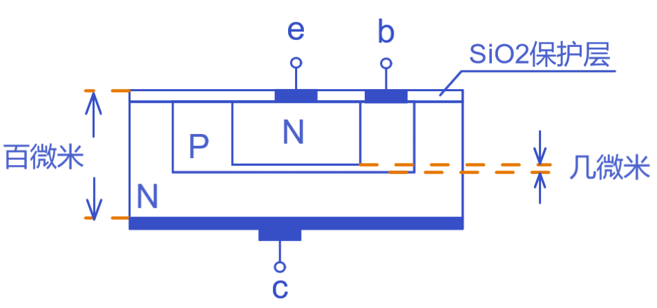
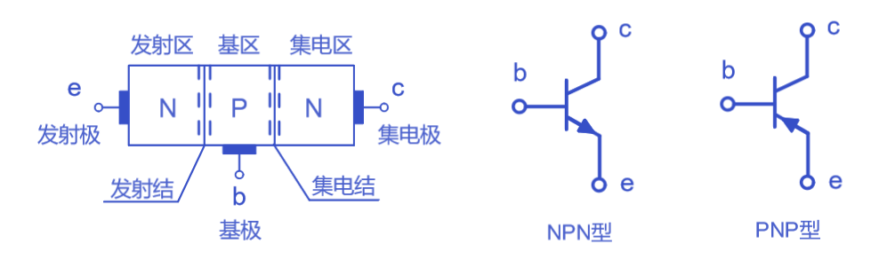
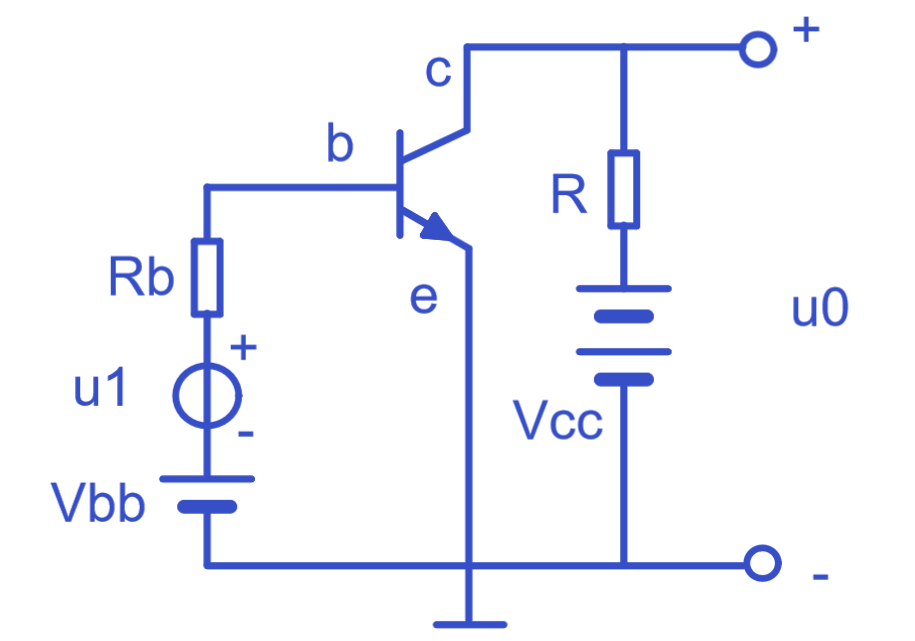
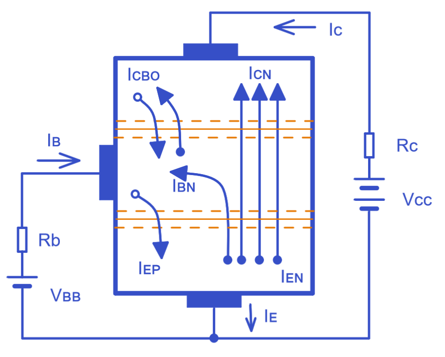

# 上海交通大学-模拟电子技术-笔记-6-双极晶体管的结构和放大原理

[TOC]

 ₀ ₁ ₂ ₃ ₄ ₅ ₆ ₇ ₈ ₉ ₊ ₋ ₌ ₍ ₎ ₐ ꜀ ₔ ₑ ₕ ᵢ ⱼ ₖ ₗ ₘ ₙ ₒ ₚ ᵣ ₛ ₜ ᵤ ᵥ ᙮ ᵤ ᵩ ᵦ ₗ ˪ ៳ ៷ ₒ ᵨ ₛ ៴ ᵤ ᵪ ᵧ .

ᴀ ʙ ᴄ ᴅ ᴇ ғ ɢ ʜ ɪ ᴊ ᴋ ʟ ᴍ ɴ ᴏ ᴘ ǫ ʀ s ᴛ ᴜ ᴠ ᴡ x ʏ ᴢ

双极晶体管也叫三极管BJT

## 结构和类型

### 构成方式

三个区域：发射 emitting 集电  collection 基 basic

发射区发射载流子，集电区收集载流子，集电区面积较大或纯度高，所以发射区的参杂浓度较高，集电区的参杂浓度低；基区的特点是非常薄且参杂浓度低纯度高，用于控制；

两个结：发射结 和 集电结；

图标箭头总是P指向N，即电流导通工作的方向；

**之后讨论直接使用e  c  b  三个字母来代表 发射极  集电极  基极 ， be为发射结，bc为集电结；**

## 电流放大作用

### 放大

重要的放大现象：$I_c/I_b = \beta$ 有个电流放大倍数；

三极管需要外部电源来工作，基本属于根据小而精致的信号来塑造外加的恒定大电流成为大而精致的信号，有时甚至刻意控制这个精致程度（失真控制）；

### 基本共射放大电路

图中情况是正向偏置，be导通，发射结正偏，那么集电极必然反偏；

发射极接地是0v，基极极电位是Vbb,集电极电位是Vcc，其中基极电位大于发射极电位，故发射极正偏，而Vcc大于Vbb，有集电极大于基极，故集电极反偏，即当P端电位大于N端电位时，PN结导通；

注意这里的Rb必须加上，作为对be分压的电阻可以保证be不击穿；毕竟be局部看就是二极管，其伏安特性决定了不能强制对其施加电压；

#### 内部载流子运动

##### 发射区

发射结正偏，则PN导通，正常扩散运动，发射区的自由电子会大量向基区扩散;

发射区参杂浓度高，多子浓度高，基区参杂浓度低，且薄，多子浓度低。当他们同时发生扩散运动时，所产生的电流就是一个大一个小，所以Iᴇᴘ与Iᴇɴ比较时，Iᴇᴘ可以近乎不计。

##### 基区

本来基区自由电子是少子，空穴是多子，而发射区过来的电子比基区空穴都要多，那么基区无法承载复合那么多电子，则多余电子继续向前扩散到集电结；

> 如果基区过宽或者参杂浓度高导致空穴多，发射结发出的电子都会在基区被复合，那么也就谈不上继续扩散电子到集电区了；所以制作工艺上需要保证基区薄且参杂浓度低；

那么材料浓度确定后，这个发射区在基区被复合的电子浓度就确定了，电子被复合的比例就确定了，发射区和基区复合比例固定就决定发射区和集电区的电子流通比例固定，那么三个区域的电子浓度梯度就是固定了；所以图中 Iᴄ / Iʙ 就固定了；

当然基区电子也有自身的有扩散、复合、生产；

##### 集电区

集电区反偏，导致扩散来的电子快速收集，保证整个浓度梯度的正常；

此时集电区反偏时进行漂移Iᴄʙᴏ，其范围很小；

#### 放大系数

$$
\bar\beta=\frac{I_{CN}}{I_{BN}}= \frac{I_C-I_{CBO}}{I_{B}+I_{CBO}}\approx\frac{I_C}{I_B}
$$

这是直流放大系数

此处Iᴄʙᴏ和Iᴇᴘ过小则忽略；
$$
\bar\beta= \frac{\Delta I_C}{\Delta I_B}
$$
这是交流放大系数

交流放大系数和直流放大系数差不多，两者近似；

##### 穿透电流Iᴄᴇᴏ

在基区没有电流的时候，穿透电流依旧存在；

##### 反向电流Iᴄʙᴏ

##### 共基放大电流

$$
\bar\alpha=\frac{I_C}{I_E}=\frac{\bar\beta}{1+\bar\beta}
$$

